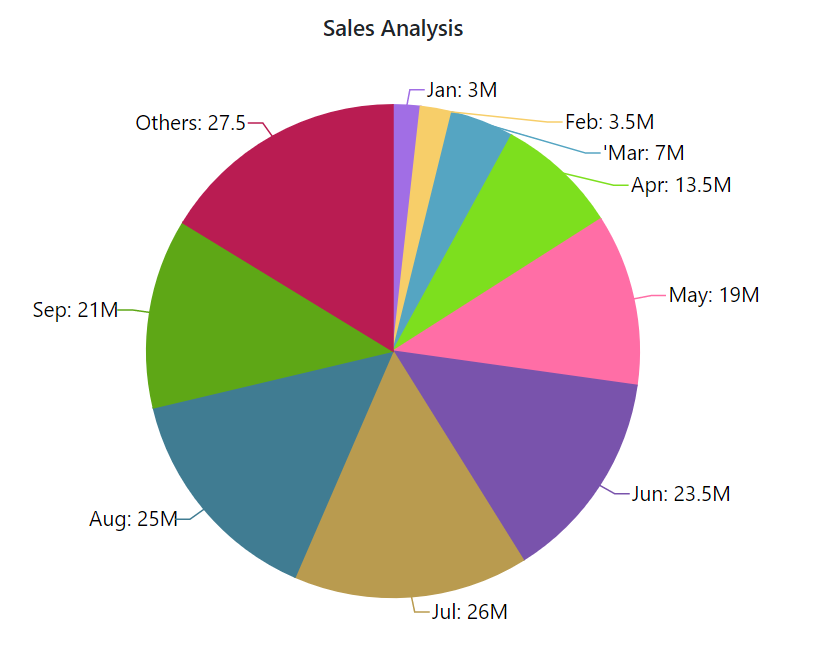

<!-- markdownlint-disable MD036 -->

# Grouping in Blazor Accumulation Chart Component

The value set to the [GroupTo](https://help.syncfusion.com/cr/blazor/Syncfusion.Blazor.Charts.AccumulationChartSeries.html#Syncfusion_Blazor_Charts_AccumulationChartSeries_GroupTo) property can be used to club/group a few points in the series. Points with a value less than [GroupTo](https://help.syncfusion.com/cr/blazor/Syncfusion.Blazor.Charts.AccumulationChartSeries.html#Syncfusion_Blazor_Charts_AccumulationChartSeries_GroupTo) are grouped together and displayed as a single point with the label **Others**. In addition, the property value can be set in percentage (percentage of total data points value).

```cshtml 

@using Syncfusion.Blazor.Charts

<SfAccumulationChart Title="Sales Analysis" EnableSmartLabels="true">
    <AccumulationChartLegendSettings Visible="false"></AccumulationChartLegendSettings>

    <AccumulationChartSeriesCollection>
        <AccumulationChartSeries DataSource="@DataSource" XName="XValue" YName="YValue" Name="Sales" GroupTo="10">
            <AccumulationDataLabelSettings Visible="true" Name="Text" Position="AccumulationLabelPosition.Outside">
            </AccumulationDataLabelSettings>
        </AccumulationChartSeries>
    </AccumulationChartSeriesCollection>
</SfAccumulationChart>

@code{
    public class ChartData
    {
        public string XValue { get; set; }
        public double YValue { get; set; }
        public string Text { get; set; }
    }

    public List<ChartData> DataSource = new List<ChartData>
    {
       new ChartData { XValue = "Jan", YValue = 3, Text= "Jan: 3M" },
       new ChartData { XValue = "Feb", YValue = 3.5, Text= "Feb: 3.5M" },
       new ChartData { XValue = "Mar", YValue = 7, Text= "'Mar: 7M" },
       new ChartData { XValue = "Apr", YValue = 13.5, Text= "Apr: 13.5M" },
       new ChartData { XValue = "May", YValue = 19, Text= "May: 19M" },
       new ChartData { XValue = "Jun", YValue = 23.5, Text= "Jun: 23.5M" },
       new ChartData { XValue = "Jul", YValue = 26, Text= "Jul: 26M" },
       new ChartData { XValue = "Aug", YValue = 25, Text= "Aug: 25M" },
       new ChartData { XValue = "Sep", YValue = 21, Text= "Sep: 21M" },
       new ChartData { XValue = "Oct", YValue = 15, Text= "Oct: 15M" },
       new ChartData { XValue = "Nov", YValue = 9, Text= "Nov: 9M" },
       new ChartData { XValue = "Dec", YValue = 3.5, Text= "Dec: 3.5M" }
   };
}

```


<!--  -->

## Pie Grouping

**Broken Slice**

The points that have been grouped together will appear as a single slice with the label **Others**, which will explode and break into separate slices when clicked.

```cshtml 

@using Syncfusion.Blazor.Charts

<SfAccumulationChart Title="Sales Analysis" EnableSmartLabels="true">
    <AccumulationChartTooltipSettings Enable="true"></AccumulationChartTooltipSettings>

    <AccumulationChartLegendSettings Visible="false"></AccumulationChartLegendSettings>

    <AccumulationChartSeriesCollection>
        <AccumulationChartSeries DataSource="@DataSource" XName="XValue" YName="YValue" Explode="true" Radius="70%" GroupTo="15">
            <AccumulationDataLabelSettings Visible="true" Name="Text" Position="AccumulationLabelPosition.Outside">
                <AccumulationChartConnector Type="ConnectorType.Line" Length="5%"></AccumulationChartConnector>
                <AccumulationChartDataLabelFont Size="14px"></AccumulationChartDataLabelFont>
            </AccumulationDataLabelSettings>
        </AccumulationChartSeries>
    </AccumulationChartSeriesCollection>
</SfAccumulationChart>

@code{
    public class ChartData
    {
        public string XValue { get; set; }
        public double YValue { get; set; }
        public string Text { get; set; }
    }

    public List<ChartData> DataSource = new List<ChartData>
    {
       new ChartData { XValue = "Jan", YValue = 3, Text= "Jan: 3M" },
       new ChartData { XValue = "Feb", YValue = 3.5, Text= "Feb: 3.5M" },
       new ChartData { XValue = "Mar", YValue = 7, Text= "'Mar: 7M" },
       new ChartData { XValue = "Apr", YValue = 3.5, Text= "Apr: 13.5M" },
       new ChartData { XValue = "May", YValue = 19, Text= "May: 19M" },
       new ChartData { XValue = "Jun", YValue = 23.5, Text= "Jun: 23.5M" },
       new ChartData { XValue = "Jul", YValue = 26, Text= "Jul: 26M" },
       new ChartData { XValue = "Aug", YValue = 25, Text= "Aug: 25M" },
       new ChartData { XValue = "Sep", YValue = 21, Text= "Sep: 21M" },
       new ChartData { XValue = "Oct", YValue = 15, Text= "Oct: 15M" },
       new ChartData { XValue = "Nov", YValue = 9, Text= "Nov: 9M" },
       new ChartData { XValue = "Dec", YValue = 13.5, Text= "Dec: 3.5M" }
   };
}

```


**Group Mode**

 When the [GroupMode](https://help.syncfusion.com/cr/blazor/Syncfusion.Blazor.Charts.AccumulationChartSeries.html#Syncfusion_Blazor_Charts_AccumulationChartSeries_GroupMode) property is set to [Point](https://help.syncfusion.com/cr/blazor/Syncfusion.Blazor.Charts.GroupMode.html#Syncfusion_Blazor_Charts_GroupMode_Point), the points are displayed as separate slices according to the [GroupTo](https://help.syncfusion.com/cr/blazor/Syncfusion.Blazor.Charts.AccumulationChartSeries.html#Syncfusion_Blazor_Charts_AccumulationChartSeries_GroupTo) value. The remaining points will be grouped into a single slice and displayed.

```cshtml 

@using Syncfusion.Blazor.Charts

<SfAccumulationChart Title="Sales Analysis" EnableSmartLabels="true">
    <AccumulationChartTooltipSettings Enable="true"></AccumulationChartTooltipSettings>

    <AccumulationChartLegendSettings Visible="false"></AccumulationChartLegendSettings>

    <AccumulationChartSeriesCollection>
        <AccumulationChartSeries DataSource="@DataSource" XName="XValue" YName="YValue" GroupTo="9" GroupMode=GroupMode.Point>
            <AccumulationDataLabelSettings Visible="true" Name="Text" Position="AccumulationLabelPosition.Outside">
                <AccumulationChartConnector Type="ConnectorType.Line" Length="5%"></AccumulationChartConnector>
                <AccumulationChartDataLabelFont Size="14px"></AccumulationChartDataLabelFont>
            </AccumulationDataLabelSettings>
        </AccumulationChartSeries>
    </AccumulationChartSeriesCollection>
</SfAccumulationChart>

@code{
    public class ChartData
    {
        public string XValue { get; set; }
        public double YValue { get; set; }
        public string Text { get; set; }
    }

    public List<ChartData> DataSource = new List<ChartData>
    {
       new ChartData { XValue = "Jan", YValue = 3, Text= "Jan: 3M" },
       new ChartData { XValue = "Feb", YValue = 3.5, Text= "Feb: 3.5M" },
       new ChartData { XValue = "Mar", YValue = 7, Text= "'Mar: 7M" },
       new ChartData { XValue = "Apr", YValue = 13.5, Text= "Apr: 13.5M" },
       new ChartData { XValue = "May", YValue = 19, Text= "May: 19M" },
       new ChartData { XValue = "Jun", YValue = 23.5, Text= "Jun: 23.5M" },
       new ChartData { XValue = "Jul", YValue = 26, Text= "Jul: 26M" },
       new ChartData { XValue = "Aug", YValue = 25, Text= "Aug: 25M" },
       new ChartData { XValue = "Sep", YValue = 21, Text= "Sep: 21M" },
       new ChartData { XValue = "Oct", YValue = 15, Text= "Oct: 15M" },
       new ChartData { XValue = "Nov", YValue = 9, Text= "Nov: 9M" },
       new ChartData { XValue = "Dec", YValue = 3.5, Text= "Dec: 3.5M" }
   };
}

```


<!--  -->

N> Refer to the [Blazor Charts](https://www.syncfusion.com/blazor-components/blazor-charts) feature tour page for its groundbreaking feature representations and also explore the [Blazor Accumulation Chart Example](https://blazor.syncfusion.com/demos/chart/pie?theme=bootstrap5) to know various features of accumulation charts and how it is used to represent numeric proportional data.

* [Data Label](./data-labels)
* [Tooltip](./tool-tip)
* [Legend](./legend)