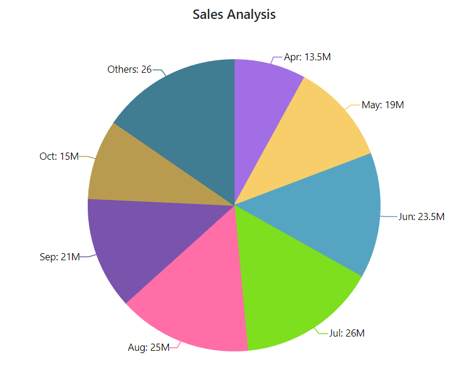
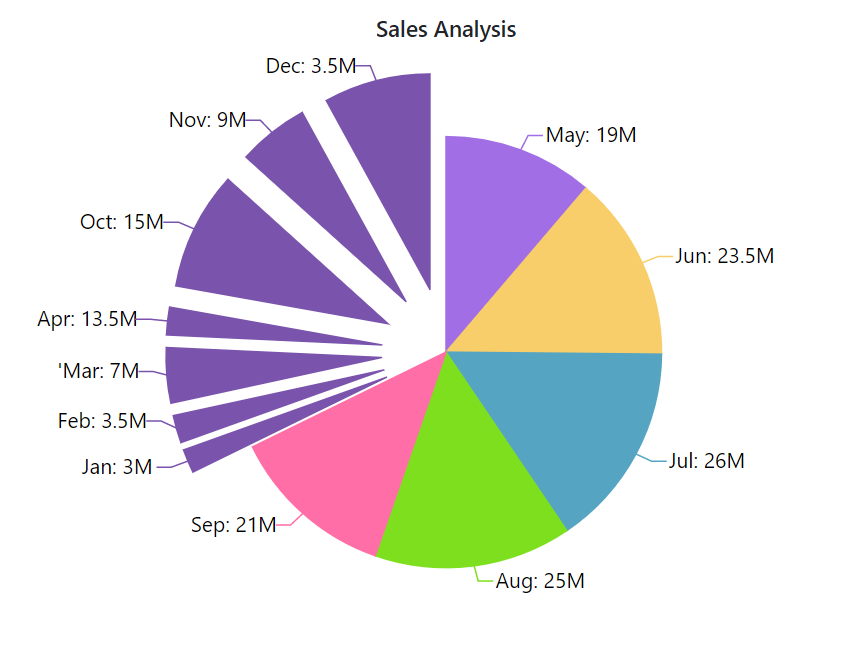
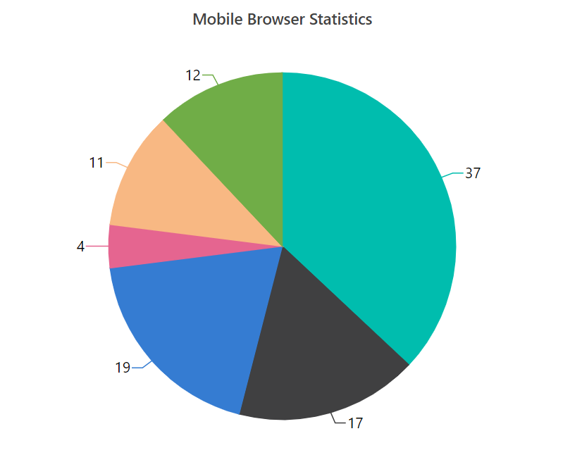

<!-- markdownlint-disable MD036 -->

# Grouping

You can club/group few points of the series based on
[`GroupTo`](https://help.syncfusion.com/cr/blazor/Syncfusion.Blazor.Charts.AccumulationChartSeries.html#Syncfusion_Blazor_Charts_AccumulationChartSeries_GroupTo)
property. For example, if the group to value is 11, then the points with value less than 11 is grouped together and will be showed as a single point with label `others`. The property also takes value in percentage
(percentage of total data points value).





## Pie Grouping

**Broken Slice**

You can visualize all points grouped together by clicking on the group. For example, if 5 points are grouped together it will be showed as a single slice with label `others` and when we click on `others` it will get explode and broken into 5 seperate slices.





**Group Mode**

Slice can also be grouped based on number of points by specifying the [`GroupMode`](https://help.syncfusion.com/cr/blazor/Syncfusion.Blazor.Charts.AccumulationChartSeries.html#Syncfusion_Blazor_Charts_AccumulationChartSeries_GroupMode)
to Point. For example, if the group to value is 11,  chart will show 1st 11 points and will group remaining entries from the collection as a single point.





