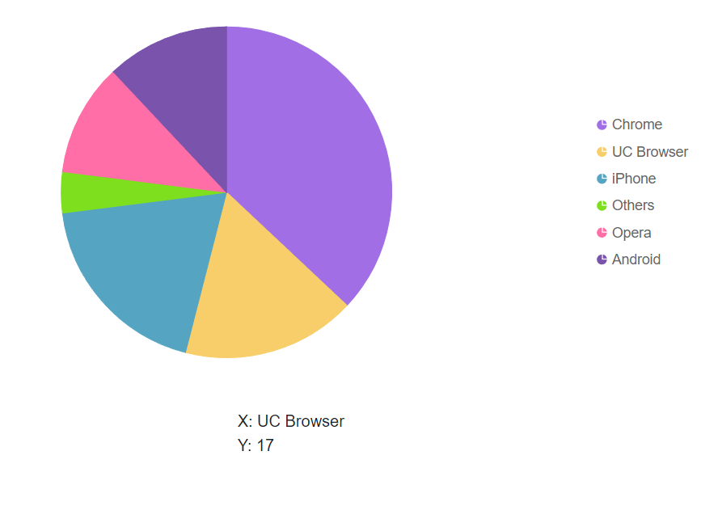

# Clicked Data in Blazor Accumulation Chart Component

By using [OnPointClick](https://help.syncfusion.com/cr/blazor/Syncfusion.Blazor.Charts.ChartEvents.html#Syncfusion_Blazor_Charts_ChartEvents_OnPointClick) event, you can get the chart data of clicked area.

To show the clicked area data from the pie, follow the given steps:

**Step 1:**

```cshtml
@using Syncfusion.Blazor.Charts
<SfAccumulationChart Title="Mobile Browser Statistics">
    <AccumulationChartEvents OnPointClick="PointClick"></AccumulationChartEvents>
    <AccumulationChartSeriesCollection>
        <AccumulationChartSeries DataSource="@StatisticsDetails" XName="Browser" YName="Users">
        </AccumulationChartSeries>
    </AccumulationChartSeriesCollection>
</SfAccumulationChart>

<style>
    body, html {
        height: 100%;
        margin: 0;
    }

    .container {
        display: flex;
        justify-content: center;
        align-items: center;
        height: 100%;
    }

    .centered-div {
        white-space: pre-line;
        text-align: left;
    }
</style>

<div class="container">
    <div class="centered-div">
        @myMarkup
    </div>
</div>

@code {
    string myMarkup;

    public class Statistics
    {
        public string Browser { get; set; }
        public double Users { get; set; }
    }

    public List<Statistics> StatisticsDetails = new List<Statistics>
    {
        new Statistics { Browser = "Chrome", Users = 37 },
        new Statistics { Browser = "UC Browser", Users = 17 },
        new Statistics { Browser = "iPhone", Users = 19 },
        new Statistics { Browser = "Others", Users = 4  },
        new Statistics { Browser = "Opera", Users = 11 },
        new Statistics { Browser = "Android", Users = 12 },
    };


    public void PointClick(AccumulationPointEventArgs args)
    {
        myMarkup = "X: " + args.Point.X +"\nY: " + args.Point.Y;     
        StateHasChanged();
    }     
}
```


N> Refer to the [Blazor Charts](https://www.syncfusion.com/blazor-components/blazor-charts) feature tour page for its groundbreaking feature representations and also explore the [Blazor Accumulation Chart Example](https://blazor.syncfusion.com/demos/chart/pie?theme=bootstrap4) to know about the various features of accumulation charts and how it is used to represent numeric proportional data.
