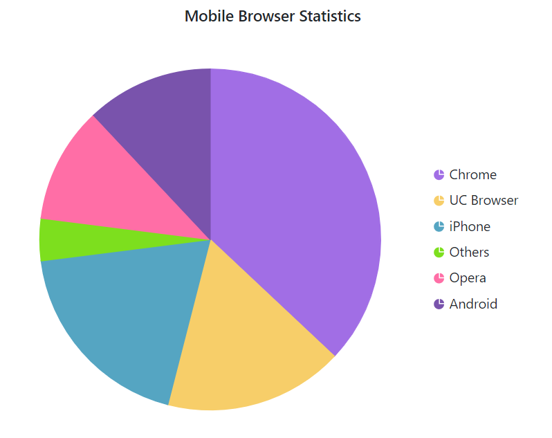
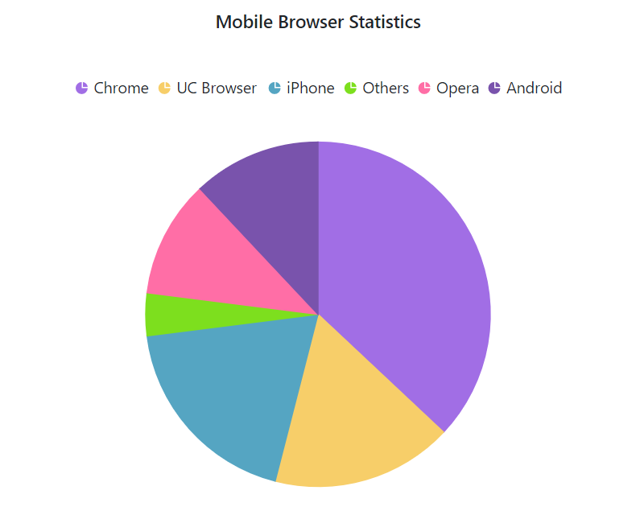
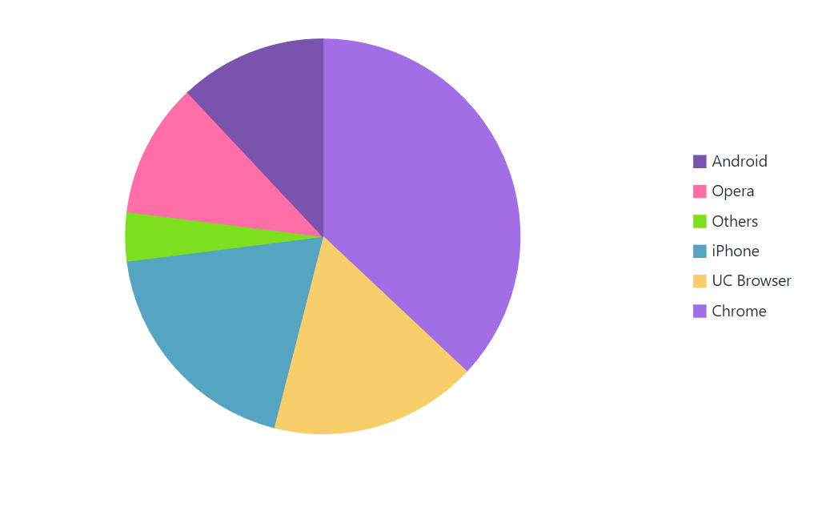
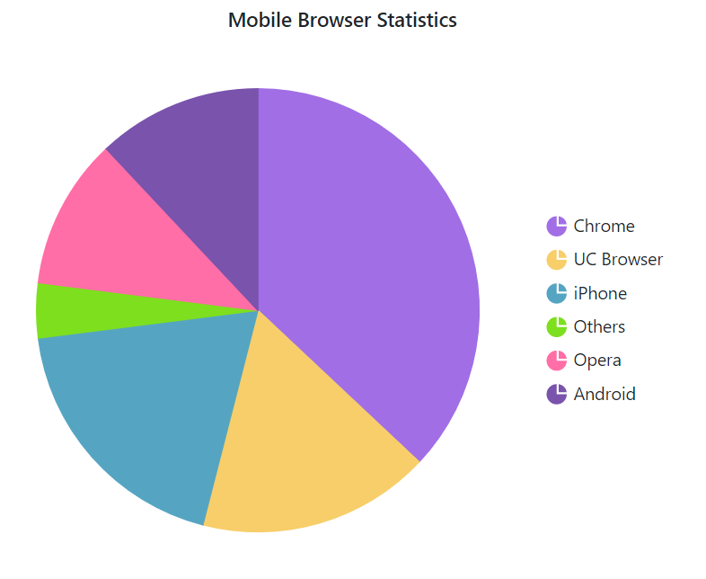
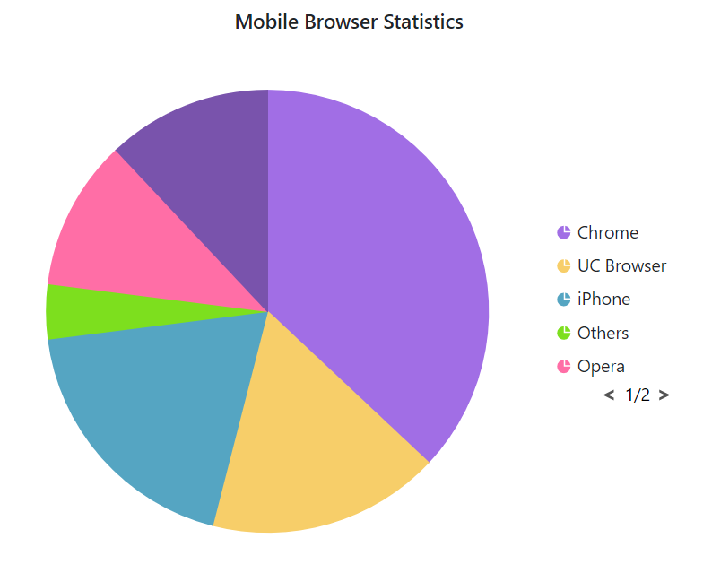
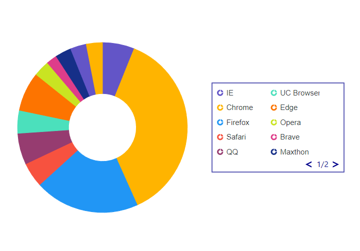
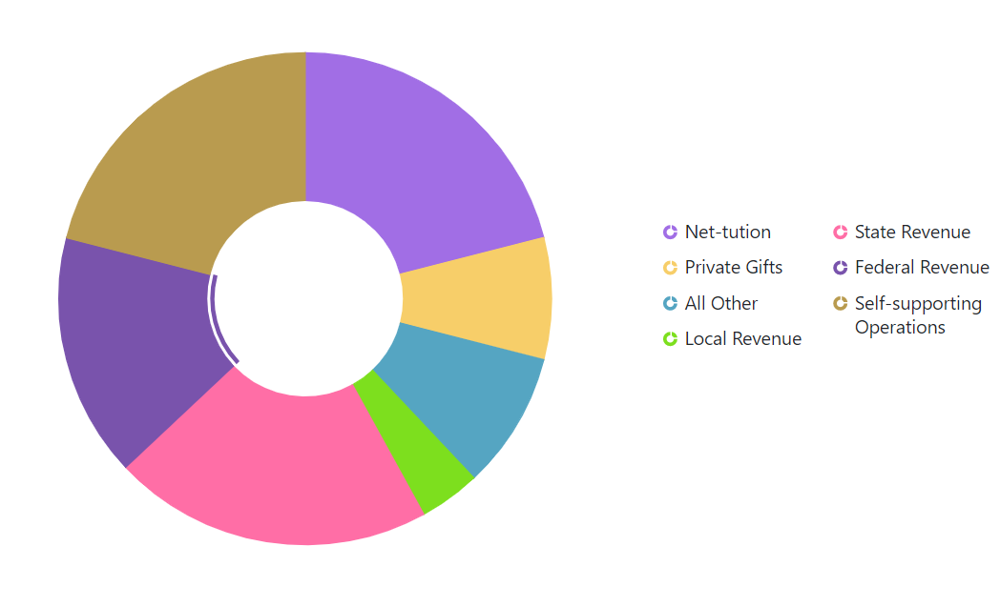

# Legend in Blazor Accumulation Chart Component

The legend is available for accumulation charts, just like it is for charts, and it provides information about the points. If the chart's width is large, the legend will be placed on the right, and if the chart's height is large, the legend will be placed on the bottom. The legend for a point can be collapsed by assigning an empty string to the point's x value.

```cshtml 

@using Syncfusion.Blazor.Charts

<SfAccumulationChart Title="Mobile Browser Statistics">
    <AccumulationChartSeriesCollection>
        <AccumulationChartSeries DataSource="@StatisticsDetails" XName="Browser" YName="Users"
                                 Name="Browser">
        </AccumulationChartSeries>
    </AccumulationChartSeriesCollection>

    <AccumulationChartLegendSettings Visible="true"></AccumulationChartLegendSettings>
</SfAccumulationChart>

@code{
    public class Statistics
    {
        public string Browser { get; set; }
        public double Users { get; set; }
    }

    public List<Statistics> StatisticsDetails = new List<Statistics>
	{
        new Statistics { Browser = "Chrome", Users = 37 },
        new Statistics { Browser = "UC Browser", Users = 17 },
        new Statistics { Browser = "iPhone", Users = 19 },
        new Statistics { Browser = "Others", Users = 4  },
        new Statistics { Browser = "Opera", Users = 11 },
        new Statistics { Browser = "Android", Users = 12 },
    };
}

```




## Position and alignment

The legend can be placed at [Left](https://help.syncfusion.com/cr/blazor/Syncfusion.Blazor.Charts.LegendPosition.html#Syncfusion_Blazor_Charts_LegendPosition_Left), [Right](https://help.syncfusion.com/cr/blazor/Syncfusion.Blazor.Charts.LegendPosition.html#Syncfusion_Blazor_Charts_LegendPosition_Right), [Top](https://help.syncfusion.com/cr/blazor/Syncfusion.Blazor.Charts.LegendPosition.html#Syncfusion_Blazor_Charts_LegendPosition_Top) or [Bottom](https://help.syncfusion.com/cr/blazor/Syncfusion.Blazor.Charts.LegendPosition.html#Syncfusion_Blazor_Charts_LegendPosition_Bottom)  [Custom](https://help.syncfusion.com/cr/blazor/Syncfusion.Blazor.Charts.LegendPosition.html#Syncfusion_Blazor_Charts_LegendPosition_Custom) position of the chart using the [Position](https://help.syncfusion.com/cr/blazor/Syncfusion.Blazor.Charts.AccumulationChartLegendSettings.html#Syncfusion_Blazor_Charts_AccumulationChartLegendSettings_Position) property. The [Alignment](https://help.syncfusion.com/cr/blazor/Syncfusion.Blazor.Charts.AccumulationChartLegendSettings.html#Syncfusion_Blazor_Charts_AccumulationChartLegendSettings_Alignment) property can also be used to align the legend to the chart's [Center](https://help.syncfusion.com/cr/blazor/Syncfusion.Blazor.Charts.Alignment.html#Syncfusion_Blazor_Charts_Alignment_Center), [Far](https://help.syncfusion.com/cr/blazor/Syncfusion.Blazor.Charts.Alignment.html#Syncfusion_Blazor_Charts_Alignment_Far) or [Near](https://help.syncfusion.com/cr/blazor/Syncfusion.Blazor.Charts.Alignment.html#Syncfusion_Blazor_Charts_Alignment_Near).

```cshtml 

@using Syncfusion.Blazor.Charts

<SfAccumulationChart Title="Mobile Browser Statistics">
    <AccumulationChartSeriesCollection>
        <AccumulationChartSeries DataSource="@StatisticsDetails" XName="Browser" YName="Users"
                                 Name="Browser">
        </AccumulationChartSeries>
    </AccumulationChartSeriesCollection>

    <AccumulationChartLegendSettings Visible="true" Position="LegendPosition.Top"></AccumulationChartLegendSettings>
</SfAccumulationChart>

@code{
    public class Statistics
    {
        public string Browser { get; set; }
        public double Users { get; set; }
    }

    public List<Statistics> StatisticsDetails = new List<Statistics>
	{
        new Statistics { Browser = "Chrome", Users = 37 },
        new Statistics { Browser = "UC Browser", Users = 17 },
        new Statistics { Browser = "iPhone", Users = 19 },
        new Statistics { Browser = "Others", Users = 4  },
        new Statistics { Browser = "Opera", Users = 11 },
        new Statistics { Browser = "Android", Users = 12 },
    };
}

```




## Legend Reverse

You can reverse the order of the legend items by using the [Reverse](https://help.syncfusion.com/cr/blazor/Syncfusion.Blazor.Charts.AccumulationChartLegendSettings.html#Syncfusion_Blazor_Charts_AccumulationChartLegendSettings_Reverse) property. By default, legend for the first series in the collection will be placed first.

```cshtml

@using Syncfusion.Blazor.Charts

<SfAccumulationChart Title="Mobile Browser Statistics">
    <AccumulationChartSeriesCollection>
        <AccumulationChartSeries LegendShape="LegendShape.Rectangle" DataSource="@StatisticsDetails" XName="Browser" YName="Users"
                                 Name="Browser">

        </AccumulationChartSeries>
    </AccumulationChartSeriesCollection>

    <AccumulationChartLegendSettings Visible="true" Reverse="true"></AccumulationChartLegendSettings>
</SfAccumulationChart>

@code{
    public class Statistics
    {
        public string Browser { get; set; }
        public double Users { get; set; }
    }

    public List<Statistics> StatisticsDetails = new List<Statistics>
	{
        new Statistics { Browser = "Chrome", Users = 37 },
        new Statistics { Browser = "UC Browser", Users = 17 },
        new Statistics { Browser = "iPhone", Users = 19 },
        new Statistics { Browser = "Others", Users = 4  },
        new Statistics { Browser = "Opera", Users = 11 },
        new Statistics { Browser = "Android", Users = 12 },
    };
}

```




## Legend shape

The [LegendShape](https://help.syncfusion.com/cr/blazor/Syncfusion.Blazor.Charts.AccumulationChartSeries.html#Syncfusion_Blazor_Charts_AccumulationChartSeries_LegendShape) property in the [Series](https://help.syncfusion.com/cr/blazor/Syncfusion.Blazor.Charts.AccumulationChartSeries.html#properties) can be used to change the shape of the legend icon. The default icon shape for legends is [SeriesType](https://help.syncfusion.com/cr/blazor/Syncfusion.Blazor.Charts.LegendShape.html#Syncfusion_Blazor_Charts_LegendShape_SeriesType).

```cshtml 

@using Syncfusion.Blazor.Charts

<SfAccumulationChart Title="Mobile Browser Statistics">
    <AccumulationChartSeriesCollection>
        <AccumulationChartSeries LegendShape="LegendShape.Rectangle" DataSource="@StatisticsDetails" XName="Browser" YName="Users"
                                 Name="Browser">

        </AccumulationChartSeries>
    </AccumulationChartSeriesCollection>

    <AccumulationChartLegendSettings Visible="true"></AccumulationChartLegendSettings>
</SfAccumulationChart>

@code{
    public class Statistics
    {
        public string Browser { get; set; }
        public double Users { get; set; }
    }

    public List<Statistics> StatisticsDetails = new List<Statistics>
	{
        new Statistics { Browser = "Chrome", Users = 37 },
        new Statistics { Browser = "UC Browser", Users = 17 },
        new Statistics { Browser = "iPhone", Users = 19 },
        new Statistics { Browser = "Others", Users = 4  },
        new Statistics { Browser = "Opera", Users = 11 },
        new Statistics { Browser = "Android", Users = 12 },
    };
}

```




## Legend size

The legend size can be customized by using the [Width](https://help.syncfusion.com/cr/blazor/Syncfusion.Blazor.Charts.AccumulationChartLegendSettings.html#Syncfusion_Blazor_Charts_AccumulationChartLegendSettings_Width) and [Height](https://help.syncfusion.com/cr/blazor/Syncfusion.Blazor.Charts.AccumulationChartLegendSettings.html#Syncfusion_Blazor_Charts_AccumulationChartLegendSettings_Height) properties of the [AccumulationChartLegendSettings](https://help.syncfusion.com/cr/blazor/Syncfusion.Blazor.Charts.AccumulationChartLegendSettings.html).

```cshtml 

@using Syncfusion.Blazor.Charts

<SfAccumulationChart Title="Mobile Browser Statistics">
    <AccumulationChartSeriesCollection>
        <AccumulationChartSeries DataSource="@StatisticsDetails" XName="Browser" YName="Users"
                                 Name="Browser">
        </AccumulationChartSeries>
    </AccumulationChartSeriesCollection>

    <AccumulationChartLegendSettings Visible="true" Height="28%" Width="44%">
        <AccumulationChartLegendBorder Color="Pink" Width="1"></AccumulationChartLegendBorder>
    </AccumulationChartLegendSettings>
</SfAccumulationChart>

@code{
    public class Statistics
    {
        public string Browser { get; set; }
        public double Users { get; set; }
    }

    public List<Statistics> StatisticsDetails = new List<Statistics>
	{
        new Statistics { Browser = "Chrome", Users = 37 },
        new Statistics { Browser = "UC Browser", Users = 17 },
        new Statistics { Browser = "iPhone", Users = 19 },
        new Statistics { Browser = "Others", Users = 4  },
        new Statistics { Browser = "Opera", Users = 11 },
        new Statistics { Browser = "Android", Users = 12 },
    };
}

```




## Legend shape size

The [ShapeHeight](https://help.syncfusion.com/cr/blazor/Syncfusion.Blazor.Charts.AccumulationChartLegendSettings.html#Syncfusion_Blazor_Charts_AccumulationChartLegendSettings_ShapeHeight) and [ShapeWidth](https://help.syncfusion.com/cr/blazor/Syncfusion.Blazor.Charts.AccumulationChartLegendSettings.html#Syncfusion_Blazor_Charts_AccumulationChartLegendSettings_ShapeWidth) properties can be used to adjust the dimensions of the legend shape.

```cshtml 

@using Syncfusion.Blazor.Charts

<SfAccumulationChart Title="Mobile Browser Statistics">
    <AccumulationChartSeriesCollection>
        <AccumulationChartSeries DataSource="@StatisticsDetails" XName="Browser" YName="Users"
                                 Name="Browser">
        </AccumulationChartSeries>
    </AccumulationChartSeriesCollection>

    <AccumulationChartLegendSettings Visible="true" ShapeHeight="15" ShapeWidth="15">
    </AccumulationChartLegendSettings>
</SfAccumulationChart>

@code{
    public class Statistics
    {
        public string Browser { get; set; }
        public double Users { get; set; }
    }

    public List<Statistics> StatisticsDetails = new List<Statistics>
	{
        new Statistics { Browser = "Chrome", Users = 37 },
        new Statistics { Browser = "UC Browser", Users = 17 },
        new Statistics { Browser = "iPhone", Users = 19 },
        new Statistics { Browser = "Others", Users = 4  },
        new Statistics { Browser = "Opera", Users = 11 },
        new Statistics { Browser = "Android", Users = 12 },
    };
}

```




## Paging for Legend

When the legend items exceed legend bounds, paging will be enabled by default. End user can view each legend item using the navigation buttons to navigate between pages.

```cshtml 

@using Syncfusion.Blazor.Charts

<SfAccumulationChart Title="Mobile Browser Statistics">
    <AccumulationChartSeriesCollection>
        <AccumulationChartSeries DataSource="@StatisticsDetails" XName="Browser" YName="Users"
                                 Name="Browser">
        </AccumulationChartSeries>
    </AccumulationChartSeriesCollection>

    <AccumulationChartLegendSettings Visible="true" Height="150" Width="100">
    </AccumulationChartLegendSettings>
</SfAccumulationChart>

@code{
    public class Statistics
    {
        public string Browser{ get; set; }
        public double Users { get; set; }
    }

    public List<Statistics> StatisticsDetails = new List<Statistics>
	{
        new Statistics { Browser = "Chrome", Users = 37 },
        new Statistics { Browser = "UC Browser", Users = 17 },
        new Statistics { Browser = "iPhone", Users = 19 },
        new Statistics { Browser = "Others", Users = 4  },
        new Statistics { Browser = "Opera", Users = 11 },
        new Statistics { Browser = "Android", Users = 12 },
    };
}

```




### Paging customization

In legend pager, the arrow elements can be customized by using the [ArrowSize](https://help.syncfusion.com/cr/blazor/Syncfusion.Blazor.Charts.AccumulationChartLegendPageSettings.html#Syncfusion_Blazor_Charts_AccumulationChartLegendPageSettings_ArrowSize) property in the [AccumulationChartLegendPageSettings](https://help.syncfusion.com/cr/blazor/Syncfusion.Blazor.Charts.AccumulationChartLegendPageSettings.html) and the page numbers can be customized by using the [AccumulationChartLegendPageSettingsTextStyle](https://help.syncfusion.com/cr/blazor/Syncfusion.Blazor.Charts.AccumulationChartLegendPageSettingsTextStyle.html).

```cshtml 

@using Syncfusion.Blazor.Charts

<SfAccumulationChart ID="chart" Width="640px" Height="475px" Theme="@Theme">
    <AccumulationChartLegendSettings ToggleVisibility=false TextWrap="@Syncfusion.Blazor.TextWrap.Wrap" MaximumLabelWidth="80" Position="@position" Height="@Height" Width="@Width">
        <AccumulationChartLegendPageSettings ArrowSize="10">
            <AccumulationChartLegendPageSettingsTextStyle Color="blue">
            </AccumulationChartLegendPageSettingsTextStyle>
        </AccumulationChartLegendPageSettings>
        <AccumulationChartLegendBorder Color="darkblue" Width="1"></AccumulationChartLegendBorder>
        <AccumulationChartLegendFont Size="12px"></AccumulationChartLegendFont>
    </AccumulationChartLegendSettings>
    <AccumulationChartSeriesCollection>
        <AccumulationChartSeries DataSource="@PieChartPoints" XName="ExpenseCategory" YName="ExpensePercentage" Radius="70%" Name="Revenue" InnerRadius="40%">
        </AccumulationChartSeries>
    </AccumulationChartSeriesCollection>
</SfAccumulationChart>

@code {
    private Theme Theme { get; set; } = Theme.Fluent2;
    public string Height { get; set; } = "30%";
    public string Width { get; set; } = "33%";
    public Syncfusion.Blazor.Charts.LegendPosition position { get; set; } = Syncfusion.Blazor.Charts.LegendPosition.Right;
    public double MaxLabel { get; set; } = 100;

    public List<PieData> PieChartPoints { get; set; } = new List<PieData>
    {
         new PieData { ExpenseCategory =  "IE", ExpensePercentage = 6.12, DataLabelMappingName = "6.12%" },
         new PieData { ExpenseCategory =  "Chrome", ExpensePercentage = 37.28, DataLabelMappingName = "57.28%" },
         new PieData { ExpenseCategory =  "Firefox", ExpensePercentage = 20, DataLabelMappingName = "57.28%" },
         new PieData { ExpenseCategory =  "Safari", ExpensePercentage = 4.73, DataLabelMappingName = "4.73%" },
         new PieData { ExpenseCategory =  "QQ", ExpensePercentage = 5.96, DataLabelMappingName = "5.96%" },
         new PieData { ExpenseCategory =  "UC Browser", ExpensePercentage = 4.37, DataLabelMappingName = "4.37%" },
         new PieData { ExpenseCategory =  "Edge", ExpensePercentage = 7.48, DataLabelMappingName = "7.48%" },
         new PieData { ExpenseCategory =  "Opera", ExpensePercentage = 3.06, DataLabelMappingName = "14.06%" },
         new PieData { ExpenseCategory =  "Brave", ExpensePercentage = 2.06, DataLabelMappingName = "14.06%" },
         new PieData { ExpenseCategory =  "Maxthon", ExpensePercentage = 3.06, DataLabelMappingName = "14.06%" },
         new PieData { ExpenseCategory =  "UC", ExpensePercentage = 3.06, DataLabelMappingName = "14.06%" },
         new PieData { ExpenseCategory =  "Falkon", ExpensePercentage = 3.06, DataLabelMappingName = "14.06%" },
    };

    public class PieData
    {
        public string ExpenseCategory { get; set; }
        public double ExpensePercentage { get; set; }
        public string DataLabelMappingName { get; set; }
    }
}

```



## Legend text wrap

When the legend text exceeds the container, the text can be wrapped by using [TextWrap](https://help.syncfusion.com/cr/blazor/Syncfusion.Blazor.Charts.AccumulationChartLegendSettings.html#Syncfusion_Blazor_Charts_AccumulationChartLegendSettings_TextWrap) Property. End user can also wrap the legend text based on the [MaximumLabelWidth](https://help.syncfusion.com/cr/blazor/Syncfusion.Blazor.Charts.AccumulationChartLegendSettings.html#Syncfusion_Blazor_Charts_AccumulationChartLegendSettings_MaximumLabelWidth) property.

```cshtml

@using Syncfusion.Blazor.Charts

<SfAccumulationChart>
        <AccumulationChartLegendSettings Position="LegendPosition.Right" TextWrap="@TextWrap.Wrap" MaximumLabelWidth="100" Height="28%" Width="36%"></AccumulationChartLegendSettings>
        <AccumulationChartSeriesCollection>
            <AccumulationChartSeries DataSource="@PieChartPoints" XName="ExpenseCategory" YName="ExpensePercentage" Name="Revenue" InnerRadius="40%">
            </AccumulationChartSeries>
        </AccumulationChartSeriesCollection>
    </SfAccumulationChart>

@code{
   public List<PieData> PieChartPoints { get; set; } = new List<PieData>
    {
         new PieData { ExpenseCategory =  "Net-tution", ExpensePercentage = 21, DataLabelMappingName = "21%" },
         new PieData { ExpenseCategory =  "Private Gifts", ExpensePercentage = 8, DataLabelMappingName = "8%" },
         new PieData { ExpenseCategory =  "All Other", ExpensePercentage = 9, DataLabelMappingName = "9%" },
         new PieData { ExpenseCategory =  "Local Revenue", ExpensePercentage = 4, DataLabelMappingName = "4%" },
         new PieData { ExpenseCategory =  "State Revenue", ExpensePercentage = 21, DataLabelMappingName = "21%" },
         new PieData { ExpenseCategory =  "Federal Revenue", ExpensePercentage = 16, DataLabelMappingName = "16%" },
         new PieData { ExpenseCategory =  "Self-supporting Operations", ExpensePercentage = 21, DataLabelMappingName = "21%" },
    };
    public class PieData
    {
        public string ExpenseCategory { get; set; }
        public double ExpensePercentage { get; set; }
        public string DataLabelMappingName { get; set; }
    }
}

```




N> Refer to the [Blazor Charts](https://www.syncfusion.com/blazor-components/blazor-charts) feature tour page for its groundbreaking feature representations and also explore the [Blazor Accumulation Chart Example](https://blazor.syncfusion.com/demos/chart/pie?theme=bootstrap5) to know about the various features of accumulation charts and how it is used to represent numeric proportional data.

* [Grouping](./grouping)
* [Data label](./data-label)
