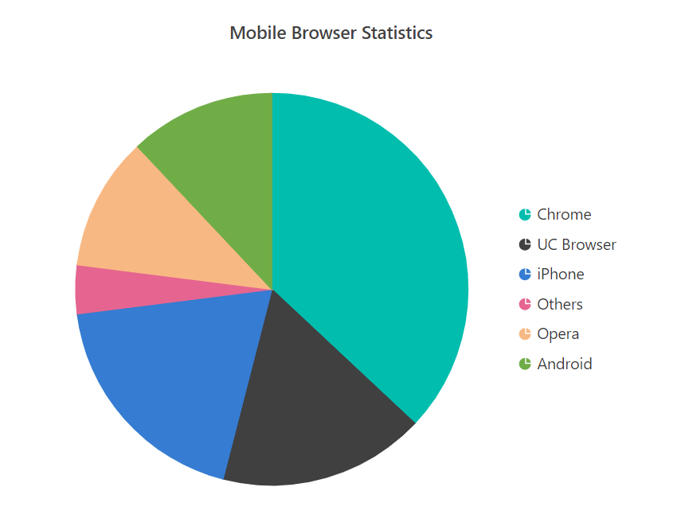
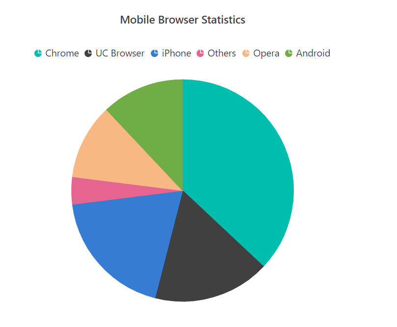
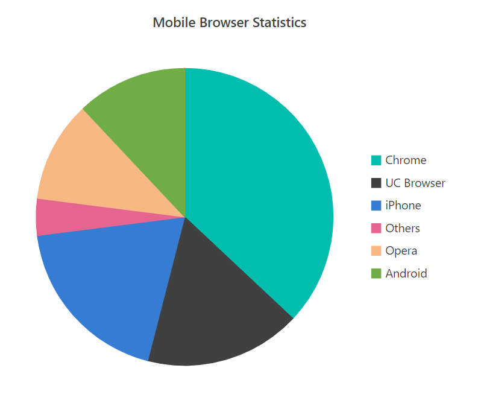
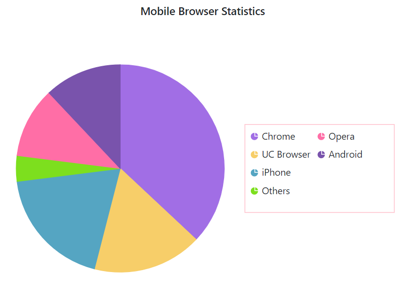
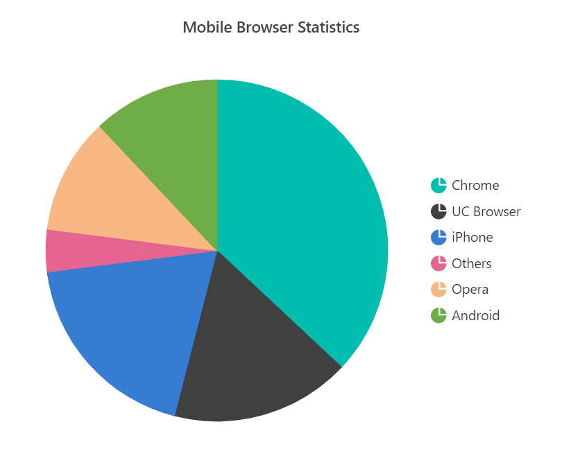
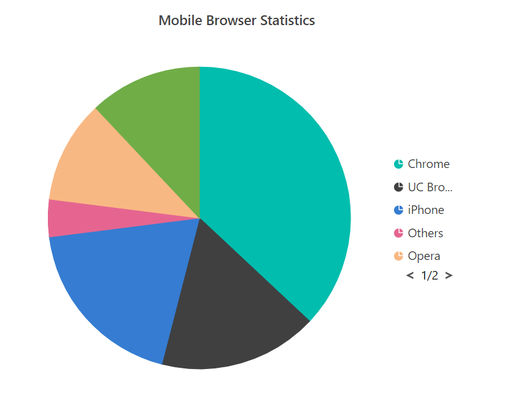

# Legend in Blazor Accumulation Chart Component

As like a chart, the legend is also available for accumulation charts, which gives information about the points. By default, the legend will be placed on the right, if the width of the chart is high or will be placed on the bottom, if the height of the chart is high. Here, the legend for a point can be collapsed by giving the empty string to the x value of the point.

```csharp

@using Syncfusion.Blazor.Charts

<SfAccumulationChart Title="Mobile Browser Statistics">
    <AccumulationChartSeriesCollection>
        <AccumulationChartSeries DataSource="@StatisticsDetails" XName="Browser" YName="Users"
                                 Name="Browser">
        </AccumulationChartSeries>
    </AccumulationChartSeriesCollection>

    <AccumulationChartLegendSettings Visible="true"></AccumulationChartLegendSettings>
</SfAccumulationChart>

@code{
    public class Statistics
    {
        public string Browser { get; set; }
        public double Users { get; set; }
    }

    public List<Statistics> StatisticsDetails = new List<Statistics>
{
        new Statistics { Browser = "Chrome", Users = 37 },
        new Statistics { Browser = "UC Browser", Users = 17 },
        new Statistics { Browser = "iPhone", Users = 19 },
        new Statistics { Browser = "Others", Users = 4  },
        new Statistics { Browser = "Opera", Users = 11 },
        new Statistics { Browser = "Android", Users = 12 },
    };
}

```



## Position and Alignment

By using the [`Position`](https://help.syncfusion.com/cr/blazor/Syncfusion.Blazor.Charts.AccumulationChartLegendSettings.html#Syncfusion_Blazor_Charts_AccumulationChartLegendSettings_Position) property, you can position the legend at the `Left`, `Right`, `Top` or `Bottom` of the chart.
You can also align the legend to `Center`, `Far` or `Near` to the chart using the [`Alignment`](https://help.syncfusion.com/cr/blazor/Syncfusion.Blazor.Charts.AccumulationChartLegendSettings.html#Syncfusion_Blazor_Charts_AccumulationChartLegendSettings_Alignment) property.

```csharp

@using Syncfusion.Blazor.Charts

<SfAccumulationChart Title="Mobile Browser Statistics">
    <AccumulationChartSeriesCollection>
        <AccumulationChartSeries DataSource="@StatisticsDetails" XName="Browser" YName="Users"
                                 Name="Browser">
        </AccumulationChartSeries>
    </AccumulationChartSeriesCollection>

    <AccumulationChartLegendSettings Visible="true" Position="LegendPosition.Top"></AccumulationChartLegendSettings>
</SfAccumulationChart>

@code{
    public class Statistics
    {
        public string Browser { get; set; }
        public double Users { get; set; }
    }

    public List<Statistics> StatisticsDetails = new List<Statistics>
{
        new Statistics { Browser = "Chrome", Users = 37 },
        new Statistics { Browser = "UC Browser", Users = 17 },
        new Statistics { Browser = "iPhone", Users = 19 },
        new Statistics { Browser = "Others", Users = 4  },
        new Statistics { Browser = "Opera", Users = 11 },
        new Statistics { Browser = "Android", Users = 12 },
    };
}

```



## Legend Shape

To change the legend icon, use the [`LegendShape`](https://help.syncfusion.com/cr/blazor/Syncfusion.Blazor.Charts.AccumulationChartSeries.html#Syncfusion_Blazor_Charts_AccumulationChartSeries_LegendShape) property in the `Series`. By default, legend icon is `SeriesType`.

```csharp

@using Syncfusion.Blazor.Charts

<SfAccumulationChart Title="Mobile Browser Statistics">
    <AccumulationChartSeriesCollection>
        <AccumulationChartSeries LegendShape="LegendShape.Rectangle" DataSource="@StatisticsDetails" XName="Browser" YName="Users"
                                 Name="Browser">

        </AccumulationChartSeries>
    </AccumulationChartSeriesCollection>

    <AccumulationChartLegendSettings Visible="true"></AccumulationChartLegendSettings>
</SfAccumulationChart>

@code{
    public class Statistics
    {
        public string Browser { get; set; }
        public double Users { get; set; }
    }

    public List<Statistics> StatisticsDetails = new List<Statistics>
{
        new Statistics { Browser = "Chrome", Users = 37 },
        new Statistics { Browser = "UC Browser", Users = 17 },
        new Statistics { Browser = "iPhone", Users = 19 },
        new Statistics { Browser = "Others", Users = 4  },
        new Statistics { Browser = "Opera", Users = 11 },
        new Statistics { Browser = "Android", Users = 12 },
    };
}

```



## Legend Size

The legend size can be changed by using the [`Width`](https://help.syncfusion.com/cr/blazor/Syncfusion.Blazor.Charts.AccumulationChartLegendSettings.html#Syncfusion_Blazor_Charts_AccumulationChartLegendSettings_Width) and [`Height`](https://help.syncfusion.com/cr/blazor/Syncfusion.Blazor.Charts.AccumulationChartLegendSettings.html#Syncfusion_Blazor_Charts_AccumulationChartLegendSettings_Height) properties of the `LegendSettings`.

```csharp

@using Syncfusion.Blazor.Charts

<SfAccumulationChart Title="Mobile Browser Statistics">
    <AccumulationChartSeriesCollection>
        <AccumulationChartSeries DataSource="@StatisticsDetails" XName="Browser" YName="Users"
                                 Name="Browser">
        </AccumulationChartSeries>
    </AccumulationChartSeriesCollection>

    <AccumulationChartLegendSettings Visible="true" Height="28%" Width="44%">
        <AccumulationChartLegendBorder Color="Pink" Width="1"></AccumulationChartLegendBorder>
    </AccumulationChartLegendSettings>
</SfAccumulationChart>

@code{
    public class Statistics
    {
        public string Browser { get; set; }
        public double Users { get; set; }
    }

    public List<Statistics> StatisticsDetails = new List<Statistics>
{
        new Statistics { Browser = "Chrome", Users = 37 },
        new Statistics { Browser = "UC Browser", Users = 17 },
        new Statistics { Browser = "iPhone", Users = 19 },
        new Statistics { Browser = "Others", Users = 4  },
        new Statistics { Browser = "Opera", Users = 11 },
        new Statistics { Browser = "Android", Users = 12 },
    };
}

```



## Legend Item Size

You can customize the size of the legend items by using the [`ShapeHeight`](https://help.syncfusion.com/cr/blazor/Syncfusion.Blazor.Charts.AccumulationChartLegendSettings.html#Syncfusion_Blazor_Charts_AccumulationChartLegendSettings_ShapeHeight) and [`ShapeWidth`](https://help.syncfusion.com/cr/blazor/Syncfusion.Blazor.Charts.AccumulationChartLegendSettings.html#Syncfusion_Blazor_Charts_AccumulationChartLegendSettings_ShapeWidth) properties.

```csharp

@using Syncfusion.Blazor.Charts

<SfAccumulationChart Title="Mobile Browser Statistics">
    <AccumulationChartSeriesCollection>
        <AccumulationChartSeries DataSource="@StatisticsDetails" XName="Browser" YName="Users"
                                 Name="Browser">
        </AccumulationChartSeries>
    </AccumulationChartSeriesCollection>

    <AccumulationChartLegendSettings Visible="true" ShapeHeight="15" ShapeWidth="15">
    </AccumulationChartLegendSettings>
</SfAccumulationChart>

@code{
    public class Statistics
    {
        public string Browser { get; set; }
        public double Users { get; set; }
    }

    public List<Statistics> StatisticsDetails = new List<Statistics>
{
        new Statistics { Browser = "Chrome", Users = 37 },
        new Statistics { Browser = "UC Browser", Users = 17 },
        new Statistics { Browser = "iPhone", Users = 19 },
        new Statistics { Browser = "Others", Users = 4  },
        new Statistics { Browser = "Opera", Users = 11 },
        new Statistics { Browser = "Android", Users = 12 },
    };
}

```



## Paging for Legend

Paging will be enabled by default, when the legend items exceeds the legend bounds. You can view the each legend item by navigating through the pages.

```csharp

@using Syncfusion.Blazor.Charts

<SfAccumulationChart Title="Mobile Browser Statistics">
    <AccumulationChartSeriesCollection>
        <AccumulationChartSeries DataSource="@StatisticsDetails" XName="Browser" YName="Users"
                                 Name="Browser">
        </AccumulationChartSeries>
    </AccumulationChartSeriesCollection>

    <AccumulationChartLegendSettings Visible="true" Height="150" Width="80">
    </AccumulationChartLegendSettings>
</SfAccumulationChart>

@code{
    public class Statistics
    {
        public string Browser{ get; set; }
        public double Users { get; set; }
    }

    public List<Statistics> StatisticsDetails = new List<Statistics>
{
        new Statistics { Browser = "Chrome", Users = 37 },
        new Statistics { Browser = "UC Browser", Users = 17 },
        new Statistics { Browser = "iPhone", Users = 19 },
        new Statistics { Browser = "Others", Users = 4  },
        new Statistics { Browser = "Opera", Users = 11 },
        new Statistics { Browser = "Android", Users = 12 },
    };
}

```



* [Grouping](./grouping/)
* [Datalabel](./data-label/)