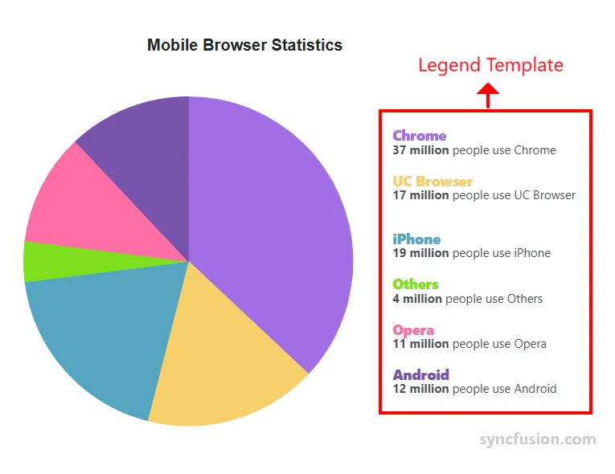
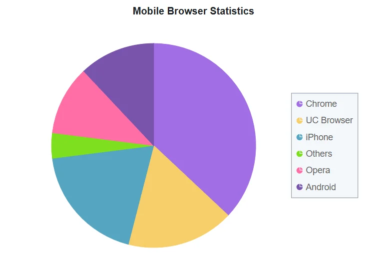

# Blazor Accumulation Chart Legend

The legend is available for accumulation charts, just like it is for charts, and it provides information about the points. If the chart's width is large, the legend will be placed on the right, and if the chart's height is large, the legend will be placed on the bottom. The legend for a point can be collapsed by assigning an empty string to the point's x value.

```cshtml 

@using Syncfusion.Blazor.Charts

<SfAccumulationChart Title="Mobile Browser Statistics">
    <AccumulationChartSeriesCollection>
        <AccumulationChartSeries DataSource="@StatisticsDetails" XName="Browser" YName="Users"
                                 Name="Browser">
        </AccumulationChartSeries>
    </AccumulationChartSeriesCollection>

    <AccumulationChartLegendSettings Visible="true"></AccumulationChartLegendSettings>
</SfAccumulationChart>

@code{
    public class Statistics
    {
        public string Browser { get; set; }
        public double Users { get; set; }
    }

    public List<Statistics> StatisticsDetails = new List<Statistics>
	{
        new Statistics { Browser = "Chrome", Users = 37 },
        new Statistics { Browser = "UC Browser", Users = 17 },
        new Statistics { Browser = "iPhone", Users = 19 },
        new Statistics { Browser = "Others", Users = 4  },
        new Statistics { Browser = "Opera", Users = 11 },
        new Statistics { Browser = "Android", Users = 12 },
    };
}

```



## Position and Alignment

The legend can be placed at [Left](https://help.syncfusion.com/cr/blazor/Syncfusion.Blazor.Charts.LegendPosition.html#Syncfusion_Blazor_Charts_LegendPosition_Left), [Right](https://help.syncfusion.com/cr/blazor/Syncfusion.Blazor.Charts.LegendPosition.html#Syncfusion_Blazor_Charts_LegendPosition_Right), [Top](https://help.syncfusion.com/cr/blazor/Syncfusion.Blazor.Charts.LegendPosition.html#Syncfusion_Blazor_Charts_LegendPosition_Top) or [Bottom](https://help.syncfusion.com/cr/blazor/Syncfusion.Blazor.Charts.LegendPosition.html#Syncfusion_Blazor_Charts_LegendPosition_Bottom)  [Custom](https://help.syncfusion.com/cr/blazor/Syncfusion.Blazor.Charts.LegendPosition.html#Syncfusion_Blazor_Charts_LegendPosition_Custom) position of the chart using the [Position](https://help.syncfusion.com/cr/blazor/Syncfusion.Blazor.Charts.AccumulationChartLegendSettings.html#Syncfusion_Blazor_Charts_AccumulationChartLegendSettings_Position) property. The [Alignment](https://help.syncfusion.com/cr/blazor/Syncfusion.Blazor.Charts.AccumulationChartLegendSettings.html#Syncfusion_Blazor_Charts_AccumulationChartLegendSettings_Alignment) property can also be used to align the legend to the chart's [Center](https://help.syncfusion.com/cr/blazor/Syncfusion.Blazor.Charts.Alignment.html#Syncfusion_Blazor_Charts_Alignment_Center), [Far](https://help.syncfusion.com/cr/blazor/Syncfusion.Blazor.Charts.Alignment.html#Syncfusion_Blazor_Charts_Alignment_Far) or [Near](https://help.syncfusion.com/cr/blazor/Syncfusion.Blazor.Charts.Alignment.html#Syncfusion_Blazor_Charts_Alignment_Near).

```cshtml 

@using Syncfusion.Blazor.Charts

<SfAccumulationChart Title="Mobile Browser Statistics">
    <AccumulationChartSeriesCollection>
        <AccumulationChartSeries DataSource="@StatisticsDetails" XName="Browser" YName="Users"
                                 Name="Browser">
        </AccumulationChartSeries>
    </AccumulationChartSeriesCollection>

    <AccumulationChartLegendSettings Visible="true" Position="LegendPosition.Top"></AccumulationChartLegendSettings>
</SfAccumulationChart>

@code{
    public class Statistics
    {
        public string Browser { get; set; }
        public double Users { get; set; }
    }

    public List<Statistics> StatisticsDetails = new List<Statistics>
	{
        new Statistics { Browser = "Chrome", Users = 37 },
        new Statistics { Browser = "UC Browser", Users = 17 },
        new Statistics { Browser = "iPhone", Users = 19 },
        new Statistics { Browser = "Others", Users = 4  },
        new Statistics { Browser = "Opera", Users = 11 },
        new Statistics { Browser = "Android", Users = 12 },
    };
}

```



## Legend Reverse

You can reverse the order of the legend items by using the [Reverse](https://help.syncfusion.com/cr/blazor/Syncfusion.Blazor.Charts.AccumulationChartLegendSettings.html#Syncfusion_Blazor_Charts_AccumulationChartLegendSettings_Reverse) property. By default, legend for the first series in the collection will be placed first.

```cshtml

@using Syncfusion.Blazor.Charts

<SfAccumulationChart Title="Mobile Browser Statistics">
    <AccumulationChartSeriesCollection>
        <AccumulationChartSeries LegendShape="LegendShape.Rectangle" DataSource="@StatisticsDetails" XName="Browser" YName="Users"
                                 Name="Browser">

        </AccumulationChartSeries>
    </AccumulationChartSeriesCollection>

    <AccumulationChartLegendSettings Visible="true" Reverse="true"></AccumulationChartLegendSettings>
</SfAccumulationChart>

@code{
    public class Statistics
    {
        public string Browser { get; set; }
        public double Users { get; set; }
    }

    public List<Statistics> StatisticsDetails = new List<Statistics>
	{
        new Statistics { Browser = "Chrome", Users = 37 },
        new Statistics { Browser = "UC Browser", Users = 17 },
        new Statistics { Browser = "iPhone", Users = 19 },
        new Statistics { Browser = "Others", Users = 4  },
        new Statistics { Browser = "Opera", Users = 11 },
        new Statistics { Browser = "Android", Users = 12 },
    };
}

```



## Legend Shape

The [LegendShape](https://help.syncfusion.com/cr/blazor/Syncfusion.Blazor.Charts.AccumulationChartSeries.html#Syncfusion_Blazor_Charts_AccumulationChartSeries_LegendShape) property in the [Series](https://help.syncfusion.com/cr/blazor/Syncfusion.Blazor.Charts.AccumulationChartSeries.html#properties) can be used to change the shape of the legend icon. The default icon shape for legends is [SeriesType](https://help.syncfusion.com/cr/blazor/Syncfusion.Blazor.Charts.LegendShape.html#Syncfusion_Blazor_Charts_LegendShape_SeriesType).

```cshtml 

@using Syncfusion.Blazor.Charts

<SfAccumulationChart Title="Mobile Browser Statistics">
    <AccumulationChartSeriesCollection>
        <AccumulationChartSeries LegendShape="LegendShape.Rectangle" DataSource="@StatisticsDetails" XName="Browser" YName="Users"
                                 Name="Browser">

        </AccumulationChartSeries>
    </AccumulationChartSeriesCollection>

    <AccumulationChartLegendSettings Visible="true"></AccumulationChartLegendSettings>
</SfAccumulationChart>

@code{
    public class Statistics
    {
        public string Browser { get; set; }
        public double Users { get; set; }
    }

    public List<Statistics> StatisticsDetails = new List<Statistics>
	{
        new Statistics { Browser = "Chrome", Users = 37 },
        new Statistics { Browser = "UC Browser", Users = 17 },
        new Statistics { Browser = "iPhone", Users = 19 },
        new Statistics { Browser = "Others", Users = 4  },
        new Statistics { Browser = "Opera", Users = 11 },
        new Statistics { Browser = "Android", Users = 12 },
    };
}

```



## Legend Size

The legend size can be customized by using the [Width](https://help.syncfusion.com/cr/blazor/Syncfusion.Blazor.Charts.AccumulationChartLegendSettings.html#Syncfusion_Blazor_Charts_AccumulationChartLegendSettings_Width) and [Height](https://help.syncfusion.com/cr/blazor/Syncfusion.Blazor.Charts.AccumulationChartLegendSettings.html#Syncfusion_Blazor_Charts_AccumulationChartLegendSettings_Height) properties of the [AccumulationChartLegendSettings](https://help.syncfusion.com/cr/blazor/Syncfusion.Blazor.Charts.AccumulationChartLegendSettings.html).

```cshtml 

@using Syncfusion.Blazor.Charts

<SfAccumulationChart Title="Mobile Browser Statistics">
    <AccumulationChartSeriesCollection>
        <AccumulationChartSeries DataSource="@StatisticsDetails" XName="Browser" YName="Users"
                                 Name="Browser">
        </AccumulationChartSeries>
    </AccumulationChartSeriesCollection>

    <AccumulationChartLegendSettings Visible="true" Height="28%" Width="44%">
        <AccumulationChartLegendBorder Color="Pink" Width="1"></AccumulationChartLegendBorder>
    </AccumulationChartLegendSettings>
</SfAccumulationChart>

@code{
    public class Statistics
    {
        public string Browser { get; set; }
        public double Users { get; set; }
    }

    public List<Statistics> StatisticsDetails = new List<Statistics>
	{
        new Statistics { Browser = "Chrome", Users = 37 },
        new Statistics { Browser = "UC Browser", Users = 17 },
        new Statistics { Browser = "iPhone", Users = 19 },
        new Statistics { Browser = "Others", Users = 4  },
        new Statistics { Browser = "Opera", Users = 11 },
        new Statistics { Browser = "Android", Users = 12 },
    };
}

```



## Legend Shape Size

The [ShapeHeight](https://help.syncfusion.com/cr/blazor/Syncfusion.Blazor.Charts.AccumulationChartLegendSettings.html#Syncfusion_Blazor_Charts_AccumulationChartLegendSettings_ShapeHeight) and [ShapeWidth](https://help.syncfusion.com/cr/blazor/Syncfusion.Blazor.Charts.AccumulationChartLegendSettings.html#Syncfusion_Blazor_Charts_AccumulationChartLegendSettings_ShapeWidth) properties can be used to adjust the dimensions of the legend shape.

```cshtml 

@using Syncfusion.Blazor.Charts

<SfAccumulationChart Title="Mobile Browser Statistics">
    <AccumulationChartSeriesCollection>
        <AccumulationChartSeries DataSource="@StatisticsDetails" XName="Browser" YName="Users"
                                 Name="Browser">
        </AccumulationChartSeries>
    </AccumulationChartSeriesCollection>

    <AccumulationChartLegendSettings Visible="true" ShapeHeight="15" ShapeWidth="15">
    </AccumulationChartLegendSettings>
</SfAccumulationChart>

@code{
    public class Statistics
    {
        public string Browser { get; set; }
        public double Users { get; set; }
    }

    public List<Statistics> StatisticsDetails = new List<Statistics>
	{
        new Statistics { Browser = "Chrome", Users = 37 },
        new Statistics { Browser = "UC Browser", Users = 17 },
        new Statistics { Browser = "iPhone", Users = 19 },
        new Statistics { Browser = "Others", Users = 4  },
        new Statistics { Browser = "Opera", Users = 11 },
        new Statistics { Browser = "Android", Users = 12 },
    };
}

```



## Paging for Legend

When the legend items exceed legend bounds, paging will be enabled by default. End user can view each legend item using the navigation buttons to navigate between pages.

```cshtml 

@using Syncfusion.Blazor.Charts

<SfAccumulationChart Title="Mobile Browser Statistics">
    <AccumulationChartSeriesCollection>
        <AccumulationChartSeries DataSource="@StatisticsDetails" XName="Browser" YName="Users"
                                 Name="Browser">
        </AccumulationChartSeries>
    </AccumulationChartSeriesCollection>

    <AccumulationChartLegendSettings Visible="true" Height="150" Width="100">
    </AccumulationChartLegendSettings>
</SfAccumulationChart>

@code{
    public class Statistics
    {
        public string Browser{ get; set; }
        public double Users { get; set; }
    }

    public List<Statistics> StatisticsDetails = new List<Statistics>
	{
        new Statistics { Browser = "Chrome", Users = 37 },
        new Statistics { Browser = "UC Browser", Users = 17 },
        new Statistics { Browser = "iPhone", Users = 19 },
        new Statistics { Browser = "Others", Users = 4  },
        new Statistics { Browser = "Opera", Users = 11 },
        new Statistics { Browser = "Android", Users = 12 },
    };
}

```



### Paging Customization

In legend pager, the arrow elements can be customized by using the [ArrowSize](https://help.syncfusion.com/cr/blazor/Syncfusion.Blazor.Charts.AccumulationChartLegendPageSettings.html#Syncfusion_Blazor_Charts_AccumulationChartLegendPageSettings_ArrowSize) property in the [AccumulationChartLegendPageSettings](https://help.syncfusion.com/cr/blazor/Syncfusion.Blazor.Charts.AccumulationChartLegendPageSettings.html) and the page numbers can be customized by using the [AccumulationChartLegendPageSettingsTextStyle](https://help.syncfusion.com/cr/blazor/Syncfusion.Blazor.Charts.AccumulationChartLegendPageSettingsTextStyle.html).

```cshtml 

@using Syncfusion.Blazor.Charts

<SfAccumulationChart ID="chart" Width="640px" Height="475px" Theme="@Theme">
    <AccumulationChartLegendSettings ToggleVisibility="false" TextWrap="@Syncfusion.Blazor.TextWrap.Wrap" MaximumLabelWidth="80" Position="@position" Height="@Height" Width="@Width">
        <AccumulationChartLegendPageSettings ArrowSize="10">
            <AccumulationChartLegendPageSettingsTextStyle Color="blue">
            </AccumulationChartLegendPageSettingsTextStyle>
        </AccumulationChartLegendPageSettings>
        <AccumulationChartLegendBorder Color="darkblue" Width="1"></AccumulationChartLegendBorder>
        <AccumulationChartLegendFont Size="12px"></AccumulationChartLegendFont>
    </AccumulationChartLegendSettings>
    <AccumulationChartSeriesCollection>
        <AccumulationChartSeries DataSource="@PieChartPoints" XName="ExpenseCategory" YName="ExpensePercentage" Radius="70%" Name="Revenue" InnerRadius="40%">
        </AccumulationChartSeries>
    </AccumulationChartSeriesCollection>
</SfAccumulationChart>

@code {
    private Syncfusion.Blazor.Theme Theme { get; set; } = Syncfusion.Blazor.Theme.Fluent2;
    public string Height { get; set; } = "30%";
    public string Width { get; set; } = "33%";
    public Syncfusion.Blazor.Charts.LegendPosition position { get; set; } = Syncfusion.Blazor.Charts.LegendPosition.Right;
    public double MaxLabel { get; set; } = 100;

    public List<PieData> PieChartPoints { get; set; } = new List<PieData>
    {
         new PieData { ExpenseCategory =  "IE", ExpensePercentage = 6.12, DataLabelMappingName = "6.12%" },
         new PieData { ExpenseCategory =  "Chrome", ExpensePercentage = 37.28, DataLabelMappingName = "57.28%" },
         new PieData { ExpenseCategory =  "Firefox", ExpensePercentage = 20, DataLabelMappingName = "57.28%" },
         new PieData { ExpenseCategory =  "Safari", ExpensePercentage = 4.73, DataLabelMappingName = "4.73%" },
         new PieData { ExpenseCategory =  "QQ", ExpensePercentage = 5.96, DataLabelMappingName = "5.96%" },
         new PieData { ExpenseCategory =  "UC Browser", ExpensePercentage = 4.37, DataLabelMappingName = "4.37%" },
         new PieData { ExpenseCategory =  "Edge", ExpensePercentage = 7.48, DataLabelMappingName = "7.48%" },
         new PieData { ExpenseCategory =  "Opera", ExpensePercentage = 3.06, DataLabelMappingName = "14.06%" },
         new PieData { ExpenseCategory =  "Brave", ExpensePercentage = 2.06, DataLabelMappingName = "14.06%" },
         new PieData { ExpenseCategory =  "Maxthon", ExpensePercentage = 3.06, DataLabelMappingName = "14.06%" },
         new PieData { ExpenseCategory =  "UC", ExpensePercentage = 3.06, DataLabelMappingName = "14.06%" },
         new PieData { ExpenseCategory =  "Falkon", ExpensePercentage = 3.06, DataLabelMappingName = "14.06%" },
    };

    public class PieData
    {
        public string ExpenseCategory { get; set; }
        public double ExpensePercentage { get; set; }
        public string DataLabelMappingName { get; set; }
    }
}

```


## Legend Text Wrap

When the legend text exceeds the container, the text can be wrapped by using the [TextWrap](https://help.syncfusion.com/cr/blazor/Syncfusion.Blazor.Charts.AccumulationChartLegendSettings.html#Syncfusion_Blazor_Charts_AccumulationChartLegendSettings_TextWrap) property. The end user can also wrap the legend text based on the [MaximumLabelWidth](https://help.syncfusion.com/cr/blazor/Syncfusion.Blazor.Charts.AccumulationChartLegendSettings.html#Syncfusion_Blazor_Charts_AccumulationChartLegendSettings_MaximumLabelWidth) property.

```cshtml

@using Syncfusion.Blazor.Charts

<SfAccumulationChart>
        <AccumulationChartLegendSettings Position="LegendPosition.Right" TextWrap="@Syncfusion.Blazor.TextWrap.Wrap" MaximumLabelWidth="100" Height="28%" Width="36%"></AccumulationChartLegendSettings>
        <AccumulationChartSeriesCollection>
            <AccumulationChartSeries DataSource="@PieChartPoints" XName="ExpenseCategory" YName="ExpensePercentage" Name="Revenue" InnerRadius="40%">
            </AccumulationChartSeries>
        </AccumulationChartSeriesCollection>
    </SfAccumulationChart>

@code{
   public List<PieData> PieChartPoints { get; set; } = new List<PieData>
    {
         new PieData { ExpenseCategory =  "Net-tution", ExpensePercentage = 21, DataLabelMappingName = "21%" },
         new PieData { ExpenseCategory =  "Private Gifts", ExpensePercentage = 8, DataLabelMappingName = "8%" },
         new PieData { ExpenseCategory =  "All Other", ExpensePercentage = 9, DataLabelMappingName = "9%" },
         new PieData { ExpenseCategory =  "Local Revenue", ExpensePercentage = 4, DataLabelMappingName = "4%" },
         new PieData { ExpenseCategory =  "State Revenue", ExpensePercentage = 21, DataLabelMappingName = "21%" },
         new PieData { ExpenseCategory =  "Federal Revenue", ExpensePercentage = 16, DataLabelMappingName = "16%" },
         new PieData { ExpenseCategory =  "Self-supporting Operations", ExpensePercentage = 21, DataLabelMappingName = "21%" },
    };
    public class PieData
    {
        public string ExpenseCategory { get; set; }
        public double ExpensePercentage { get; set; }
        public string DataLabelMappingName { get; set; }
    }
}

```



## Legend Template

Legend templates allow you to replace default legend icons and text with custom HTML or Blazor markup for each series. This enables branded styles, richer content (icons, multi-line text, badges), improved readability, and localization.

To use, add a `LegendItemTemplate` inside any [AccumulationChartSeries](https://help.syncfusion.com/cr/blazor/Syncfusion.Blazor.Charts.AccumulationChartSeries.html) you want to customize. The rendered content becomes the legend item and can be styled with CSS. Legend interactions (click to toggle series) remain unless [ToggleVisibility](https://help.syncfusion.com/cr/blazor/Syncfusion.Blazor.Charts.AccumulationChartLegendSettings.html#Syncfusion_Blazor_Charts_AccumulationChartLegendSettings_ToggleVisibility) is set to false. Templates work with all legend positions, alignments, and paging.

**Text** : Gets or sets the text to render for the current legend item in the template. Defaults to the value from the field mapped by AccumulationChartSeries.XName.

**Data** : Gets the data item from AccumulationChartSeries.DataSource bound to the current legend item. Use this to access additional fields (for example, images, badges, or localized text) inside the template.

```
@using Syncfusion.Blazor.Charts

@* Initialize the accumulation chart component and configure its essential features *@
<SfAccumulationChart Title="Mobile Browser Statistics">

    @* Display the legend and allow toggling visibility on interaction *@
    <AccumulationChartLegendSettings Visible="true" >
    </AccumulationChartLegendSettings>

    <AccumulationChartSeriesCollection>
        @* Define a pie series with X and Y mappings and color mapping *@
        <AccumulationChartSeries DataSource="@StatisticsDetails" XName="Browser" YName="Users" Name="Browser" PointColorMapping="Color">
            @* Render a custom legend item using the template context *@
            <LegendItemTemplate>
                @{
                    var info = context as AccumulationChartLegendInfo;
                    var browser = info?.Data?["Browser"]?.ToString() ?? "";
                    var users = info?.Data?["Users"] is null ? 0 : Convert.ToDouble(info.Data["Users"]);
                }
                <div style="display:flex; align-items:center; gap:8px; padding:4px 0;">
                    <div style="display:flex; flex-direction:column; line-height:1.1;">
                        <span style="font-weight:800; font-size:14px; color: @info.Data["Color"]">@browser</span>
                        <span style="font-size:12px; opacity:0.8;"><b>@users million</b> people use @browser</span>
                    </div>
                </div>
            </LegendItemTemplate>
        </AccumulationChartSeries>
    </AccumulationChartSeriesCollection>

</SfAccumulationChart>

@code {
    public class Statistics
    {
        public string Browser { get; set; }
        public double Users { get; set; }
        public string Color { get; set; }
    }

    public List<Statistics> StatisticsDetails = new()
    {
    new Statistics { Browser = "Chrome", Users = 37, Color = "#a16ee5" },
    new Statistics { Browser = "UC Browser", Users = 17, Color = "#f7ce69" },
    new Statistics { Browser = "iPhone", Users = 19, Color = "#55a5c2" },
    new Statistics { Browser = "Others", Users = 4,  Color = "#7ddf1e" },
    new Statistics { Browser = "Opera", Users = 11, Color = "#ff6ea6" },
    new Statistics { Browser = "Android", Users = 12, Color = "#7953ac" },
    };

}
```


## Legend Background

The background color of the legend area can be customized using the [Background](https://help.syncfusion.com/cr/blazor/Syncfusion.Blazor.Charts.AccumulationChartLegendSettings.html#Syncfusion_Blazor_Charts_AccumulationChartLegendSettings_Background) property of the [AccumulationChartLegendSettings](https://help.syncfusion.com/cr/blazor/Syncfusion.Blazor.Charts.AccumulationChartLegendSettings.html). Combined with the legend border and padding, this lets you create distinct visual zones for the legend area on top of chart backgrounds.

```cshtml

@using Syncfusion.Blazor.Charts

<SfAccumulationChart Title="Mobile Browser Statistics">
    <AccumulationChartSeriesCollection>
        <AccumulationChartSeries DataSource="@StatisticsDetails" XName="Browser" YName="Users"
                                 Name="Browser">
        </AccumulationChartSeries>
    </AccumulationChartSeriesCollection>

    <AccumulationChartLegendSettings Visible="true" Background="#F4F7FB">
        <AccumulationChartLegendBorder Color="#9CA3AF" Width="1"></AccumulationChartLegendBorder>
    </AccumulationChartLegendSettings>
</SfAccumulationChart>

@code {
    public class Statistics
    {
        public string Browser { get; set; }
        public double Users { get; set; }
    }

    public List<Statistics> StatisticsDetails = new List<Statistics>
    {
        new Statistics { Browser = "Chrome", Users = 37 },
        new Statistics { Browser = "UC Browser", Users = 17 },
        new Statistics { Browser = "iPhone", Users = 19 },
        new Statistics { Browser = "Others", Users = 4 },
        new Statistics { Browser = "Opera", Users = 11 },
        new Statistics { Browser = "Android", Users = 12 },
    };
}
```



## Troubleshooting

This section answers common questions when configuring the legend for the Blazor Accumulation Chart.

**Q: Why doesn't the legend appear even though I have data?**

A: The legend is hidden when `Visible` is set to `false` (the default). Set `Visible="true"` on the [AccumulationChartLegendSettings](https://help.syncfusion.com/cr/blazor/Syncfusion.Blazor.Charts.AccumulationChartLegendSettings.html). Also confirm that the data is bound through the `DataSource` and that the chart series renders at least one slice.

**Q: Why is the legend placed in an unexpected position?**

A: The legend position is controlled by the [Position](https://help.syncfusion.com/cr/blazor/Syncfusion.Blazor.Charts.AccumulationChartLegendSettings.html#Syncfusion_Blazor_Charts_AccumulationChartLegendSettings_Position) property. The default behavior places the legend on the right when the chart's width is greater than its height, and at the bottom when the height is greater. Override this with an explicit value such as `Position="LegendPosition.Top"`.

**Q: Why are legend items not all visible?**

A: When pager navigation arrows appear, paging is in effect. Increase the legend [Width](https://help.syncfusion.com/cr/blazor/Syncfusion.Blazor.Charts.AccumulationChartLegendSettings.html#Syncfusion_Blazor_Charts_AccumulationChartLegendSettings_Width) and [Height](https://help.syncfusion.com/cr/blazor/Syncfusion.Blazor.Charts.AccumulationChartLegendSettings.html#Syncfusion_Blazor_Charts_AccumulationChartLegendSettings_Height), enable [TextWrap](https://help.syncfusion.com/cr/blazor/Syncfusion.Blazor.Charts.AccumulationChartLegendSettings.html#Syncfusion_Blazor_Charts_AccumulationChartLegendSettings_TextWrap) with a [MaximumLabelWidth](https://help.syncfusion.com/cr/blazor/Syncfusion.Blazor.Charts.AccumulationChartLegendSettings.html#Syncfusion_Blazor_Charts_AccumulationChartLegendSettings_MaximumLabelWidth), or apply the [Paging customization](#paging-customization) section.

**Q: Why does clicking a legend item not toggle the series?**

A: Toggle behavior depends on [ToggleVisibility](https://help.syncfusion.com/cr/blazor/Syncfusion.Blazor.Charts.AccumulationChartLegendSettings.html#Syncfusion_Blazor_Charts_AccumulationChartLegendSettings_ToggleVisibility). The default is `true`. If toggling is disabled, set `ToggleVisibility="true"` on the legend settings. Custom [LegendItemTemplate](#legend-template) content also needs to keep the root clickable (e.g., a `<div>` rather than inline content inside a non-clickable element) to forward the toggle event.

**Q: How do I hide a specific entry from the legend?**

A: Set the `Name` of the corresponding `AccumulationChartSeries` to an empty string. A series with no rendered name will be excluded from the legend. Note that this also hides it in tooltips that derive their header from the series name.

N> Refer to the [Blazor Charts](https://www.syncfusion.com/blazor-components/blazor-charts) feature tour page for its groundbreaking feature representations and also explore the [Blazor Accumulation Chart Example](https://blazor.syncfusion.com/demos/chart/pie?theme=fluent2) to know about the various features of accumulation charts and how they are used to represent numeric proportional data.

## See also

* [Grouping](./grouping)
* [Data label](./data-label)
