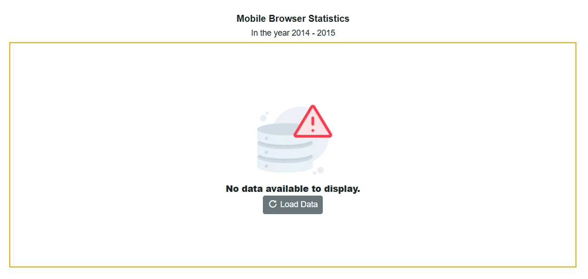

# No Data Template in Blazor Accumulation Chart Component

When there is no data available to render in the chart, the `NoDataTemplate` property allows you to display a custom layout within the chart area. This layout can include a message indicating the absence of data, a relevant image, or a button to initiate data loading. You can incorporate styled text, images, or interactive elements to maintain design consistency and enhance user guidance.

Once data becomes available, the chart automatically updates to display the appropriate visualization.

```cshtml 

@using Syncfusion.Blazor.Charts
@using Syncfusion.Blazor.Buttons

<SfAccumulationChart @ref="accChart" Width="80%" Title="Mobile Browser Statistics" SubTitle="In the year 2014 - 2015">
    <NoDataTemplate>
    <div style="border: 2px solid orange; display: row-flex; align-items: center; justify-content: center; align-content: center; white-space: normal; text-align: center; width: inherit; height: inherit; font-weight: bolder; font-size: medium;">
        <div></div>
        <div style="font-size:15px;"><strong>No data available to display.</strong></div>
        <SfButton IconCss="e-icons e-refresh" OnClick="LoadData">Load Data</SfButton>
    </div>
</NoDataTemplate>
    <ChildContent>
        <AccumulationChartSeriesCollection>
            <AccumulationChartSeries DataSource="@StatisticsDetails" XName="Browser" YName="Users" Name="Browser">
            </AccumulationChartSeries>
        </AccumulationChartSeriesCollection>
        <AccumulationChartLegendSettings Visible="true"></AccumulationChartLegendSettings>
    </ChildContent>
</SfAccumulationChart>

@code {
    private SfAccumulationChart accChart;
    public class Statistics
    {
        public string Browser { get; set; }
        public double Users { get; set; }
    }
    public List<Statistics> StatisticsDetails = new List<Statistics>();
    private void LoadData()
    {
        StatisticsDetails = new List<Statistics>
        {
            new Statistics { Browser = "Chrome", Users = 37 },
            new Statistics { Browser = "UC Browser", Users = 17 },
            new Statistics { Browser = "iPhone", Users = 19 },
            new Statistics { Browser = "Others", Users = 4  },
            new Statistics { Browser = "Opera", Users = 11 },
            new Statistics { Browser = "Android", Users = 12 },
        };
        if (accChart != null)
        accChart.Refresh();
    }
}

```



N> Refer to the [Blazor Charts](https://www.syncfusion.com/blazor-components/blazor-charts) feature tour page for its groundbreaking feature representations and also explore the [Blazor Accumulation Chart Example](https://blazor.syncfusion.com/demos/chart/pie?theme=bootstrap5) to know about the various features of accumulation charts and how it is used to represent numeric proportional data.

## See also

* [Data Label](./data-labels)
* [Tooltip](./tool-tip)
* [Legend](./legend)