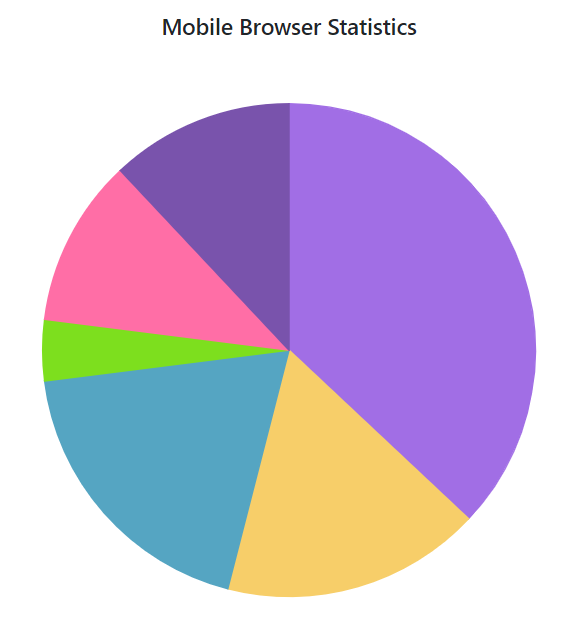
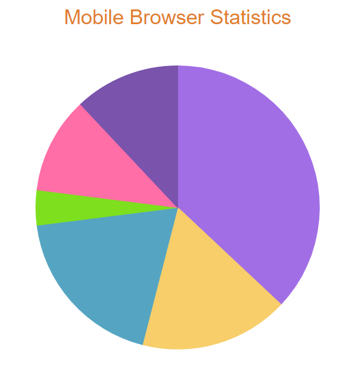
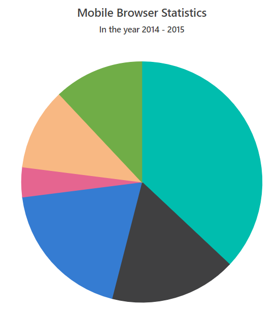

# Title

The [`Title`](https://help.syncfusion.com/cr/blazor/Syncfusion.Blazor.Charts.SfAccumulationChart.html#Syncfusion_Blazor_Charts_SfAccumulationChart_Title) property can be used to give the accumulation chart a title in-order to provide information about the data displayed.





## Title Customization

The [`Title`](https://help.syncfusion.com/cr/blazor/Syncfusion.Blazor.Charts.SfAccumulationChart.html#Syncfusion_Blazor_Charts_SfAccumulationChart_Title) can be customized by using the [`TitleStyle`](https://help.syncfusion.com/cr/blazor/Syncfusion.Blazor.Charts.AccumulationChartTitleStyle.html) property.





## Subtitle

The [`SubTitle`](https://help.syncfusion.com/cr/blazor/Syncfusion.Blazor.Charts.SfChart.html#Syncfusion_Blazor_Charts_SfChart_SubTitle) property can be used to give the accumulation chart a subtitle in-order to provide additional information about the data displayed.





## Subtitle Customization

The [`SubTitle`](https://help.syncfusion.com/cr/blazor/Syncfusion.Blazor.Charts.SfChart.html#Syncfusion_Blazor_Charts_SfChart_SubTitle) can be customized using [`SubTitleStyle`](https://help.syncfusion.com/cr/blazor/Syncfusion.Blazor.Charts.AccumulationChartSubTitleStyle.html) property.





> Refer to our [`Blazor Charts`](https://www.syncfusion.com/blazor-components/blazor-charts) feature tour page for its groundbreaking feature representations and also explore our [`Blazor Accumulation Chart Example`](https://blazor.syncfusion.com/demos/chart/pie?theme=bootstrap4) to know various features of accumulation charts and how it is used to represent numeric proportional data.

## See Also

* [Grouping](./grouping/)
* [Datalabel](./data-label/)