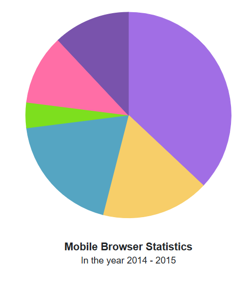
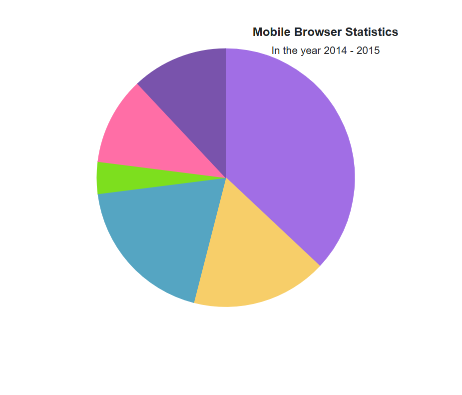
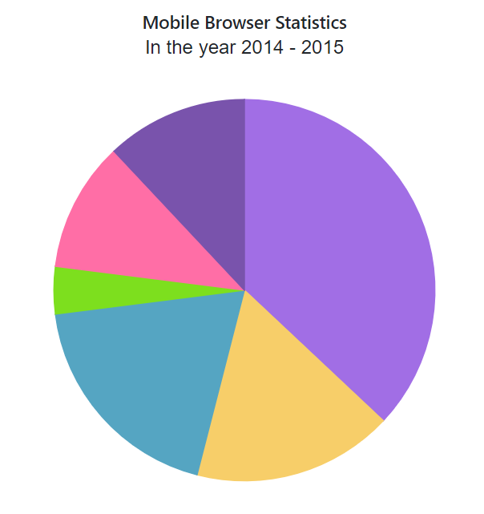
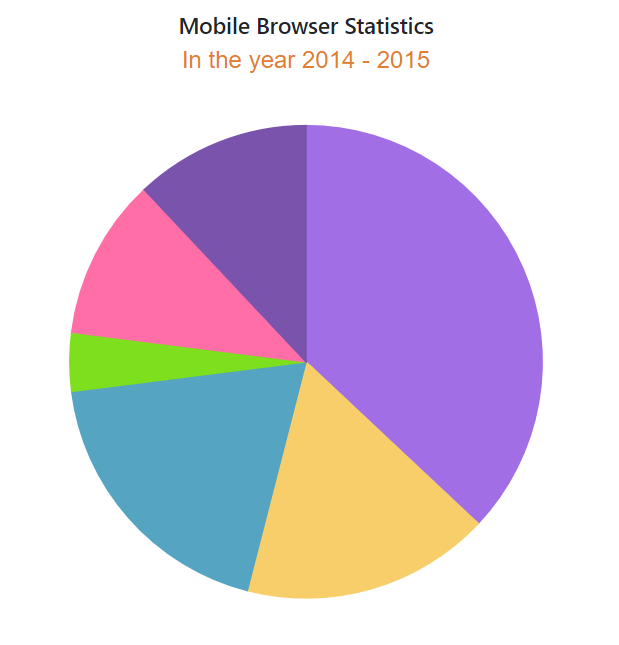

<!-- markdownlint-disable MD036 -->

# Title and Subtitle in Blazor Accumulation Chart Component

Use the [Title](https://help.syncfusion.com/cr/blazor/Syncfusion.Blazor.Charts.SfAccumulationChart.html#Syncfusion_Blazor_Charts_SfAccumulationChart_Title) property to provide a title for the accumulation chart, offering context about the displayed data.

```cshtml

@using Syncfusion.Blazor.Charts

<SfAccumulationChart Title="Mobile Browser Statistics">
    <AccumulationChartSeriesCollection>
        <AccumulationChartSeries DataSource="@StatisticsDetails" XName="Browser" YName="Users"
                                 Name="Browser">
        </AccumulationChartSeries>
    </AccumulationChartSeriesCollection>

    <AccumulationChartLegendSettings Visible="false"></AccumulationChartLegendSettings>
</SfAccumulationChart>

@code {
    public class Statistics
    {
        public string Browser { get; set; }
        public double Users { get; set; }
    }

    public List<Statistics> StatisticsDetails = new List<Statistics>
	{
        new Statistics { Browser = "Chrome", Users = 37 },
        new Statistics { Browser = "UC Browser", Users = 17 },
        new Statistics { Browser = "iPhone", Users = 19 },
        new Statistics { Browser = "Others", Users = 4  },
        new Statistics { Browser = "Opera", Users = 11 },
        new Statistics { Browser = "Android", Users = 12 }
    };
}

```




## Title Customization

Customize the [Title](https://help.syncfusion.com/cr/blazor/Syncfusion.Blazor.Charts.SfAccumulationChart.html#Syncfusion_Blazor_Charts_SfAccumulationChart_Title) using [AccumulationChartTitleStyle](https://help.syncfusion.com/cr/blazor/Syncfusion.Blazor.Charts.AccumulationChartTitleStyle.html).

```cshtml

@using Syncfusion.Blazor.Charts

<SfAccumulationChart Title="Mobile Browser Statistics">
	<AccumulationChartTitleStyle FontFamily="Arial" FontWeight="regular" Color="#E27F2D" Size="23px"></AccumulationChartTitleStyle>

    <AccumulationChartSeriesCollection>
        <AccumulationChartSeries DataSource="@StatisticsDetails" XName="Browser" YName="Users"
                                 Name="Browser">
        </AccumulationChartSeries>
    </AccumulationChartSeriesCollection>

    <AccumulationChartLegendSettings Visible="false"></AccumulationChartLegendSettings>
</SfAccumulationChart>

@code {
    public class Statistics
    {
        public string Browser { get; set; }
        public double Users { get; set; }
    }

    public List<Statistics> StatisticsDetails = new List<Statistics>
	{
        new Statistics { Browser = "Chrome", Users = 37 },
        new Statistics { Browser = "UC Browser", Users = 17 },
        new Statistics { Browser = "iPhone", Users = 19 },
        new Statistics { Browser = "Others", Users = 4  },
        new Statistics { Browser = "Opera", Users = 11 },
        new Statistics { Browser = "Android", Users = 12 }
    };
}

```




### Title Position

Customize the title placement using the [Position](https://help.syncfusion.com/cr/blazor/Syncfusion.Blazor.Charts.AccumulationChartTitleStyle.html#Syncfusion_Blazor_Charts_AccumulationChartTitleStyle_Position) property. Supported options: [Right](https://help.syncfusion.com/cr/blazor/Syncfusion.Blazor.Charts.ChartTitlePosition.html#Syncfusion_Blazor_Charts_ChartTitlePosition_Right), [Left](https://help.syncfusion.com/cr/blazor/Syncfusion.Blazor.Charts.ChartTitlePosition.html#Syncfusion_Blazor_Charts_ChartTitlePosition_Left), [Bottom](https://help.syncfusion.com/cr/blazor/Syncfusion.Blazor.Charts.ChartTitlePosition.html#Syncfusion_Blazor_Charts_ChartTitlePosition_Bottom), [Top](https://help.syncfusion.com/cr/blazor/Syncfusion.Blazor.Charts.ChartTitlePosition.html#Syncfusion_Blazor_Charts_ChartTitlePosition_Top), and [Custom](https://help.syncfusion.com/cr/blazor/Syncfusion.Blazor.Charts.ChartTitlePosition.html#Syncfusion_Blazor_Charts_ChartTitlePosition_Custom). By default, the title appears at the top.

N> The subtitle, which appears below the title, will also be positioned along with the title when the `Position` property is set.

```cshtml

@using Syncfusion.Blazor.Charts

<SfAccumulationChart Title="Mobile Browser Statistics" SubTitle="In the year 2014 - 2015">
    <AccumulationChartTitleStyle Position="ChartTitlePosition.Bottom"></AccumulationChartTitleStyle>
    <AccumulationChartSeriesCollection>
        <AccumulationChartSeries DataSource="@StatisticsDetails" XName="Browser" YName="Users"
                                 Name="Browser">
        </AccumulationChartSeries>
    </AccumulationChartSeriesCollection>

    <AccumulationChartLegendSettings Visible="false"></AccumulationChartLegendSettings>
</SfAccumulationChart>

@code {
    public class Statistics
    {
        public string Browser { get; set; }
        public double Users { get; set; }
    }

    public List<Statistics> StatisticsDetails = new List<Statistics>
	{
        new Statistics { Browser = "Chrome", Users = 37 },
        new Statistics { Browser = "UC Browser", Users = 17 },
        new Statistics { Browser = "iPhone", Users = 19 },
        new Statistics { Browser = "Others", Users = 4  },
        new Statistics { Browser = "Opera", Users = 11 },
        new Statistics { Browser = "Android", Users = 12 }
    };
}

```




Set the `Position` to `Custom` to place the title anywhere on the chart using the [X](https://help.syncfusion.com/cr/blazor/Syncfusion.Blazor.Charts.AccumulationChartTitleStyle.html#Syncfusion_Blazor_Charts_AccumulationChartTitleStyle_X) and [Y](https://help.syncfusion.com/cr/blazor/Syncfusion.Blazor.Charts.AccumulationChartTitleStyle.html#Syncfusion_Blazor_Charts_AccumulationChartTitleStyle_Y) properties. This allows precise control over the title’s location.

```cshtml

@using Syncfusion.Blazor.Charts

<SfAccumulationChart Title="Mobile Browser Statistics" SubTitle="In the year 2014 - 2015">
    <AccumulationChartTitleStyle Position="ChartTitlePosition.Custom" X="320" Y="10"></AccumulationChartTitleStyle>
    <AccumulationChartSeriesCollection>
        <AccumulationChartSeries DataSource="@StatisticsDetails" XName="Browser" YName="Users"
                                 Name="Browser">
        </AccumulationChartSeries>
    </AccumulationChartSeriesCollection>

    <AccumulationChartLegendSettings Visible="false"></AccumulationChartLegendSettings>
</SfAccumulationChart>

@code {
    public class Statistics
    {
        public string Browser { get; set; }
        public double Users { get; set; }
    }

    public List<Statistics> StatisticsDetails = new List<Statistics>
	{
        new Statistics { Browser = "Chrome", Users = 37 },
        new Statistics { Browser = "UC Browser", Users = 17 },
        new Statistics { Browser = "iPhone", Users = 19 },
        new Statistics { Browser = "Others", Users = 4  },
        new Statistics { Browser = "Opera", Users = 11 },
        new Statistics { Browser = "Android", Users = 12 }
    };
}

```




## Subtitle

Use the [SubTitle](https://help.syncfusion.com/cr/blazor/Syncfusion.Blazor.Charts.SfChart.html#Syncfusion_Blazor_Charts_SfChart_SubTitle) property to add a subtitle, providing additional information about the chart data.

```cshtml

@using Syncfusion.Blazor.Charts

<SfAccumulationChart Title="Mobile Browser Statistics" SubTitle="In the year 2014 - 2015">
    <AccumulationChartLegendSettings Visible="false"></AccumulationChartLegendSettings>

    <AccumulationChartSeriesCollection>
        <AccumulationChartSeries DataSource="@StatisticsDetails" XName="Browser" YName="Users">
        </AccumulationChartSeries>
    </AccumulationChartSeriesCollection>
</SfAccumulationChart>

@code {
    public class Statistics
    {
        public string Browser { get; set; }
        public double Users { get; set; }
    }

    public List<Statistics> StatisticsDetails = new List<Statistics>
	{
        new Statistics { Browser = "Chrome", Users = 37 },
        new Statistics { Browser = "UC Browser", Users = 17 },
        new Statistics { Browser = "iPhone", Users = 19 },
        new Statistics { Browser = "Others", Users = 4  },
        new Statistics { Browser = "Opera", Users = 11 },
        new Statistics { Browser = "Android", Users = 12 }
    };
}

```




## Subtitle Customization

Customize the [SubTitle](https://help.syncfusion.com/cr/blazor/Syncfusion.Blazor.Charts.SfChart.html#Syncfusion_Blazor_Charts_SfChart_SubTitle) using [AccumulationChartSubTitleStyle](https://help.syncfusion.com/cr/blazor/Syncfusion.Blazor.Charts.AccumulationChartSubTitleStyle.html).

```cshtml

@using Syncfusion.Blazor.Charts

<SfAccumulationChart Title="Mobile Browser Statistics" SubTitle="In the year 2014 - 2015">
    <AccumulationChartSubTitleStyle FontFamily="Arial" FontWeight="regular" Color="#E27F2D" Size="13px"></AccumulationChartSubTitleStyle>

    <AccumulationChartLegendSettings Visible="false"></AccumulationChartLegendSettings>

    <AccumulationChartSeriesCollection>
        <AccumulationChartSeries DataSource="@StatisticsDetails" XName="Browser" YName="Users">
        </AccumulationChartSeries>
    </AccumulationChartSeriesCollection>
</SfAccumulationChart>

@code {
    public class Statistics
    {
        public string Browser { get; set; }
        public double Users { get; set; }
    }

    public List<Statistics> StatisticsDetails = new List<Statistics>
	{
        new Statistics { Browser = "Chrome", Users = 37 },
        new Statistics { Browser = "UC Browser", Users = 17 },
        new Statistics { Browser = "iPhone", Users = 19 },
        new Statistics { Browser = "Others", Users = 4  },
        new Statistics { Browser = "Opera", Users = 11 },
        new Statistics { Browser = "Android", Users = 12 }
    };
}

```




N> Refer to the [Blazor Charts](https://www.syncfusion.com/blazor-components/blazor-charts) feature tour page for its groundbreaking feature representations and also explore the [Blazor Accumulation Chart Example](https://blazor.syncfusion.com/demos/chart/pie?theme=bootstrap5) to know various features of accumulation charts and how it is used to represent numeric proportional data.

## See also

* [Grouping](./grouping)
* [Data label](./data-label)
