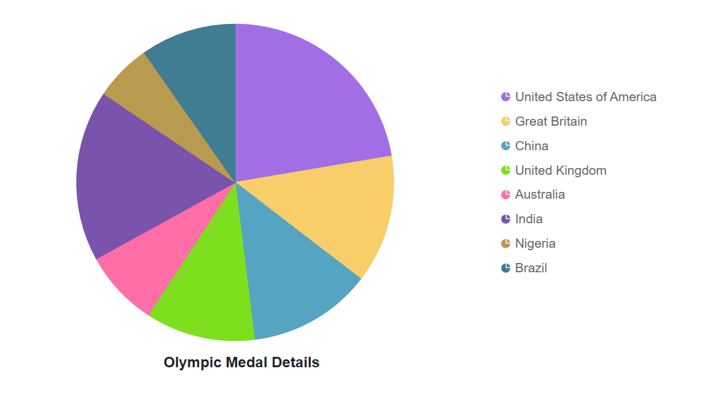

<!-- markdownlint-disable MD036 -->

# Title and Subtitle in Blazor Accumulation Chart Component

The [Title](https://help.syncfusion.com/cr/blazor/Syncfusion.Blazor.Charts.SfAccumulationChart.html#Syncfusion_Blazor_Charts_SfAccumulationChart_Title) property can be used to give the accumulation chart a title in-order to provide information about the data displayed.

```cshtml 

@using Syncfusion.Blazor.Charts

<SfAccumulationChart Title="Mobile Browser Statistics">
    <AccumulationChartSeriesCollection>
        <AccumulationChartSeries DataSource="@StatisticsDetails" XName="Browser" YName="Users"
                                 Name="Browser">
        </AccumulationChartSeries>
    </AccumulationChartSeriesCollection>

    <AccumulationChartLegendSettings Visible="false"></AccumulationChartLegendSettings>
</SfAccumulationChart>

@code{
    public class Statistics
    {
        public string Browser { get; set; }
        public double Users { get; set; }
    }

    public List<Statistics> StatisticsDetails = new List<Statistics>
	{
        new Statistics { Browser = "Chrome", Users = 37 },
        new Statistics { Browser = "UC Browser", Users = 17 },
        new Statistics { Browser = "iPhone", Users = 19 },
        new Statistics { Browser = "Others", Users = 4  },
        new Statistics { Browser = "Opera", Users = 11 },
        new Statistics { Browser = "Android", Users = 12 },
    };
}

```




## Title customization

The [Title](https://help.syncfusion.com/cr/blazor/Syncfusion.Blazor.Charts.SfAccumulationChart.html#Syncfusion_Blazor_Charts_SfAccumulationChart_Title) can be customized to be defined in the [AccumulationChartTitleStyle](https://help.syncfusion.com/cr/blazor/Syncfusion.Blazor.Charts.AccumulationChartTitleStyle.html).

```cshtml 

@using Syncfusion.Blazor.Charts

<SfAccumulationChart Title="Mobile Browser Statistics">
	<AccumulationChartTitleStyle FontFamily="Arial" FontWeight="regular" Color="#E27F2D" Size="23px"></AccumulationChartTitleStyle>

    <AccumulationChartSeriesCollection>
        <AccumulationChartSeries DataSource="@StatisticsDetails" XName="Browser" YName="Users"
                                 Name="Browser">
        </AccumulationChartSeries>
    </AccumulationChartSeriesCollection>

    <AccumulationChartLegendSettings Visible="false"></AccumulationChartLegendSettings>
</SfAccumulationChart>

@code{
    public class Statistics
    {
        public string Browser { get; set; }
        public double Users { get; set; }
    }

    public List<Statistics> StatisticsDetails = new List<Statistics>
	{
        new Statistics { Browser = "Chrome", Users = 37 },
        new Statistics { Browser = "UC Browser", Users = 17 },
        new Statistics { Browser = "iPhone", Users = 19 },
        new Statistics { Browser = "Others", Users = 4  },
        new Statistics { Browser = "Opera", Users = 11 },
        new Statistics { Browser = "Android", Users = 12 },
    };
}

```




## Title position customization

Using [Position](https://help.syncfusion.com/cr/blazor/Syncfusion.Blazor.Charts.AccumulationChartTitleStyle.html#Syncfusion_Blazor_Charts_AccumulationChartTitleStyle_Position) property in [AccumulationChartTitleStyle](https://help.syncfusion.com/cr/blazor/Syncfusion.Blazor.Charts.AccumulationChartTitleStyle.html) helps to customize the position of the title. You can set the position as [Top](), [Bottom](), [Left](), [Right]() and [Custom]().

This provides greater flexibility for aligning the title with different chart layouts.

```cshtml
<SfAccumulationChart Title="Olympic Medal Details">
    <AccumulationChartTitleStyle Position="ChartTitlePosition.Custom" X="300" Y="400">
    </AccumulationChartTitleStyle>
    <AccumulationChartSeriesCollection>
        <AccumulationChartSeries DataSource="@MedalDetails" XName="Country" YName="Medals">
        </AccumulationChartSeries>
    </AccumulationChartSeriesCollection>
</SfAccumulationChart>
@code{
    public class ChartData
    {
        public string Country { get; set; }
        public double Medals { get; set; }
    }

    public List<ChartData> MedalDetails = new List<ChartData>
    {
        new ChartData { Country= "United States of America", Medals= 46 },
        new ChartData { Country= "Great Britain", Medals= 27 },
        new ChartData { Country= "China", Medals= 26 },
        new ChartData { Country= "United Kingdom", Medals= 23 },
        new ChartData { Country= "Australia", Medals= 16 },
        new ChartData { Country= "India", Medals= 36 },
        new ChartData { Country= "Nigeria", Medals= 12 },
        new ChartData { Country= "Brazil", Medals= 20 },
     };
}
```


## Subtitle

The [SubTitle](https://help.syncfusion.com/cr/blazor/Syncfusion.Blazor.Charts.SfChart.html#Syncfusion_Blazor_Charts_SfChart_SubTitle) property can be used to give the accumulation chart a subtitle in-order to provide an additional information about the data displayed.

```cshtml 

@using Syncfusion.Blazor.Charts

<SfAccumulationChart Title="Mobile Browser Statistics" SubTitle="In the year 2014 - 2015">
    <AccumulationChartLegendSettings Visible="false"></AccumulationChartLegendSettings>

    <AccumulationChartSeriesCollection>
        <AccumulationChartSeries DataSource="@StatisticsDetails" XName="Browser" YName="Users">
        </AccumulationChartSeries>
    </AccumulationChartSeriesCollection>
</SfAccumulationChart>

@code{
    public class Statistics
    {
        public string Browser { get; set; }
        public double Users { get; set; }
    }

    public List<Statistics> StatisticsDetails = new List<Statistics>
	{
        new Statistics { Browser = "Chrome", Users = 37 },
        new Statistics { Browser = "UC Browser", Users = 17 },
        new Statistics { Browser = "iPhone", Users = 19 },
        new Statistics { Browser = "Others", Users = 4  },
        new Statistics { Browser = "Opera", Users = 11 },
        new Statistics { Browser = "Android", Users = 12 },
    };
}

```




## Subtitle customization

The [SubTitle](https://help.syncfusion.com/cr/blazor/Syncfusion.Blazor.Charts.SfChart.html#Syncfusion_Blazor_Charts_SfChart_SubTitle) can be customized to be defined in the [AccumulationChartSubTitleStyle](https://help.syncfusion.com/cr/blazor/Syncfusion.Blazor.Charts.AccumulationChartSubTitleStyle.html).

```cshtml 

@using Syncfusion.Blazor.Charts

<SfAccumulationChart Title="Mobile Browser Statistics" SubTitle="In the year 2014 - 2015">
    <AccumulationChartSubTitleStyle FontFamily="Arial" FontWeight="regular" Color="#E27F2D" Size="13px"></AccumulationChartSubTitleStyle>

    <AccumulationChartLegendSettings Visible="false"></AccumulationChartLegendSettings>

    <AccumulationChartSeriesCollection>
        <AccumulationChartSeries DataSource="@StatisticsDetails" XName="Browser" YName="Users">
        </AccumulationChartSeries>
    </AccumulationChartSeriesCollection>
</SfAccumulationChart>

@code{
    public class Statistics
    {
        public string Browser { get; set; }
        public double Users { get; set; }
    }

    public List<Statistics> StatisticsDetails = new List<Statistics>
	{
        new Statistics { Browser = "Chrome", Users = 37 },
        new Statistics { Browser = "UC Browser", Users = 17 },
        new Statistics { Browser = "iPhone", Users = 19 },
        new Statistics { Browser = "Others", Users = 4  },
        new Statistics { Browser = "Opera", Users = 11 },
        new Statistics { Browser = "Android", Users = 12 },
    };
}

```




N> Refer to the [Blazor Charts](https://www.syncfusion.com/blazor-components/blazor-charts) feature tour page for its groundbreaking feature representations and also explore the [Blazor Accumulation Chart Example](https://blazor.syncfusion.com/demos/chart/pie?theme=bootstrap5) to know various features of accumulation charts and how it is used to represent numeric proportional data.

## See also

* [Grouping](./grouping)
* [Data label](./data-label)