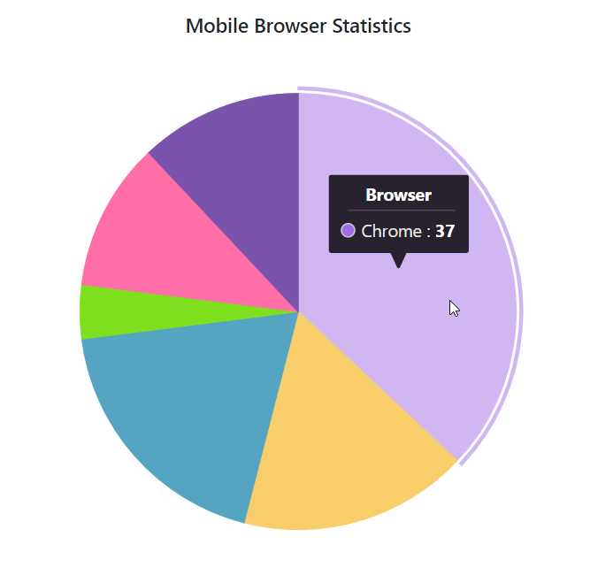
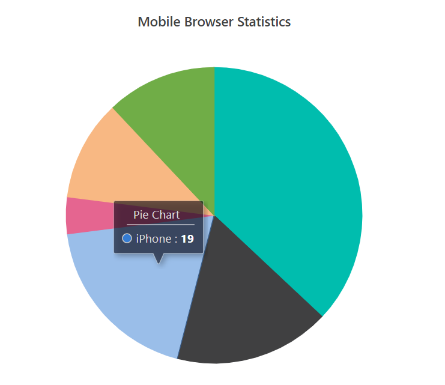
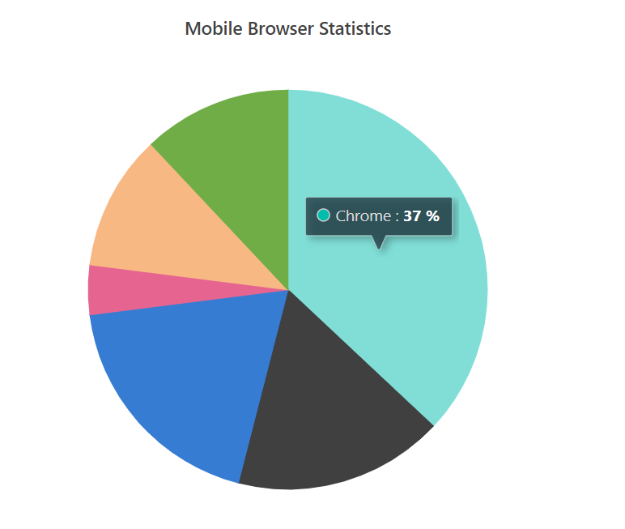
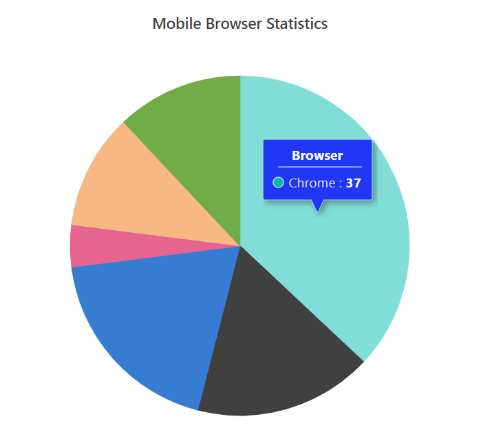
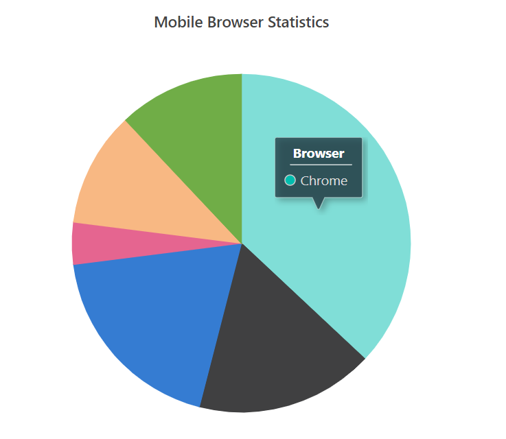

# Tooltip

Tooltip for the accumulation chart can be enabled by using the [`Enable`](https://help.syncfusion.com/cr/blazor/Syncfusion.Blazor.Charts.AccumulationChartTooltipSettings.html#Syncfusion_Blazor_Charts_AccumulationChartTooltipSettings_Enable) property.



@using Syncfusion.Blazor.Charts

<SfAccumulationChart Title="Mobile Browser Statistics">
    <AccumulationChartSeriesCollection>
        <AccumulationChartSeries DataSource="@StatisticsDetails" XName="Browser" YName="Users"
                                 Name="Browser">
        </AccumulationChartSeries>
    </AccumulationChartSeriesCollection>

    <AccumulationChartLegendSettings Visible="false"></AccumulationChartLegendSettings>

    <AccumulationChartTooltipSettings Enable="true"></AccumulationChartTooltipSettings>
</SfAccumulationChart>

@code{
    public class Statistics
    {
        public string Browser { get; set; }
        public double Users { get; set; }

    }

    public List<Statistics> StatisticsDetails = new List<Statistics>
{
        new Statistics { Browser = "Chrome", Users = 37 },
        new Statistics { Browser = "UC Browser", Users = 17 },
        new Statistics { Browser = "iPhone", Users = 19 },
        new Statistics { Browser = "Others", Users = 4  },
        new Statistics { Browser = "Opera", Users = 11 },
        new Statistics { Browser = "Android", Users = 12 },
    };
}



## Header

We can specify header for the tooltip using [`Header`](https://help.syncfusion.com/cr/blazor/Syncfusion.Blazor.Charts.AccumulationChartTooltipSettings.html#Syncfusion_Blazor_Charts_AccumulationChartTooltipSettings_Header) property.



@using Syncfusion.Blazor.Charts

<SfAccumulationChart Title="Mobile Browser Statistics">
    <AccumulationChartSeriesCollection>
        <AccumulationChartSeries DataSource="@StatisticsDetails" XName="Browser" YName="Users"
                                 Name="Browser">
        </AccumulationChartSeries>
    </AccumulationChartSeriesCollection>
    <AccumulationChartLegendSettings Visible="false"></AccumulationChartLegendSettings>
    <AccumulationChartTooltipSettings Enable="true" Header="Pie Chart"></AccumulationChartTooltipSettings>
</SfAccumulationChart>

@code{
    public class Statistics
    {
        public string Browser { get; set; }
        public double Users { get; set; }

    }

    public List<Statistics> StatisticsDetails = new List<Statistics>
{
        new Statistics { Browser = "Chrome", Users = 37 },
        new Statistics { Browser = "UC Browser", Users = 17 },
        new Statistics { Browser = "iPhone", Users = 19 },
        new Statistics { Browser = "Others", Users = 4  },
        new Statistics { Browser = "Opera", Users = 11 },
        new Statistics { Browser = "Android", Users = 12 },
    };
}



## Format

By default, tooltip shows information about x and y value in points. In addition to that, you can show more
information in tooltip. For example the format `${point.x} : <b>${point.y}%</b>` shows series name and point x value.



@using Syncfusion.Blazor.Charts

<SfAccumulationChart Title="Mobile Browser Statistics">
    <AccumulationChartSeriesCollection>
        <AccumulationChartSeries DataSource="@StatisticsDetails" XName="Browser" YName="Users"
                                 Name="Browser">
        </AccumulationChartSeries>
    </AccumulationChartSeriesCollection>
    <AccumulationChartLegendSettings Visible="false"></AccumulationChartLegendSettings>
    <AccumulationChartTooltipSettings Enable="true" Format="${point.x} : <b>${point.y}%</b>"></AccumulationChartTooltipSettings>
</SfAccumulationChart>

@code{
    public class Statistics
    {
        public string Browser { get; set; }
        public double Users { get; set; }

    }

    public List<Statistics> StatisticsDetails = new List<Statistics>
{
        new Statistics { Browser = "Chrome", Users = 37 },
        new Statistics { Browser = "UC Browser", Users = 17 },
        new Statistics { Browser = "iPhone", Users = 19 },
        new Statistics { Browser = "Others", Users = 4  },
        new Statistics { Browser = "Opera", Users = 11 },
        new Statistics { Browser = "Android", Users = 12 },
    };
}



## Customization

The [`Fill`](https://help.syncfusion.com/cr/blazor/Syncfusion.Blazor.Charts.AccumulationChartTooltipSettings.html#Syncfusion_Blazor_Charts_AccumulationChartTooltipSettings_Fill) and
[`Border`](https://help.syncfusion.com/cr/blazor/Syncfusion.Blazor.Charts.AccumulationChartTooltipSettings.html#Syncfusion_Blazor_Charts_AccumulationChartTooltipSettings_Border)
properties are used to customize the background color and border of the tooltip respectively.
The [`TextStyle`](https://help.syncfusion.com/cr/blazor/Syncfusion.Blazor.Charts.AccumulationChartTooltipSettings.html#Syncfusion_Blazor_Charts_AccumulationChartTooltipSettings_TextStyle)
property in the tooltip is used to customize the font of the tooltip text.



@using Syncfusion.Blazor.Charts

<SfAccumulationChart Title="Mobile Browser Statistics">
    <AccumulationChartSeriesCollection>
        <AccumulationChartSeries DataSource="@StatisticsDetails" XName="Browser" YName="Users"
                                 Name="Browser">
        </AccumulationChartSeries>
    </AccumulationChartSeriesCollection>

    <AccumulationChartLegendSettings Visible="false"></AccumulationChartLegendSettings>

    <AccumulationChartTooltipSettings Enable="true" Format="${point.x} : <b>${point.y}</b>" Fill="#7bb4eb"></AccumulationChartTooltipSettings>
</SfAccumulationChart>

@code{
    public class Statistics
    {
       public string Browser { get; set; }
       public double Users { get; set; }
    }

    public List<Statistics> StatisticsDetails = new List<Statistics>
    {
        new Statistics { Browser = "Chrome", Users = 37 },
        new Statistics { Browser = "UC Browser", Users = 17 },
        new Statistics { Browser = "iPhone", Users = 19 },
        new Statistics { Browser = "Others", Users = 4  },
        new Statistics { Browser = "Opera", Users = 11 },
        new Statistics { Browser = "Android", Users = 12 },
    };
}



## Tooltip Text Mapping

By default, tooltip shows information of x and y value in points. You can show more information from datasource in tooltip by using the [`TooltipMappingName`](https://help.syncfusion.com/cr/blazor/Syncfusion.Blazor.Charts.AccumulationChartSeries.html#Syncfusion_Blazor_Charts_AccumulationChartSeries_TooltipMappingName) . You can use the `${point.tooltip}` as place holders to display the specified tooltip content.



@using Syncfusion.Blazor.Charts

<SfAccumulationChart Title="Mobile Browser Statistics">
    <AccumulationChartSeriesCollection>
        <AccumulationChartSeries DataSource="@StatisticsDetails" XName="Browser" YName="Users"
                                 Name="Browser" TooltipMappingName="Browser">
        </AccumulationChartSeries>
    </AccumulationChartSeriesCollection>

    <AccumulationChartLegendSettings Visible="false"></AccumulationChartLegendSettings>

    <AccumulationChartTooltipSettings Enable="true" Format="${point.tooltip}"></AccumulationChartTooltipSettings>
</SfAccumulationChart>

@code{
    public class Statistics
    {
        public string Browser { get; set; }
        public double Users { get; set; }

    }

    public List<Statistics> StatisticsDetails = new List<Statistics>
{
        new Statistics { Browser = "Chrome", Users = 37 },
        new Statistics { Browser = "UC Browser", Users = 17 },
        new Statistics { Browser = "iPhone", Users = 19 },
        new Statistics { Browser = "Others", Users = 4  },
        new Statistics { Browser = "Opera", Users = 11 },
        new Statistics { Browser = "Android", Users = 12 },
    };
}



* [Grouping](./grouping/)
* [Datalabel](./data-label/)