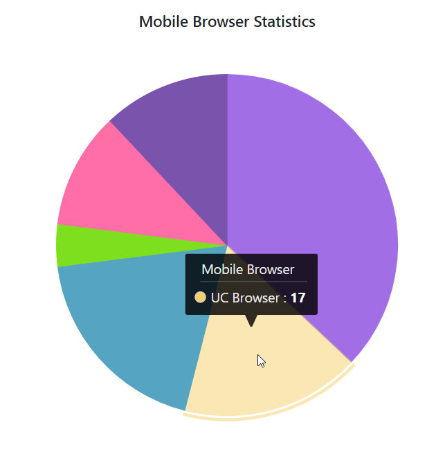
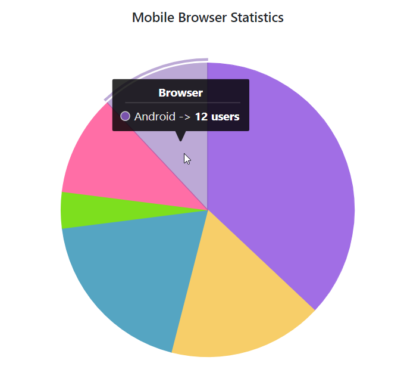
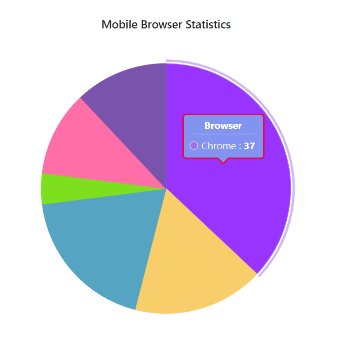
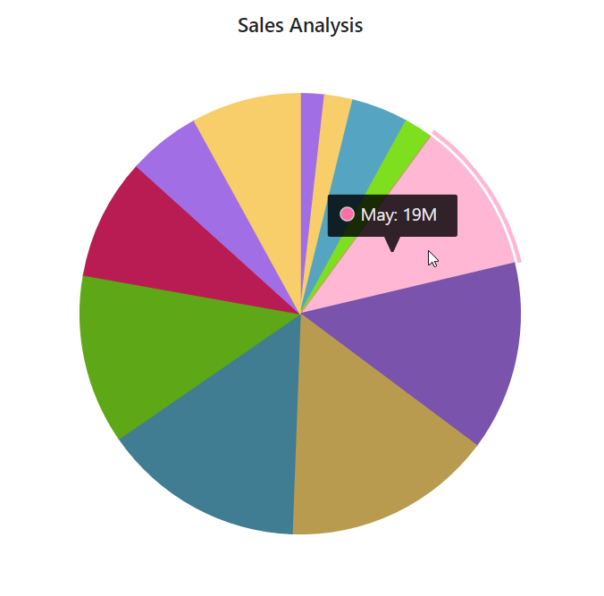

# Tooltip in Blazor Accumulation Chart Component

Enable tooltips by setting the [Enable](https://help.syncfusion.com/cr/blazor/Syncfusion.Blazor.Charts.AccumulationChartTooltipSettings.html#Syncfusion_Blazor_Charts_AccumulationChartTooltipSettings_Enable) property in [AccumulationChartTooltipSettings](https://help.syncfusion.com/cr/blazor/Syncfusion.Blazor.Charts.AccumulationChartTooltipSettings.html) to **true**.

```cshtml

@using Syncfusion.Blazor.Charts

<SfAccumulationChart Title="Mobile Browser Statistics">
    <AccumulationChartSeriesCollection>
        <AccumulationChartSeries DataSource="@StatisticsDetails" XName="Browser" YName="Users"
                                 Name="Browser">
        </AccumulationChartSeries>
    </AccumulationChartSeriesCollection>

    <AccumulationChartLegendSettings Visible="false"></AccumulationChartLegendSettings>

    <AccumulationChartTooltipSettings Enable="true"></AccumulationChartTooltipSettings>
</SfAccumulationChart>

@code {
    public class Statistics
    {
        public string Browser { get; set; }
        public double Users { get; set; }
    }

    public List<Statistics> StatisticsDetails = new List<Statistics>
	{
        new Statistics { Browser = "Chrome", Users = 37 },
        new Statistics { Browser = "UC Browser", Users = 17 },
        new Statistics { Browser = "iPhone", Users = 19 },
        new Statistics { Browser = "Others", Users = 4  },
        new Statistics { Browser = "Opera", Users = 11 },
        new Statistics { Browser = "Android", Users = 12 }
    };
}

```




## Header

Specify the tooltip's header using the [Header](https://help.syncfusion.com/cr/blazor/Syncfusion.Blazor.Charts.AccumulationChartTooltipSettings.html#Syncfusion_Blazor_Charts_AccumulationChartTooltipSettings_Header) property in [AccumulationChartTooltipSettings](https://help.syncfusion.com/cr/blazor/Syncfusion.Blazor.Charts.AccumulationChartTooltipSettings.html).

```cshtml

@using Syncfusion.Blazor.Charts

<SfAccumulationChart Title="Mobile Browser Statistics">
    <AccumulationChartSeriesCollection>
        <AccumulationChartSeries DataSource="@StatisticsDetails" XName="Browser" YName="Users"
                                 Name="Browser">
        </AccumulationChartSeries>
    </AccumulationChartSeriesCollection>

    <AccumulationChartLegendSettings Visible="false"></AccumulationChartLegendSettings>

    <AccumulationChartTooltipSettings Enable="true" Header="Mobile Browser"></AccumulationChartTooltipSettings>
</SfAccumulationChart>

@code {
    public class Statistics
    {
        public string Browser { get; set; }
        public double Users { get; set; }

    }

    public List<Statistics> StatisticsDetails = new List<Statistics>
	{
        new Statistics { Browser = "Chrome", Users = 37 },
        new Statistics { Browser = "UC Browser", Users = 17 },
        new Statistics { Browser = "iPhone", Users = 19 },
        new Statistics { Browser = "Others", Users = 4  },
        new Statistics { Browser = "Opera", Users = 11 },
        new Statistics { Browser = "Android", Users = 12 }
    };
}

```




## Tooltip Format

By default, the tooltip displays information about the x and y values of points. Customize the tooltip format as needed. For example, the format `${point.x} : <b>${point.y}%</b>` shows the x value and a customized y value.

```cshtml

@using Syncfusion.Blazor.Charts

<SfAccumulationChart Title="Mobile Browser Statistics">
    <AccumulationChartSeriesCollection>
        <AccumulationChartSeries DataSource="@StatisticsDetails" XName="Browser" YName="Users"
                                 Name="Browser">
        </AccumulationChartSeries>
    </AccumulationChartSeriesCollection>

    <AccumulationChartLegendSettings Visible="false"></AccumulationChartLegendSettings>

    <AccumulationChartTooltipSettings Enable="true" Format="${point.x} -> <b>${point.y} users</b>"></AccumulationChartTooltipSettings>
</SfAccumulationChart>

@code {
    public class Statistics
    {
        public string Browser { get; set; }
        public double Users { get; set; }
    }

    public List<Statistics> StatisticsDetails = new List<Statistics>
    {
        new Statistics { Browser = "Chrome", Users = 37 },
        new Statistics { Browser = "UC Browser", Users = 17 },
        new Statistics { Browser = "iPhone", Users = 19 },
        new Statistics { Browser = "Others", Users = 4  },
        new Statistics { Browser = "Opera", Users = 11 },
        new Statistics { Browser = "Android", Users = 12 }
    };
}

```




## Tooltip Customization

Customize the tooltip background color using the [Fill](https://help.syncfusion.com/cr/blazor/Syncfusion.Blazor.Charts.AccumulationChartTooltipSettings.html#Syncfusion_Blazor_Charts_AccumulationChartTooltipSettings_Fill) property and the border using [AccumulationChartTooltipBorder](https://help.syncfusion.com/cr/blazor/Syncfusion.Blazor.Charts.AccumulationChartTooltipBorder.html). Adjust the font size with [AccumulationChartTooltipTextStyle](https://help.syncfusion.com/cr/blazor/Syncfusion.Blazor.Charts.AccumulationChartTooltipTextStyle.html). Change the color of the data point on hover using the [HighlightColor](https://help.syncfusion.com/cr/blazor/Syncfusion.Blazor.Charts.SfAccumulationChart.html#Syncfusion_Blazor_Charts_SfAccumulationChart_HighlightColor) property.

```cshtml

@using Syncfusion.Blazor.Charts

<SfAccumulationChart Title="Mobile Browser Statistics" HighlightColor="#9933ff">
    <AccumulationChartSeriesCollection>
        <AccumulationChartSeries DataSource="@StatisticsDetails" XName="Browser" YName="Users"
                                 Name="Browser">
        </AccumulationChartSeries>
    </AccumulationChartSeriesCollection>

    <AccumulationChartLegendSettings Visible="false"></AccumulationChartLegendSettings>

    <AccumulationChartTooltipSettings Enable="true" Format="${point.x} : <b>${point.y}</b>" Fill="#7bb4eb">
        <AccumulationChartTooltipBorder Color="red" Width="2"></AccumulationChartTooltipBorder>
    </AccumulationChartTooltipSettings>
</SfAccumulationChart>

@code {
    public class Statistics
    {
        public string Browser { get; set; }
        public double Users { get; set; }
    }

    public List<Statistics> StatisticsDetails = new List<Statistics>
    {
        new Statistics { Browser = "Chrome", Users = 37 },
        new Statistics { Browser = "UC Browser", Users = 17 },
        new Statistics { Browser = "iPhone", Users = 19 },
        new Statistics { Browser = "Others", Users = 4  },
        new Statistics { Browser = "Opera", Users = 11 },
        new Statistics { Browser = "Android", Users = 12 }
    };
}

```




## Tooltip Text Mapping

Display additional information from the data source in the tooltip using the [TooltipMappingName](https://help.syncfusion.com/cr/blazor/Syncfusion.Blazor.Charts.AccumulationChartSeries.html#Syncfusion_Blazor_Charts_AccumulationChartSeries_TooltipMappingName) property. Use **$point.tooltip** as a placeholder to show the specified tooltip content.

```cshtml

@using Syncfusion.Blazor.Charts

<SfAccumulationChart Title="Sales Analysis">
    <AccumulationChartSeriesCollection>
        <AccumulationChartSeries DataSource="@StatisticsDetails" XName="XValue" YName="YValue"
                                 TooltipMappingName="Text">
        </AccumulationChartSeries>
    </AccumulationChartSeriesCollection>

    <AccumulationChartLegendSettings Visible="false"></AccumulationChartLegendSettings>

    <AccumulationChartTooltipSettings Enable="true" Format="${point.tooltip}" ></AccumulationChartTooltipSettings>
</SfAccumulationChart>

@code {
    public class ChartData
    {
        public string XValue { get; set; }
        public double YValue { get; set; }
        public string Text { get; set; }
    }

    public List<ChartData> StatisticsDetails = new List<ChartData>
    {
       new ChartData { XValue = "Jan", YValue = 3, Text = "Jan: 3M" },
       new ChartData { XValue = "Feb", YValue = 3.5, Text = "Feb: 3.5M" },
       new ChartData { XValue = "Mar", YValue = 7, Text = "Mar: 7M" },
       new ChartData { XValue = "Apr", YValue = 3.5, Text = "Apr: 13.5M" },
       new ChartData { XValue = "May", YValue = 19, Text = "May: 19M" },
       new ChartData { XValue = "Jun", YValue = 23.5, Text = "Jun: 23.5M" },
       new ChartData { XValue = "Jul", YValue = 26, Text = "Jul: 26M" },
       new ChartData { XValue = "Aug", YValue = 25, Text = "Aug: 25M" },
       new ChartData { XValue = "Sep", YValue = 21, Text = "Sep: 21M" },
       new ChartData { XValue = "Oct", YValue = 15, Text = "Oct: 15M" },
       new ChartData { XValue = "Nov", YValue = 9, Text = "Nov: 9M" },
       new ChartData { XValue = "Dec", YValue = 13.5, Text = "Dec: 3.5M" }
   };
}

```




N> Refer to the [Blazor Charts](https://www.syncfusion.com/blazor-components/blazor-charts) feature tour page for its groundbreaking feature representations and also explore the [Blazor Accumulation Chart Example](https://blazor.syncfusion.com/demos/chart/pie?theme=bootstrap5) to know about the various features of accumulation charts and how it is used to represent numeric proportional data.

## See also

* [Grouping](./grouping)
* [Data label](./data-label)
