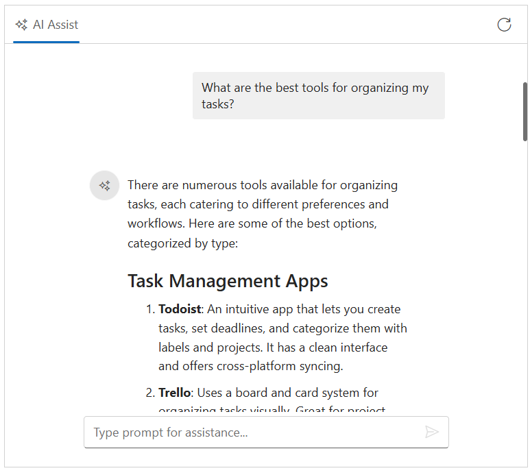

# Integrate Gemini AI With Blazor AI AssistView component

The AI AssistView component integrates with Google’s [Gemini](https://ai.google.dev/gemini-api/docs/quickstart) API to deliver intelligent conversational interfaces. It leverages advanced natural language understanding to interpret user input, maintain context throughout interactions, and provide accurate, relevant responses. By configuring secure authentication and data handling, developers can unlock powerful AI-driven communication features that elevate user engagement and streamline support experiences.

## Prerequisites

Before starting, ensure you have the following:

* **Google Account**: For generating a Gemini API key.

* **Syncfusion AI AssistView**: Package [Syncfusion Blazor package](https://www.nuget.org/packages/Syncfusion.Blazor.InteractiveChat) installed.

* [Markdig](https://www.nuget.org/packages/Markdig) package: For parsing Markdown responses.

## Set Up the AI AssistView Component

Follow the Syncfusion AI AssistView [Getting Started](../getting-started) guide to configure and render the AI AssistView component in the application and that prerequisites are met.

## Install Dependencies

Install the required packages:

1. Install the `Gemini AI` nuget package in the application.

```bash

Nuget\Install-Package Mscc.GenerativeAI

```

2. Install the `Markdig` nuget packages in the application.

```bash

Nuget\Install-Package Markdig

```

## Generate API Key

1. **Access Google AI Studio**: Instructs users to sign into [Google AI Studio](https://aistudio.google.com/app/apikey) with a Google account or create a new account if needed. 

2. **Navigate to API Key Creation**: Go to the `Get API Key` option in the left-hand menu or top-right corner of the dashboard. Click the `Create API Key` button.

3. **Project Selection**: Choose an existing Google Cloud project or create a new one.

4. **API Key Generation**: After project selection, the API key is generated. Users are instructed to copy and store the key securely, as it is shown only once.

> Security note: Advises against committing the API key to version control and recommends using environment variables or a secret manager in production.

## Gemini AI with AI AssistView

Modify the Razor file to integrate the Gemini AI with the AI AssistView component.

* update your Gemini API key securely in the configuration:

```bash

const string GeminiApiKey = 'Place your API key here';

```




@using Syncfusion.Blazor.InteractiveChat
@using Syncfusion.Blazor.Navigations
@using Mscc.GenerativeAI
@using Markdig

<div class="aiassist-container" style="height: 350px; width: 650px;">
// Initializes the AI Assist component
    <SfAIAssistView @ref="sfAIAssistView" ID="aiAssistView" PromptSuggestions="@promptSuggestions" PromptRequested="@OnPromptRequest">
        <AssistViews>
            <AssistView>
                <BannerTemplate>
                    <div class="banner-content">
                        <div class="e-icons e-assistview-icon"></div>
                        <h3>AI Assistance</h3>
                        <i>To get started, provide input or choose a suggestion.</i>
                    </div>
                </BannerTemplate>
            </AssistView>
        </AssistViews>
        <AssistViewToolbar ItemClicked="ToolbarItemClicked">
            <AssistViewToolbarItem Type="ItemType.Spacer"></AssistViewToolbarItem>
            <AssistViewToolbarItem IconCss="e-icons e-refresh"></AssistViewToolbarItem>
        </AssistViewToolbar>
    </SfAIAssistView>
</div>

@code {
    private SfAIAssistView sfAIAssistView = new SfAIAssistView();
    private List<string> promptSuggestions = new List<string>
    {
        "What are the best tools for organizing my tasks?",
        "How can I maintain work-life balance effectively?"
    };
    // Initialize Gemini API
    private readonly string geminiApiKey = "";
    // Handle user prompt: call Gemini model
    private async Task OnPromptRequest(AssistViewPromptRequestedEventArgs args)
    {
        try
        {
            var gemini = new GoogleAI(apiKey: geminiApiKey); // Replace with your Gemini API key
            var model = gemini.GenerativeModel(model: "gemini-2.5-flash"); // Select the Gemini model (update model name as needed)
            var response = await model.GenerateContent(args.Prompt);
            var responseText = response.Text;
            var pipeline = new MarkdownPipelineBuilder()
                .UseAdvancedExtensions()
                .UsePipeTables()
                .UseTaskLists()
                .Build();
            // Add the response to the AIAssistView
            await Task.Delay(1000); // Simulate delay as in original code
            args.Response = Markdown.ToHtml(responseText, pipeline);
        }
        catch (Exception ex)
        {
            Console.WriteLine($"Error fetching Gemini response: {ex.Message}");
            await Task.Delay(1000);
            args.Response = "⚠️ Something went wrong while connecting to the AI service. Please check your API key or try again later.";
        }
    }

    private void ToolbarItemClicked(AssistViewToolbarItemClickedEventArgs args)
    {
        sfAIAssistView.Prompts.Clear();
        StateHasChanged();
    }
}




