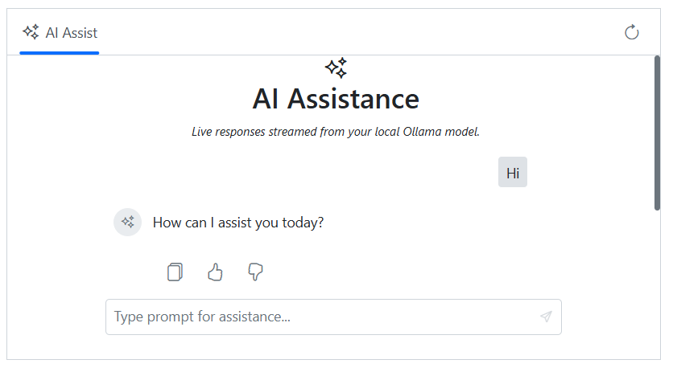

# Integrate LLM via Ollama with Blazor AI AssistView Component

The AI AssistView component integrates with [LLM via Ollama](https://ollama.com) to enable advanced conversational AI features in your Blazor application. The component acts as a user interface where user prompts are sent to the selected LLM model via API calls, providing natural language understanding and context-aware responses.

## Prerequisites

Before starting, ensure you have the following:

* [Ollama](https://ollama.com) installed to run and manage LLM models locally.

* **Syncfusion AI AssistView**: Package [Syncfusion Blazor package](https://www.nuget.org/packages/Syncfusion.Blazor.InteractiveChat) installed.

* [Markdig](https://www.nuget.org/packages/Markdig) package: For parsing Markdown responses.

## Set Up the AI AssistView Component

Follow the Syncfusion AI AssistView [Getting Started](../getting-started) guide to configure and render the AI AssistView component in the application and that prerequisites are met.

## Install Dependency

To install the Markdig package by run `NuGet\Install-Package Markdig` in Package Manager Console.

## Configuring Ollama

Install Ollama for your operating system:




1. Visit [Windows](https://ollama.com/download)
2. Click `Download for Windows` to get the `.exe installer`. 
3. Run `OllamaSetup.exe` and follow the wizard to install.





1. Visit [macOS](https://ollama.com/download/mac)
2. Click `Download for macOS` to get `.dmg file`
3. Install it by following the wizard.





1. Visit [Linux](https://ollama.com/download/linux)
2. Run the below command to install Ollama in your system
      
    curl -fsSL https://ollama.com/install.sh | sh




## Download and run an Ollama model

* Download and run a model using the following command. Replace `deepseek-r1` with your preferred model (e.g., `llama3`, `phi4`). See the [Ollama model](https://ollama.com/search) library for available models.
 
```bash

ollama run deepseek-r1

```

* After the model download completes, start the Ollama server to make the model accessible:

```bash

ollama serve

```

## Configure AI AssistView with Ollama

To integrate Ollama with the Syncfusion Blazor AI AssistView component in your Blazor application:

* Configure the AI services in the `Program.cs` file to register the Ollama client and Syncfusion Blazor services.





using Blazor_AssistView_Ollama.Components;
using Microsoft.Extensions.Caching.Memory;
using Microsoft.Extensions.AI;
using OllamaSharp;
using Syncfusion.Blazor;

var builder = WebApplication.CreateBuilder(args);

// Add services to the container.
builder.Services.AddRazorComponents()
    .AddInteractiveServerComponents();
builder.Services.AddSyncfusionBlazor();

builder.Services.AddHttpClient();

builder.Services.AddDistributedMemoryCache();

// Ollama configuration
builder.Services.AddChatClient(new OllamaApiClient(new Uri("http://localhost:11434/"), "llama3.2"))
    .UseDistributedCache()
    .UseLogging();

var app = builder.Build();

// Configure the HTTP request pipeline.
if (!app.Environment.IsDevelopment())
{
    app.UseExceptionHandler("/Error", createScopeForErrors: true);
    // The default HSTS value is 30 days. You may want to change this for production scenarios, see https://aka.ms/aspnetcore-hsts.
    app.UseHsts();
}

app.UseHttpsRedirection();


app.UseAntiforgery();

app.MapStaticAssets();
app.MapRazorComponents<App>()
    .AddInteractiveServerRenderMode();

app.Run();




* Modify the `Index.razor` file (or a dedicated component) to host the integration logic and handle prompt requests.




@rendermode InteractiveServer
@using Markdig
@using Microsoft.Extensions.AI
@using Syncfusion.Blazor.Navigations

<div class="control-section">
    <div class="stream-aiassistview">
        <SfAIAssistView @ref="AIAssist"
        PromptSuggestions="@suggestions"
        PromptRequested="@PromptRequest"
        ResponseStopped="@HandleStopResponse">
            <AssistViews>
                <AssistView>
                    <BannerTemplate>
                        <div class="banner-content">
                            <div class="e-icons e-assistview-icon"></div>
                            <h3>AI Assistance</h3>
                            <i> Live responses streamed from your local Ollama model. </i>
                        </div>
                    </BannerTemplate>
                </AssistView>
            </AssistViews>

            <AssistViewToolbar ItemClicked="ToolbarItemClicked">
                <AssistViewToolbarItem Type="ItemType.Spacer"></AssistViewToolbarItem>
                <AssistViewToolbarItem IconCss="e-icons e-refresh"></AssistViewToolbarItem>
            </AssistViewToolbar>
        </SfAIAssistView>
    </div>
</div>

@code {
    private SfAIAssistView AIAssist = new();
    private bool responseStopped = false;
    private bool isStreaming = false;

    // Suggestion list
    private List<string> suggestions = new()
    {
        "What are the best tools for organizing my tasks?",
        "How can I maintain work-life balance effectively?"
    };

    [Inject] private IChatClient ChatClient { get; set; } = default!;

    private async Task PromptRequest(AssistViewPromptRequestedEventArgs args)
    {
        responseStopped = false;
        isStreaming = true; // turn on Stop button

        try
        {
            var pipeline = new MarkdownPipelineBuilder()
                .UseAdvancedExtensions()
                .UsePipeTables()
                .UseTaskLists()
                .Build();

            var messages = new List<Microsoft.Extensions.AI.ChatMessage>
            {
                new(ChatRole.System, "You are a helpful AI assistant. Respond with clear, concise explanations. Use Markdown when helpful."),
                new(ChatRole.User, args.Prompt)
            };

            var buffer = new System.Text.StringBuilder();
            const int updateRateChars = 5;
            int lastLenPushed = 0;

            await foreach (var update in ChatClient.GetStreamingResponseAsync(messages))
            {
                if (responseStopped) break;
                if (string.IsNullOrEmpty(update?.Text)) continue;

                buffer.Append(update.Text);

                if (buffer.Length - lastLenPushed >= updateRateChars)
                {
                    string html = Markdown.ToHtml(buffer.ToString(), pipeline);
                    await AIAssist.UpdateResponseAsync(html);
                    await AIAssist.ScrollToBottomAsync();
                    lastLenPushed = buffer.Length;
                }
            }

            if (!responseStopped)
            {
                string finalHtml = Markdown.ToHtml(buffer.ToString(), pipeline);
                await AIAssist.UpdateResponseAsync(finalHtml);
                await AIAssist.ScrollToBottomAsync();
            }

            args.PromptSuggestions = suggestions;
        }
        catch (Exception ex)
        {
            await AIAssist.UpdateResponseAsync($"Error generating response: {ex.Message}");
            await AIAssist.ScrollToBottomAsync();
        }
        finally
        {
            responseStopped = false;
            isStreaming = true; 
            StateHasChanged();     
        }
    }

    private void ToolbarItemClicked(AssistViewToolbarItemClickedEventArgs args)
    {
        // Handle Refresh
        if (args.Item.IconCss == "e-icons e-refresh")
        {
            AIAssist.Prompts.Clear();

            AIAssist.PromptSuggestions = suggestions;
        }
    }

    private void HandleStopResponse(ResponseStoppedEventArgs args)
    {
        responseStopped = true;
    }
}

<style>
.stream-aiassistview {
    height: 350px;
    width: 650px;
    margin: 0 auto;
}
.stream-aiassistview .banner-content .e-assistview-icon:before {
    font-size: 25px;
}
.stream-aiassistview .banner-content {
    text-align: center;
}
</style>




