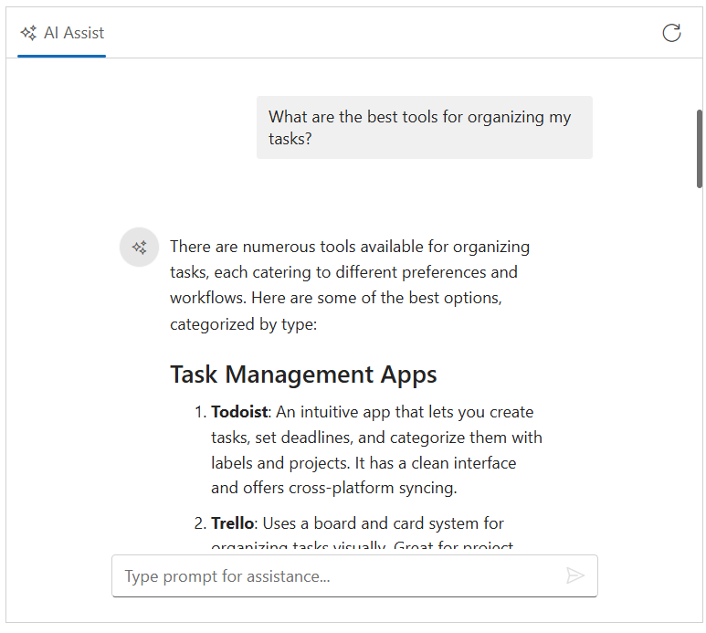

# Integrate Azure OpenAI with Blazor AI AssistView component

The AI AssistView component integrates with [Azure OpenAI](https://microsoft.github.io/PartnerResources/skilling/ai-ml-academy/resources/openai) to enable advanced conversational AI features in your applications. The component acts as a user interface, where user prompts are sent to the Azure OpenAI service via API calls, providing natural language understanding and context-aware responses.

## Prerequisites

Before starting, ensure you have the following:

* **An Azure account**: with access to [Azure OpenAI](https://microsoft.github.io/PartnerResources/skilling/ai-ml-academy/resources/openai) services and a generated API key.

* **Syncfusion AI AssistView**: Package [Syncfusion Blazor package](https://www.nuget.org/packages/Syncfusion.Blazor.InteractiveChat) installed.

* [Markdig](https://www.nuget.org/packages/Markdig) package available in the project for Markdown-to-HTML conversion (required by the sample code).

## Set Up the AI AssistView Component

Follow the Syncfusion AI AssistView [Getting Started](../getting-started) guide to configure and render the AI AssistView component in the application and that prerequisites are met.

## Install Dependencies

Install the required packages:

1. Install the `OpenAI` and `Azure` nuget packages in the application.

```bash

NuGet\Install-Package OpenAI
NuGet\Install-Package Azure.AI.OpenAI
NuGet\Install-Package Azure.Core

```

2. Install the `Markdig` nuget packages in the application.

```bash

Nuget\Install-Package Markdig

```

Note: The sample below uses HttpClient directly and does not require the Azure/OpenAI SDKs.

## Configure Azure OpenAI

1. Log in to the [Azure Portal](https://portal.azure.com/#home) and navigate to your Azure OpenAI resource.

2. Under resource Management, select keys and endpoint to retrieve your API key and endpoint URL. 

3. Note the following values:
   - API key
   - Endpoint (for example, https://<resource-name>.openai.azure.com/)
   - API version (must be supported by your resource)
   - Deployment name (for example, gpt-4o-mini)

4. Store these values securely, as they will be used in your application.

> `Security Note`: expose your API key in client-side code for production applications. Use a server-side proxy or environment variables to manage sensitive information securely.

## Azure OpenAI with AI AssistView

- Configure your Azure OpenAI endpoint, API key, and deployment name in your **Program.cs** (or using your preferred configuration mechanism).

- Register the service for dependency injection.

- Inject and use the service in your Razor component.

Modify the razor file to integrate the Azure OpenAI with the AI AssistView component.




@using AIAssistView_AzureAI.Components.Services
@using Syncfusion.Blazor.InteractiveChat
@using Syncfusion.Blazor.Navigations
@inject AzureOpenAIService OpenAIService

// Initialize AI AssistView component
<div class="aiassist-container" style="height: 450px; width: 650px;">
    <SfAIAssistView @ref="assistView" ID="aiAssistView" PromptSuggestions="@promptSuggestions" PromptRequested="@PromptRequest">
        <AssistViews>
            <AssistView>
                <BannerTemplate>
                    <div class="banner-content">
                        <div class="e-icons e-assistview-icon"></div>
                        <h3>AI Assistance</h3>
                        <i>To get started, provide input or choose a suggestion.</i>
                    </div>
                </BannerTemplate>
            </AssistView>
        </AssistViews>
        <AssistViewToolbar ItemClicked="ToolbarItemClicked">
            <AssistViewToolbarItem Type="ItemType.Spacer"></AssistViewToolbarItem>
            <AssistViewToolbarItem IconCss="e-icons e-refresh"></AssistViewToolbarItem>
        </AssistViewToolbar>
    </SfAIAssistView>
</div>

@code {
    private SfAIAssistView assistView;
    private string finalResponse { get; set; }
    private List<string> promptSuggestions = new List<string>
    {
        "What are the best tools for organizing my tasks?",
        "How can I maintain work-life balance effectively?"
    };
    
    // Handle user prompt: call Azure OpenAI Chat Completions
    private async Task PromptRequest(AssistViewPromptRequestedEventArgs args)
    {
        // Reset the response for this prompt
        var lastIdx = assistView.Prompts.Count - 1;
        assistView.Prompts[lastIdx].Response = string.Empty;
        finalResponse = string.Empty;
        try
        {
            await foreach (var chunk in OpenAIService.GetChatResponseStreamAsync(args.Prompt))
            {
                await UpdateResponse(args, chunk);
            }

            args.Response = finalResponse;
        }
        catch (Exception ex)
        {
            args.Response = $"Error: {ex.Message}";
        }
    }

    private async Task UpdateResponse(AssistViewPromptRequestedEventArgs args, string response)
    {
        var lastIdx = assistView.Prompts.Count - 1;
        await Task.Delay(10); // Small delay for UI updates
        assistView.Prompts[lastIdx].Response += response.Replace("\n", "<br>");
        finalResponse = assistView.Prompts[lastIdx].Response;
        StateHasChanged();
    }

    private void ToolbarItemClicked(AssistViewToolbarItemClickedEventArgs args)
    {
        assistView.Prompts.Clear();
        StateHasChanged();
    }
}




using System.Text.Json;
using Markdig;
using System.Text.RegularExpressions;

namespace AIAssistView_AzureAI.Components.Services
{
    public class AzureOpenAIService
    {
        private readonly HttpClient _httpClient;
        private readonly string _endpoint;
        private readonly string _apiKey;
        private readonly string _deploymentName;

        public AzureOpenAIService(HttpClient httpClient, string endpoint, string apiKey, string deploymentName)
        {
            _httpClient = httpClient;
            _endpoint = endpoint;
            _apiKey = apiKey;
            _deploymentName = deploymentName;
        }
        
        public async IAsyncEnumerable<string> GetChatResponseStreamAsync(string prompt)
        {
            var request = new
            {
                messages = new[] { new { role = "user", content = prompt } },
                max_tokens = 500,
            };

            var url = $"{_endpoint}/openai/deployments/{_deploymentName}/chat/completions?api-version=2024-02-15-preview";
            _httpClient.DefaultRequestHeaders.Add("api-key", _apiKey);

            Stream responseStream = null;
            List<string> results = new List<string>();

            try
            {
                var response = await _httpClient.PostAsJsonAsync(url, request);

                if (response.IsSuccessStatusCode)
                {
                    responseStream = await response.Content.ReadAsStreamAsync();
                    using var jsonDocument = JsonDocument.Parse(responseStream);
                    var choices = jsonDocument.RootElement.GetProperty("choices");
                    if (choices.GetArrayLength() > 0)
                    {
                        var content = choices[0].GetProperty("message").GetProperty("content").GetString();
                        var htmlContent = Markdown.ToHtml(content);
                        htmlContent = Regex.Replace(htmlContent, @"\s+", " ").Trim();
                        // Collect each character to the results list before yielding
                        foreach (var chunk in htmlContent)
                        {
                            results.Add(chunk.ToString());
                        }
                    }
                    else
                    {
                        results.Add("Error: No choices returned in the response.");
                    }
                }
                else
                {
                    var error = await response.Content.ReadAsStringAsync();
                    results.Add($"Error: {error}");
                }
            }
            catch (Exception ex)
            {
                // Collect the error message to be yielded later
                results.Add($"Error: {ex.Message}");
            }
            finally
            {
                if (responseStream != null)
                {
                    responseStream.Dispose();
                }
            }

            // Now yield each collected result
            foreach (var result in results)
            {
                yield return result;
            }
        }
    }
}




// Initialize Azure OpenAI
var endpoint = "https://azure-testresource.openai.azure.com";
var apiKey = "<Your API Key>"; // Replace with your API key;
var deploymentName = "gpt-4o-mini";





