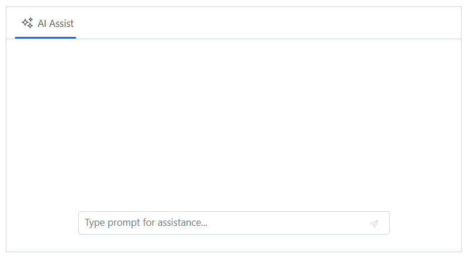
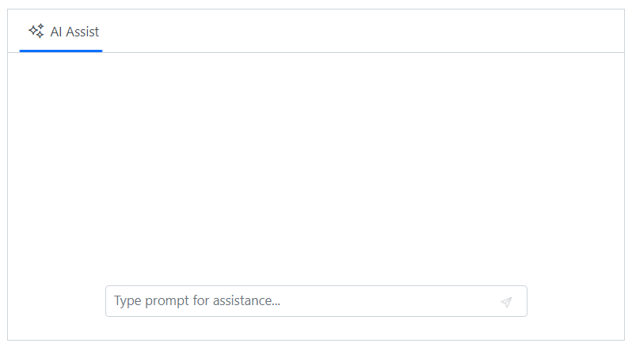
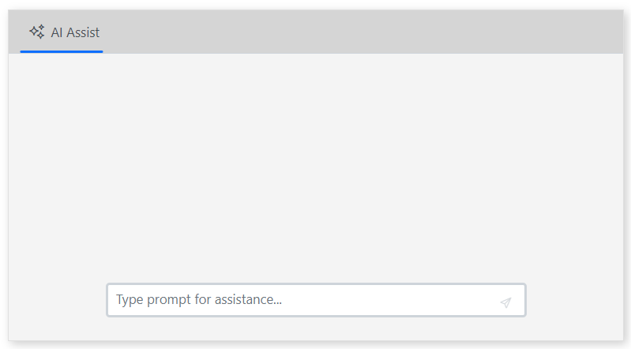

# Appearance in Blazor AI AssistView component

## Setting width

You can use the [Width](https://help.syncfusion.com/cr/blazor/Syncfusion.Blazor.InteractiveChat.SfAIAssistView.html#Syncfusion_Blazor_InteractiveChat_SfAIAssistView_Width) property to set the width of the AI AssistView. The default value is `100%`.

```cshtml

@using Syncfusion.Blazor.InteractiveChat

<div class="aiassist-container" style="height: 350px;">
    <SfAIAssistView Width="650px" PromptRequested="@PromptRequest"></SfAIAssistView>
</div>

@code {
    private async Task PromptRequest(AssistViewPromptRequestedEventArgs args)
    {
        await Task.Delay(1000);
        var defaultResponse = "For real-time prompt processing, connect the AI AssistView component to your preferred AI service, such as OpenAI or Azure Cognitive Services. Ensure you obtain the necessary API credentials to authenticate and enable seamless integration.";
        args.Response = defaultResponse;
    }
}

```



## Setting height

You can use the [Height](https://help.syncfusion.com/cr/blazor/Syncfusion.Blazor.InteractiveChat.SfAIAssistView.html#Syncfusion_Blazor_InteractiveChat_SfAIAssistView_Height) property to set the height of the AI AssistView. The default value is `100%`.

```cshtml

@using Syncfusion.Blazor.InteractiveChat

<div class="aiassist-container" style="width: 650px;">
    <SfAIAssistView Height="350px" PromptRequested="@PromptRequest"></SfAIAssistView>
</div>

@code {
    private async Task PromptRequest(AssistViewPromptRequestedEventArgs args)
    {
        await Task.Delay(1000);
        var defaultResponse = "For real-time prompt processing, connect the AI AssistView component to your preferred AI service, such as OpenAI or Azure Cognitive Services. Ensure you obtain the necessary API credentials to authenticate and enable seamless integration.";
        args.Response = defaultResponse;
    }
}

```



## CssClass

You can customize the appearance of the AI AssistView component by using the [CssClass](https://help.syncfusion.com/cr/blazor/Syncfusion.Blazor.InteractiveChat.SfAIAssistView.html#Syncfusion_Blazor_InteractiveChat_SfAIAssistView_CssClass) property.

```cshtml

@using Syncfusion.Blazor.InteractiveChat

<div class="aiassist-container" style="height: 350px; width: 650px;">
    <SfAIAssistView CssClass="custom-container" PromptRequested="@PromptRequest"></SfAIAssistView>
</div>

@code {
    private async Task PromptRequest(AssistViewPromptRequestedEventArgs args)
    {
        await Task.Delay(1000);
        var defaultResponse = "For real-time prompt processing, connect the AI AssistView component to your preferred AI service, such as OpenAI or Azure Cognitive Services. Ensure you obtain the necessary API credentials to authenticate and enable seamless integration.";
        args.Response = defaultResponse;
    }
}
<style>
    .e-aiassistview.custom-container {
        border-color: #e0e0e0;
        background-color: #f4f4f4;
        box-shadow: 3px 3px 10px 0px rgba(0, 0, 0, 0.2);
    }

    .e-aiassistview.custom-container .e-view-header .e-toolbar,
    .e-aiassistview.custom-container .e-view-header .e-toolbar-items {
        background: #d5d5d5;
    }

    .e-aiassistview.custom-container .e-view-content .e-input-group {
        border: 3px solid #e0e0e0;
    }
</style>

```


