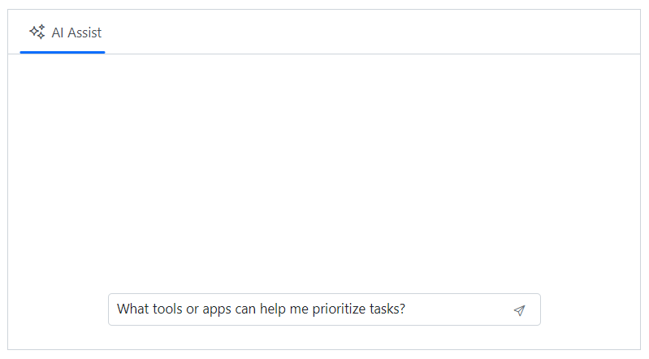
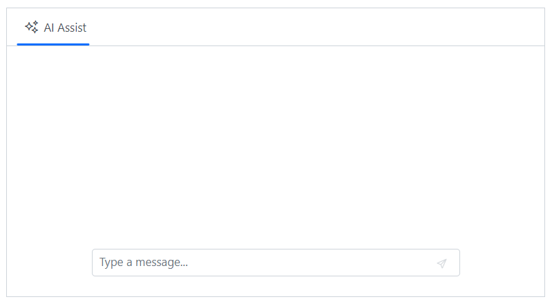
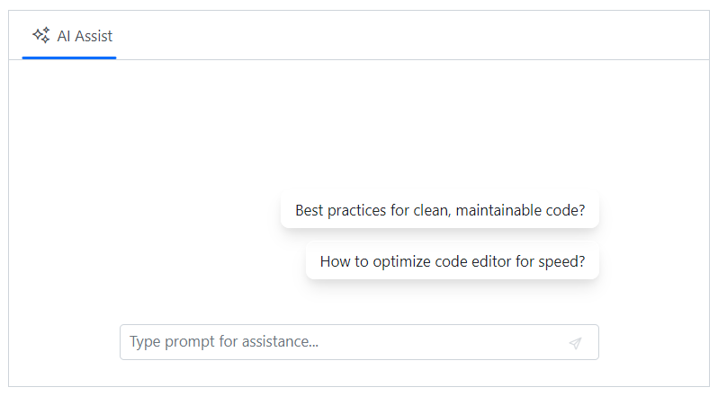
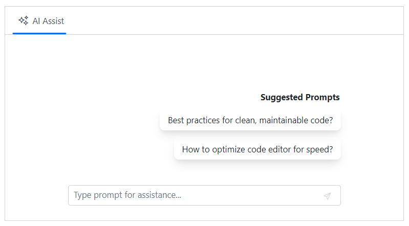
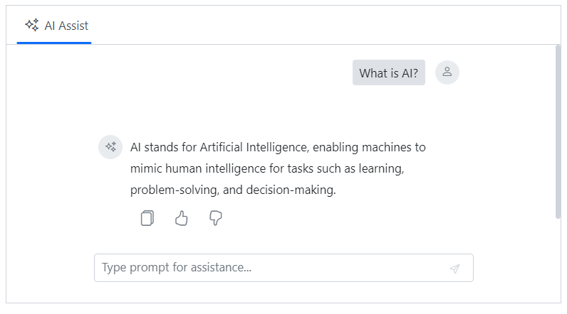
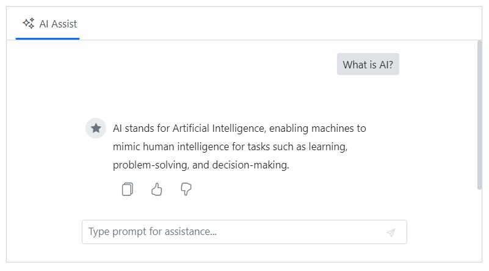
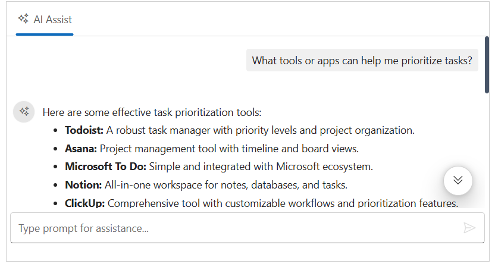

# Assist view in Blazor AI AssistView component

## Setting prompt text

You can use the [Prompt](https://help.syncfusion.com/cr/blazor/Syncfusion.Blazor.InteractiveChat.SfAIAssistView.html#Syncfusion_Blazor_InteractiveChat_SfAIAssistView_Prompt) property to define the prompt text for the AI AssistView component.

```cshtml

@using Syncfusion.Blazor.InteractiveChat

<div class="aiassist-container" style="height: 350px; width: 650px;">
    <SfAIAssistView Prompt = "What tools or apps can help me prioritize tasks?" PromptRequested="@PromptRequest"></SfAIAssistView>
</div>

@code {
    private async Task PromptRequest(AssistViewPromptRequestedEventArgs args)
    {
        await Task.Delay(1000);
        var defaultResponse = "For real-time prompt processing, connect the AI AssistView component to your preferred AI service, such as OpenAI or Azure Cognitive Services. Ensure you obtain the necessary API credentials to authenticate and enable seamless integration.";
        args.Response = defaultResponse;
    }
}

```



## Setting prompt placeholder

You can use the [PromptPlaceholder](https://help.syncfusion.com/cr/blazor/Syncfusion.Blazor.InteractiveChat.SfAIAssistView.html#Syncfusion_Blazor_InteractiveChat_SfAIAssistView_PromptPlaceholder) property to set the placeholder text for the prompt textarea. The default value is `Type prompt for assistance...`.

```cshtml

@using Syncfusion.Blazor.InteractiveChat

<div class="aiassist-container" style="height: 350px; width: 650px;">
    <SfAIAssistView PromptPlaceholder="Type a message..." PromptRequested="@PromptRequest"></SfAIAssistView>
</div>

@code {
    private async Task PromptRequest(AssistViewPromptRequestedEventArgs args)
    {
        await Task.Delay(1000);
        var defaultResponse = "For real-time prompt processing, connect the AI AssistView component to your preferred AI service, such as OpenAI or Azure Cognitive Services. Ensure you obtain the necessary API credentials to authenticate and enable seamless integration.";
        args.Response = defaultResponse;
    }
}

```



## Prompt-response collection

You can use the [Prompts](https://help.syncfusion.com/cr/blazor/Syncfusion.Blazor.InteractiveChat.SfAIAssistView.html#Syncfusion_Blazor_InteractiveChat_SfAIAssistView_Prompts) property to initialize the component with the configured data as a collection of prompts and responses or individual entries.

The `Prompts` collection stores all the prompts and responses generated.

```cshtml

@using Syncfusion.Blazor.InteractiveChat

<div class="aiassist-container" style="height: 350px; width: 650px;">
    <SfAIAssistView Prompts="@prompts" PromptRequested="@PromptRequest"></SfAIAssistView>
</div>

@code {
    private List<AssistViewPrompt> prompts = new List<AssistViewPrompt>()
    {
        new AssistViewPrompt() { Prompt = "What is AI?", Response = "<div>AI stands for Artificial Intelligence, enabling machines to mimic human intelligence for tasks such as learning, problem-solving, and decision-making.</div>" }
    };
    private async Task PromptRequest(AssistViewPromptRequestedEventArgs args)
    {
        await Task.Delay(1000);
        var promptData = prompts.FirstOrDefault(prompt => prompt.Prompt == args.Prompt);
        var defaultResponse = "For real-time prompt processing, connect the AI AssistView component to your preferred AI service, such as OpenAI or Azure Cognitive Services. Ensure you obtain the necessary API credentials to authenticate and enable seamless integration.";
        args.Response = string.IsNullOrEmpty(promptData.Response) ? defaultResponse : promptData.Response;
    }
}

```


### Update response as markdown

The AI AssistView supports rendering responses as **Markdown** content, which is automatically converted to HTML using the built-in [Markdown Converter](https://blazor.syncfusion.com/documentation/markdown-editor/markdown-preview). When you pass markdown-formatted text in the response, it will be displayed as formatted HTML in the AI AssistView. The streaming of markdown content happens seamlessly with built-in support for dynamic rendering.

You can use markdown syntax like **bold**, *italic*, headings, lists, code blocks, and links to format your responses.

```cshtml

@using Syncfusion.Blazor.InteractiveChat

<div class="aiassist-container" style="height: 350px; width: 650px;">
    <SfAIAssistView Prompts="@markdownPrompts" PromptSuggestions="@markdownSuggestions" PromptRequested="@PromptRequest"></SfAIAssistView>
</div>

@code {
    private List<string> markdownSuggestions = new List<string> 
    { 
        "What is Markdown?", 
        "How do I use bold?", 
        "Show code block example" 
    };

    private List<AssistViewPrompt> markdownPrompts = new List<AssistViewPrompt>()
    {
        new AssistViewPrompt() 
        { 
            Prompt = "What is Markdown?", 
            Response = @"# Markdown Guide

Markdown is a lightweight markup language:

- **Headers:** Use `#`, `##`, `###`
- **Bold:** `**text**` for bold
- **Italic:** `*text*` for italic
- **Code:** Triple backticks for code blocks
- **Lists:** Use `-` for bullet points

It's simple and perfect for documentation."
        },
        new AssistViewPrompt() 
        { 
            Prompt = "How do I use bold?", 
            Response = @"# Bold Text in Markdown

Use double asterisks `**text**` or double underscores `__text__`:

**This is bold text**

Both methods produce the same result."
        }
    };

    private async Task PromptRequest(AssistViewPromptRequestedEventArgs args)
    {
        await Task.Delay(1000);
        var markdownResponse = markdownPrompts.FirstOrDefault(prompt => prompt.Prompt == args.Prompt);
        var defaultResponse = "For real-time prompt processing, connect the AI AssistView component to your preferred AI service, such as OpenAI or Azure Cognitive Services. Ensure you obtain the necessary API credentials to authenticate and enable seamless integration.";
        args.Response = markdownResponse?.Response ?? defaultResponse;
    }
}

```

## Adding prompt suggestions

You can use the [PromptSuggestions](https://help.syncfusion.com/cr/blazor/Syncfusion.Blazor.InteractiveChat.SfAIAssistView.html#Syncfusion_Blazor_InteractiveChat_SfAIAssistView_PromptSuggestions) property, to add the suggestions in both initial and on-demand which help users to refine their prompts. Additionally, custom header can be set for suggestions further enhancing the user experience.

```cshtml

@using Syncfusion.Blazor.InteractiveChat

<div class="aiassist-container" style="height: 350px; width: 650px;">
    <SfAIAssistView PromptSuggestions="@suggestions" PromptRequested="@PromptRequest"></SfAIAssistView>
</div>

@code {
    List<string> suggestions = new List<string> { "Best practices for clean, maintainable code?", "How to optimize code editor for speed?" };
    private async Task PromptRequest(AssistViewPromptRequestedEventArgs args)
    {
        await Task.Delay(1000);
        var response1 = "Use clear naming, break code into small functions, avoid repetition, write tests, and follow coding standards.";
        var response2 = "Install useful extensions, set up shortcuts, enable linting, and customize settings for smoother development.";
        var defaultResponse = "For real-time prompt processing, connect the AI AssistView component to your preferred AI service, such as OpenAI or Azure Cognitive Services. Ensure you obtain the necessary API credentials to authenticate and enable seamless integration.";
        args.Response = args.Prompt == suggestions[0] ? response1 : args.Prompt == suggestions[1] ? response2 : defaultResponse;
    }
}

```



### Adding suggestion headers

You can use the [PromptSuggestionsHeader](https://help.syncfusion.com/cr/blazor/Syncfusion.Blazor.InteractiveChat.SfAIAssistView.html#Syncfusion_Blazor_InteractiveChat_SfAIAssistView_PromptSuggestionsHeader) property to set the header text for the prompt suggestions in the AI AssistView.

```cshtml

@using Syncfusion.Blazor.InteractiveChat

<div class="aiassist-container" style="height: 350px; width: 650px;">
    <SfAIAssistView PromptSuggestions="@suggestions" PromptSuggestionsHeader="Suggested Prompts" PromptRequested="@PromptRequest"></SfAIAssistView>
</div>

@code {
    List<string> suggestions = new List<string> { "Best practices for clean, maintainable code?", "How to optimize code editor for speed?" };
    private async Task PromptRequest(AssistViewPromptRequestedEventArgs args)
    {
        await Task.Delay(1000);
        var response1 = "Use clear naming, break code into small functions, avoid repetition, write tests, and follow coding standards.";
        var response2 = "Install useful extensions, set up shortcuts, enable linting, and customize settings for smoother development.";
        var defaultResponse = "For real-time prompt processing, connect the AI AssistView component to your preferred AI service, such as OpenAI or Azure Cognitive Services. Ensure you obtain the necessary API credentials to authenticate and enable seamless integration.";
        args.Response = args.Prompt == suggestions[0] ? response1 : args.Prompt == suggestions[1] ? response2 : defaultResponse;
    }
}

```



## Adding prompt iconCss

You can customize the appearance of the prompter avatar by using the [PromptIconCss](https://help.syncfusion.com/cr/blazor/Syncfusion.Blazor.InteractiveChat.SfAIAssistView.html#Syncfusion_Blazor_InteractiveChat_SfAIAssistView_PromptIconCss) property.

```cshtml

@using Syncfusion.Blazor.InteractiveChat

<div class="aiassist-container" style="height: 350px; width: 650px;">
    <SfAIAssistView Prompts="@prompts" PromptRequested="@PromptRequest" PromptIconCss="e-icons e-user"></SfAIAssistView>
</div>

@code {
    private List<AssistViewPrompt> prompts = new List<AssistViewPrompt>()
    {
        new AssistViewPrompt() { Prompt = "What is AI?", Response = "<div>AI stands for Artificial Intelligence, enabling machines to mimic human intelligence for tasks such as learning, problem-solving, and decision-making.</div>" }
    };
    private async Task PromptRequest(AssistViewPromptRequestedEventArgs args)
    {
        await Task.Delay(1000);
        var promptData = prompts.FirstOrDefault(prompt => prompt.Prompt == args.Prompt);
        var defaultResponse = "For real-time prompt processing, connect the AI AssistView component to your preferred AI service, such as OpenAI or Azure Cognitive Services. Ensure you obtain the necessary API credentials to authenticate and enable seamless integration.";
        args.Response = string.IsNullOrEmpty(promptData.Response) ? defaultResponse : promptData.Response;
    }
}

```



## Adding response iconCss

You can use the [ResponseIconCss](https://help.syncfusion.com/cr/blazor/Syncfusion.Blazor.InteractiveChat.SfAIAssistView.html#Syncfusion_Blazor_InteractiveChat_SfAIAssistView_ResponseIconCss) property to customize the appearance of the responder avatar. By default, the `e-assistview-icon` class is added as the built-in AI AssistView response icon.

```cshtml

@using Syncfusion.Blazor.InteractiveChat

<div class="aiassist-container" style="height: 350px; width: 650px;">
    <SfAIAssistView Prompts="@prompts" PromptRequested="@PromptRequest" ResponseIconCss="e-icons e-bullet-4"></SfAIAssistView>
</div>

@code {
    private List<AssistViewPrompt> prompts = new List<AssistViewPrompt>()
    {
        new AssistViewPrompt() { Prompt = "What is AI?", Response = "<div>AI stands for Artificial Intelligence, enabling machines to mimic human intelligence for tasks such as learning, problem-solving, and decision-making.</div>" }
    };
    private async Task PromptRequest(AssistViewPromptRequestedEventArgs args)
    {
        await Task.Delay(1000);
        var promptData = prompts.FirstOrDefault(prompt => prompt.Prompt == args.Prompt);
        var defaultResponse = "For real-time prompt processing, connect the AI AssistView component to your preferred AI service, such as OpenAI or Azure Cognitive Services. Ensure you obtain the necessary API credentials to authenticate and enable seamless integration.";
        args.Response = string.IsNullOrEmpty(promptData.Response) ? defaultResponse : promptData.Response;
    }
}

```



## Enable scroll to bottom icon

You can use the [EnableScrollToBottom](https://help.syncfusion.com/cr/blazor/Syncfusion.Blazor.InteractiveChat.SfAIAssistView.html#Syncfusion_Blazor_InteractiveChat_SfAIAssistView_EnableScrollToBottom) property to show or hide the scroll-to-bottom indicator. By default, this property is `true`. When enabled, a floating icon/button appears when the user scrolls away from the bottom of the conversation. Clicking this icon smoothly scrolls the view to the bottom to display the latest response.

```cshtml

@using Syncfusion.Blazor.InteractiveChat

<div class="aiassist-container" style="height: 350px; width: 650px;">
    <SfAIAssistView EnableScrollToBottom="true" Prompts="@prompts" PromptSuggestions="@suggestions" PromptRequested="@PromptRequest"></SfAIAssistView>
</div>

@code {
    private List<string> suggestions = new List<string> 
    { 
        "What tools or apps can help me prioritize tasks?", 
        "How do I manage multiple projects effectively?" 
    };
    
    private List<AssistViewPrompt> prompts = new List<AssistViewPrompt>()
    {
        new AssistViewPrompt() 
        { 
            Prompt = "What tools or apps can help me prioritize tasks?", 
            Response = "<div>Here are some effective task prioritization tools:<ul><li><strong>Todoist:</strong> A robust task manager with priority levels and project organization.</li><li><strong>Asana:</strong> Project management tool with timeline and board views.</li><li><strong>Microsoft To Do:</strong> Simple and integrated with Microsoft ecosystem.</li><li><strong>Notion:</strong> All-in-one workspace for notes, databases, and tasks.</li><li><strong>ClickUp:</strong> Comprehensive tool with customizable workflows and prioritization features.</li></ul></div>" 
        },
        new AssistViewPrompt() 
        { 
            Prompt = "How do I manage multiple projects effectively?", 
            Response = "<div>Here are best practices for managing multiple projects:<ul><li><strong>Use a centralized dashboard:</strong> Track all projects in one place.</li><li><strong>Set clear milestones:</strong> Break down each project into manageable phases.</li><li><strong>Prioritize tasks:</strong> Focus on high-impact items first.</li><li><strong>Delegate effectively:</strong> Assign tasks to team members based on skills.</li><li><strong>Regular reviews:</strong> Conduct weekly or bi-weekly project status meetings.</li></ul></div>" 
        }
    };
    
    private async Task PromptRequest(AssistViewPromptRequestedEventArgs args)
    {
        await Task.Delay(1000);
        var promptData = prompts.FirstOrDefault(prompt => prompt.Prompt == args.Prompt);
        var defaultResponse = "For real-time prompt processing, connect the AI AssistView component to your preferred AI service, such as OpenAI or Azure Cognitive Services. Ensure you obtain the necessary API credentials to authenticate and enable seamless integration.";
        args.Response = string.IsNullOrEmpty(promptData.Response) ? defaultResponse : promptData.Response;
    }
}

```



