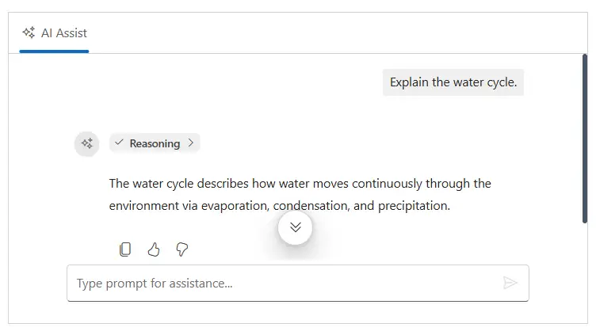
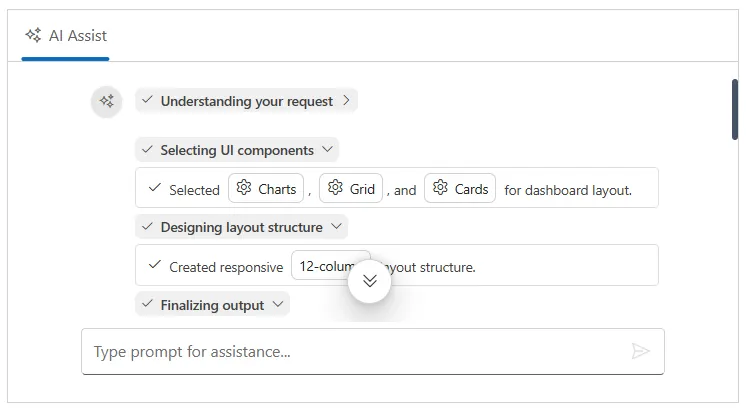
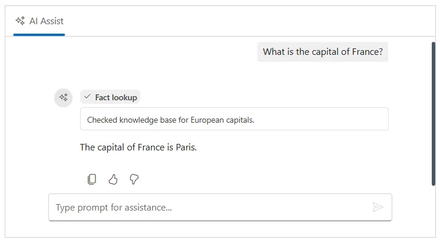
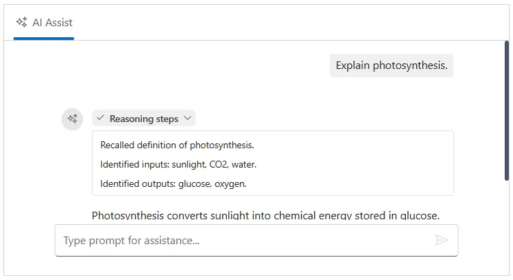

# Chain of Thoughts in Blazor AI AssistView

The AI AssistView supports rendering **Chain of Thoughts** (also called `Thinking`) blocks, allowing you to visualize the model's reasoning process step by step before the final response is generated. The injectable module is ideal for extended reasoning models (such as Claude 3.5, GPT‑o1, and similar), which expose intermediate reasoning stages.

## Types of response blocks

A single response may contain `Thinking`, `Text`, and `Tool` blocks in the `blocks` array. The component renders them in the order they appear. Below are the available types of the response blocks.

| Property | Description |
|---|---|---|---|
| `TextBlock` | Unique identifier for the block, used for collapsing/expanding state. |
| `ToolBlock` | Identifies this block as a thinking block. Required. |
| `ThinkingBlock` | Heading text shown in the collapsible header. |

## Configure the thinking block
 
You can add a `ThinkingBlock` to the Blocks collection of an `AssistViewPrompt` or set it through args.Blocks in the `PromptRequested` event. This allows you to display reasoning steps, progress indicators, and contextual information before the response content.

> When only `blocks` are provided (no `response` text), the component will render the blocks directly and skip the default text-response rendering path. When both `blocks` and `response` are provided, the blocks are rendered first followed by the response text.
 
| Property | Type | Default | Description |
|---|---|---|---|
| `ID` | `string` | auto-generated | Unique identifier for the block, used for collapsing/expanding state. |
| `BlockType` | `'Thinking'` | — | Identifies this block as a thinking block. Required. |
| `Title` | `string` | `'Thinking...'` | Heading text shown in the collapsible header. |
| `Content` | `string` | — | Markdown text rendered as a description beneath the stages. |
| `IsActive` | `boolean` | `false` | When `true`, a Syncfusion spinner is shown inside the thinking header to indicate the reasoning is still in progress. |
| `Collapsed` | `boolean` | `true` | Initial collapsed state of the thinking block. |
| `Collapsible` | `boolean` | `true` | Whether the block can be expanded or collapsed by the user. |
| `Stages` | `ThinkingStage[]` | — | Array of reasoning stages rendered using the Timeline component. |

```cshtml

@using Syncfusion.Blazor.InteractiveChat

<div style="height:350px; width:650px;">
    <SfAIAssistView Prompts="@PromptCollection"
                    PromptRequested="@PromptRequest">
    </SfAIAssistView>
</div>

@code {
    private List<AssistViewPrompt> PromptCollection = new()
    {
        new AssistViewPrompt
        {
            Prompt = "Explain the water cycle.",
            Response = "The water cycle describes how water moves continuously through the environment via evaporation, condensation, and precipitation.",
            Blocks = new List<IResponseBlock>
            {
                new ThinkingBlock
                {
                    BlockType = BlockType.Thinking,
                    Title = "Reasoning",
                    Collapsed = true,
                    Collapsible = true,
                    IsActive = false,
                    Stages = new List<ThinkingStage>
                    {
                        new ThinkingStage
                        {
                            ID = "Step1",
                            Status = ThinkingStageStatus.Completed,
                            Content = "Identified request as a water cycle explanation."
                        },
                        new ThinkingStage
                        {
                            ID = "Step2",
                            Status = ThinkingStageStatus.Completed,
                            Content = "Summarized key stages concisely."
                        },
                        new ThinkingStage
                        {
                            ID = "Step3",
                            Status = ThinkingStageStatus.Completed,
                            Content = "Composed a clear single-paragraph response."
                        }
                    }
                }
            }
        }
    };

    private async Task PromptRequest(AssistViewPromptRequestedEventArgs args)
    {
        await Task.Delay(1000);
        args.Response = "For real-time prompt processing, connect the AI AssistView component to your preferred AI service, such as OpenAI or Azure Cognitive Services. Ensure you obtain the necessary API credentials to authenticate and enable seamless integration.";
    }
}

```
 

 
### Adding stages
 
Each entry in the `stages` array represents a single reasoning step. Below are the list of available stages property.
 
| Property | Type | Description |
|---|---|---|
| `ID` | `string` | Unique identifier for the stage. |
| `Content` | `string` | Markdown content for this stage. Supports `{index}` placeholders for inline context items. |
| `Status` | `'Completed'` \| `'InProgress'` \| `'Failed'` | Controls the icon/spinner shown on the timeline dot. |
| `IconCss` | `string` | Custom CSS class for the timeline dot icon, overrides the default status icon. |
| `EditableContext` | `ThinkingContextItem[]` | Inline context items injected into the stage content via `{index}` placeholders. |
 
#### Adding stage status
 
Each thinking stage will carry a `status` value that controls the visual indicator on its timeline dot:
 
- **`Completed`** — renders a check icon (`e-check`).
- **`InProgress`** — renders an animated spinner.
- **`Failed`** — renders an error/cross icon (`e-error-treeview`).

Use this to reflect real-time reasoning progress when streaming multi-step responses.
 
```cshtml

@using Syncfusion.Blazor.InteractiveChat

<div style="height:350px; width:650px;">
    <SfAIAssistView PromptSuggestions="@PromptSuggestions"
                    PromptRequested="@PromptRequest">
    </SfAIAssistView>
</div>

@code {
    private List<string> PromptSuggestions = new()
    {
        "Build a modern dashboard for my business",
        "Create a login page with validation",
        "Make a task management board"
    };

    private async Task PromptRequest(AssistViewPromptRequestedEventArgs args)
    {
        // Step 1
        args.Blocks = new List<IResponseBlock>
        {
            new ThinkingBlock
            {
                BlockType = BlockType.Thinking,
                Title = "Understanding your request",
                Collapsible = true,
                Collapsed = false,
                IsActive = true,
                Stages = new List<ThinkingStage>
                {
                    new ThinkingStage
                    {
                        Status = ThinkingStageStatus.InProgress,
                        Content = "Identified request as a business dashboard requirement."
                    }
                }
            }
        };
        args.Response = "";
        await Task.Delay(1000);

        // Step 2
        args.Blocks = new List<IResponseBlock>
        {
            new ThinkingBlock
            {
                BlockType = BlockType.Thinking,
                Title = "Understanding your request",
                Collapsible = true,
                Collapsed = true,
                IsActive = false,
                Stages = new List<ThinkingStage>
                {
                    new ThinkingStage
                    {
                        Status = ThinkingStageStatus.Completed,
                        Content = "Identified request as a business dashboard requirement."
                    }
                }
            },
            new ThinkingBlock
            {
                BlockType = BlockType.Thinking,
                Title = "Selecting UI components",
                Collapsible = true,
                Collapsed = false,
                IsActive = true,
                Stages = new List<ThinkingStage>
                {
                    new ThinkingStage
                    {
                        Status = ThinkingStageStatus.InProgress,
                        IconCss = "e-icons e-check",
                        Content = "Selected {0}, {1}, and {2} for dashboard layout.",
                        EditableContext = new List<ThinkingContextItem>
                        {
                            new ThinkingContextItem { Type = ThinkingContextType.Tool, Name = "Charts", Value = "Analytics visualization" },
                            new ThinkingContextItem { Type = ThinkingContextType.Tool, Name = "Grid", Value = "Tabular data" },
                            new ThinkingContextItem { Type = ThinkingContextType.Tool, Name = "Cards", Value = "KPI metrics" }
                        }
                    }
                }
            }
        };
        args.Response = "";
        await Task.Delay(1000);

        // Step 3
        args.Blocks = new List<IResponseBlock>
        {
            new ThinkingBlock
            {
                BlockType = BlockType.Thinking,
                Title = "Understanding your request",
                Collapsible = true,
                Collapsed = true,
                IsActive = false,
                Stages = new List<ThinkingStage>
                {
                    new ThinkingStage
                    {
                        Status = ThinkingStageStatus.Completed,
                        Content = "Identified request as a business dashboard requirement.",
                        IconCss = "e-icons e-check"
                    }
                }
            },
            new ThinkingBlock
            {
                BlockType = BlockType.Thinking,
                Title = "Selecting UI components",
                Collapsible = true,
                Collapsed = true,
                IsActive = false,
                Stages = new List<ThinkingStage>
                {
                    new ThinkingStage
                    {
                        Status = ThinkingStageStatus.Completed,
                        IconCss = "e-icons e-check",
                        Content = "Selected {0}, {1}, and {2} for dashboard layout.",
                        EditableContext = new List<ThinkingContextItem>
                        {
                            new ThinkingContextItem { Type = ThinkingContextType.Tool, Name = "Charts", Value = "Analytics visualization" },
                            new ThinkingContextItem { Type = ThinkingContextType.Tool, Name = "Grid", Value = "Tabular data" },
                            new ThinkingContextItem { Type = ThinkingContextType.Tool, Name = "Cards", Value = "KPI metrics" }
                        }
                    }
                }
            },
            new ThinkingBlock
            {
                BlockType = BlockType.Thinking,
                Title = "Designing layout structure",
                Collapsible = true,
                Collapsed = false,
                IsActive = true,
                Stages = new List<ThinkingStage>
                {
                    new ThinkingStage
                    {
                        Status = ThinkingStageStatus.InProgress,
                        IconCss = "e-icons e-check",
                        Content = "Created responsive {0} layout structure.",
                        EditableContext = new List<ThinkingContextItem>
                        {
                            new ThinkingContextItem { Type = ThinkingContextType.Context, Name = "12-column", Value = "12-column grid" }
                        }
                    }
                }
            }
        };
        args.Response = "";
        await Task.Delay(1000);

        // Step 4 (FINAL RESPONSE)
        args.Blocks = new List<IResponseBlock>
        {
            new ThinkingBlock
            {
                BlockType = BlockType.Thinking,
                Title = "Understanding your request",
                Collapsible = true,
                Collapsed = true,
                IsActive = false,
                Stages = new List<ThinkingStage>
                {
                    new ThinkingStage
                    {
                        Status = ThinkingStageStatus.Completed,
                        Content = "Identified request as a business dashboard requirement.",
                        IconCss = "e-icons e-check"
                    }
                }
            },
            new ThinkingBlock
            {
                BlockType = BlockType.Thinking,
                Title = "Selecting UI components",
                Collapsible = true,
                Collapsed = true,
                IsActive = false,
                Stages = new List<ThinkingStage>
                {
                    new ThinkingStage
                    {
                        Status = ThinkingStageStatus.Completed,
                        IconCss = "e-icons e-check",
                        Content = "Selected {0}, {1}, and {2} for dashboard layout.",
                        EditableContext = new List<ThinkingContextItem>
                        {
                            new ThinkingContextItem { Type = ThinkingContextType.Tool, Name = "Charts", Value = "Analytics visualization" },
                            new ThinkingContextItem { Type = ThinkingContextType.Tool, Name = "Grid", Value = "Tabular data" },
                            new ThinkingContextItem { Type = ThinkingContextType.Tool, Name = "Cards", Value = "KPI metrics" }
                        }
                    }
                }
            },
            new ThinkingBlock
            {
                BlockType = BlockType.Thinking,
                Title = "Designing layout structure",
                Collapsible = true,
                Collapsed = true,
                IsActive = false,
                Stages = new List<ThinkingStage>
                {
                    new ThinkingStage
                    {
                        Status = ThinkingStageStatus.Completed,
                        IconCss = "e-icons e-check",
                        Content = "Created responsive {0} layout structure.",
                        EditableContext = new List<ThinkingContextItem>
                        {
                            new ThinkingContextItem { Type = ThinkingContextType.Context, Name = "12-column", Value = "12-column grid" }
                        }
                    }
                }
            },
            new ThinkingBlock
            {
                BlockType = BlockType.Thinking,
                Title = "Finalizing output",
                Collapsible = true,
                Collapsed = false,
                IsActive = false,
                Stages = new List<ThinkingStage>
                {
                    new ThinkingStage
                    {
                        Status = ThinkingStageStatus.Completed,
                        IconCss = "e-icons e-check",
                        Content = "Generated final dashboard structure successfully."
                    }
                }
            }
        };
        args.Response = @"## Business Dashboard Structure

**Generated successfully.**

### Features Included:
- Key performance indicator cards
- Revenue and sales charts
- Recent activity data grid
- Responsive layout for all devices
- Clean navigation structure

### Recommended Syncfusion Components:
- Chart
- Grid
- Card
- Sidebar
- DropDownList";
    }
}

```


## Configure thinking block template
 
You can use the `blockTemplate` property, to customize the thinking block rendering. The template receives a context object with the following properties:
 
| Context property | Type | Description |
|---|---|---|
| `Blocks` | `ThinkingBlock` | The full thinking block model. |
| `BlockIndex` | `number` | Zero-based index of this block in the `blocks` array. |
 
```cshtml

@using Syncfusion.Blazor.InteractiveChat

<div class="aiassist-container" style="height: 350px; width: 650px;">
    <SfAIAssistView PromptRequested="@PromptRequest" Prompts="@prompts">
        <ThinkingStageTemplate>
            <div class="custom-stage-item">
                <span class="e-icons @context.Stage.IconCss"></span>
                <div class="custom-stage-content">@context.Stage.Content</div>
            </div>
        </ThinkingStageTemplate>
    </SfAIAssistView>
</div>

@code {
    private readonly List<AssistViewPrompt> prompts = new()
    {
        new AssistViewPrompt
        {
            Prompt = "What is the capital of France?",
            Response = "The capital of France is Paris.",
            Blocks = new List<IResponseBlock>
            {
                new ThinkingBlock
                {
                    BlockType = BlockType.Thinking,
                    Title = "Fact lookup",
                    IsActive = false,
                    Collapsed = false,
                    Collapsible = false,
                    Stages = new List<ThinkingStage>
                    {
                        new ThinkingStage
                        {
                            Status = ThinkingStageStatus.Completed,
                            Content = "Checked knowledge base for European capitals."
                        }
                    }
                }
            }
        }
    };

    private async Task PromptRequest(AssistViewPromptRequestedEventArgs args)
    {
        await Task.Delay(1000);
        args.Response = "For real-time prompt processing, connect the AI AssistView component to your preferred AI service, such as OpenAI or Azure Cognitive Services. Ensure you obtain the necessary API credentials to authenticate and enable seamless integration.";
    }
}

```

 
> When `blockTemplate` is set, the default collapsible header, spinner, and Timeline rendering are completely replaced by your template. Collapse/expand behavior and spinner life cycle management must be handled within the template itself.
 
## Configure item template

You can use the `itemTemplate` property to add individual thinking stages inside the Timeline. This property applies to every stage item within all thinking blocks.

The template context for each stage item exposes:

| Property | Description |
|---|---|
| `context` | Contains `Stage`, `IconCss`, and `Status` properties of the timeline stage item. |
| `itemIndex` | Current item index in the timeline. |
 
```cshtml

@using Syncfusion.Blazor.InteractiveChat

<div class="aiassist-container" style="height: 350px; width: 650px;">
    <SfAIAssistView PromptRequested="@PromptRequest" Prompts="@prompts">
        <ThinkingStageTemplate>
            @{
                var statusClass = context.Stage.Status == ThinkingStageStatus.InProgress ? "e-stage-inprogress" : "e-stage-done";
            }
            <div class="custom-stage-item @statusClass">
                <span class="e-icons @context.Stage.IconCss"></span>
                <div class="custom-stage-content">@context.Stage.Content</div>
            </div>
        </ThinkingStageTemplate>
    </SfAIAssistView>
</div>

@code {
    private readonly List<AssistViewPrompt> prompts = new()
    {
        new AssistViewPrompt
        {
            Prompt = "Explain photosynthesis.",
            Response = "Photosynthesis converts sunlight into chemical energy stored in glucose.",
            Blocks = new List<IResponseBlock>
            {
                new ThinkingBlock
                {
                    BlockType = BlockType.Thinking,
                    Title = "Reasoning steps",
                    IsActive = false,
                    Collapsed = true,
                    Collapsible = true,
                    Stages = new List<ThinkingStage>
                    {
                        new ThinkingStage { ID = "step1", Status = ThinkingStageStatus.Completed, Content = "Recalled definition of photosynthesis." },
                        new ThinkingStage { ID = "step2", Status = ThinkingStageStatus.Completed, Content = "Identified inputs: sunlight, CO2, water." },
                        new ThinkingStage { ID = "step3", Status = ThinkingStageStatus.Completed, Content = "Identified outputs: glucose, oxygen." }
                    }
                }
            }
        }
    };

    private async Task PromptRequest(AssistViewPromptRequestedEventArgs args)
    {
        await Task.Delay(1000);
        args.Response = "For real-time prompt processing, connect the AI AssistView component to your preferred AI service, such as OpenAI or Azure Cognitive Services. Ensure you obtain the necessary API credentials to authenticate and enable seamless integration.";
    }
}

```
