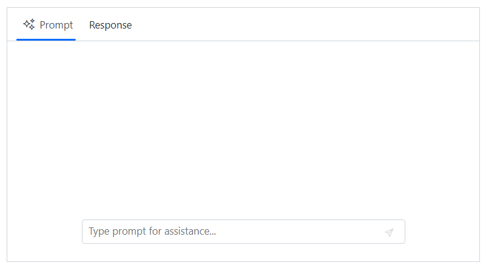

# Custom views in Blazor AI AssistView component

## Adding custom views

The Blazor AI AssistView allows you to add different views available for user interaction.

#### Setting view type

You can change the type of view by using the `AssistView` and `CustomView` tag directive.

```cshtml

@using Syncfusion.Blazor.InteractiveChat

<div class="aiassist-container" style="height: 350px; width: 650px;">
    <SfAIAssistView PromptRequested="@PromptRequest">
        <AssistViews>
            <AssistView></AssistView>
            <CustomView Header="Response"></CustomView>
        </AssistViews>
    </SfAIAssistView>
</div>

@code {
    private async Task PromptRequest(AssistViewPromptRequestedEventArgs args)
    {
        await Task.Delay(1000);
        var defaultResponse = "For real-time prompt processing, connect the AI AssistView component to your preferred AI service, such as OpenAI or Azure Cognitive Services. Ensure you obtain the necessary API credentials to authenticate and enable seamless integration.";
        args.Response = defaultResponse;
    }
}

```


### Setting name

You can use the `Header` property to specifies the header name of the `Assist` or `Custom` views in the AI AssistView.

```cshtml

@using Syncfusion.Blazor.InteractiveChat

<div class="aiassist-container" style="height: 350px; width: 650px;">
    <SfAIAssistView PromptRequested="@PromptRequest">
        <AssistViews>
            <AssistView Header="Prompt"></AssistView>
            <CustomView Header="Response"></CustomView>
        </AssistViews>
    </SfAIAssistView>
</div>

@code {
    private async Task PromptRequest(AssistViewPromptRequestedEventArgs args)
    {
        await Task.Delay(1000);
        var defaultResponse = "For real-time prompt processing, connect the AI AssistView component to your preferred AI service, such as OpenAI or Azure Cognitive Services. Ensure you obtain the necessary API credentials to authenticate and enable seamless integration.";
        args.Response = defaultResponse;
    }
}

```



### Setting iconCSS

You can customize the view icons by using the `IconCss` property. By default the `e-assistview-icon` class is added as built-in header icon for the AI AssistView.

```cshtml

@using Syncfusion.Blazor.InteractiveChat

<div class="aiassist-container" style="height: 350px; width: 650px;">
    <SfAIAssistView PromptRequested="@PromptRequest">
        <AssistViews>
            <AssistView Header="Prompt" IconCss="e-assistview-icon"></AssistView>
            <CustomView Header="Response" IconCss="e-comment-show"></CustomView>
        </AssistViews>
    </SfAIAssistView>
</div>

@code {
    private async Task PromptRequest(AssistViewPromptRequestedEventArgs args)
    {
        await Task.Delay(1000);
        var defaultResponse = "For real-time prompt processing, connect the AI AssistView component to your preferred AI service, such as OpenAI or Azure Cognitive Services. Ensure you obtain the necessary API credentials to authenticate and enable seamless integration.";
        args.Response = defaultResponse;
    }
}

```


### Setting view template 

You can use the `ViewTemplate` tag directive to add the view content of the multiple views added in the AI AssistView.

```cshtml

@using Syncfusion.Blazor.InteractiveChat

<div class="aiassist-container" style="width: max(50%, 500px); margin: 30px auto;">
    <SfAIAssistView>
        <AssistViews>
            <AssistView Header="Prompt">
                <ViewTemplate>
                    <div class="view-container"><h5>Prompt view content</h5></div>
                </ViewTemplate>
            </AssistView>
            <CustomView Header="Response">
                <ViewTemplate>
                    <div class="view-container"><h5>Response view content</h5></div>
                </ViewTemplate>
            </CustomView>
        </AssistViews>
    </SfAIAssistView>
</div>

<style>
    .view-container {
        margin: 20px auto;
        width: 80%;
    }
</style>

```


#### Show or hide clear button

You can use the `ShowClearButton` property using the `AssistView` tag directive to show or hide the clear button. By default, its value is `false`, when the clear button is clicked, the prompt text entered will be cleared.

```cshtml

@using Syncfusion.Blazor.InteractiveChat

<div class="aiassist-container" style="height: 350px; width: 650px;">
    <SfAIAssistView Prompt="What tools or apps can help me prioritize tasks?" PromptRequested="@PromptRequest">
        <AssistViews>
            <AssistView ShowClearButton=true></AssistView>
        </AssistViews>
    </SfAIAssistView>
</div>

@code {
    private async Task PromptRequest(AssistViewPromptRequestedEventArgs args)
    {
        await Task.Delay(1000);
        var defaultResponse = "For real-time prompt processing, connect the AI AssistView component to your preferred AI service, such as OpenAI or Azure Cognitive Services. Ensure you obtain the necessary API credentials to authenticate and enable seamless integration.";
        args.Response = defaultResponse;
    }
}

```


## Setting active view

You can use the `ActiveView` property set the active view in the AI AssistView. By default, the value is `0`.

```cshtml

@using Syncfusion.Blazor.InteractiveChat

<div class="aiassist-container" style="height: 350px; width: 650px;">
    <SfAIAssistView PromptRequested="@PromptRequest" ActiveView="1">
        <AssistViews>
            <AssistView Header="Prompt"></AssistView>
            <CustomView Header="Response" IconCss="e-icons e-comment-show"></CustomView>
        </AssistViews>
    </SfAIAssistView>
</div>

@code {
    private async Task PromptRequest(AssistViewPromptRequestedEventArgs args)
    {
        await Task.Delay(1000);
        var defaultResponse = "For real-time prompt processing, connect the AI AssistView component to your preferred AI service, such as OpenAI or Azure Cognitive Services. Ensure you obtain the necessary API credentials to authenticate and enable seamless integration.";
        args.Response = defaultResponse;
    }
}

```

