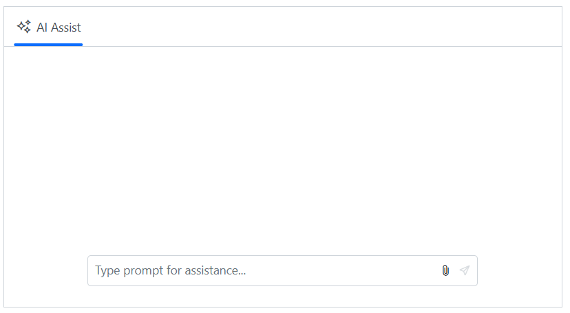
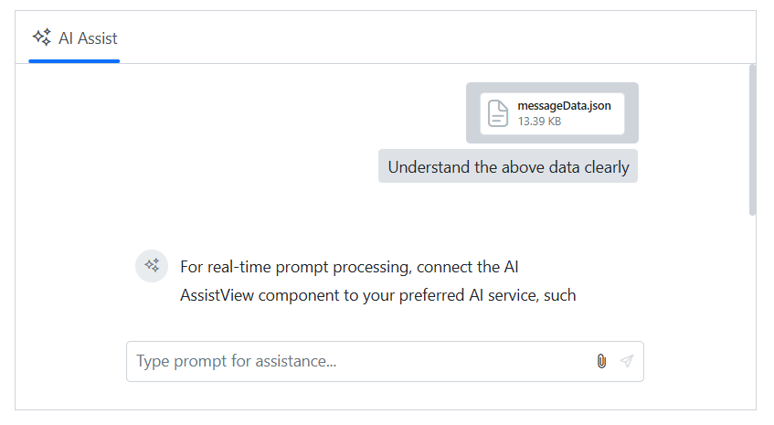
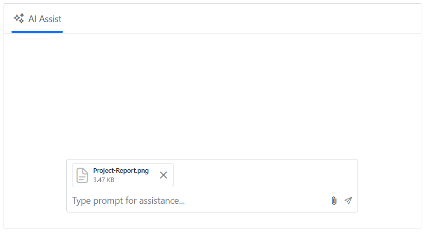
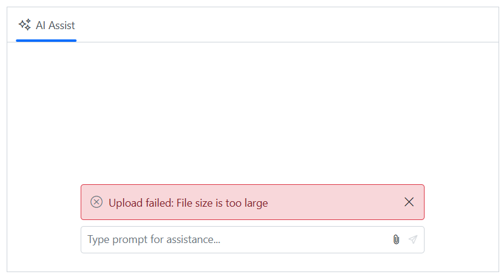

# Attachments in Blazor AI AssistView component

`Attachment` support in the AI AssistView allows users to include files with their prompts, providing additional context to improve responses. Configure this behavior using the `AttachmentSettings` property, which controls enabling, allowed file types, size limits, and the server endpoints used for upload and removal.

You can use the `AttachmentSettings` property to configure  attachments in the AI AssistView.

### Enabling attachment

You can use the `Enable` property to enable the attachment in the AI AssistView. By default, the value is `false`.

```cshtml
@using Syncfusion.Blazor.InteractiveChat

<div class="aiassist-container" style="height: 350px; width: 650px;">
    <SfAIAssistView AttachmentSettings="attachmentSettings" PromptRequested="PromptRequest"></SfAIAssistView>
</div>

@code {
    private AssistViewAttachmentSettings attachmentSettings = new AssistViewAttachmentSettings()
    {
        Enable = true,
        SaveUrl = "https://blazor.syncfusion.com/services/production/api/FileUploader/Save",
        RemoveUrl = "https://blazor.syncfusion.com/services/production/api/FileUploader/Remove"
    };
    private async Task PromptRequest(AssistViewPromptRequestedEventArgs args)
    {
        await Task.Delay(1000);
        var defaultResponse = "For real-time prompt processing, connect the AI AssistView component to your preferred AI service, such as OpenAI or Azure Cognitive Services. Ensure you obtain the necessary API credentials to authenticate and enable seamless integration.";
        args.Response = defaultResponse;
    }
}
```


### Setting SaveUrl and RemoveUrl

You can use the `SaveUrl` and `RemoveUrl` property to add the save and remove the URL for the file uploaded in the AI AssistView.

```cshtml
@using Syncfusion.Blazor.InteractiveChat

<div class="aiassist-container" style="height: 350px; width: 650px;">
    <SfAIAssistView AttachmentSettings="attachmentSettings" PromptRequested="PromptRequest"></SfAIAssistView>
</div>

@code {
    private AssistViewAttachmentSettings attachmentSettings = new AssistViewAttachmentSettings()
    {
        Enable = true,
        SaveUrl = "https://blazor.syncfusion.com/services/production/api/FileUploader/Save",
        RemoveUrl = "https://blazor.syncfusion.com/services/production/api/FileUploader/Remove"
    };
    private async Task PromptRequest(AssistViewPromptRequestedEventArgs args)
    {
        await Task.Delay(1000);
        var defaultResponse = "For real-time prompt processing, connect the AI AssistView component to your preferred AI service, such as OpenAI or Azure Cognitive Services. Ensure you obtain the necessary API credentials to authenticate and enable seamless integration.";
        args.Response = defaultResponse;
    }
}
```


### Setting file type

Use the AllowedFileTypes property to restrict uploads to specific file extensions. Provide one or more extensions (for example, ".png" or ".png,.jpg,.pdf").

```cshtml
@using Syncfusion.Blazor.InteractiveChat

<div class="aiassist-container" style="height: 350px; width: 650px;">
    <SfAIAssistView AttachmentSettings="attachmentSettings" PromptRequested="PromptRequest"></SfAIAssistView>
</div>

@code {
    private AssistViewAttachmentSettings attachmentSettings = new AssistViewAttachmentSettings()
    {
        Enable = true,
        SaveUrl = "https://blazor.syncfusion.com/services/production/api/FileUploader/Save",
        RemoveUrl = "https://blazor.syncfusion.com/services/production/api/FileUploader/Remove",
        AllowedFileTypes = ".png",
    };
    private async Task PromptRequest(AssistViewPromptRequestedEventArgs args)
    {
        await Task.Delay(1000);
        var defaultResponse = "For real-time prompt processing, connect the AI AssistView component to your preferred AI service, such as OpenAI or Azure Cognitive Services. Ensure you obtain the necessary API credentials to authenticate and enable seamless integration.";
        args.Response = defaultResponse;
    }
}
```


### Setting file size

Use the MaxFileSize property to define the maximum allowed upload size in bytes. By default, the value is 2000000 bytes (approximately 2 MB).

```cshtml
@using Syncfusion.Blazor.InteractiveChat

<div class="aiassist-container" style="height: 350px; width: 650px;">
    <SfAIAssistView AttachmentSettings="attachmentSettings" PromptRequested="PromptRequest"></SfAIAssistView>
</div>

@code {
    private AssistViewAttachmentSettings attachmentSettings = new AssistViewAttachmentSettings()
    {
        Enable = true,
        SaveUrl = "https://blazor.syncfusion.com/services/production/api/FileUploader/Save",
        RemoveUrl = "https://blazor.syncfusion.com/services/production/api/FileUploader/Remove",
        MaxFileSize = 1000000
    };
    private async Task PromptRequest(AssistViewPromptRequestedEventArgs args)
    {
        await Task.Delay(1000);
        var defaultResponse = "For real-time prompt processing, connect the AI AssistView component to your preferred AI service, such as OpenAI or Azure Cognitive Services. Ensure you obtain the necessary API credentials to authenticate and enable seamless integration.";
        args.Response = defaultResponse;
    }
}
```


