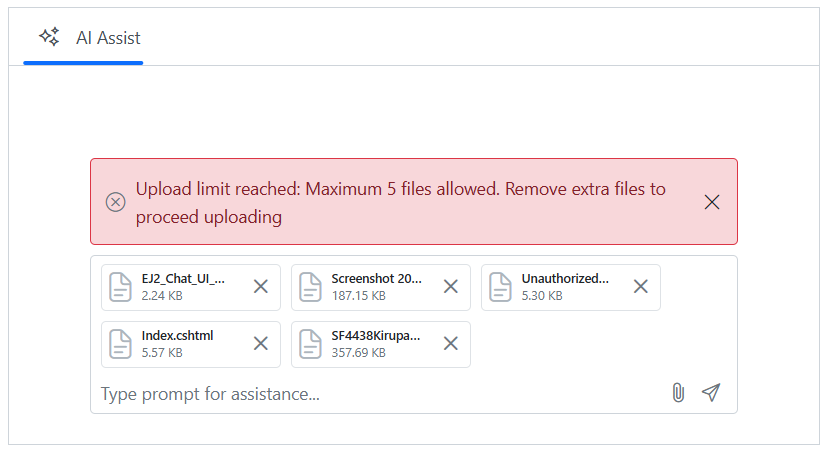

# Attachments in Blazor AI AssistView component

The `Attachment` support in AI AssistView specifies user to include file attachments along with their prompts in the AI AssistView. This enhances the interaction by allowing users to provide additional context through files. You can enable and customize this feature and its behavior using the `AttachmentSettings` configuration.

You can use the `AttachmentSettings` property to configure the attachments in the AI AssistView.

### Enabling attachment

You can use the `Enable` property to enable the attachment in the AI AssistView. By default, the value is `false`.

```cshtml
@using Syncfusion.Blazor.InteractiveChat

<div class="aiassist-container" style="height: 350px; width: 650px;">
    <SfAIAssistView AttachmentSettings="attachmentSettings" PromptRequested="PromptRequest"></SfAIAssistView>
</div>

@code {
    private AssistViewAttachmentSettings attachmentSettings = new AssistViewAttachmentSettings()
    {
        Enable = true,
        SaveUrl = "https://blazor.syncfusion.com/services/production/api/FileUploader/Save",
        RemoveUrl = "https://blazor.syncfusion.com/services/production/api/FileUploader/Remove"
    };
    private async Task PromptRequest(AssistViewPromptRequestedEventArgs args)
    {
        await Task.Delay(1000);
        var defaultResponse = "For real-time prompt processing, connect the AI AssistView component to your preferred AI service, such as OpenAI or Azure Cognitive Services. Ensure you obtain the necessary API credentials to authenticate and enable seamless integration.";
        args.Response = defaultResponse;
    }
}
```


### Setting SaveUrl and RemoveUrl

You can use the `SaveUrl` and `RemoveUrl` property to add the save and remove the URL for the file uploaded in the AI AssistView.

```cshtml
@using Syncfusion.Blazor.InteractiveChat

<div class="aiassist-container" style="height: 350px; width: 650px;">
    <SfAIAssistView AttachmentSettings="attachmentSettings" PromptRequested="PromptRequest"></SfAIAssistView>
</div>

@code {
    private AssistViewAttachmentSettings attachmentSettings = new AssistViewAttachmentSettings()
    {
        Enable = true,
        SaveUrl = "https://blazor.syncfusion.com/services/production/api/FileUploader/Save",
        RemoveUrl = "https://blazor.syncfusion.com/services/production/api/FileUploader/Remove"
    };
    private async Task PromptRequest(AssistViewPromptRequestedEventArgs args)
    {
        await Task.Delay(1000);
        var defaultResponse = "For real-time prompt processing, connect the AI AssistView component to your preferred AI service, such as OpenAI or Azure Cognitive Services. Ensure you obtain the necessary API credentials to authenticate and enable seamless integration.";
        args.Response = defaultResponse;
    }
}
```


### Setting file type

You can use the `AllowedFileTypes` property to upload the specific file types in the attachment.

```cshtml
@using Syncfusion.Blazor.InteractiveChat

<div class="aiassist-container" style="height: 350px; width: 650px;">
    <SfAIAssistView AttachmentSettings="attachmentSettings" PromptRequested="PromptRequest"></SfAIAssistView>
</div>

@code {
    private AssistViewAttachmentSettings attachmentSettings = new AssistViewAttachmentSettings()
    {
        Enable = true,
        SaveUrl = "https://blazor.syncfusion.com/services/production/api/FileUploader/Save",
        RemoveUrl = "https://blazor.syncfusion.com/services/production/api/FileUploader/Remove",
        AllowedFileTypes = ".png",
    };
    private async Task PromptRequest(AssistViewPromptRequestedEventArgs args)
    {
        await Task.Delay(1000);
        var defaultResponse = "For real-time prompt processing, connect the AI AssistView component to your preferred AI service, such as OpenAI or Azure Cognitive Services. Ensure you obtain the necessary API credentials to authenticate and enable seamless integration.";
        args.Response = defaultResponse;
    }
}
```


### Setting file size

You can use the `MaxFileSize` property to allow the maximum file size of the upload file in the AI AssistView. By default, its value is `2000000` bytes.

```cshtml
@using Syncfusion.Blazor.InteractiveChat

<div class="aiassist-container" style="height: 350px; width: 650px;">
    <SfAIAssistView AttachmentSettings="attachmentSettings" PromptRequested="PromptRequest"></SfAIAssistView>
</div>

@code {
    private AssistViewAttachmentSettings attachmentSettings = new AssistViewAttachmentSettings()
    {
        Enable = true,
        SaveUrl = "https://blazor.syncfusion.com/services/production/api/FileUploader/Save",
        RemoveUrl = "https://blazor.syncfusion.com/services/production/api/FileUploader/Remove",
        MaxFileSize = 1000000
    };
    private async Task PromptRequest(AssistViewPromptRequestedEventArgs args)
    {
        await Task.Delay(1000);
        var defaultResponse = "For real-time prompt processing, connect the AI AssistView component to your preferred AI service, such as OpenAI or Azure Cognitive Services. Ensure you obtain the necessary API credentials to authenticate and enable seamless integration.";
        args.Response = defaultResponse;
    }
}
```


### Setting maximum count

Restrict how many files can be attached at once using `MaximumCount` property. The default value is `10`. If users select more than the allowed count, the maximum count reached error will be displayed.

```cshtml
@using Syncfusion.Blazor.InteractiveChat

<div class="aiassist-container" style="height: 350px; width: 650px;">
    <SfAIAssistView AttachmentSettings="attachmentSettings" PromptRequested="PromptRequest"></SfAIAssistView>
</div>

@code {
    private void OnAttachmentClick(AttachmentClickEventArgs args)
    {
        // Your required action here
    }
    private AssistViewAttachmentSettings attachmentSettings = new AssistViewAttachmentSettings()
    {
        Enable = true,
        SaveUrl = "https://blazor.syncfusion.com/services/production/api/FileUploader/Save",
        RemoveUrl = "https://blazor.syncfusion.com/services/production/api/FileUploader/Remove",
        MaximumCount = 5
    };
    private async Task PromptRequest(AssistViewPromptRequestedEventArgs args)
    {
        await Task.Delay(1000);
        var defaultResponse = "For real-time prompt processing, connect the AI AssistView component to your preferred AI service, such as OpenAI or Azure Cognitive Services. Ensure you obtain the necessary API credentials to authenticate and enable seamless integration.";
        args.Response = defaultResponse;
    }
}
```


