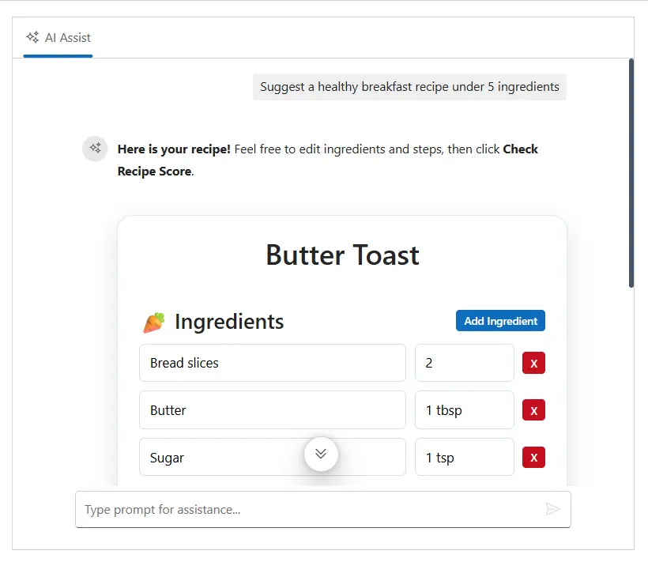

# Generative UI in Blazor AI AssistView

The **Generative UI** feature in the Blazor AI AssistView enables you to render dynamic tools and UI elements within the chat interface. This allows seamless integration of interactive components based on AI-generated responses, such as cards, forms, or custom widgets.

## Registering custom tools

You can register custom tools in the AI AssistView by using the `ToolUIBlock` method. Each tool requires a unique name, a template for rendering, and an optional handler for interactive logic.

> **Note:** When adding a tool block in a response, set `blockType` to `tool` and provide the registered tool name in `toolName`. The tool must be registered before it is referenced in a response.

### Example: Registering a tool

```cshtml

@using Syncfusion.Blazor.InteractiveChat
@inject IJSRuntime JS

<SfAIAssistView @ref="aiAssistView" PromptRequested="PromptRequest" PromptSuggestions="@PromptSuggestions" EnableStreaming="true" Prompts="@Prompts">
	<ToolUIBlock>
		@if (context.Block?.ToolName == "weather-card")
		{
			<div class="e-card weather-card" role="button">
				<div class="e-card-header">
					<div class="e-card-header-caption">
						<div class="e-card-header-title">Today</div>
						<div class="e-card-sub-title">New York - Scattered Showers</div>
					</div>
				</div>
				<div class="e-card-header weather_report">
					<div class="e-card-header-caption">
						<div class="e-card-header-title">1C / -4C</div>
						<div class="e-card-sub-title">Chance for snow: 100%</div>
					</div>
				</div>
			</div>
		}
		else if (context.Block?.ToolName == "recipe-maker")
		{
			<div class="recipe-panel e-card">
				<h2 class="recipe-title">@CurrentRecipe.Title</h2>
				<div class="recipe-section">
					<div class="recipe-header">
						<h4>🥕 Ingredients</h4>
						<button class="e-btn e-primary e-small" @onclick="AddIngredient">Add Ingredient</button>
					</div>
					<div class="ingredients-list">
						@for (var index = 0; index < CurrentRecipe.Ingredients.Count; index++)
						{
							var ingredientIndex = index;
							<div class="ingredient-item">
								<input class="ingredient-name" @bind="CurrentRecipe.Ingredients[ingredientIndex].Name" />
								<input class="ingredient-qty" @bind="CurrentRecipe.Ingredients[ingredientIndex].Quantity" />
								<button class="e-btn e-small e-danger" @onclick="() => RemoveIngredient(ingredientIndex)">X</button>
							</div>
						}
					</div>
				</div>
				<div class="recipe-section">
					<div class="recipe-header">
						<h4>Instructions</h4>
						<button class="e-btn e-primary e-small" @onclick="AddStep">Add Step</button>
					</div>
					<div class="instructions-list">
						@for (var index = 0; index < CurrentRecipe.Instructions.Count; index++)
						{
							var stepIndex = index;
							<div class="step-item">
								<input class="step-text" @bind="CurrentRecipe.Instructions[stepIndex]" />
								<button class="e-btn e-small e-danger" @onclick="() => RemoveStep(stepIndex)">X</button>
							</div>
						}
					</div>
				</div>
				<button class="e-btn e-primary" @onclick="CheckRecipeScore">Check Recipe Score</button>
			</div>
		}
		else if (context.Block?.ToolName == "recipe-score-gauge")
        {
             var props = context.Block?.Props as IDictionary<string, object>;
             int score = 0;
             string title = "Recipe Score";
             if (props != null)
             {
                if (props.TryGetValue("score", out var scoreObj))
                {
                    score = Convert.ToInt32(scoreObj);
                }
                if (props.TryGetValue("title", out var titleObj))
                {
                    title = titleObj?.ToString() ?? "Recipe Score";
                }
             }
             <div class="score-gauge-panel e-card">
                 <h3>@title</h3>
                 <div class="score-value"> @score/100</div>
                 <p class="score-comment"> @GetScoreComment(score)</p>
             </div>
        }
	</ToolUIBlock>
</SfAIAssistView>

@code {
	private List<string> PromptSuggestions = new() {
		"Suggest a healthy breakfast recipe under 5 ingredients",
		"What is the weather in New York?"
	};

	private List<AssistViewPrompt> Prompts = new() {
		new AssistViewPrompt {
			Prompt = "Suggest a healthy breakfast recipe under 5 ingredients",
			Blocks = RecipeData
		}
	};
	private static List<IResponseBlock> RecipeData => new() {
		new TextBlock { BlockType = BlockType.Text, Content = "**Here is your recipe!** Feel free to edit ingredients and steps, then click **Check Recipe Score**." },
		new ToolBlock { BlockType = BlockType.Tool, ToolName = "recipe-maker" }
	};
	private static List<IResponseBlock> WeatherData => new() {
		new TextBlock { BlockType = BlockType.Text, Content = "Here is the current weather forecast for your location:" },
		new ToolBlock { BlockType = BlockType.Tool, ToolName = "weather-card" },
		new TextBlock { BlockType = BlockType.Text, Content = "**Scattered Showers Expected** with temperatures ranging from **1°C to -4°C**. There is a **100% chance of snow**, so it's recommended to bundle up and exercise caution if traveling. The weather system is expected to continue throughout the day with moderate precipitation." }
	};

	private List<IResponseBlock> ScoreBlocks = new();
	private SfAIAssistView aiAssistView;
	private RecipeDraft CurrentRecipe { get; set; } = new()
	{
		Title = "Butter Toast",
		Ingredients = new List<Ingredient>
		{
			new() { Name = "Bread slices", Quantity = "2" },
			new() { Name = "Butter", Quantity = "1 tbsp" },
			new() { Name = "Sugar", Quantity = "1 tsp" }
		},
		Instructions = new List<string>
		{
			"Spread butter on bread slices",
			"Toast until golden and sprinkle sugar on top"
		}
	};
	private async Task PromptRequest(AssistViewPromptRequestedEventArgs args)
	{
		await Task.Delay(1000);
		if (args.Prompt == "What is the weather in New York?")
		{
			args.Blocks = WeatherData;
		}
		else if (args.Prompt == "Generate a score analysis for this recipe.")
		{
			args.Blocks = ScoreBlocks;
		}
		else if (args.Prompt == "Suggest a healthy breakfast recipe under 5 ingredients")
		{
			CurrentRecipe = new RecipeDraft
			{
				Title = "Butter Toast",
				Ingredients = new List<Ingredient>
				{
					new() { Name = "Bread slices", Quantity = "2" },
					new() { Name = "Butter", Quantity = "1 tbsp" },
					new() { Name = "Sugar", Quantity = "1 tsp" }
				},
				Instructions = new List<string>
				{
					"Spread butter on bread slices",
					"Toast until golden and sprinkle sugar on top"
				}
			};
			args.Blocks = new List<IResponseBlock> {
				new TextBlock { BlockType = BlockType.Text, Content = "**Here is your recipe!** Feel free to edit ingredients and steps, then click **Check Recipe Score**." },
				new ToolBlock { BlockType = BlockType.Tool, ToolName = "recipe-maker" }
			};
		}
		else
		{
			args.Response = "For real-time prompt processing, connect the AIAssistView component to your preferred AI service, such as OpenAI or Azure Cognitive Services. Ensure you obtain the necessary API credentials to authenticate and enable seamless integration.";
		}
	}

	private void AddIngredient()
	{
		CurrentRecipe.Ingredients.Add(new Ingredient { Name = "New Ingredient", Quantity = "qty" });
	}

	private void RemoveIngredient(int index)
	{
		if (index >= 0 && index < CurrentRecipe.Ingredients.Count)
		{
			CurrentRecipe.Ingredients.RemoveAt(index);
		}
	}

	private void AddStep()
	{
		CurrentRecipe.Instructions.Add("New instruction step...");
	}

	private void RemoveStep(int index)
	{
		if (index >= 0 && index < CurrentRecipe.Instructions.Count)
		{
			CurrentRecipe.Instructions.RemoveAt(index);
		}
	}

	private async Task CheckRecipeScore()
    {
    var score = CalculateRecipeScore(CurrentRecipe);
    ScoreBlocks = new List<IResponseBlock>
    {
        new TextBlock
        {
            BlockType = BlockType.Text,
            Content = $"**Recipe Score Analysis**\n\nHere is the health and quality score for **{CurrentRecipe.Title}**."
        },

        new ToolBlock
        {
            BlockType = BlockType.Tool,
            ToolName = "recipe-score-gauge",
            Props = new Dictionary<string, object>
            {
                ["score"] = score,
                ["title"] = CurrentRecipe.Title
            }
        },

        new TextBlock
        {
            BlockType = BlockType.Text,
            Content = "You can continue editing the recipe above and check the score again anytime."
        }
    };

    await InvokeAsync(StateHasChanged);

    await aiAssistView.ExecutePromptAsync(
        "Generate a score analysis for this recipe.");
    }
	private sealed class RecipeDraft
	{
		public string Title { get; set; } = "Custom Recipe";
		public List<Ingredient> Ingredients { get; set; } = new();
		public List<string> Instructions { get; set; } = new();
	}
	private sealed class Ingredient
	{
		public string Name { get; set; } = string.Empty;
		public string Quantity { get; set; } = string.Empty;
	}
	private int CalculateRecipeScore(RecipeDraft recipe)
	{
		int score = 100;
		var ingredients = recipe.Ingredients;
		var instructions = recipe.Instructions;
		int validIng = 0, validSteps = 0;
		if (!ingredients.Any()) return 15;
		if (!instructions.Any()) return 20;
		foreach (var ingredient in ingredients)
		{
			var n = ingredient.Name.Trim();
			var q = ingredient.Quantity.Trim();
			if (string.IsNullOrEmpty(n) || string.IsNullOrEmpty(q)) score -= 12;
			else validIng++;
		}
		score += (validIng >= 5 ? 10 : validIng == 1 ? -20 : validIng == 2 ? -10 : 0);
		foreach (var step in instructions)
		{
			var s = step?.ToString().Trim();
			if (string.IsNullOrEmpty(s)) score -= 15;
			else validSteps++;
		}
		score += (validSteps >= 4 ? 10 : validSteps == 1 ? -25 : validSteps == 2 ? -15 : validSteps == 3 ? -5 : 0);
		if (validIng >= 3 && validSteps >= 3) score += 8;
		score += new Random().Next(0, 6);
		return Math.Clamp(score, 10, 100);
	}
	private string GetScoreComment(int score)
	{
		if (score >= 90) return "Outstanding recipe! Highly recommended.";
		if (score >= 80) return "Very good recipe with excellent balance.";
		if (score >= 70) return "Solid recipe. Minor improvements possible.";
		return "Average recipe. Consider refining ingredients or steps.";
	}
}
<style>
.recipe-panel {
    max-width: 720px;
    margin: 1rem auto;
    padding: 1.5rem;
    border: 1px solid #e2e8f0;
    border-radius: 18px;
    box-shadow: 0 8px 24px rgba(15, 23, 42, 0.12);
}

.recipe-title {
    margin: 0 0 1.5rem;
    text-align: center;
    font-size: 2rem;
}

.recipe-section {
    margin-top: 1.25rem;
}

.recipe-header {
    display: flex;
    align-items: center;
    justify-content: space-between;
    gap: 1rem;
    margin-bottom: .75rem;
}

.recipe-header h4 {
    margin: 0;
}

.ingredient-item,
.step-item {
    display: flex;
    align-items: center;
    gap: .6rem;
    margin-bottom: .6rem;
}

.ingredient-name,
.ingredient-qty,
.step-text {
    min-width: 0;
    padding: .55rem .7rem;
    border: 1px solid #d6dee8;
    border-radius: 6px;
    font: inherit;
}

.ingredient-name,
.step-text {
    flex: 1;
}

.ingredient-qty {
    width: 7rem;
}

.score-gauge-panel {
    max-width: 420px;
    margin: 1rem auto;
    padding: 1.5rem;
    text-align: center;
    border: 1px solid #e2e8f0;
    border-radius: 18px;
    box-shadow: 0 8px 24px rgba(15, 23, 42, 0.12);
}

.score-value {
    margin: .75rem 0;
    color: #1769aa;
    font-size: 2.5rem;
    font-weight: 700;
}

@@media (max-width: 640px) {
    .recipe-panel {
        padding: 1rem;
    }

    .ingredient-item,
    .step-item,
    .recipe-header {
        align-items: stretch;
        flex-direction: column;
    }

    .ingredient-qty {
        width: auto;
    }
}	
</style>

```


## Adding tools in AI responses

To display a tool in the chat, return a response block with `blockType: tool` and the registered `toolName` from your AI or backend logic. You can combine tool blocks with text or other block types in the same response.

## Configuring AI for generative UI responses

Configure your AI service to return structured JSON blocks as shown above. This ensures that the AI AssistView can render both text and interactive tool blocks in the chat interface.

> **Tip:** Always return a single `blocks` array in your AI response. Each block can be of type `text`, `tool`, or other supported types.

### Example: Handling AI response in Blazor

```cshtml

@using Syncfusion.Blazor.InteractiveChat

<SfAIAssistView ID="aiAssistView" PromptRequested="PromptRequest">
    <ToolUIBlock>
        @if (context.Block?.ToolName == "weather-tool")
        {
    var props = context.Block?.Props as Dictionary<string, object>;
    var location = props != null && props.TryGetValue("location", out var locationValue)
        ? locationValue?.ToString()
        : "Unknown";
    var temperature = props != null && props.TryGetValue("temperature", out var temperatureValue)
        ? temperatureValue?.ToString()
        : "--";
        

            <div tabindex="0" class="e-card" id="weather_card" role="button">
                <div class="e-card-header">
                    <div class="e-card-header-caption">
                        <div class="e-card-header-title">@location</div>
                        <div class="e-card-sub-title">@temperature</div>
                    </div>
                </div>
            </div>
        }
    </ToolUIBlock>
</SfAIAssistView>

@code {
    private const string ApiKey = ""; // Your API key here
    private const string ApiUrl = ""; // Your AI response URL here

    private static readonly string SystemPrompt = @"
    You are an AI assistant that generates Syncfusion AIAssistView blocks.
    Return ONLY valid JSON.
    Output format:
    {
       ""blocks"": [
            {
            ""blockType"": ""text"",
            ""content"": ""Description""
            },
            {
            ""blockType"": ""tool"",
            ""toolName"": ""toolname"",
            ""props"": { ... }
            }
        ]
    }
    Rules:
    1. Always return a single ""blocks"" array.
    2. Return ONLY valid JSON.
    3. You may return ANY number of blocks.
    4. Whenever weather-related queries are requested, invoke the weather-tool block with blockType ""tool"" and toolName ""weather-tool"".";

    [Inject]
    private HttpClient Http { get; set; }

    private async Task PromptRequest(AssistViewPromptRequestedEventArgs args)
    {
        await Task.Delay(1000);
        var prompt = args.Prompt?.Trim();
        // If API key and URL are set, call the AI service
        if (!string.IsNullOrWhiteSpace(ApiKey) && !string.IsNullOrWhiteSpace(ApiUrl))
        {
            try
            {
                var payload = new
                {
                    model = "gpt-5",
                    messages = new
                    {
                        messages = new[]
                        {
                            new { role = "system", content = SystemPrompt },
                            new { role = "user", content = prompt }
                        }
                    },
                    max_output_tokens = 1000
                };

                var request = new HttpRequestMessage(HttpMethod.Post, ApiUrl);
                request.Headers.Authorization = new System.Net.Http.Headers.AuthenticationHeaderValue("Bearer", ApiKey);
                request.Content = new StringContent(System.Text.Json.JsonSerializer.Serialize(payload), System.Text.Encoding.UTF8, "application/json");

                var response = await Http.SendAsync(request);
                response.EnsureSuccessStatusCode();

                var jsonText = await response.Content.ReadAsStringAsync();
                using var doc = System.Text.Json.JsonDocument.Parse(jsonText);
                if (doc.RootElement.TryGetProperty("blocks", out var blocksElement))
                {
                    var blocks = new List<IResponseBlock>();
                    foreach (var block in blocksElement.EnumerateArray())
                    {
                        var type = block.GetProperty("blockType").GetString();
                        if (type == "text")
                        {
                            blocks.Add(new TextBlock
                            {
                                BlockType = BlockType.Text,
                                Content = block.GetProperty("content").GetString()
                            });
                        }
                        else if (type == "tool")
                        {
                            var toolName = block.GetProperty("toolName").GetString();
                            var props = new Dictionary<string, object>();
                            if (block.TryGetProperty("props", out var propsElement))
                            {
                                foreach (var prop in propsElement.EnumerateObject())
                                    props[prop.Name] = prop.Value.GetString();
                            }
                            blocks.Add(new ToolBlock
                            {
                                BlockType = BlockType.Tool,
                                ToolName = toolName,
                                Props = props
                            });
                        }
                    }
                    args.Blocks = blocks;
                }
            }
            catch
            {
            }
        }
        else
        {
            args.Response = "For real-time prompt processing, connect the AI AssistView component to your preferred AI service.";
        }
    }
}

```

## See Also

* [About response blocks](./chain-of-thoughts.md)