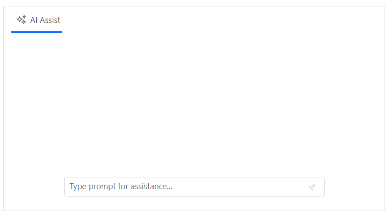
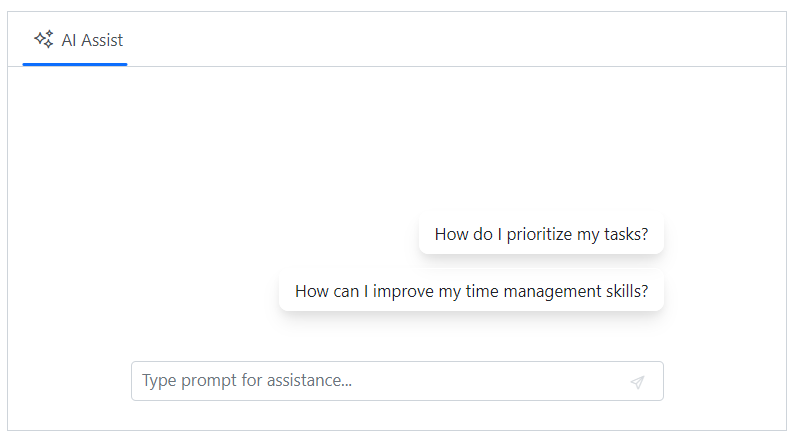

# Getting Started with Blazor AI AssistView Component

This section briefly explains about how to include [Blazor AI AssistView](https://www.syncfusion.com/blazor-components/blazor-ai-assistview) component in your Blazor Server App and Blazor WebAssembly App using Visual Studio.

## Prerequisites

* [System requirements for Blazor components](https://blazor.syncfusion.com/documentation/system-requirements)

## Create a new Blazor App in Visual Studio

You can create a **Blazor Server App** or **Blazor WebAssembly App** using Visual Studio via [Microsoft Templates](https://learn.microsoft.com/en-us/aspnet/core/blazor/tooling?view=aspnetcore-7.0) or the [Syncfusion Blazor Extension](https://blazor.syncfusion.com/documentation/visual-studio-integration/template-studio).

## Install Syncfusion Blazor InteractiveChat and Themes NuGet in the App

To add **Blazor AI AssistView** component in the app, open the NuGet package manager in Visual Studio (*Tools → NuGet Package Manager → Manage NuGet Packages for Solution*), search and install `Syncfusion.Blazor.InteractiveChat` and [Syncfusion.Blazor.Themes](https://www.nuget.org/packages/Syncfusion.Blazor.Themes/). Alternatively, you can utilize the following package manager command to achieve the same.




Install-Package Syncfusion.Blazor.InteractiveChat -Version {{ site.releaseversion }}
Install-Package Syncfusion.Blazor.Themes -Version {{ site.releaseversion }}




N> Syncfusion Blazor components are available in [nuget.org](https://www.nuget.org/packages?q=syncfusion.blazor). Refer to [NuGet packages](https://blazor.syncfusion.com/documentation/nuget-packages) topic for available NuGet packages list with component details.

## Register Syncfusion Blazor Service

Open **~/_Imports.razor** file and import the `Syncfusion.Blazor` and `Syncfusion.Blazor.InteractiveChat` namespace.




@using Syncfusion.Blazor
@using Syncfusion.Blazor.InteractiveChat




Now, register the Syncfusion Blazor Service in the **~/Program.cs** file of your Blazor Server App or Blazor WebAssembly App.




using Microsoft.AspNetCore.Components;
using Microsoft.AspNetCore.Components.Web;
using Syncfusion.Blazor;

var builder = WebApplication.CreateBuilder(args);

// Add services to the container.
builder.Services.AddRazorPages();
builder.Services.AddServerSideBlazor();
builder.Services.AddSyncfusionBlazor();

var app = builder.Build();
....




using Microsoft.AspNetCore.Components.Web;
using Microsoft.AspNetCore.Components.WebAssembly.Hosting;
using Syncfusion.Blazor;

var builder = WebAssemblyHostBuilder.CreateDefault(args);
builder.RootComponents.Add<App>("#app");
builder.RootComponents.Add<HeadOutlet>("head::after");

builder.Services.AddScoped(sp => new HttpClient { BaseAddress = new Uri(builder.HostEnvironment.BaseAddress) });

builder.Services.AddSyncfusionBlazor();
await builder.Build().RunAsync();
....




## Add stylesheet and script resources

The theme stylesheet and script can be accessed from NuGet through [Static Web Assets](https://blazor.syncfusion.com/documentation/appearance/themes#static-web-assets). Reference the stylesheet and script in the `<head>` of the main page as follows:

* For **.NET 6** Blazor Server app, include it in **~/Pages/_Layout.cshtml** file.

* For **.NET 7** Blazor Server app, include it in the **~/Pages/_Host.cshtml** file.

* For Blazor WebAssembly app, include it in the **~/index.html** file.

```html
<head>
    ....
    <link href="_content/Syncfusion.Blazor.Themes/material3.css" rel="stylesheet" />
    <script src="_content/Syncfusion.Blazor.Core/scripts/syncfusion-blazor.min.js" type="text/javascript"></script>
</head>
```
N> Check out the [Blazor Themes](https://blazor.syncfusion.com/documentation/appearance/themes) topic to discover various methods ([Static Web Assets](https://blazor.syncfusion.com/documentation/appearance/themes#static-web-assets), [CDN](https://blazor.syncfusion.com/documentation/appearance/themes#cdn-reference), and [CRG](https://blazor.syncfusion.com/documentation/common/custom-resource-generator)) for referencing themes in your Blazor application. Also, check out the [Adding Script Reference](https://blazor.syncfusion.com/documentation/common/adding-script-references) topic to learn different approaches for adding script references in your Blazor application.

## Add Syncfusion Blazor AI AssistView component

Add the Syncfusion Blazor AI AssistView component in the **~/Pages/Index.razor** file.




<div class="aiassist-container" style="height: 350px; width: 650px;">
    <SfAIAssistView></SfAIAssistView>
</div>




* Press <kbd>Ctrl</kbd>+<kbd>F5</kbd> (Windows) or <kbd>⌘</kbd>+<kbd>F5</kbd> (macOS) to launch the application. This will render the Syncfusion Blazor AI AssistView component in your default web browser.



## Configure suggestions and responses

You can use the `PromptSuggestions` property to add prompt suggestions and the `PromptRequested` event to add responses when the prompt matches the specified prompts data otherwise, the default response will be displayed.




@* desired render mode define here *@
@rendermode InteractiveAuto







<div class="aiassist-container" style="height: 350px; width: 650px;">
    <SfAIAssistView PromptSuggestions="@promptSuggestions" PromptRequested="@PromptRequest"></SfAIAssistView>
</div>

@code {
    List<string> promptSuggestions = new List<string> { "How do I prioritize my tasks?", "How can I improve my time management skills?" };
    public class AssistModel
    {
        public string Prompt { get; set; }
        public string Response { get; set; }
    }
    private List<AssistModel> prompts = new List<AssistModel>()
    {
        new AssistModel() { Prompt = "How do I prioritize my tasks?", Response = "Prioritize tasks by urgency and impact: tackle high-impact tasks first, delegate when possible, and break large tasks into smaller steps. For more assistance, feel free to ask—I’m here to help!" },
        new AssistModel() { Prompt = "How can I improve my time management skills?", Response = "To improve time management skills, try setting clear goals, using a planner or digital tools, prioritizing tasks, breaking tasks into smaller steps, and minimizing distractions. Regularly review and adjust your approach for better efficiency" }
    };
    private async Task PromptRequest(AssistViewPromptRequestedEventArgs args)
    {
        await Task.Delay(3000);
        var isPromptFound = prompts.Any(prompt => prompt.Prompt == args.Prompt);
        var promptData = prompts.FirstOrDefault(prompt => prompt.Prompt == args.Prompt);
        var defaultResponse = "For real-time prompt processing, connect the AI AssistView component to your preferred AI service, such as OpenAI or Azure Cognitive Services. Ensure you obtain the necessary API credentials to authenticate and enable seamless integration.";
        args.Response = isPromptFound ? promptData.Response : defaultResponse;
    }
}





