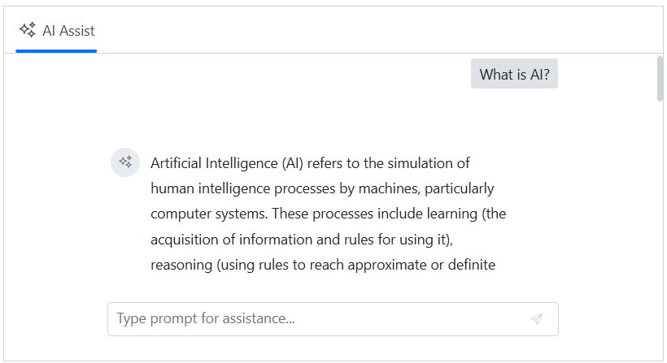

# Integration of Microsoft.Extensions.AI with AI AssistView component

The Syncfusion&reg; AI AssistView component supports integration with the `Microsoft.Extensions.AI` framework, enabling seamless communication with various large language models (LLMs) such as `Azure OpenAI`, `OpenAI`, and more.

`Microsoft.Extensions.AI` simplifies integration with different providers and typically requires only minimal configuration changes based on the selected model. The following example demonstrates integration using `Azure OpenAI`.

N> The Microsoft AI extension libraries are currently in preview and may include breaking changes. Use compatible versions of all referenced packages to prevent integration issues.

### Getting started with AI AssistView

Before integrating `AI AssistView` with `Microsoft.Extensions.AI`, ensure the `SfAIAssistView` component is rendered by following the appropriate project guidelines:

* [Blazor Web App](../getting-started-webapp)
* [Blazor WASM App](../getting-started)

### Prerequisites for Microsoft.Extensions.AI integration

To add the required NuGet packages, use the NuGet Package Manager in Visual Studio (Tools → NuGet Package Manager → Manage NuGet Packages for Solution), then search for and install the following packages:

* `Azure.AI.OpenAI`
* `Azure.Identity`
* `Microsoft.Extensions.AI`
* `Microsoft.Extensions.AI.OpenAI`
* `Markdig`

Alternatively, run the following commands in your terminal:




dotnet add package Azure.AI.OpenAI
dotnet add package Azure.Identity
dotnet add package Microsoft.Extensions.AI
dotnet add package Microsoft.Extensions.AI.OpenAI
dotnet add package Markdig




### Configure services in Program.cs

Register the `Azure OpenAI` client and the Syncfusion&reg; AI AssistView component within the Blazor application.




using Syncfusion.Blazor;
using Microsoft.Extensions.AI;
using Azure.AI.OpenAI;
using Azure;

var builder = WebApplication.CreateBuilder(args);

// Add services to the container.
builder.Services.AddRazorComponents()
    .AddInteractiveServerComponents();

// Set Azure OpenAI configuration
var endpoint = "https://azure-testresource.openai.azure.com";
var apiKey = "YOUR_API_KEY"; // Replace with your actual key;
var deploymentName = "gpt-4o-mini";

var credential = new AzureKeyCredential(apiKey);

// Register Azure OpenAI chat client
builder.Services.AddChatClient(
    new AzureOpenAIClient(new Uri(endpoint), credential)
        .GetChatClient(deploymentName)
        .AsIChatClient()
);

// Register Syncfusion Blazor components
builder.Services.AddSyncfusionBlazor();

var app = builder.Build();




### AI AssistView with IChatClient

The Syncfusion&reg; AI AssistView component is designed to integrate seamlessly with external AI services. When an `IChatClient` is registered via Microsoft.Extensions.AI, the component automatically uses it to process user prompts without additional component configuration.

In the following example, user input is sent to the injected `IChatClient`. The AI model’s response is returned in Markdown, converted to HTML using the `Markdig` library, and rendered in the AI AssistView component.




@rendermode InteractiveServer

@using Syncfusion.Blazor.InteractiveChat
@using Microsoft.Extensions.AI
@using Markdig;
@using System.Text.RegularExpressions;
@inject IChatClient ChatClient

    <SfAIAssistView PromptRequested="@OnPromptRequested"></SfAIAssistView>

@code {
    
    private async Task OnPromptRequested(AssistViewPromptRequestedEventArgs args)
    {
        // Send the user’s prompt to the AI model
        var chatResponse = await ChatClient.GetResponseAsync(args.Prompt, new ChatOptions());
        // Convert markdown to HTML
        var htmlContent = Markdown.ToHtml(chatResponse.Text);
        // Clean up extra whitespace
        htmlContent = Regex.Replace(htmlContent, @"\s+", " ").Trim();
        // Set the cleaned HTML as the response
        args.Response = htmlContent;
    }
}




