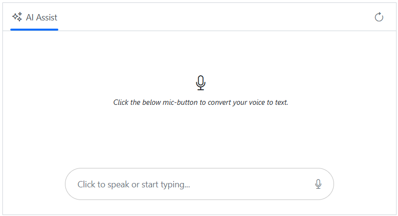

# Speech-to-Text in Blazor AI AssistView

The Syncfusion Blazor AI AssistView component supports `Speech-to-Text` functionality through the browser's [Web Speech API](https://developer.mozilla.org/en-US/docs/Web/API/Web_Speech_API), enabling conversion of spoken words into text using the device's microphone.

## Prerequisites

Before integrating `Speech-to-Text`, ensure the following:

1. The Syncfusion AI AssistView component is properly set up in your Blazor application.
    - [Blazor Getting Started Guide](../getting-started)

2. The AI AssistView component is integrated with [Azure OpenAI](https://microsoft.github.io/PartnerResources/skilling/ai-ml-academy/resources/openai).

    - [Integration of Azure OpenAI With Blazor AI AssistView component](../ai-integrations/openai-integration.md)

## Configure Speech-to-Text

To enable Speech-to-Text functionality, modify the `Home.razor` file to incorporate the Web Speech API. The SpeechToText component listens for microphone input, transcribes spoken words, and updates the AI AssistView's editable footer with the transcribed text. The transcribed text is then sent as a prompt to the Azure OpenAI service via the AI AssistView component.

The `speechtotext.js` file handles operations related to the content of the editable footer, such as checking for meaningful input, clearing existing text, and updating the content with the transcribed value. Meanwhile, the `speechtotext.css` file styles the AI AssistView layout and ensures the component remains responsive across different screen sizes and devices.




@using Syncfusion.Blazor.InteractiveChat
@using AssistView_OpenAI.Components.Services
@using Syncfusion.Blazor.Navigations
@using Syncfusion.Blazor.Inputs
@using Syncfusion.Blazor.Buttons
@inject AzureOpenAIService OpenAIService
@inject IJSRuntime JSRuntime

    <SfAIAssistView @ref="assistView" PromptRequested="@PromptRequest">
        <AssistViews>
            <AssistView>
                <FooterTemplate>
                    

                        
@AssistViewFooterValue

                        

                            <SfSpeechToText ID="speechToText" TranscriptChanging="@OnTranscriptChange" SpeechRecognitionStopped="@HandleStopRecognition"
                            CssClass="@($"e-flat {SpeechToTextCssClass}")"></SfSpeechToText>
                            <SfButton ID="assistview-sendButton" IconCss="e-assist-send e-icons" CssClass="@ButtonCssClass" @onclick="SendButtonClicked"></SfButton>
                        

                    

                </FooterTemplate>
                <BannerTemplate>
                    

                        

                        <i>Click the below mic-button to convert your voice to text.</i>
                    

                </BannerTemplate>
            </AssistView>
        </AssistViews>
        <AssistViewToolbar ItemClicked="ToolbarItemClicked">
            <AssistViewToolbarItem Type="ItemType.Spacer"></AssistViewToolbarItem>
            <AssistViewToolbarItem IconCss="e-icons e-refresh"></AssistViewToolbarItem>
        </AssistViewToolbar>
        <PromptToolbar ItemClicked="PromptToolbarItemClicked"></PromptToolbar>
    </SfAIAssistView>

@code {
    private SfAIAssistView assistView;
    private string finalResponse { get; set; }
    private string AssistViewFooterValue = String.Empty;
    private ElementReference EditableDiv;
    private string FooterContent = String.Empty;
    private string SpeechToTextCssClass = "visible";
    private string ButtonCssClass = String.Empty;

    private async void OnTranscriptChange(TranscriptChangeEventArgs args)
    {
        AssistViewFooterValue = args.Transcript;
        await JSRuntime.InvokeVoidAsync("updateContentEditableDiv", EditableDiv, AssistViewFooterValue);
        await InvokeAsync(StateHasChanged);
    }
    private async Task UpdateContent()
    {
        FooterContent = await JSRuntime.InvokeAsync<String>("isFooterContainsValue", EditableDiv);
        ToggleVisibility();
    }
    private async Task HandleStopRecognition()
    {
        FooterContent = AssistViewFooterValue;
        ToggleVisibility();
        await InvokeAsync(StateHasChanged);
    }
    private void ToggleVisibility()
    {
        ButtonCssClass = string.IsNullOrWhiteSpace(FooterContent) ? "" : "visible";
        SpeechToTextCssClass = string.IsNullOrWhiteSpace(FooterContent) ? "visible" : "";
    }
    private async Task PromptRequest(AssistViewPromptRequestedEventArgs args)
    {
        AssistViewFooterValue = String.Empty;
        await JSRuntime.InvokeVoidAsync("emptyFooterValue", EditableDiv);
        await UpdateContent();
        var lastIdx = assistView.Prompts.Count - 1;
        assistView.Prompts[lastIdx].Response = string.Empty;
        finalResponse = string.Empty;
        try
        {
            await foreach (var chunk in OpenAIService.GetChatResponseStreamAsync(args.Prompt))
            {
                await UpdateResponse(args, chunk);
            }

            args.Response = finalResponse;
        }
        catch (Exception ex)
        {
            args.Response = $"Error: {ex.Message}";
        }
        ToggleVisibility();
    }

    private async Task UpdateResponse(AssistViewPromptRequestedEventArgs args, string response)
    {
        var lastIdx = assistView.Prompts.Count - 1;
        await Task.Delay(30); // Small delay for UI updates
        assistView.Prompts[lastIdx].Response += response.Replace("\n", " ");
        finalResponse = assistView.Prompts[lastIdx].Response;
        StateHasChanged();
    }

    private async Task SendButtonClicked()
    {
        await assistView.ExecutePromptAsync(FooterContent);
    }
    private void ToolbarItemClicked(AssistViewToolbarItemClickedEventArgs args)
    {
        if (args.Item.IconCss == "e-icons e-refresh")
        {
            assistView.Prompts.Clear();
        }
    }
    private async Task OnKeyDown(KeyboardEventArgs e)
    {
        if (e.Key == "Enter" && !e.ShiftKey)
        {
            await SendButtonClicked();
        }
    }
    private async void PromptToolbarItemClicked(AssistViewToolbarItemClickedEventArgs args)
    {
        if (args.Item.IconCss == "e-icons e-assist-edit") {
            AssistViewFooterValue = assistView.Prompts[args.DataIndex].Prompt;
            await JSRuntime.InvokeVoidAsync("updateContentEditableDiv", EditableDiv, AssistViewFooterValue);
            await UpdateContent();
        }
    }
}





// Checks if the content editable element contains meaningful text and cleans up.
function isFooterContainsValue(elementref) {
    if (!elementref.innerText.trim() !== '') {
        if ((elementref.innerHTML === ' ' || elementref.innerHTML.trim() === '')) {
            elementref.innerHTML = '';
        }
    }
    return elementref.innerText || "";
}
// Clears the text content of a content editable element.
function emptyFooterValue(elementref) {
    if (elementref) {
        elementref.innerText = "";
    }
}
// Updates the text content of a content editable element with a specified value.
function updateContentEditableDiv(element, value) {
    if (element) {
        element.innerText = value;
    }
}





.integration-speechToText-section {
    height: 350px;
    width: 650px;
    margin: 0 auto;
}

.integration-speechToText-section .banner-content .e-listen-icon:before {
    font-size: 25px;
}

.integration-speechToText-section .e-view-container {
    margin: auto;
}

.integration-speechToText-section .banner-content {
    display: flex;
    flex-direction: column;
    gap: 10px;
    text-align: center;
}

.integration-speechToText-section #assistview-sendButton {
    width: 40px;
    height: 40px;
    font-size: 20px;
    border: none;
    background: none;
    cursor: pointer;
}

.integration-speechToText-section #speechToText.visible,
.integration-speechToText-section #assistview-sendButton.visible {
    display: inline-block;
}

.integration-speechToText-section #speechToText,
.integration-speechToText-section #assistview-sendButton {
    display: none;
}

@media only screen and (max-width: 750px) {
    .integration-speechToText-section {
        width: 100%;
    }
}

.integration-speechToText-section .e-footer-wrapper {
    display: flex;
    border: 1px solid #c1c1c1;
    padding: 5px 5px 5px 10px;
    margin: 5px 5px 0 5px;
    border-radius: 30px;
}

.integration-speechToText-section .content-editor {
    width: 100%;
    overflow-y: auto;
    font-size: 14px;
    min-height: 25px;
    max-height: 200px;
    padding: 10px;
}

.integration-speechToText-section .content-editor[contentEditable=true]:empty:before {
    content: attr(placeholder);
    color: #6b7280;
}

.integration-speechToText-section .option-container {
    align-self: flex-end;
}





## See Also

* [Text-to-Speech](./text-to-speech.md)