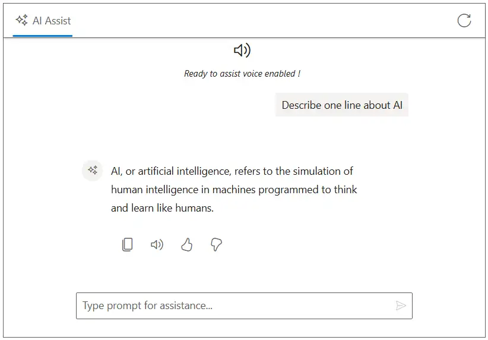

# Text-to-Speech in Blazor AI AssistView

The Syncfusion Blazor AI AssistView component provides built-in `Text-to-Speech` (TTS) support using the browser's Web Speech API, specifically the [SpeechSynthesisUtterance](https://developer.mozilla.org/en-US/docs/Web/API/SpeechSynthesisUtterance) interface. This allows AI-generated responses into spoken audio, enhancing accessibility and user interaction.

## Prerequisites

Before integrating `Text-to-Speech`, ensure the following:

1. The Syncfusion AI AssistView component is properly set up in your Blazor application.
    - [Blazor Getting Started Guide](../getting-started)

2. The AI AssistView component is integrated with [Azure OpenAI](https://microsoft.github.io/PartnerResources/skilling/ai-ml-academy/resources/openai).
    - [Integration of Azure OpenAI With Blazor AI AssistView component](../ai-integrations/openai-integration.md)

## Configure text to speech

To enable the built-in Text-to-Speech functionality, add the `e-assist-audio` icon to the [ResponseToolbarItem](https://help.syncfusion.com/cr/blazor/Syncfusion.Blazor.InteractiveChat.ResponseToolbarItem.html) tag directive within the [ResponseToolbar](https://help.syncfusion.com/cr/blazor/Syncfusion.Blazor.InteractiveChat.ResponseToolbar.html). When clicked, it fetches the text from the generated AI response and uses the browser's SpeechSynthesis API to read it aloud.




@using Syncfusion.Blazor.InteractiveChat
@using AssistView_OpenAI.Components.Services
@using Syncfusion.Blazor.Navigations
@inject AzureOpenAIService OpenAIService

    <SfAIAssistView @ref="assistView" PromptRequested="@PromptRequest">
        <AssistViews>
            <AssistView>
                <BannerTemplate>
                    

                        

                        <i>Ready to assist voice enabled !</i>
                    

                </BannerTemplate>
            </AssistView>
        </AssistViews>
        <AssistViewToolbar ItemClicked="ToolbarItemClicked">
            <AssistViewToolbarItem Type="ItemType.Spacer"></AssistViewToolbarItem>
            <AssistViewToolbarItem IconCss="e-icons e-refresh"></AssistViewToolbarItem>
        </AssistViewToolbar>
        <ResponseToolbar>
            <ResponseToolbarItem IconCss="e-icons e-assist-copy" Tooltip="Copy"></ResponseToolbarItem>
            <ResponseToolbarItem IconCss="e-icons e-assist-audio" Tooltip="Read Aloud"></ResponseToolbarItem>
            <ResponseToolbarItem IconCss="e-icons e-assist-like" Tooltip="Like"></ResponseToolbarItem>
            <ResponseToolbarItem IconCss="e-icons e-assist-dislike" Tooltip="Need Improvement"></ResponseToolbarItem>
        </ResponseToolbar>
    </SfAIAssistView>

@code {
    private SfAIAssistView assistView;
    private string finalResponse { get; set; }
    private async Task PromptRequest(AssistViewPromptRequestedEventArgs args)
    {
        var lastIdx = assistView.Prompts.Count - 1;
        assistView.Prompts[lastIdx].Response = string.Empty;
        finalResponse = string.Empty;
        try
        {
            await foreach (var chunk in OpenAIService.GetChatResponseStreamAsync(args.Prompt))
            {
                await UpdateResponse(args, chunk);
            }

            args.Response = finalResponse;
        }
        catch (Exception ex)
        {
            args.Response = $"Error: {ex.Message}";
        }
    }

    private async Task UpdateResponse(AssistViewPromptRequestedEventArgs args, string response)
    {
        var lastIdx = assistView.Prompts.Count - 1;
        await Task.Delay(30); // Small delay for UI updates
        assistView.Prompts[lastIdx].Response += response.Replace("\n", " ");
        finalResponse = assistView.Prompts[lastIdx].Response;
        StateHasChanged();
    }

    private void ToolbarItemClicked(AssistViewToolbarItemClickedEventArgs args)
    {
        if (args.Item.IconCss == "e-icons e-refresh")
        {
            assistView.Prompts.Clear();
        }
    }
}





.integration-texttospeech-section {
    height: 350px;
    width: 650px;
    margin: 0 auto;
}

.integration-texttospeech-section .banner-content .e-assist-audio:before {
    font-size: 25px;
}

.integration-texttospeech-section .e-view-container {
    margin: auto;
}

.integration-texttospeech-section .banner-content {
    display: flex;
    flex-direction: column;
    gap: 10px;
    text-align: center;
}
@media only screen and (max-width: 750px) {
    .integration-texttospeech-section {
        width: 100%;
    }
}





## Configuring the speech settings

You can use the [TextToSpeechSettings](https://help.syncfusion.com/cr/blazor/Syncfusion.Blazor.InteractiveChat.SfAIAssistView.html#Syncfusion_Blazor_InteractiveChat_SfAIAssistView_TextToSpeechSettings) property to customize the speech synthesis behavior using the following available properties such as [Language](https://help.syncfusion.com/cr/blazor/Syncfusion.Blazor.InteractiveChat.AIAssistViewTextToSpeechSettings.html#Syncfusion_Blazor_InteractiveChat_AIAssistViewTextToSpeechSettings_Language), [SpeechPitch](https://help.syncfusion.com/cr/blazor/Syncfusion.Blazor.InteractiveChat.AIAssistViewTextToSpeechSettings.html#Syncfusion_Blazor_InteractiveChat_AIAssistViewTextToSpeechSettings_SpeechPitch), [SpeechRate](https://help.syncfusion.com/cr/blazor/Syncfusion.Blazor.InteractiveChat.AIAssistViewTextToSpeechSettings.html#Syncfusion_Blazor_InteractiveChat_AIAssistViewTextToSpeechSettings_SpeechRate), [Volume](https://help.syncfusion.com/cr/blazor/Syncfusion.Blazor.InteractiveChat.AIAssistViewTextToSpeechSettings.html#Syncfusion_Blazor_InteractiveChat_AIAssistViewTextToSpeechSettings_Volume) and [Voice](https://help.syncfusion.com/cr/blazor/Syncfusion.Blazor.InteractiveChat.AIAssistViewTextToSpeechSettings.html#Syncfusion_Blazor_InteractiveChat_AIAssistViewTextToSpeechSettings_Voice).




@using Syncfusion.Blazor.InteractiveChat

    <SfAIAssistView Prompts="@promptsData" PromptRequested="@PromptRequest">
        <ResponseToolbar>
            <ResponseToolbarItem IconCss="e-icons e-assist-copy" Tooltip="Copy"></ResponseToolbarItem>
            <ResponseToolbarItem IconCss="e-icons e-assist-audio" Tooltip="Read Aloud"></ResponseToolbarItem>
            <ResponseToolbarItem IconCss="e-icons e-assist-like" Tooltip="Like"></ResponseToolbarItem>
            <ResponseToolbarItem IconCss="e-icons e-assist-dislike" Tooltip="Need Improvement"></ResponseToolbarItem>
        </ResponseToolbar>
        <AIAssistViewTextToSpeechSettings Language="en-US" SpeechPitch="1" SpeechRate="1" Volume="1">
        </AIAssistViewTextToSpeechSettings>
    </SfAIAssistView>

@code {
    private List<AssistViewPrompt> promptsData = new List<AssistViewPrompt>()
    {
        new AssistViewPrompt() { Prompt = "What is AI?", Response = "AI stands for Artificial Intelligence, enabling machines to mimic human intelligence for tasks such as learning, problem-solving, and decision-making." }
    };

    private async Task PromptRequest(AssistViewPromptRequestedEventArgs args)
    {
        await Task.Delay(1000);
        args.Response = "For real-time prompt processing, connect the AI AssistView component to your preferred AI service, such as OpenAI or Azure Cognitive Services. Ensure you obtain the necessary API credentials to authenticate and enable seamless integration.";
    }
}





.integration-texttospeech-section {
    height: 350px;
    width: 650px;
    margin: 0 auto;
}

@media only screen and (max-width: 750px) {
    .integration-texttospeech-section {
        width: 100%;
    }
}





## See Also

* [Speech-to-Text](./speech-to-text.md)
