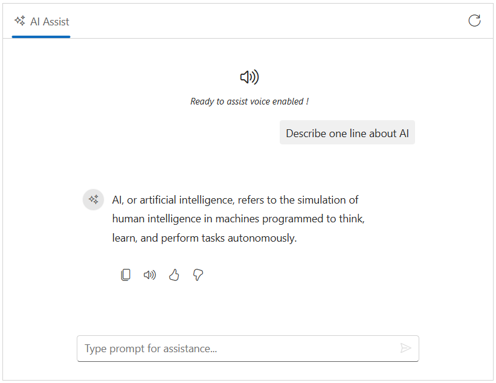

# Text-to-Speech in Blazor AI AssistView

The Syncfusion Blazor AI AssistView component supports `Text-to-Speech` (TTS) functionality using the browser's Web Speech API specifically using the [SpeechSynthesisUtterance](https://developer.mozilla.org/en-US/docs/Web/API/SpeechSynthesisUtterance) interface, to convert AI-generated responses into spoken audio.

## Prerequisites

Before integrating `Text-to-Speech`, ensure the following:

1. The Syncfusion AI AssistView component is properly set up in your Blazor application.
    - [Blazor Getting Started Guide](../getting-started)

2. The AI AssistView component is integrated with [Azure OpenAI](https://microsoft.github.io/PartnerResources/skilling/ai-ml-academy/resources/openai).

    - [Integration of Azure OpenAI With Blazor AI AssistView component](../ai-integrations/openai-integration.md)

## Configure Text-to-Speech

To enable Text-to-Speech functionality, modify the `Home.razor` file to incorporate the Web Speech API. A custom `Read Aloud` button is added to the response toolbar using the [ResponseToolbarItem](https://help.syncfusion.com/cr/blazor/Syncfusion.Blazor.InteractiveChat.ResponseToolbarItem.html) tag directive. When clicked, the `ItemClicked` event extracts plain text from the generated AI response and uses the browser's SpeechSynthesis API to read it aloud.

The `texttospeech.js` file handles the core speech logic—extracting text from HTML, initiating speech synthesis, and cancel ongoing speech when needed. Meanwhile, the `texttospeech.css` file styles the AI AssistView layout and ensures the component remains responsive across different screen sizes and devices.




@using Syncfusion.Blazor.InteractiveChat
@using AssistView_OpenAI.Components.Services
@using Syncfusion.Blazor.Navigations
@inject AzureOpenAIService OpenAIService
@inject IJSRuntime JSRuntime
@implements IDisposable

    <SfAIAssistView @ref="assistView" PromptRequested="@PromptRequest">
        <AssistViews>
            <AssistView>
                <BannerTemplate>
                    

                        

                        <i>Ready to assist voice enabled !</i>
                    

                </BannerTemplate>
            </AssistView>
        </AssistViews>
        <AssistViewToolbar ItemClicked="ToolbarItemClicked">
            <AssistViewToolbarItem Type="ItemType.Spacer"></AssistViewToolbarItem>
            <AssistViewToolbarItem IconCss="e-icons e-refresh"></AssistViewToolbarItem>
        </AssistViewToolbar>
        <ResponseToolbar ItemClicked="ResponseToolbarItemClicked">
            <ResponseToolbarItem IconCss="e-icons e-assist-copy" Tooltip="Copy"></ResponseToolbarItem>
            <ResponseToolbarItem IconCss="@audioIconCss" Tooltip="@audioTooltip"></ResponseToolbarItem>
            <ResponseToolbarItem IconCss="e-icons e-assist-like" Tooltip="Like"></ResponseToolbarItem>
            <ResponseToolbarItem IconCss="e-icons e-assist-dislike" Tooltip="Need Improvement"></ResponseToolbarItem>
        </ResponseToolbar>
    </SfAIAssistView>

@code {
    private SfAIAssistView assistView;
    private string finalResponse { get; set; }
    private string audioIconCss = "e-icons e-audio";
    private string audioTooltip = "Read Aloud";
    private bool IsSpeaking = false;
    // If component class name isn’t Home (file is not Home.razor), update DotNetObjectReference to match the actual component type.
    private DotNetObjectReference<Home>? dotNetRef;

    protected override void OnInitialized()
    {
        dotNetRef = DotNetObjectReference.Create(this);
    }
    
    private async Task PromptRequest(AssistViewPromptRequestedEventArgs args)
    {
        var lastIdx = assistView.Prompts.Count - 1;
        assistView.Prompts[lastIdx].Response = string.Empty;
        finalResponse = string.Empty;
        try
        {
            await foreach (var chunk in OpenAIService.GetChatResponseStreamAsync(args.Prompt))
            {
                await UpdateResponse(args, chunk);
            }

            args.Response = finalResponse;
        }
        catch (Exception ex)
        {
            args.Response = $"Error: {ex.Message}";
        }
    }

    private async Task UpdateResponse(AssistViewPromptRequestedEventArgs args, string response)
    {
        var lastIdx = assistView.Prompts.Count - 1;
        await Task.Delay(30); // Small delay for UI updates
        assistView.Prompts[lastIdx].Response += response.Replace("\n", " ");
        finalResponse = assistView.Prompts[lastIdx].Response;
        StateHasChanged();
    }

    private void ToolbarItemClicked(AssistViewToolbarItemClickedEventArgs args)
    {
        if (args.Item.IconCss == "e-icons e-refresh")
        {
            assistView.Prompts.Clear();
        }
    }

    // Handles toolbar item clicks to toggle text-to-speech functionality for AI responses
    private async void ResponseToolbarItemClicked(AssistViewToolbarItemClickedEventArgs args)
    {
        var prompts = assistView.Prompts;
        if (prompts.Count > args.DataIndex && prompts[args.DataIndex].Response != null)
        {
            string responseHtml = prompts[args.DataIndex].Response;
            string text = await JSRuntime.InvokeAsync<string>("extractTextFromHtml", responseHtml);

            if (args.Item.IconCss == "e-icons e-audio" || args.Item.IconCss == "e-icons e-assist-stop")
            {
                if (IsSpeaking)
                {
                    await JSRuntime.InvokeVoidAsync("cancel");
                    IsSpeaking = false;
                    audioIconCss = "e-icons e-audio";
                    audioTooltip = "Read Aloud";
                }
                else if (!string.IsNullOrEmpty(text))
                {
                    IsSpeaking = await JSRuntime.InvokeAsync<bool>("speak", text, dotNetRef);
                    if (IsSpeaking)
                    {
                        audioIconCss = "e-icons e-assist-stop";
                        audioTooltip = "Stop";
                    }
                    else
                    {
                        await JSRuntime.InvokeVoidAsync("console.warn", "Failed to start speech synthesis.");
                    }
                }
                await InvokeAsync(StateHasChanged);
            }
        }
    }

    [JSInvokable]
    public void OnSpeechEnd()
    {
        IsSpeaking = false;
        audioIconCss = "e-icons e-audio";
        audioTooltip = "Read Aloud";
        StateHasChanged();
    }

    public void Dispose()
    {
        dotNetRef?.Dispose();
        dotNetRef = null;
    }
}





// Initialize the speechSynthesisInterop object to store speech-related data if it doesn't exist.
window.speechSynthesisInterop = window.speechSynthesisInterop || {};

// Converts HTML content to plain text by stripping HTML tags.
function extractTextFromHtml(html) {
    const tempDiv = document.createElement('div');
    tempDiv.innerHTML = html;
    return (tempDiv.textContent || tempDiv.innerText || '').trim();
}

// Initiates text-to-speech synthesis to read the provided text aloud.
function speak(text, dotNetRef) {
    // Check if the browser supports the Web Speech API
    if ('speechSynthesis' in window) {
        // Create a new speech synthesis utterance with the provided text
        const utterance = new SpeechSynthesisUtterance(text);
        // Call the Blazor OnSpeechEnd method when speech ends
        utterance.onend = () => {
            dotNetRef.invokeMethodAsync('OnSpeechEnd');
        };
        utterance.onerror = (event) => {
            console.error('Speech synthesis error:', event);
            dotNetRef.invokeMethodAsync('OnSpeechEnd');
        };
        // Start speaking the utterance
        window.speechSynthesis.speak(utterance);
        // Store the utterance in the global interop object for cancellation
        window.speechSynthesisInterop.currentUtterance = utterance;
        return Promise.resolve(true);
    } else {
        console.warn('Web Speech API is not supported.');
        return Promise.resolve(false);
    }
}

// Cancels any ongoing speech synthesis.
function cancel() {
    if ('speechSynthesis' in window) {
        // Stop any active speech synthesis
        window.speechSynthesis.cancel();
        // Clear the stored utterance reference
        window.speechSynthesisInterop.currentUtterance = null;
    }
}





.integration-textToSpeech-section {
    height: 350px;
    width: 650px;
    margin: 0 auto;
}

.integration-textToSpeech-section .banner-content .e-audio:before {
    font-size: 25px;
}

.integration-textToSpeech-section .e-view-container {
    margin: auto;
}

.integration-textToSpeech-section .banner-content {
    display: flex;
    flex-direction: column;
    gap: 10px;
    text-align: center;
}
@media only screen and (max-width: 750px) {
    .integration-textToSpeech-section {
        width: 100%;
    }
}





## See Also

* [Speech-to-Text](./speech-to-text.md)
