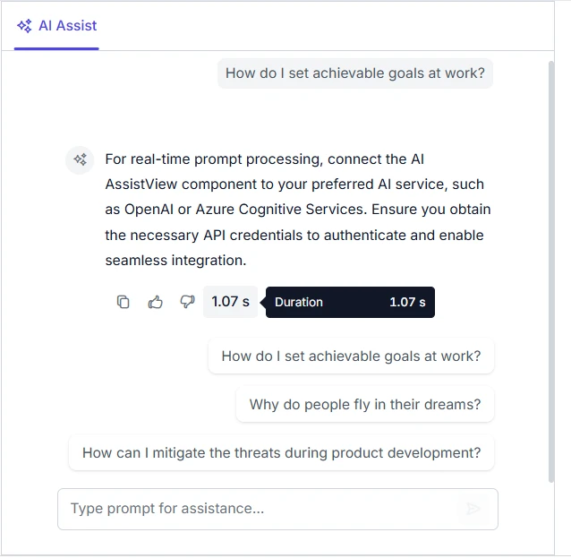
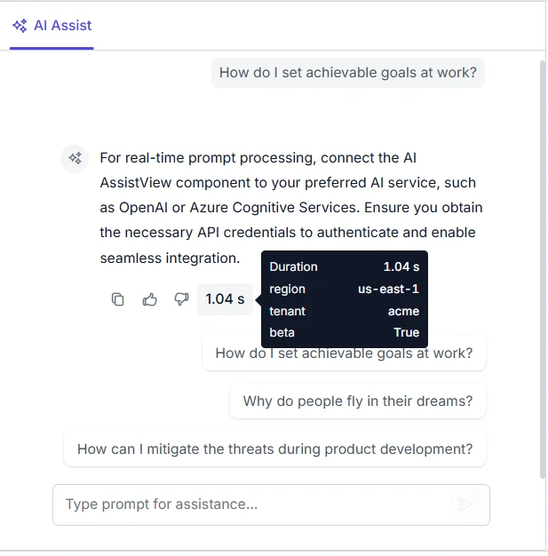
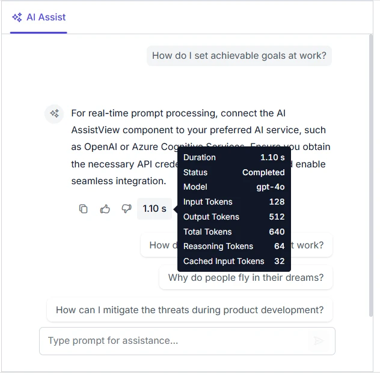
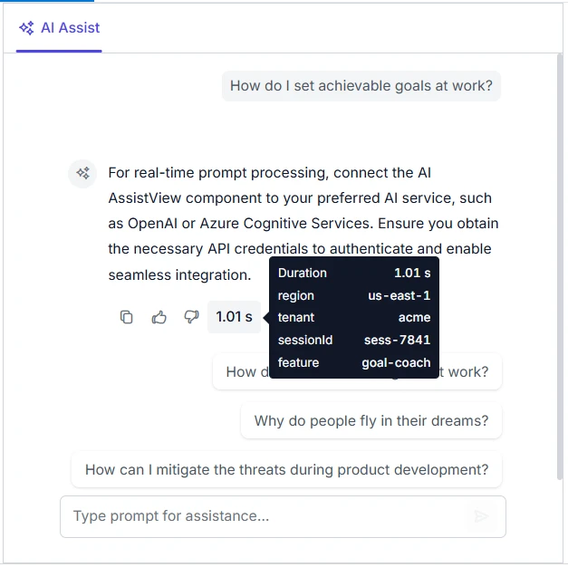

# Telemetry in Blazor AI AssistView

To get started with the telemetry feature in AI AssistView, configure the `AssistViewTelemetry` tag directive inside the [SfAIAssistView](https://help.syncfusion.com/cr/blazor/Syncfusion.Blazor.InteractiveChat.SfAIAssistView.html) and set its `Enable` property to `true`. Once configured, AI AssistView will start tracking AI interaction metrics such as response duration and tool calls, and will render a built-in telemetry summary button (displaying the duration) in each response toolbar.

You can hover over the telemetry summary button in any response toolbar to view the full telemetry report in a tooltip.

```cshtml

@using Syncfusion.Blazor.InteractiveChat

<div class="aiassist-container" style="height: 550px; width: 550px;">
    <SfAIAssistView @ref="sfAIAssistView" ID="aiAssistView" PromptSuggestions="@suggestions" PromptRequested="PromptRequest">
        <AssistViewTelemetry Enable="true" />
    </SfAIAssistView>
</div>

@code {
    private SfAIAssistView sfAIAssistView = new SfAIAssistView();

    private List<string> suggestions = new List<string>
    {
        "How do I set achievable goals at work?",
        "Why do people fly in their dreams?",
        "How can I mitigate the threats during product development?"
    };

    private async Task PromptRequest(AssistViewPromptRequestedEventArgs args)
    {
        await Task.Delay(1000);
        var defaultResponse = "For real-time prompt processing, connect the AI AssistView component to your preferred AI service, such as OpenAI or Azure Cognitive Services. Ensure you obtain the necessary API credentials to authenticate and enable seamless integration.";
        await sfAIAssistView.UpdateResponseAsync(defaultResponse);
        args.PromptSuggestions = suggestions;
    }
}

```



N> Add `@using Syncfusion.Blazor.InteractiveChat` to the Razor file (or to `~/_Imports.razor`) to use `SfAIAssistView` together with the `AssistViewTelemetry`, `TelemetryMetric`, `TelemetryData`, and `AssistViewTelemetryReport` types.

## Configuring metrics

You can control which telemetry metrics are captured in the report using the `Metrics` property of the `AssistViewTelemetry` tag. It accepts one or more values from the `TelemetryMetric` enum, such as `Status`, `Duration`, `ToolCalls`, `StreamingChunks`, `Model`, `InputTokens`, `OutputTokens`, `ReasoningTokens`, `CachedInputTokens`, and `TotalTokens`.

Additionally, the order of metrics in the `Metrics` array also determines the display order of rows in the telemetry tooltip.

```cshtml

@using Syncfusion.Blazor.InteractiveChat

<div class="aiassist-container" style="height: 550px; width: 550px;">
    <SfAIAssistView @ref="sfAIAssistView" ID="aiAssistView" PromptSuggestions="@suggestions" PromptRequested="PromptRequest">
        <AssistViewTelemetry Enable="true" Metrics="@CurrentMetrics" />
    </SfAIAssistView>
</div>

@code {
    private SfAIAssistView sfAIAssistView = new SfAIAssistView();

    private List<string> suggestions = new List<string>
    {
        "How do I set achievable goals at work?",
        "Why do people fly in their dreams?",
        "How can I mitigate the threats during product development?"
    };

    private TelemetryMetric[] CurrentMetrics = new[]
    {
        TelemetryMetric.Status,
        TelemetryMetric.Duration,
        TelemetryMetric.ToolCalls,
        TelemetryMetric.Model,
        TelemetryMetric.InputTokens,
        TelemetryMetric.OutputTokens
    };

    private async Task PromptRequest(AssistViewPromptRequestedEventArgs args)
    {
        await Task.Delay(1000);
        var defaultResponse = "For real-time prompt processing, connect the AI AssistView component to your preferred AI service, such as OpenAI or Azure Cognitive Services. Ensure you obtain the necessary API credentials to authenticate and enable seamless integration.";
        // Mock telemetry data with hard-coded usage values to filter the report rows.
        var telemetryData = new TelemetryData
        {
            Model = "gpt-4o",
            InputTokens = 128,
            OutputTokens = 512
        };
        await sfAIAssistView.UpdateResponseAsync(defaultResponse, null, telemetryData);
        args.PromptSuggestions = suggestions;
    }
}

```


## Customizing the report

Use the `OnBeforeReport` callback of the `AssistViewTelemetry` tag to intercept the generated report before it is rendered. The callback receives the `TelemetryReport` instance and must return it (modified or as is) to deliver the report, or `null` to suppress the report delivery. Entries added to the report's `CustomAttributes` dictionary are shown as additional rows in the telemetry tooltip.

```cshtml

@using Syncfusion.Blazor.InteractiveChat

<div class="aiassist-container" style="height: 550px; width: 550px;">
    <SfAIAssistView @ref="sfAIAssistView"
                    ID="aiAssistView"
                    PromptSuggestions="@suggestions"
                    PromptRequested="PromptRequest">
        <AssistViewTelemetry Enable="true"
                             BeforeReport="OnBeforeReport" />
    </SfAIAssistView>
</div>

@code {
    private SfAIAssistView sfAIAssistView = new();

    private readonly List<string> suggestions = new()
    {
        "How do I set achievable goals at work?",
        "Why do people fly in their dreams?",
        "How can I mitigate the threats during product development?"
    };

    private async Task PromptRequest(
        AssistViewPromptRequestedEventArgs args)
    {
        await Task.Delay(1000);

        var defaultResponse =
            "For real-time prompt processing, connect the AI AssistView " +
            "component to your preferred AI service, such as OpenAI or " +
            "Azure Cognitive Services. Ensure you obtain the necessary API " +
            "credentials to authenticate and enable seamless integration.";

        await sfAIAssistView.UpdateResponseAsync(defaultResponse);
        args.PromptSuggestions = suggestions;
    }

    private void OnBeforeReport(TelemetryReport report)
    {
        report.CustomAttributes = new Dictionary<string, object>
        {
            { "region", "us-east-1" },
            { "tenant", "acme" },
            { "beta", true }
        };
    }
}

```



## Enriching with AI usage data

AI AssistView automatically measures the basic metrics such as `Duration`, `ToolCalls`, and `StreamingChunks`. To include model and token usage details, pass the third optional parameter `TelemetryData` to the `UpdateResponseAsync` method on [SfAIAssistView](https://help.syncfusion.com/cr/blazor/Syncfusion.Blazor.InteractiveChat.SfAIAssistView.html). The `Model`, `InputTokens`, `OutputTokens`, `ReasoningTokens`, and `CachedInputTokens` values from this object are merged into the final telemetry report.

```cshtml

@using Syncfusion.Blazor.InteractiveChat

<div class="aiassist-container" style="height: 420px; width: 550px;">
    <SfAIAssistView @ref="sfAIAssistView"
                    ID="aiAssistView"
                    PromptSuggestions="@suggestions"
                    PromptRequested="PromptRequest">
        <AssistViewTelemetry Enable="true"
                             Metrics="@telemetryMetrics">
        </AssistViewTelemetry>
    </SfAIAssistView>
</div>

@code {
    private SfAIAssistView sfAIAssistView = new();

    private List<string> suggestions = new()
    {
        "How do I set achievable goals at work?",
        "Why do people fly in their dreams?",
        "How can I mitigate the threats during product development?"
    };

    private List<TelemetryMetric> telemetryMetrics = new()
    {
        TelemetryMetric.Status,
        TelemetryMetric.Duration,
        TelemetryMetric.Model,
        TelemetryMetric.InputTokens,
        TelemetryMetric.OutputTokens,
        TelemetryMetric.TotalTokens,
        TelemetryMetric.ReasoningTokens,
        TelemetryMetric.CachedInputTokens
    };

    private async Task PromptRequest(
        AssistViewPromptRequestedEventArgs args)
    {
        await Task.Delay(1000);

        var defaultResponse =
            "For real-time prompt processing, connect the AI AssistView " +
            "component to your preferred AI service, such as OpenAI or " +
            "Azure Cognitive Services. Ensure you obtain the necessary API " +
            "credentials to authenticate and enable seamless integration.";

        var telemetryData = new TelemetryData
        {
            Model = "gpt-4o",
            InputTokens = 128,
            OutputTokens = 512,
            ReasoningTokens = 64,
            CachedInputTokens = 32
        };

        await sfAIAssistView.UpdateResponseAsync(
            defaultResponse,
            null,
            telemetryData);

        args.PromptSuggestions = suggestions;
    }
}

```



## Custom attributes

Pass arbitrary key/value pairs through the `CustomAttributes` dictionary of the `TelemetryData` argument to surface domain-specific metrics (for example, `region`, `tenant`, `sessionId`, or `feature`) inside the telemetry report. Each entry is rendered as its own row in the telemetry tooltip and is included alongside the standard metrics regardless of the `Metrics` filter.

```cshtml

@using Syncfusion.Blazor.InteractiveChat

<div class="aiassist-container" style="height: 550px; width: 550px;">
    <SfAIAssistView @ref="sfAIAssistView" ID="aiAssistView" PromptSuggestions="@suggestions" PromptRequested="PromptRequest">
        <AssistViewTelemetry Enable="true" />
    </SfAIAssistView>
</div>

@code {
    private SfAIAssistView sfAIAssistView = new SfAIAssistView();

    private List<string> suggestions = new List<string>
    {
        "How do I set achievable goals at work?",
        "Why do people fly in their dreams?",
        "How can I mitigate the threats during product development?"
    };

    private async Task PromptRequest(AssistViewPromptRequestedEventArgs args)
    {
        await Task.Delay(1000);
        var defaultResponse = "For real-time prompt processing, connect the AI AssistView component to your preferred AI service, such as OpenAI or Azure Cognitive Services. Ensure you obtain the necessary API credentials to authenticate and enable seamless integration.";
        // Pass domain-specific keys through TelemetryData.CustomAttributes. Each
        // entry is rendered as its own row in the telemetry tooltip regardless
        // of the Metrics filter.
        var telemetryData = new TelemetryData
        {
            Model = "gpt-4o",
            InputTokens = 128,
            OutputTokens = 512,
            CustomAttributes = new Dictionary<string, object>
            {
                { "region", "us-east-1" },
                { "tenant", "acme" },
                { "sessionId", "sess-7841" },
                { "feature", "goal-coach" }
            }
        };
        await sfAIAssistView.UpdateResponseAsync(defaultResponse, null, telemetryData);
        args.PromptSuggestions = suggestions;
    }
}

```



## Behavior notes

The following are the key behaviors and constraints of the telemetry feature:

1. **Turn tracking**: A telemetry turn begins when a prompt is sent (or [ExecutePromptAsync](https://help.syncfusion.com/cr/blazor/Syncfusion.Blazor.InteractiveChat.SfAIAssistView.html#Syncfusion_Blazor_InteractiveChat_SfAIAssistView_ExecutePromptAsync_System_String_) is called) and ends when the response is completed or canceled (via `stop responding` button, `CancelPrompt`, or `FailPrompt`). The status is recorded as `completed` or `canceled` respectively in the report.

2. **Telemetry button state**: The telemetry summary button in the response toolbar displays `— ms` (a disabled state) when no telemetry report is available for the completed or canceled response, and then shows only the `Duration` value once the report is generated.

3. **Tooltip display rules**: The telemetry tooltip only displays rows for metrics that have valid values. Count-based metrics `ToolCalls`, `InputTokens`, `OutputTokens`, `TotalTokens`, `ReasoningTokens`, `CachedInputTokens`, and `StreamingChunks` are displayed only when their values are positive numbers (greater than 0). Other metrics such as `Model` and `Status` are displayed whenever they are present.

4. **Duration formatting**: Duration values below 1 second are displayed in `ms`, and values of 1 second or above are displayed in `s` with two decimal places (for example, `500 ms`, `1.25 s`).

5. **Total tokens**: The `TotalTokens` metric is automatically computed as the sum of `InputTokens` and `OutputTokens` whenever either value is provided through `TelemetryData`.

6. **Metrics filter precedence**: When the `Metrics` property of the `AssistViewTelemetry` tag is configured, only the specified metrics are retained in the report. However, `Status` and `Duration` are always retained, and entries in `CustomAttributes` are always included in the tooltip.

7. **Regenerate flow**: Each regenerated response emits its own telemetry report. The report of the latest completion is bound to the prompt response.

8. **Memory cleanup**: Telemetry reports and tooltips are cleared when the component is disposed.