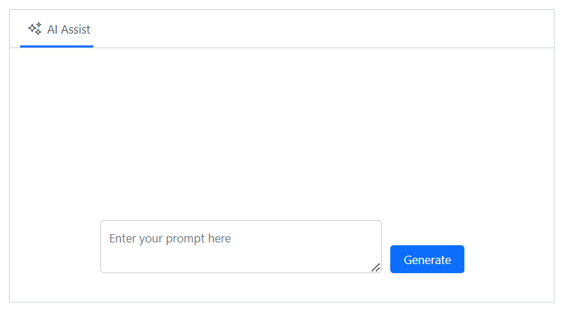

# Templates in Blazor AI AssistView component

The AI AssistView provides several template options to customize the banner, prompt, response, suggestions and footer items.

## Banner template

You can use the [BannerTemplate](https://help.syncfusion.com/cr/blazor/Syncfusion.Blazor.InteractiveChat.AssistView.html#Syncfusion_Blazor_InteractiveChat_AssistView_BannerTemplate) tag directive to display additional information, such as a welcome note, and more in the AI AssistView. This banner is positioned at the top of the prompt and response conversation area within the AI AssistView.

```cshtml

@using Syncfusion.Blazor.InteractiveChat

<div class="aiassist-container" style="height: 350px; width: 650px;">
    <SfAIAssistView PromptRequested="@PromptRequest">
        <AssistViews>
            <AssistView>
                <BannerTemplate>
                    <div class="banner-content">
                        <div class="e-icons e-assistview-icon"></div>
                        <h3>AI Assistance</h3>
                        <div>Your everyday AI companion.</div>
                    </div>
                </BannerTemplate>
            </AssistView>
        </AssistViews>
    </SfAIAssistView>
</div>

@code {
    private async Task PromptRequest(AssistViewPromptRequestedEventArgs args)
    {
        await Task.Delay(1000);
        var defaultResponse = "For real-time prompt processing, connect the AI AssistView component to your preferred AI service, such as OpenAI or Azure Cognitive Services. Ensure you obtain the necessary API credentials to authenticate and enable seamless integration.";
        args.Response = defaultResponse;
    }
}
<style>
    .aiassist-container .e-view-container {
        margin: auto;
    }

    .aiassist-container .e-banner-view {
        margin-left: 0;
    }
    .banner-content .e-assistview-icon:before {
        font-size: 35px;
    }

    .banner-content {
        text-align: center;
    }
</style>

```


## Prompt item template

You can use the [PromptItemTemplate](https://help.syncfusion.com/cr/blazor/Syncfusion.Blazor.InteractiveChat.AssistView.html#Syncfusion_Blazor_InteractiveChat_AssistView_PromptItemTemplate) tag directive to customize the prompt items in the AI AssistView. The template context includes `Prompt`, `ToolbarItems` and `Index` items.

```cshtml

@using Syncfusion.Blazor.InteractiveChat

<div class="aiassist-container" style="height: 350px; width: 650px;">
    <SfAIAssistView Prompts="prompts" PromptRequested="@PromptRequest" >
        <AssistViews>
            <AssistView>
                <PromptItemTemplate>
                    <div class="promptItemContent">
                        <div class="prompt-header">
                            You
                            <span class="e-icons e-user"></span>
                        </div>
                        <div class="promptcontent">@context.Prompt.Replace(@"<span class=""e-icons e-circle-info""></span>", "")</div>
                    </div>
                </PromptItemTemplate>
            </AssistView>
        </AssistViews>
    </SfAIAssistView>
</div>

@code {
    private List<AssistViewPrompt> prompts = new List<AssistViewPrompt>()
    {
        new AssistViewPrompt() { Prompt = "What is AI?", Response = "<div>AI stands for Artificial Intelligence, enabling machines to mimic human intelligence for tasks such as learning, problem-solving, and decision-making.</div>" }
    };
    private async Task PromptRequest(AssistViewPromptRequestedEventArgs args)
    {
        await Task.Delay(1000);
        var promptData = prompts.FirstOrDefault(prompt => prompt.Prompt == args.Prompt);
        var defaultResponse = "For real-time prompt processing, connect the AI AssistView component to your preferred AI service, such as OpenAI or Azure Cognitive Services. Ensure you obtain the necessary API credentials to authenticate and enable seamless integration.";
        args.Response = string.IsNullOrEmpty(promptData.Response) ? defaultResponse : promptData.Response;
    }
}
<style>
    .promptItemContent {
        display: flex;
        flex-direction: column;
        gap: 10px;
    }

    .promptItemContent {
        align-items: flex-end;
        margin-right: 20px
    }

    .promptItemContent .prompt-header {
        font-size: 20px;
        font-weight: bold;
        display: flex;
        align-items: center;
    }

    .promptItemContent .prompt-header span {
        margin-left: 10px;
    }

    .promptItemContent .promptcontent {
        margin-right: 35px;
    }
</style>
```


## Response item template

You can use the [ResponseItemTemplate](https://help.syncfusion.com/cr/blazor/Syncfusion.Blazor.InteractiveChat.AssistView.html#Syncfusion_Blazor_InteractiveChat_AssistView_ResponseItemTemplate) tag directive to customize response items within the AI AssistView. The template context includes the `Prompt`, `Response`, `Index`, `ToolbarItems` and `Output` items.

```cshtml

@using Syncfusion.Blazor.InteractiveChat

<div class="aiassist-container" style="height: 400px; width: 650px;">
    <SfAIAssistView Prompts="prompts" PromptRequested="@PromptRequest">
        <AssistViews>
            <AssistView>
                <ResponseItemTemplate>
                    <div class="responseItemContent">
                        <div class="response-header">
                            <span class="e-icons e-assistview-icon"></span>
                            AI Assist
                        </div>
                        <div class="responseContent">@((MarkupString)context.Response)</div>
                    </div>
                </ResponseItemTemplate>
            </AssistView>
        </AssistViews>
    </SfAIAssistView>
</div>

@code {
    private List<AssistViewPrompt> prompts = new List<AssistViewPrompt>()
    {
        new AssistViewPrompt() { Prompt = "What is AI?", Response = "<div>AI stands for Artificial Intelligence, enabling machines to mimic human intelligence for tasks such as learning, problem-solving, and decision-making.</div>" }
    };
    private async Task PromptRequest(AssistViewPromptRequestedEventArgs args)
    {
        await Task.Delay(1000);
        var promptData = prompts.FirstOrDefault(prompt => prompt.Prompt == args.Prompt);
        var defaultResponse = "For real-time prompt processing, connect the AI AssistView component to your preferred AI service, such as OpenAI or Azure Cognitive Services. Ensure you obtain the necessary API credentials to authenticate and enable seamless integration.";
        args.Response = string.IsNullOrEmpty(promptData.Response) ? defaultResponse : promptData.Response;
    }
}
<style>
    .responseItemContent {
        display: flex;
        flex-direction: column;
        gap: 10px;
        margin-left: 20px
    }

    .responseItemContent .response-header {
        font-size: 20px;
        font-weight: bold;
        display: flex;
        align-items: center;
    }

    .responseItemContent .responseContent {
        margin-left: 35px;
    }

    .responseItemContent .response-header .e-assistview-icon:before {
        margin-right: 10px;
    }

    .aiassist-container .e-response-item-template .e-toolbar-items {
        margin-left: 35px;
    }
</style>

```


## Prompt suggestion item template

You can use the [PromptSuggestionItemTemplate](https://help.syncfusion.com/cr/blazor/Syncfusion.Blazor.InteractiveChat.AssistView.html#Syncfusion_Blazor_InteractiveChat_AssistView_PromptSuggestionItemTemplate) tag directive to customize the prompt suggestion items in the AI AssistView. The template context includes the `Index` and `PromptSuggestion`.

```cshtml
@using Syncfusion.Blazor.InteractiveChat

<div class="aiassist-container" style="height: 350px; width: 650px;">
    <SfAIAssistView PromptSuggestions="@suggestions" PromptRequested="@PromptRequest">
        <AssistViews>
            <AssistView>
                <PromptSuggestionItemTemplate>
                    <div class='suggestion-item active'>
                        <span class="e-icons e-circle-info"></span>
                        <div class="suggestioncontent">@context.PromptSuggestion</div>
                    </div>
                </PromptSuggestionItemTemplate>
            </AssistView>
        </AssistViews>
    </SfAIAssistView>
</div>

@code {
    List<string> suggestions = new List<string> { "Best practices for clean, maintainable code?", "How to optimize code editor for speed?" };
    private async Task PromptRequest(AssistViewPromptRequestedEventArgs args)
    {
        await Task.Delay(1000);
        var response1 = "Use clear naming, break code into small functions, avoid repetition, write tests, and follow coding standards.";
        var response2 = "Install useful extensions, set up shortcuts, enable linting, and customize settings for smoother development.";
        var defaultResponse = "For real-time prompt processing, connect the AI AssistView component to your preferred AI service, such as OpenAI or Azure Cognitive Services. Ensure you obtain the necessary API credentials to authenticate and enable seamless integration.";
        args.Response = args.Prompt == suggestions[0] ? response1 : args.Prompt == suggestions[1] ? response2 : defaultResponse;
    }
}
<style>
    .e-aiassistview .e-views .e-suggestions li {
        padding: 0;
        border: none;
        box-shadow: none;
    }

    .suggestion-item {
        display: flex;
        align-items: center;
        background-color: #686868;
        color: white;
        padding: 4px 10px;
        opacity: 0.8;
        gap: 5px;
        height: 35px;
        border-radius: 5px;
    }

    .suggestion-item .suggestioncontent {
        text-overflow: ellipsis;
        white-space: nowrap;
        overflow: hidden;
    }
</style>
```


## Footer template

You can use the [FooterTemplate](https://help.syncfusion.com/cr/blazor/Syncfusion.Blazor.InteractiveChat.AssistView.html#Syncfusion_Blazor_InteractiveChat_AssistView_FooterTemplate) tag directive to customize the default footer area and manage prompt request actions in the AI AssistView. This allows users to create unique footers that meet their specific needs.

```cshtml
@using Syncfusion.Blazor.InteractiveChat

<div class="aiassist-container" style="height: 350px; width: 650px;">
    <SfAIAssistView @ref="AIAssist" PromptRequested="PromptRequest">
        <AssistViews>
            <AssistView>
                <FooterTemplate>
                    <div class="custom-footer">
                        <textarea id="promptTextArea" @bind="textAreaValue" class="e-input" rows="2" placeholder="Enter your prompt here"></textarea>
                        <button id="sendPrompt" @onclick="GenerateContent" class="e-btn e-primary">Generate</button>
                    </div>
                </FooterTemplate>
            </AssistView>
        </AssistViews>
    </SfAIAssistView>
</div>

@code {
    private SfAIAssistView AIAssist;
    private string textAreaValue = string.Empty;
    private async Task GenerateContent()
    {
        if (!string.IsNullOrEmpty(textAreaValue))
        {
            var value = textAreaValue;
            textAreaValue = String.Empty;
            await AIAssist.ExecutePromptAsync(value);
        }
    }
    private async Task PromptRequest(AssistViewPromptRequestedEventArgs args)
    {
        await Task.Delay(1000);
        var defaultResponse = "For real-time prompt processing, connect the AI AssistView component to your preferred AI service, such as OpenAI or Azure Cognitive Services. Ensure you obtain the necessary API credentials to authenticate and enable seamless integration.";
        args.Response = defaultResponse;
    }
}
<style>
    .custom-footer {
        display: flex;
        gap: 10px;
        padding: 10px;
        background-color: transparent;
    }

    #promptTextArea {
        width: 100%;
        padding: 10px;
        border-radius: 5px;
        border: 1px solid #ccc;
    }

    #sendPrompt {
        padding: 5px 15px;
        align-self: flex-end;
    }
</style>
```


