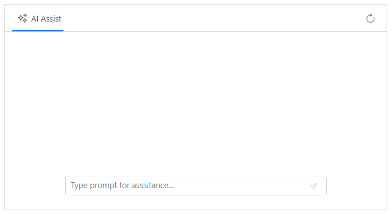
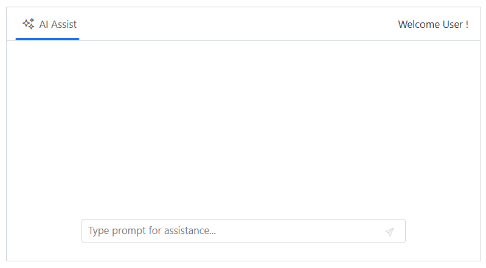
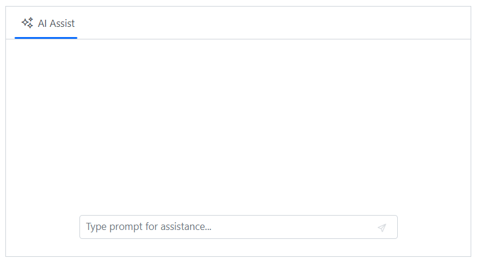
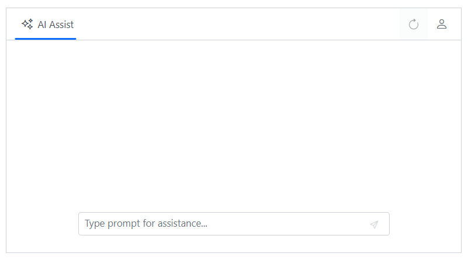
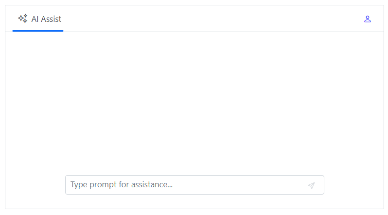
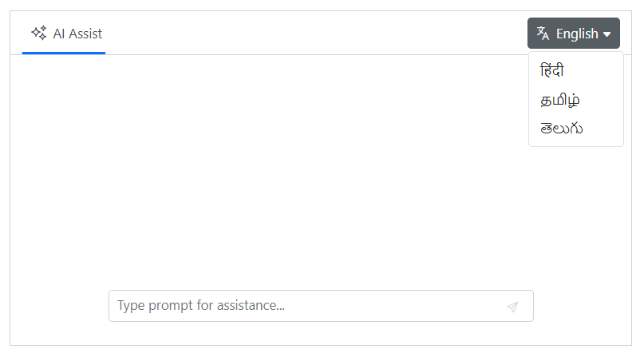
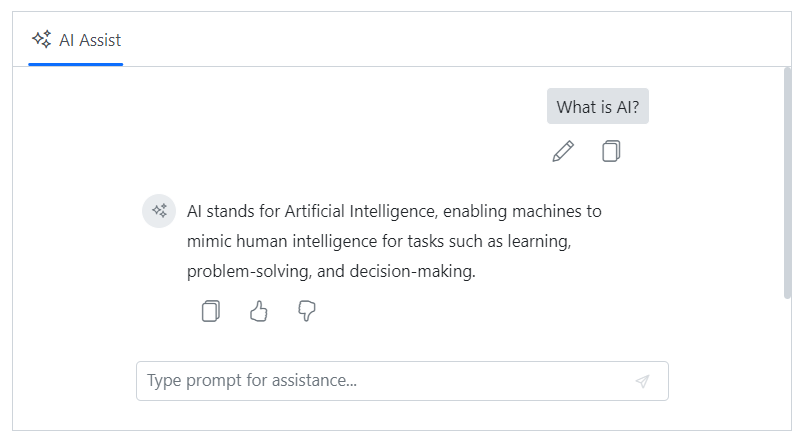
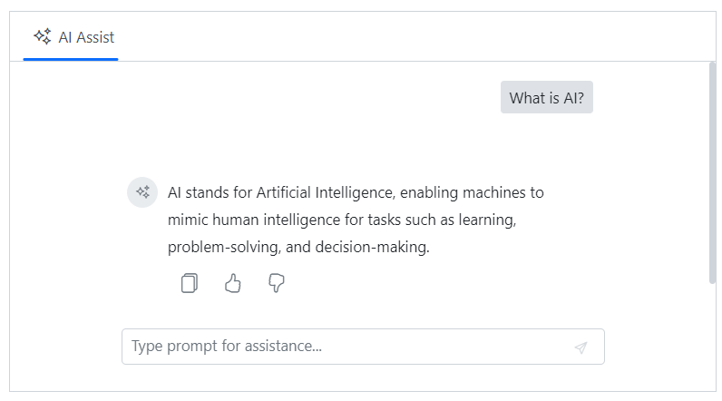
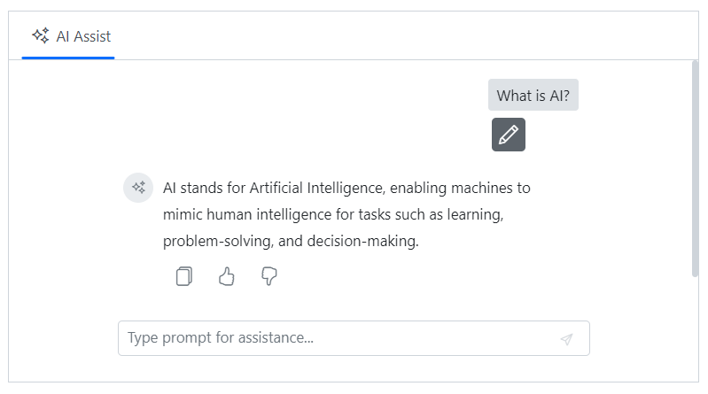
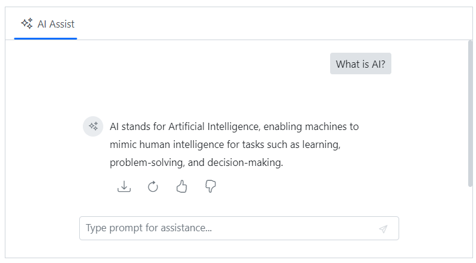

# Toolbar items in Blazor AI AssistView component

Toolbar items in the AI AssistView component can be rendered using the [AssistViewToolbarItem](https://help.syncfusion.com/cr/blazor/Syncfusion.Blazor.InteractiveChat.AssistViewToolbarItem.html), [PromptToolbarItem](https://help.syncfusion.com/cr/blazor/Syncfusion.Blazor.InteractiveChat.PromptToolbarItem.html), and [ResponseToolbarItem](https://help.syncfusion.com/cr/blazor/Syncfusion.Blazor.InteractiveChat.ResponseToolbarItem.html) tag directives.

## Adding header toolbar items

The AI AssistView component allows you to add header toolbar items using the [AssistViewToolbarItem](https://help.syncfusion.com/cr/blazor/Syncfusion.Blazor.InteractiveChat.AssistViewToolbarItem.html) tag directive within the [AssistViewToolbar](https://help.syncfusion.com/cr/blazor/Syncfusion.Blazor.InteractiveChat.AssistViewToolbar.html).

### Items

Toolbar items can be configured using the following properties:

#### Adding iconCss

An Icons can be added to toolbar items using the [IconCss](https://help.syncfusion.com/cr/blazor/Syncfusion.Blazor.InteractiveChat.AssistViewToolbarItem.html#Syncfusion_Blazor_InteractiveChat_AssistViewToolbarItem_IconCss) property.

```cshtml

@using Syncfusion.Blazor.InteractiveChat
@using Syncfusion.Blazor.Navigations

<div class="aiassist-container" style="height: 350px; width: 650px;">
    <SfAIAssistView PromptRequested="@PromptRequest">
        <AssistViewToolbar>
            <AssistViewToolbarItem Type="ItemType.Spacer"></AssistViewToolbarItem>
            <AssistViewToolbarItem IconCss="e-icons e-refresh"></AssistViewToolbarItem>
        </AssistViewToolbar>
    </SfAIAssistView>
</div>

@code {
    private async Task PromptRequest(AssistViewPromptRequestedEventArgs args)
    {
        await Task.Delay(1000);
        var defaultResponse = "For real-time prompt processing, connect the AI AssistView component to your preferred AI service, such as OpenAI or Azure Cognitive Services. Ensure you obtain the necessary API credentials to authenticate and enable seamless integration.";
        args.Response = defaultResponse;
    }
}

```



#### Set the item type

The [Type](https://help.syncfusion.com/cr/blazor/Syncfusion.Blazor.InteractiveChat.AssistViewToolbarItem.html#Syncfusion_Blazor_InteractiveChat_AssistViewToolbarItem_Type) property is used to specify the type of a toolbar item in the AI AssistView component. Supported item types includes `Button`, `Separator`, `Spacer`, and `Input`. The default value is `Button`.

In the following example, the toolbar item type is set to `Button`.

```cshtml

@using Syncfusion.Blazor.InteractiveChat
@using Syncfusion.Blazor.Navigations


<div class="aiassist-container" style="height: 350px; width: 650px;">
    <SfAIAssistView PromptRequested="@PromptRequest">
        <AssistViewToolbar>
            <AssistViewToolbarItem Type="ItemType.Spacer"></AssistViewToolbarItem>
            <AssistViewToolbarItem Type="ItemType.Button" IconCss="e-icons e-refresh"></AssistViewToolbarItem>
        </AssistViewToolbar>
    </SfAIAssistView>
</div>

@code {
    private async Task PromptRequest(AssistViewPromptRequestedEventArgs args)
    {
        await Task.Delay(1000);
        var defaultResponse = "For real-time prompt processing, connect the AI AssistView component to your preferred AI service, such as OpenAI or Azure Cognitive Services. Ensure you obtain the necessary API credentials to authenticate and enable seamless integration.";
        args.Response = defaultResponse;
    }
}

```


#### Set the display text

The [Text](https://help.syncfusion.com/cr/blazor/Syncfusion.Blazor.InteractiveChat.AssistViewToolbarItem.html#Syncfusion_Blazor_InteractiveChat_AssistViewToolbarItem_Text) property is used to set the display text for a toolbar item in the AI AssistView component.

```cshtml

@using Syncfusion.Blazor.InteractiveChat
@using Syncfusion.Blazor.Navigations

<div class="aiassist-container" style="height: 350px; width: 650px;">
    <SfAIAssistView PromptRequested="@PromptRequest">
        <AssistViewToolbar>
            <AssistViewToolbarItem Type="ItemType.Spacer"></AssistViewToolbarItem>
            <AssistViewToolbarItem Text="Welcome User !"></AssistViewToolbarItem>
        </AssistViewToolbar>
    </SfAIAssistView>
</div>

@code {
    private async Task PromptRequest(AssistViewPromptRequestedEventArgs args)
    {
        await Task.Delay(1000);
        var defaultResponse = "For real-time prompt processing, connect the AI AssistView component to your preferred AI service, such as OpenAI or Azure Cognitive Services. Ensure you obtain the necessary API credentials to authenticate and enable seamless integration.";
        args.Response = defaultResponse;
    }
}

```



#### Show or hide toolbar item

The [Visible](https://help.syncfusion.com/cr/blazor/Syncfusion.Blazor.InteractiveChat.AssistViewToolbarItem.html#Syncfusion_Blazor_InteractiveChat_AssistViewToolbarItem_Visible) property can be used to control the visibility of a toolbar item. Its default value is `true`.

```cshtml

@using Syncfusion.Blazor.InteractiveChat
@using Syncfusion.Blazor.Navigations

<div class="aiassist-container" style="height: 350px; width: 650px;">
    <SfAIAssistView PromptRequested="@PromptRequest">
        <AssistViewToolbar>
            <AssistViewToolbarItem Type="ItemType.Spacer"></AssistViewToolbarItem>
            <AssistViewToolbarItem Type="ItemType.Button" IconCss="e-icons e-refresh" Visible=false></AssistViewToolbarItem>
            <AssistViewToolbarItem Type="ItemType.Button" IconCss="e-icons e-user"></AssistViewToolbarItem>
        </AssistViewToolbar>
    </SfAIAssistView>
</div>

@code {
    private async Task PromptRequest(AssistViewPromptRequestedEventArgs args)
    {
        await Task.Delay(1000);
        var defaultResponse = "For real-time prompt processing, connect the AI AssistView component to your preferred AI service, such as OpenAI or Azure Cognitive Services. Ensure you obtain the necessary API credentials to authenticate and enable seamless integration.";
        args.Response = defaultResponse;
    }
}

```



#### Setting disabled

You can use the [Disabled](https://help.syncfusion.com/cr/blazor/Syncfusion.Blazor.InteractiveChat.AssistViewToolbarItem.html#Syncfusion_Blazor_InteractiveChat_AssistViewToolbarItem_Disabled) property to disable the toolbar item. By default, its value is `false`.


```cshtml

@using Syncfusion.Blazor.InteractiveChat
@using Syncfusion.Blazor.Navigations

<div class="aiassist-container" style="height: 350px; width: 650px;">
    <SfAIAssistView PromptRequested="@PromptRequest">
        <AssistViewToolbar>
            <AssistViewToolbarItem Type="ItemType.Spacer"></AssistViewToolbarItem>
            <AssistViewToolbarItem Type="ItemType.Button" IconCss="e-icons e-refresh" Disabled=true></AssistViewToolbarItem>
            <AssistViewToolbarItem Type="ItemType.Button" IconCss="e-icons e-user"></AssistViewToolbarItem>
        </AssistViewToolbar>
    </SfAIAssistView>
</div>

@code {
    private async Task PromptRequest(AssistViewPromptRequestedEventArgs args)
    {
        await Task.Delay(1000);
        var defaultResponse = "For real-time prompt processing, connect the AI AssistView component to your preferred AI service, such as OpenAI or Azure Cognitive Services. Ensure you obtain the necessary API credentials to authenticate and enable seamless integration.";
        args.Response = defaultResponse;
    }
}

```



#### Set a tooltip

The [Tooltip](https://help.syncfusion.com/cr/blazor/Syncfusion.Blazor.InteractiveChat.AssistViewToolbarItem.html#Syncfusion_Blazor_InteractiveChat_AssistViewToolbarItem_Tooltip) property specifies the text to be displayed when hovering over a toolbar item.

```cshtml

@using Syncfusion.Blazor.InteractiveChat
@using Syncfusion.Blazor.Navigations

<div class="aiassist-container" style="height: 350px; width: 650px;">
    <SfAIAssistView PromptRequested="@PromptRequest">
        <AssistViewToolbar>
            <AssistViewToolbarItem Type="ItemType.Spacer"></AssistViewToolbarItem>
            <AssistViewToolbarItem Type="ItemType.Button" IconCss="e-icons e-refresh" Tooltip="Refresh"></AssistViewToolbarItem>
        </AssistViewToolbar>
    </SfAIAssistView>
</div>

@code {
    private async Task PromptRequest(AssistViewPromptRequestedEventArgs args)
    {
        await Task.Delay(1000);
        var defaultResponse = "For real-time prompt processing, connect the AI AssistView component to your preferred AI service, such as OpenAI or Azure Cognitive Services. Ensure you obtain the necessary API credentials to authenticate and enable seamless integration.";
        args.Response = defaultResponse;
    }
}

```

#### Setting cssClass

The [CssClass](https://help.syncfusion.com/cr/blazor/Syncfusion.Blazor.InteractiveChat.AssistViewToolbarItem.html#Syncfusion_Blazor_InteractiveChat_AssistViewToolbarItem_CssClass) property allows the application of a custom CSS class to a toolbar item for styling purposes.

```cshtml

@using Syncfusion.Blazor.InteractiveChat
@using Syncfusion.Blazor.Navigations

<div class="aiassist-container" style="height: 350px; width: 650px;">
    <SfAIAssistView PromptRequested="@PromptRequest">
        <AssistViewToolbar>
            <AssistViewToolbarItem Type="ItemType.Spacer"></AssistViewToolbarItem>
            <AssistViewToolbarItem Type="ItemType.Button" IconCss="e-icons e-user" CssClass="custom-btn"></AssistViewToolbarItem>
        </AssistViewToolbar>
    </SfAIAssistView>
</div>

@code {
    private async Task PromptRequest(AssistViewPromptRequestedEventArgs args)
    {
        await Task.Delay(1000);
        var defaultResponse = "For real-time prompt processing, connect the AI AssistView component to your preferred AI service, such as OpenAI or Azure Cognitive Services. Ensure you obtain the necessary API credentials to authenticate and enable seamless integration.";
        args.Response = defaultResponse;
    }
}
<style>
    .custom-btn .e-user::before {
        color: blue;
        font-size: 15px;
    }

    .custom-btn.e-toolbar-item button.e-tbar-btn {
        border: 1px solid #dcdcdc;
    }
</style>

```



#### Enable tab key navigation

The [TabIndex](https://help.syncfusion.com/cr/blazor/Syncfusion.Blazor.InteractiveChat.AssistViewToolbarItem.html#Syncfusion_Blazor_InteractiveChat_AssistViewToolbarItem_TabIndex) property is used to manage keyboard navigation for toolbar items via the `Tab` key.

*   A positive `TabIndex` value sets a specific order for tab navigation.
*   A `TabIndex` value of `0` allows the item to be focused in its natural order within the document.
*   A negative `TabIndex` value removes the item from the tab navigation sequence.

By default, users navigate between items with arrow keys. Setting `TabIndex` enables navigation with both `Tab` and `Shift+Tab`.

```cshtml

@using Syncfusion.Blazor.InteractiveChat
@using Syncfusion.Blazor.Navigations

<div class="aiassist-container" style="height: 350px; width: 650px;">
    <SfAIAssistView>
        <AssistViewToolbar>
            <AssistViewToolbarItem Text="Item 1" TabIndex="1"></AssistViewToolbarItem>
            <AssistViewToolbarItem Text="Item 2" TabIndex="2"></AssistViewToolbarItem>
        </AssistViewToolbar>
    </SfAIAssistView>
</div>

```

With the above code, the user can switch between the two Toolbar items using the Tab and Shift+Tab keys, in addition to using the arrow keys. The items will be navigated in the order specified by the `TabIndex` values.

If you set the `TabIndex` value to 0 for all Toolbar items, tab key navigation will be based on the element order rather than the `TabIndex` values. For example:

```cshtml

@using Syncfusion.Blazor.InteractiveChat
@using Syncfusion.Blazor.Navigations

<div class="aiassist-container" style="height: 350px; width: 650px;">
    <SfAIAssistView>
        <AssistViewToolbar>
            <AssistViewToolbarItem Text="Item 1" TabIndex="0"></AssistViewToolbarItem>
            <AssistViewToolbarItem Text="Item 2" TabIndex="0"></AssistViewToolbarItem>
        </AssistViewToolbar>
    </SfAIAssistView>
</div>

```

#### Setting template

The [Template](https://help.syncfusion.com/cr/blazor/Syncfusion.Blazor.InteractiveChat.AssistViewToolbarItem.html#Syncfusion_Blazor_InteractiveChat_AssistViewToolbarItem_Template) tag directive enables rendering of a custom component or HTML element as a toolbar item.

```cshtml

@using Syncfusion.Blazor.InteractiveChat
@using Syncfusion.Blazor.Navigations
@using Syncfusion.Blazor.SplitButtons

<div class="aiassist-container" style="height: 350px; width: 650px;">
    <SfAIAssistView PromptRequested="@PromptRequest">
        <AssistViewToolbar>
            <AssistViewToolbarItem Type="ItemType.Spacer"></AssistViewToolbarItem>
            <AssistViewToolbarItem Type="ItemType.Input">
                <Template>
                    <SfDropDownButton Content="English" CssClass="custom-dropdown" IconCss="e-icons e-translate">
                        <DropDownMenuItems>
                            <DropDownMenuItem Text="हिंदी"></DropDownMenuItem>
                            <DropDownMenuItem Text="தமிழ்"></DropDownMenuItem>
                            <DropDownMenuItem Text="తెలుగు"></DropDownMenuItem>
                        </DropDownMenuItems>
                    </SfDropDownButton>
                </Template>
            </AssistViewToolbarItem>
        </AssistViewToolbar>
    </SfAIAssistView>
</div>

@code {
    private async Task PromptRequest(AssistViewPromptRequestedEventArgs args)
    {
        await Task.Delay(1000);
        var defaultResponse = "For real-time prompt processing, connect the AI AssistView component to your preferred AI service, such as OpenAI or Azure Cognitive Services. Ensure you obtain the necessary API credentials to authenticate and enable seamless integration.";
        args.Response = defaultResponse;
    }
}
<style>
    .custom-dropdown.e-dropdown-popup ul {
        min-width: 100px;
    }
</style>

```



### Handle item clicks

Use the [ItemClicked](https://help.syncfusion.com/cr/blazor/Syncfusion.Blazor.InteractiveChat.AssistViewToolbar.html#Syncfusion_Blazor_InteractiveChat_AssistViewToolbar_ItemClicked) event on the [AssistViewToolbar](https://help.syncfusion.com/cr/blazor/Syncfusion.Blazor.InteractiveChat.AssistViewToolbar.html) tag directive to handle click actions on header toolbar items.

```cshtml

@using Syncfusion.Blazor.InteractiveChat
@using Syncfusion.Blazor.Navigations

<div class="aiassist-container" style="height: 350px; width: 650px;">
    <SfAIAssistView PromptRequested="@PromptRequest">
        <AssistViewToolbar ItemClicked="ToolbarItemClicked">
            <AssistViewToolbarItem Type="ItemType.Button" IconCss="e-icons e-refresh"></AssistViewToolbarItem>
        </AssistViewToolbar>
    </SfAIAssistView>
</div>

@code {
    private async Task PromptRequest(AssistViewPromptRequestedEventArgs args)
    {
        await Task.Delay(1000);
        var defaultResponse = "For real-time prompt processing, connect the AI AssistView component to your preferred AI service, such as OpenAI or Azure Cognitive Services. Ensure you obtain the necessary API credentials to authenticate and enable seamless integration.";
        args.Response = defaultResponse;
    }
    private void ToolbarItemClicked(AssistViewToolbarItemClickedEventArgs args)
    {
        // Your required action here
    }
}

```

## Built-in toolbar items

### Prompt

By default, the prompt toolbar includes built-in `edit` and `copy` items, allowing users to modify or copy the prompt text.

In the following example, AI AssistView component rendered with built-in toolbar items such as `edit` and `copy` items.

```cshtml

@using Syncfusion.Blazor.InteractiveChat

<div class="aiassist-container" style="height: 350px; width: 650px;">
    <SfAIAssistView Prompts="@prompts" PromptRequested="@PromptRequest"></SfAIAssistView>
</div>

@code {
    private List<AssistViewPrompt> prompts = new List<AssistViewPrompt>()
    {
        new AssistViewPrompt() { Prompt = "What is AI?", Response = "<div>AI stands for Artificial Intelligence, enabling machines to mimic human intelligence for tasks such as learning, problem-solving, and decision-making.</div>" }
    };
    private async Task PromptRequest(AssistViewPromptRequestedEventArgs args)
    {
        await Task.Delay(1000);
        var promptData = prompts.FirstOrDefault(prompt => prompt.Prompt == args.Prompt);
        var defaultResponse = "For real-time prompt processing, connect the AI AssistView component to your preferred AI service, such as OpenAI or Azure Cognitive Services. Ensure you obtain the necessary API credentials to authenticate and enable seamless integration.";
        args.Response = string.IsNullOrEmpty(promptData.Response) ? defaultResponse : promptData.Response;
    }
}

```



#### Set the width

The [Width](https://help.syncfusion.com/cr/blazor/Syncfusion.Blazor.InteractiveChat.PromptToolbar.html#Syncfusion_Blazor_InteractiveChat_PromptToolbar_Width) property in the [PromptToolbar](https://help.syncfusion.com/cr/blazor/Syncfusion.Blazor.InteractiveChat.PromptToolbar.html) tag directive is used to set the width of the prompt toolbar.

```cshtml

@using Syncfusion.Blazor.InteractiveChat

<div class="aiassist-container" style="height: 350px; width: 650px;">
    <SfAIAssistView PromptRequested="@PromptRequest" Prompts="@prompts">
        <PromptToolbar Width="100px"></PromptToolbar>
    </SfAIAssistView>
</div>

@code {
    private List<AssistViewPrompt> prompts = new List<AssistViewPrompt>()
    {
        new AssistViewPrompt() { Prompt = "What is AI?", Response = "<div>AI stands for Artificial Intelligence, enabling machines to mimic human intelligence for tasks such as learning, problem-solving, and decision-making.</div>" }
    };
    private async Task PromptRequest(AssistViewPromptRequestedEventArgs args)
    {
        await Task.Delay(1000);
        var promptData = prompts.FirstOrDefault(prompt => prompt.Prompt == args.Prompt);
        var defaultResponse = "For real-time prompt processing, connect the AI AssistView component to your preferred AI service, such as OpenAI or Azure Cognitive Services. Ensure you obtain the necessary API credentials to authenticate and enable seamless integration.";
        args.Response = string.IsNullOrEmpty(promptData.Response) ? defaultResponse : promptData.Response;
    }
}

```

#### Handle item clicks

Use the [ItemClicked](https://help.syncfusion.com/cr/blazor/Syncfusion.Blazor.InteractiveChat.PromptToolbar.html#Syncfusion_Blazor_InteractiveChat_PromptToolbar_ItemClicked) event on the [PromptToolbar](https://help.syncfusion.com/cr/blazor/Syncfusion.Blazor.InteractiveChat.PromptToolbar.html) tag directive to handle clicks on prompt toolbar items.

```cshtml

@using Syncfusion.Blazor.InteractiveChat

<div class="aiassist-container" style="height: 350px; width: 650px;">
    <SfAIAssistView PromptRequested="@PromptRequest" Prompts="@prompts">
        <PromptToolbar ItemClicked="ToolbarItemClicked"></PromptToolbar>
    </SfAIAssistView>
</div>

@code {
    private List<AssistViewPrompt> prompts = new List<AssistViewPrompt>()
    {
        new AssistViewPrompt() { Prompt = "What is AI?", Response = "<div>AI stands for Artificial Intelligence, enabling machines to mimic human intelligence for tasks such as learning, problem-solving, and decision-making.</div>" }
    };
    private async Task PromptRequest(AssistViewPromptRequestedEventArgs args)
    {
        await Task.Delay(1000);
        var promptData = prompts.FirstOrDefault(prompt => prompt.Prompt == args.Prompt);
        var defaultResponse = "For real-time prompt processing, connect the AI AssistView component to your preferred AI service, such as OpenAI or Azure Cognitive Services. Ensure you obtain the necessary API credentials to authenticate and enable seamless integration.";
        args.Response = string.IsNullOrEmpty(promptData.Response) ? defaultResponse : promptData.Response;
    }
    private void ToolbarItemClicked(AssistViewToolbarItemClickedEventArgs args)
    {
        // Your required action here
    }
}

```

### Response

By default, the response toolbar includes `copy`, `like`, and `dislike` items to let users copy the response or provide feedback.

In the following example, AI AssistView renders with built-in toolbar items.

```cshtml

@using Syncfusion.Blazor.InteractiveChat

<div class="aiassist-container" style="height: 350px; width: 650px;">
    <SfAIAssistView Prompts="@prompts" PromptRequested="@PromptRequest"></SfAIAssistView>
</div>

@code {
    private List<AssistViewPrompt> prompts = new List<AssistViewPrompt>()
    {
        new AssistViewPrompt() { Prompt = "What is AI?", Response = "<div>AI stands for Artificial Intelligence, enabling machines to mimic human intelligence for tasks such as learning, problem-solving, and decision-making.</div>" }
    };
    private async Task PromptRequest(AssistViewPromptRequestedEventArgs args)
    {
        await Task.Delay(1000);
        var promptData = prompts.FirstOrDefault(prompt => prompt.Prompt == args.Prompt);
        var defaultResponse = "For real-time prompt processing, connect the AI AssistView component to your preferred AI service, such as OpenAI or Azure Cognitive Services. Ensure you obtain the necessary API credentials to authenticate and enable seamless integration.";
        args.Response = string.IsNullOrEmpty(promptData.Response) ? defaultResponse : promptData.Response;
    }
}

```



#### Set the width

The [Width](https://help.syncfusion.com/cr/blazor/Syncfusion.Blazor.InteractiveChat.ResponseToolbar.html#Syncfusion_Blazor_InteractiveChat_ResponseToolbar_Width) property in the [ResponseToolbar](https://help.syncfusion.com/cr/blazor/Syncfusion.Blazor.InteractiveChat.ResponseToolbar.html) tag directive is used to set the width of the response toolbar.

```cshtml

@using Syncfusion.Blazor.InteractiveChat

<div class="aiassist-container" style="height: 350px; width: 650px;">
    <SfAIAssistView PromptRequested="@PromptRequest" Prompts="@prompts">
        <ResponseToolbar Width="200px"></ResponseToolbar>
    </SfAIAssistView>
</div>

@code {
    private List<AssistViewPrompt> prompts = new List<AssistViewPrompt>()
    {
        new AssistViewPrompt() { Prompt = "What is AI?", Response = "<div>AI stands for Artificial Intelligence, enabling machines to mimic human intelligence for tasks such as learning, problem-solving, and decision-making.</div>" }
    };
    private async Task PromptRequest(AssistViewPromptRequestedEventArgs args)
    {
        await Task.Delay(1000);
        var promptData = prompts.FirstOrDefault(prompt => prompt.Prompt == args.Prompt);
        var defaultResponse = "For real-time prompt processing, connect the AI AssistView component to your preferred AI service, such as OpenAI or Azure Cognitive Services. Ensure you obtain the necessary API credentials to authenticate and enable seamless integration.";
        args.Response = string.IsNullOrEmpty(promptData.Response) ? defaultResponse : promptData.Response;
    }
}

```

#### Handle item clicks

Use the [ItemClicked](https://help.syncfusion.com/cr/blazor/Syncfusion.Blazor.InteractiveChat.ResponseToolbar.html#Syncfusion_Blazor_InteractiveChat_ResponseToolbar_ItemClicked) event on the [ResponseToolbar](https://help.syncfusion.com/cr/blazor/Syncfusion.Blazor.InteractiveChat.ResponseToolbar.html) tag directive to handle clicks on response toolbar items.

```cshtml

@using Syncfusion.Blazor.InteractiveChat

<div class="aiassist-container" style="height: 350px; width: 650px;">
    <SfAIAssistView PromptRequested="@PromptRequest" Prompts="@prompts">
        <ResponseToolbar ItemClicked="ToolbarItemClicked"></ResponseToolbar>
    </SfAIAssistView>
</div>

@code {
    private List<AssistViewPrompt> prompts = new List<AssistViewPrompt>()
    {
        new AssistViewPrompt() { Prompt = "What is AI?", Response = "<div>AI stands for Artificial Intelligence, enabling machines to mimic human intelligence for tasks such as learning, problem-solving, and decision-making.</div>" }
    };
    private async Task PromptRequest(AssistViewPromptRequestedEventArgs args)
    {
        await Task.Delay(1000);
        var promptData = prompts.FirstOrDefault(prompt => prompt.Prompt == args.Prompt);
        var defaultResponse = "For real-time prompt processing, connect the AI AssistView component to your preferred AI service, such as OpenAI or Azure Cognitive Services. Ensure you obtain the necessary API credentials to authenticate and enable seamless integration.";
        args.Response = string.IsNullOrEmpty(promptData.Response) ? defaultResponse : promptData.Response;
    }
    private void ToolbarItemClicked(AssistViewToolbarItemClickedEventArgs args)
    {
        // Your required action here
    }
}

```

## Adding custom toolbar items

You can also add custom toolbar items in the AI AssistView by using the [AssistViewToolbarItem](https://help.syncfusion.com/cr/blazor/Syncfusion.Blazor.InteractiveChat.AssistViewToolbarItem.html), [PromptToolbarItem](https://help.syncfusion.com/cr/blazor/Syncfusion.Blazor.InteractiveChat.PromptToolbarItem.html) & [ResponseToolbarItem](https://help.syncfusion.com/cr/blazor/Syncfusion.Blazor.InteractiveChat.ResponseToolbarItem.html) tag directives.

### Prompt

Use the [PromptToolbarItem](https://help.syncfusion.com/cr/blazor/Syncfusion.Blazor.InteractiveChat.PromptToolbarItem.html) tag directive inside the [PromptToolbar](https://help.syncfusion.com/cr/blazor/Syncfusion.Blazor.InteractiveChat.PromptToolbar.html) to add custom items to the prompt toolbar.

For more information on item configuration, please refer to the [Items](./toolbar-items#items) properties section.

```cshtml

@using Syncfusion.Blazor.InteractiveChat

<div class="aiassist-container" style="height: 350px; width: 650px;">
    <SfAIAssistView PromptRequested="@PromptRequest" Prompts="@prompts">
        <PromptToolbar>
            <PromptToolbarItem IconCss="e-icons e-edit"></PromptToolbarItem>
        </PromptToolbar>
    </SfAIAssistView>
</div>

@code {
    private List<AssistViewPrompt> prompts = new List<AssistViewPrompt>()
    {
        new AssistViewPrompt() { Prompt = "What is AI?", Response = "<div>AI stands for Artificial Intelligence, enabling machines to mimic human intelligence for tasks such as learning, problem-solving, and decision-making.</div>" }
    };
    private async Task PromptRequest(AssistViewPromptRequestedEventArgs args)
    {
        await Task.Delay(1000);
        var promptData = prompts.FirstOrDefault(prompt => prompt.Prompt == args.Prompt);
        var defaultResponse = "For real-time prompt processing, connect the AI AssistView component to your preferred AI service, such as OpenAI or Azure Cognitive Services. Ensure you obtain the necessary API credentials to authenticate and enable seamless integration.";
        args.Response = string.IsNullOrEmpty(promptData.Response) ? defaultResponse : promptData.Response;
    }
}

```



### Response

Use the [ResponseToolbarItem](https://help.syncfusion.com/cr/blazor/Syncfusion.Blazor.InteractiveChat.ResponseToolbarItem.html) tag directive inside the [ResponseToolbar](https://help.syncfusion.com/cr/blazor/Syncfusion.Blazor.InteractiveChat.ResponseToolbar.html) to add custom items to the response toolbar.

For more information on item configuration, please refer to the [Items](./toolbar-items#items) section.

```cshtml

@using Syncfusion.Blazor.InteractiveChat

<div class="aiassist-container" style="height: 350px; width: 650px;">
    <SfAIAssistView PromptRequested="@PromptRequest" Prompts="@prompts">
        <ResponseToolbar>
            <ResponseToolbarItem IconCss="e-icons e-download"></ResponseToolbarItem>
            <ResponseToolbarItem IconCss="e-icons e-refresh"></ResponseToolbarItem>
            <ResponseToolbarItem IconCss="e-icons e-assist-like"></ResponseToolbarItem>
            <ResponseToolbarItem IconCss="e-icons e-assist-dislike"></ResponseToolbarItem>
        </ResponseToolbar>
    </SfAIAssistView>
</div>

@code {
    private List<AssistViewPrompt> prompts = new List<AssistViewPrompt>()
    {
        new AssistViewPrompt() { Prompt = "What is AI?", Response = "<div>AI stands for Artificial Intelligence, enabling machines to mimic human intelligence for tasks such as learning, problem-solving, and decision-making.</div>" }
    };
    private async Task PromptRequest(AssistViewPromptRequestedEventArgs args)
    {
        await Task.Delay(1000);
        var promptData = prompts.FirstOrDefault(prompt => prompt.Prompt == args.Prompt);
        var defaultResponse = "For real-time prompt processing, connect the AI AssistView component to your preferred AI service, such as OpenAI or Azure Cognitive Services. Ensure you obtain the necessary API credentials to authenticate and enable seamless integration.";
        args.Response = string.IsNullOrEmpty(promptData.Response) ? defaultResponse : promptData.Response;
    }
}

```



#### Item clicked

The [itemClicked](https://help.syncfusion.com/cr/blazor/Syncfusion.Blazor.InteractiveChat.PromptToolbar.html#Syncfusion_Blazor_InteractiveChat_PromptToolbar_ItemClicked) event is triggered when a custom toolbar item is clicked. This event applies to both prompt and response toolbar items.
