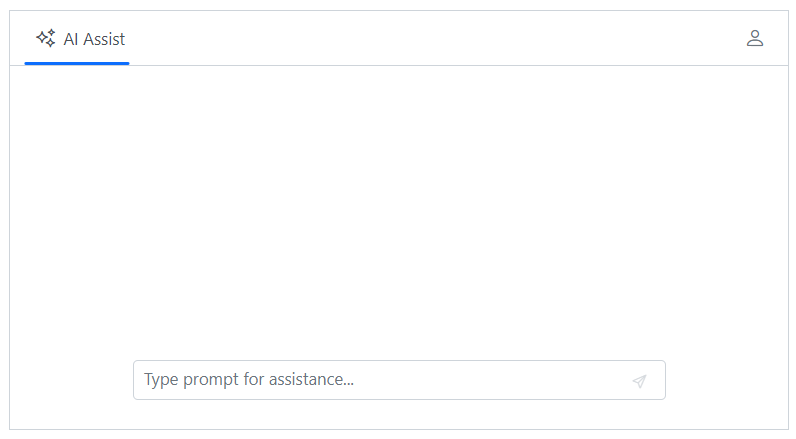

# Toolbar items in Blazor AI AssistView component

You can render the AI AssistView toolbar items by using the [AssistViewToolbarItem](https://help.syncfusion.com/cr/blazor/Syncfusion.Blazor.InteractiveChat.AssistViewToolbarItem.html), [PromptToolbarItem](https://help.syncfusion.com/cr/blazor/Syncfusion.Blazor.InteractiveChat.PromptToolbarItem.html), [ResponseToolbarItem](https://help.syncfusion.com/cr/blazor/Syncfusion.Blazor.InteractiveChat.ResponseToolbarItem.html) & [AssistViewFooterToolbar](https://help.syncfusion.com/cr/blazor/Syncfusion.Blazor.InteractiveChat.AssistViewFooterToolbar.html) tag directives.

## Configure footer toolbar

By default, the footer toolbar renders the `send`, if attachment is enabled the `attachment` item will also be rendered which allows users to send the prompt text or attach files as needed.

In the following example, AI AssistView component rendered with footer toolbar items such as `send` and `attachment` icons.

```cshtml
@using Syncfusion.Blazor.InteractiveChat

<div class="aiassist-container" style="height: 350px; width: 650px;">
    <SfAIAssistView AttachmentSettings="attachmentSettings" PromptRequested="PromptRequest"></SfAIAssistView>
</div>

@code {
    private AssistViewAttachmentSettings attachmentSettings = new AssistViewAttachmentSettings()
    {
        Enable = true,
        SaveUrl = "https://blazor.syncfusion.com/services/production/api/FileUploader/Save",
        RemoveUrl = "https://blazor.syncfusion.com/services/production/api/FileUploader/Remove"
    };
    private async Task PromptRequest(AssistViewPromptRequestedEventArgs args)
    {
        await Task.Delay(1000);
        var defaultResponse = "For real-time prompt processing, connect the AI AssistView component to your preferred AI service, such as OpenAI or Azure Cognitive Services. Ensure you obtain the necessary API credentials to authenticate and enable seamless integration.";
        args.Response = defaultResponse;
    }
}
```


### Toolbar positioning

You can use the `ToolbarPosition` property to customize footer toolbar position. It has two modes such as `Inline`, and `Bottom`. By default, the ToolbarPosition is `Inline`.

By setting ToolbarPosition as `Bottom`, footer items will be rendered at the bottom with a dedicated footer area .

```cshtml

@using Syncfusion.Blazor.InteractiveChat

<div class="aiassist-container" style="height: 350px; width: 650px;">
    <button id="toolbarBtn" class="e-btn" @onclick="UpdateToolbarPosition">UpdateToolbarPosition</button>
    <SfAIAssistView PromptRequested="PromptRequest" Prompts="@prompts">
        <AssistViewFooterToolbar ToolbarPosition="@toolbarPosition">
            <AssistViewFooterToolbarItem></AssistViewFooterToolbarItem>
        </AssistViewFooterToolbar>
    </SfAIAssistView>
</div>

@code {
    private ToolbarPosition toolbarPosition = ToolbarPosition.Bottom;
    private List<AssistViewPrompt> prompts = new List<AssistViewPrompt>()
    {
        new AssistViewPrompt() { Prompt = "What is AI?", Response = "<div>AI stands for Artificial Intelligence, enabling machines to mimic human intelligence for tasks such as learning, problem-solving, and decision-making.</div>" }
    };
    private async Task PromptRequest(AssistViewPromptRequestedEventArgs args)
    {
        await Task.Delay(1000);
        var defaultResponse = "For real-time prompt processing, connect the AI AssistView component to your preferred AI service, such as OpenAI or Azure Cognitive Services. Ensure you obtain the necessary API credentials to authenticate and enable seamless integration.";
        args.Response = defaultResponse;
    }
    private void UpdateToolbarPosition()
    {
        toolbarPosition = toolbarPosition == ToolbarPosition.Bottom ? ToolbarPosition.Inline : ToolbarPosition.Bottom;
    }
}

<style>
    #toolbarBtn {
        margin-bottom: 10px;
    }
</style>

```


### Adding custom items

You can use the [AssistViewFooterToolbarItem](https://help.syncfusion.com/cr/blazor/Syncfusion.Blazor.InteractiveChat.AssistViewFooterToolbarItem.html) tag directive within the [AssistViewFooterToolbar](https://help.syncfusion.com/cr/blazor/Syncfusion.Blazor.InteractiveChat.AssistViewFooterToolbar.html) to add custom items for the footer toolbar in the AI AssistView.

> To know more about the items, please refer to the [Items](./toolbar-items#items) section.

```cshtml

@using Syncfusion.Blazor.InteractiveChat
@using Syncfusion.Blazor.Navigations

<div class="aiassist-container" style="height: 350px; width: 650px;">
    <SfAIAssistView PromptRequested="PromptRequest" Prompts="@prompts">
        <AssistViewFooterToolbar ToolbarPosition="ToolbarPosition.Bottom">
            <AssistViewFooterToolbarItem IconCss="e-icons e-assistview-icon" Align="ItemAlign.Left"></AssistViewFooterToolbarItem>
        </AssistViewFooterToolbar>
    </SfAIAssistView>
</div>

@code {
    private List<AssistViewPrompt> prompts = new List<AssistViewPrompt>()
    {
        new AssistViewPrompt() { Prompt = "What is AI?", Response = "<div>AI stands for Artificial Intelligence, enabling machines to mimic human intelligence for tasks such as learning, problem-solving, and decision-making.</div>" }
    };
    private async Task PromptRequest(AssistViewPromptRequestedEventArgs args)
    {
        await Task.Delay(1000);
        var defaultResponse = "For real-time prompt processing, connect the AI AssistView component to your preferred AI service, such as OpenAI or Azure Cognitive Services. Ensure you obtain the necessary API credentials to authenticate and enable seamless integration.";
        args.Response = defaultResponse;
    }
}

```


### Item click
The [ItemClick](https://help.syncfusion.com/cr/blazor/Syncfusion.Blazor.InteractiveChat.PromptToolbar.html#Syncfusion_Blazor_InteractiveChat_PromptToolbar_ItemClick) event is triggered when the footer toolbar item is clicked.

```cshtml

@using Syncfusion.Blazor.InteractiveChat

<div class="aiassist-container" style="height: 350px; width: 650px;">
    <SfAIAssistView PromptRequested="PromptRequest" Prompts="@prompts">
        <AssistViewFooterToolbar ItemClick="FooterToolbarItemClicked">
        </AssistViewFooterToolbar>
    </SfAIAssistView>
</div>

@code {
    private void FooterToolbarItemClicked(AssistViewToolbarItemClickedEventArgs args)
    {
        // Your required action here
    }
    private List<AssistViewPrompt> prompts = new List<AssistViewPrompt>()
    {
        new AssistViewPrompt() { Prompt = "What is AI?", Response = "<div>AI stands for Artificial Intelligence, enabling machines to mimic human intelligence for tasks such as learning, problem-solving, and decision-making.</div>" }
    };
    private async Task PromptRequest(AssistViewPromptRequestedEventArgs args)
    {
        await Task.Delay(1000);
        var defaultResponse = "For real-time prompt processing, connect the AI AssistView component to your preferred AI service, such as OpenAI or Azure Cognitive Services. Ensure you obtain the necessary API credentials to authenticate and enable seamless integration.";
        args.Response = defaultResponse;
    }
}

```

## Adding header toolbar items

The AI AssistView component allows you to add header toolbar items using the [AssistViewToolbarItem](https://help.syncfusion.com/cr/blazor/Syncfusion.Blazor.InteractiveChat.AssistViewToolbarItem.html) tag directive within the [AssistViewToolbar](https://help.syncfusion.com/cr/blazor/Syncfusion.Blazor.InteractiveChat.AssistViewToolbar.html).

### Items

Items can be constructed with the following built-in command types or item template.

#### Adding iconCss

You can customize the toolbar icons by using the [IconCss](https://help.syncfusion.com/cr/blazor/Syncfusion.Blazor.InteractiveChat.AssistViewToolbarItem.html#Syncfusion_Blazor_InteractiveChat_AssistViewToolbarItem_IconCss) property.

```cshtml

@using Syncfusion.Blazor.InteractiveChat
@using Syncfusion.Blazor.Navigations

<div class="aiassist-container" style="height: 350px; width: 650px;">
    <SfAIAssistView PromptRequested="@PromptRequest">
        <AssistViewToolbar>
            <AssistViewToolbarItem Type="ItemType.Spacer"></AssistViewToolbarItem>
            <AssistViewToolbarItem IconCss="e-icons e-refresh"></AssistViewToolbarItem>
        </AssistViewToolbar>
    </SfAIAssistView>
</div>

@code {
    private async Task PromptRequest(AssistViewPromptRequestedEventArgs args)
    {
        await Task.Delay(1000);
        var defaultResponse = "For real-time prompt processing, connect the AI AssistView component to your preferred AI service, such as OpenAI or Azure Cognitive Services. Ensure you obtain the necessary API credentials to authenticate and enable seamless integration.";
        args.Response = defaultResponse;
    }
}

```


#### Setting item type

You can change the toolbar item type by using the [Type](https://help.syncfusion.com/cr/blazor/Syncfusion.Blazor.InteractiveChat.AssistViewToolbarItem.html#Syncfusion_Blazor_InteractiveChat_AssistViewToolbarItem_Type) property. The `Type` supports three types of items such as `Button`, `Separator`, `Spacer` and `Input`. By default, the type is `Button`.

In the following example, toolbar item type is set as `Button`.

```cshtml

@using Syncfusion.Blazor.InteractiveChat
@using Syncfusion.Blazor.Navigations


<div class="aiassist-container" style="height: 350px; width: 650px;">
    <SfAIAssistView PromptRequested="@PromptRequest">
        <AssistViewToolbar>
            <AssistViewToolbarItem Type="ItemType.Spacer"></AssistViewToolbarItem>
            <AssistViewToolbarItem Type="ItemType.Button" IconCss="e-icons e-refresh"></AssistViewToolbarItem>
        </AssistViewToolbar>
    </SfAIAssistView>
</div>

@code {
    private async Task PromptRequest(AssistViewPromptRequestedEventArgs args)
    {
        await Task.Delay(1000);
        var defaultResponse = "For real-time prompt processing, connect the AI AssistView component to your preferred AI service, such as OpenAI or Azure Cognitive Services. Ensure you obtain the necessary API credentials to authenticate and enable seamless integration.";
        args.Response = defaultResponse;
    }
}

```


#### Setting text

You can use the [Text](https://help.syncfusion.com/cr/blazor/Syncfusion.Blazor.InteractiveChat.AssistViewToolbarItem.html#Syncfusion_Blazor_InteractiveChat_AssistViewToolbarItem_Text) property to set the text for the toolbar item.

```cshtml

@using Syncfusion.Blazor.InteractiveChat
@using Syncfusion.Blazor.Navigations

<div class="aiassist-container" style="height: 350px; width: 650px;">
    <SfAIAssistView PromptRequested="@PromptRequest">
        <AssistViewToolbar>
            <AssistViewToolbarItem Type="ItemType.Spacer"></AssistViewToolbarItem>
            <AssistViewToolbarItem Text="Welcome User !"></AssistViewToolbarItem>
        </AssistViewToolbar>
    </SfAIAssistView>
</div>

@code {
    private async Task PromptRequest(AssistViewPromptRequestedEventArgs args)
    {
        await Task.Delay(1000);
        var defaultResponse = "For real-time prompt processing, connect the AI AssistView component to your preferred AI service, such as OpenAI or Azure Cognitive Services. Ensure you obtain the necessary API credentials to authenticate and enable seamless integration.";
        args.Response = defaultResponse;
    }
}

```


#### Show or hide toolbar item

You can use the [Visible](https://help.syncfusion.com/cr/blazor/Syncfusion.Blazor.InteractiveChat.AssistViewToolbarItem.html#Syncfusion_Blazor_InteractiveChat_AssistViewToolbarItem_Visible) property to specify whether to show or hide the toolbar item. By default, its value is `true`.

```cshtml

@using Syncfusion.Blazor.InteractiveChat
@using Syncfusion.Blazor.Navigations

<div class="aiassist-container" style="height: 350px; width: 650px;">
    <SfAIAssistView PromptRequested="@PromptRequest">
        <AssistViewToolbar>
            <AssistViewToolbarItem Type="ItemType.Spacer"></AssistViewToolbarItem>
            <AssistViewToolbarItem Type="ItemType.Button" IconCss="e-icons e-refresh" Visible=false></AssistViewToolbarItem>
            <AssistViewToolbarItem Type="ItemType.Button" IconCss="e-icons e-user"></AssistViewToolbarItem>
        </AssistViewToolbar>
    </SfAIAssistView>
</div>

@code {
    private async Task PromptRequest(AssistViewPromptRequestedEventArgs args)
    {
        await Task.Delay(1000);
        var defaultResponse = "For real-time prompt processing, connect the AI AssistView component to your preferred AI service, such as OpenAI or Azure Cognitive Services. Ensure you obtain the necessary API credentials to authenticate and enable seamless integration.";
        args.Response = defaultResponse;
    }
}

```



#### Setting disabled

You can use the [Disabled](https://help.syncfusion.com/cr/blazor/Syncfusion.Blazor.InteractiveChat.AssistViewToolbarItem.html#Syncfusion_Blazor_InteractiveChat_AssistViewToolbarItem_Disabled) property to disable the toolbar item. By default, its value is `false`.


```cshtml

@using Syncfusion.Blazor.InteractiveChat
@using Syncfusion.Blazor.Navigations

<div class="aiassist-container" style="height: 350px; width: 650px;">
    <SfAIAssistView PromptRequested="@PromptRequest">
        <AssistViewToolbar>
            <AssistViewToolbarItem Type="ItemType.Spacer"></AssistViewToolbarItem>
            <AssistViewToolbarItem Type="ItemType.Button" IconCss="e-icons e-refresh" Disabled=true></AssistViewToolbarItem>
            <AssistViewToolbarItem Type="ItemType.Button" IconCss="e-icons e-user"></AssistViewToolbarItem>
        </AssistViewToolbar>
    </SfAIAssistView>
</div>

@code {
    private async Task PromptRequest(AssistViewPromptRequestedEventArgs args)
    {
        await Task.Delay(1000);
        var defaultResponse = "For real-time prompt processing, connect the AI AssistView component to your preferred AI service, such as OpenAI or Azure Cognitive Services. Ensure you obtain the necessary API credentials to authenticate and enable seamless integration.";
        args.Response = defaultResponse;
    }
}

```


#### Setting tooltip text

You can use the [Tooltip](https://help.syncfusion.com/cr/blazor/Syncfusion.Blazor.InteractiveChat.AssistViewToolbarItem.html#Syncfusion_Blazor_InteractiveChat_AssistViewToolbarItem_Tooltip) property to specify the tooltip text to be displayed on hovering the toolbar item.

```cshtml

@using Syncfusion.Blazor.InteractiveChat
@using Syncfusion.Blazor.Navigations

<div class="aiassist-container" style="height: 350px; width: 650px;">
    <SfAIAssistView PromptRequested="@PromptRequest">
        <AssistViewToolbar>
            <AssistViewToolbarItem Type="ItemType.Spacer"></AssistViewToolbarItem>
            <AssistViewToolbarItem Type="ItemType.Button" IconCss="e-icons e-refresh" Tooltip="Refresh"></AssistViewToolbarItem>
        </AssistViewToolbar>
    </SfAIAssistView>
</div>

@code {
    private async Task PromptRequest(AssistViewPromptRequestedEventArgs args)
    {
        await Task.Delay(1000);
        var defaultResponse = "For real-time prompt processing, connect the AI AssistView component to your preferred AI service, such as OpenAI or Azure Cognitive Services. Ensure you obtain the necessary API credentials to authenticate and enable seamless integration.";
        args.Response = defaultResponse;
    }
}

```

#### Setting cssClass

You can use the [CssClass](https://help.syncfusion.com/cr/blazor/Syncfusion.Blazor.InteractiveChat.AssistViewToolbarItem.html#Syncfusion_Blazor_InteractiveChat_AssistViewToolbarItem_CssClass) property to customize the toolbar item.

```cshtml

@using Syncfusion.Blazor.InteractiveChat
@using Syncfusion.Blazor.Navigations

<div class="aiassist-container" style="height: 350px; width: 650px;">
    <SfAIAssistView PromptRequested="@PromptRequest">
        <AssistViewToolbar>
            <AssistViewToolbarItem Type="ItemType.Spacer"></AssistViewToolbarItem>
            <AssistViewToolbarItem Type="ItemType.Button" IconCss="e-icons e-user" CssClass="custom-btn"></AssistViewToolbarItem>
        </AssistViewToolbar>
    </SfAIAssistView>
</div>

@code {
    private async Task PromptRequest(AssistViewPromptRequestedEventArgs args)
    {
        await Task.Delay(1000);
        var defaultResponse = "For real-time prompt processing, connect the AI AssistView component to your preferred AI service, such as OpenAI or Azure Cognitive Services. Ensure you obtain the necessary API credentials to authenticate and enable seamless integration.";
        args.Response = defaultResponse;
    }
}
<style>
    .custom-btn .e-user::before {
        color: blue;
        font-size: 15px;
    }

    .custom-btn.e-toolbar-item button.e-tbar-btn {
        border: 1px solid #dcdcdc;
    }
</style>

```


#### Enabling tab key navigation in toolbar

You can use the [TabIndex](https://help.syncfusion.com/cr/blazor/Syncfusion.Blazor.InteractiveChat.AssistViewToolbarItem.html#Syncfusion_Blazor_InteractiveChat_AssistViewToolbarItem_TabIndex) property of a Toolbar item to enable tab key navigation for the item. By default, the user can switch between items using the arrow keys, but the `TabIndex` property allows you to switch between items using the `Tab` and `Shift+Tab` keys as well.

To use the `TabIndex` property, set it for each Toolbar item which you want to enable tab key navigation. The `TabIndex` property should be set to a positive integer value. A value of `0` or a negative value will disable tab key navigation for the item.

For example, to enable tab key navigation for two Toolbar items you can use the following code:

```cshtml

@using Syncfusion.Blazor.InteractiveChat
@using Syncfusion.Blazor.Navigations

<div class="aiassist-container" style="height: 350px; width: 650px;">
    <SfAIAssistView>
        <AssistViewToolbar>
            <AssistViewToolbarItem Text="Item 1" TabIndex="1"></AssistViewToolbarItem>
            <AssistViewToolbarItem Text="Item 2" TabIndex="2"></AssistViewToolbarItem>
        </AssistViewToolbar>
    </SfAIAssistView>
</div>

```

With the above code, the user can switch between the two Toolbar items using the Tab and Shift+Tab keys, in addition to using the arrow keys. The items will be navigated in the order specified by the `TabIndex` values.

If you set the `TabIndex` value to 0 for all Toolbar items, tab key navigation will be based on the element order rather than the `TabIndex` values. For example:

```cshtml

@using Syncfusion.Blazor.InteractiveChat
@using Syncfusion.Blazor.Navigations

<div class="aiassist-container" style="height: 350px; width: 650px;">
    <SfAIAssistView>
        <AssistViewToolbar>
            <AssistViewToolbarItem Text="Item 1" TabIndex="0"></AssistViewToolbarItem>
            <AssistViewToolbarItem Text="Item 2" TabIndex="0"></AssistViewToolbarItem>
        </AssistViewToolbar>
    </SfAIAssistView>
</div>

```

#### Setting template

You can use the [Template](https://help.syncfusion.com/cr/blazor/Syncfusion.Blazor.InteractiveChat.AssistViewToolbarItem.html#Syncfusion_Blazor_InteractiveChat_AssistViewToolbarItem_Template) tag directive to add custom toolbar item in the AI AssistView component. Template property can be given as the `HTML element` or `RenderFragment`.

```cshtml

@using Syncfusion.Blazor.InteractiveChat
@using Syncfusion.Blazor.Navigations
@using Syncfusion.Blazor.SplitButtons

<div class="aiassist-container" style="height: 350px; width: 650px;">
    <SfAIAssistView PromptRequested="@PromptRequest">
        <AssistViewToolbar>
            <AssistViewToolbarItem Type="ItemType.Spacer"></AssistViewToolbarItem>
            <AssistViewToolbarItem Type="ItemType.Input">
                <Template>
                    <SfDropDownButton Content="English" CssClass="custom-dropdown" IconCss="e-icons e-translate">
                        <DropDownMenuItems>
                            <DropDownMenuItem Text="हिंदी"></DropDownMenuItem>
                            <DropDownMenuItem Text="தமிழ்"></DropDownMenuItem>
                            <DropDownMenuItem Text="తెలుగు"></DropDownMenuItem>
                        </DropDownMenuItems>
                    </SfDropDownButton>
                </Template>
            </AssistViewToolbarItem>
        </AssistViewToolbar>
    </SfAIAssistView>
</div>

@code {
    private async Task PromptRequest(AssistViewPromptRequestedEventArgs args)
    {
        await Task.Delay(1000);
        var defaultResponse = "For real-time prompt processing, connect the AI AssistView component to your preferred AI service, such as OpenAI or Azure Cognitive Services. Ensure you obtain the necessary API credentials to authenticate and enable seamless integration.";
        args.Response = defaultResponse;
    }
}
<style>
    .custom-dropdown.e-dropdown-popup ul {
        min-width: 100px;
    }
</style>

```


### Item clicked

You can define [ItemClicked](https://help.syncfusion.com/cr/blazor/Syncfusion.Blazor.InteractiveChat.AssistViewToolbar.html#Syncfusion_Blazor_InteractiveChat_AssistViewToolbar_ItemClicked) event in the [AssistViewToolbar](https://help.syncfusion.com/cr/blazor/Syncfusion.Blazor.InteractiveChat.AssistViewToolbar.html) tag directive which will be triggered when the header toolbar item is clicked.

```cshtml

@using Syncfusion.Blazor.InteractiveChat
@using Syncfusion.Blazor.Navigations

<div class="aiassist-container" style="height: 350px; width: 650px;">
    <SfAIAssistView PromptRequested="@PromptRequest">
        <AssistViewToolbar ItemClicked="ToolbarItemClicked">
            <AssistViewToolbarItem Type="ItemType.Button" IconCss="e-icons e-refresh"></AssistViewToolbarItem>
        </AssistViewToolbar>
    </SfAIAssistView>
</div>

@code {
    private async Task PromptRequest(AssistViewPromptRequestedEventArgs args)
    {
        await Task.Delay(1000);
        var defaultResponse = "For real-time prompt processing, connect the AI AssistView component to your preferred AI service, such as OpenAI or Azure Cognitive Services. Ensure you obtain the necessary API credentials to authenticate and enable seamless integration.";
        args.Response = defaultResponse;
    }
    private void ToolbarItemClicked(AssistViewToolbarItemClickedEventArgs args)
    {
        // Your required action here
    }
}

```

## Built-in toolbar items

### Prompt

By default, the prompt toolbar renders the built-in items such as `edit` and `copy` items. These allow users to edit the prompt text or copy as needed.

In the following example, AI AssistView component rendered with built-in toolbar items such as `edit` and `copy` items.

```cshtml

@using Syncfusion.Blazor.InteractiveChat

<div class="aiassist-container" style="height: 350px; width: 650px;">
    <SfAIAssistView Prompts="@prompts" PromptRequested="@PromptRequest"></SfAIAssistView>
</div>

@code {
    private List<AssistViewPrompt> prompts = new List<AssistViewPrompt>()
    {
        new AssistViewPrompt() { Prompt = "What is AI?", Response = "<div>AI stands for Artificial Intelligence, enabling machines to mimic human intelligence for tasks such as learning, problem-solving, and decision-making.</div>" }
    };
    private async Task PromptRequest(AssistViewPromptRequestedEventArgs args)
    {
        await Task.Delay(1000);
        var promptData = prompts.FirstOrDefault(prompt => prompt.Prompt == args.Prompt);
        var defaultResponse = "For real-time prompt processing, connect the AI AssistView component to your preferred AI service, such as OpenAI or Azure Cognitive Services. Ensure you obtain the necessary API credentials to authenticate and enable seamless integration.";
        args.Response = string.IsNullOrEmpty(promptData.Response) ? defaultResponse : promptData.Response;
    }
}

```


#### Setting width

You can use the [Width](https://help.syncfusion.com/cr/blazor/Syncfusion.Blazor.InteractiveChat.PromptToolbar.html#Syncfusion_Blazor_InteractiveChat_PromptToolbar_Width) property using [PromptToolbar](https://help.syncfusion.com/cr/blazor/Syncfusion.Blazor.InteractiveChat.PromptToolbar.html) tag directive to set the width of the prompt toolbar in the AI AssistView.

```cshtml

@using Syncfusion.Blazor.InteractiveChat

<div class="aiassist-container" style="height: 350px; width: 650px;">
    <SfAIAssistView PromptRequested="@PromptRequest" Prompts="@prompts">
        <PromptToolbar Width="100px"></PromptToolbar>
    </SfAIAssistView>
</div>

@code {
    private List<AssistViewPrompt> prompts = new List<AssistViewPrompt>()
    {
        new AssistViewPrompt() { Prompt = "What is AI?", Response = "<div>AI stands for Artificial Intelligence, enabling machines to mimic human intelligence for tasks such as learning, problem-solving, and decision-making.</div>" }
    };
    private async Task PromptRequest(AssistViewPromptRequestedEventArgs args)
    {
        await Task.Delay(1000);
        var promptData = prompts.FirstOrDefault(prompt => prompt.Prompt == args.Prompt);
        var defaultResponse = "For real-time prompt processing, connect the AI AssistView component to your preferred AI service, such as OpenAI or Azure Cognitive Services. Ensure you obtain the necessary API credentials to authenticate and enable seamless integration.";
        args.Response = string.IsNullOrEmpty(promptData.Response) ? defaultResponse : promptData.Response;
    }
}

```

#### Item clicked

You can define [ItemClicked](https://help.syncfusion.com/cr/blazor/Syncfusion.Blazor.InteractiveChat.PromptToolbar.html#Syncfusion_Blazor_InteractiveChat_PromptToolbar_ItemClicked) event in the [PromptToolbar](https://help.syncfusion.com/cr/blazor/Syncfusion.Blazor.InteractiveChat.PromptToolbar.html) tag directive which will be triggered when the prompt toolbar item is clicked.

```cshtml

@using Syncfusion.Blazor.InteractiveChat

<div class="aiassist-container" style="height: 350px; width: 650px;">
    <SfAIAssistView PromptRequested="@PromptRequest" Prompts="@prompts">
        <PromptToolbar ItemClicked="ToolbarItemClicked"></PromptToolbar>
    </SfAIAssistView>
</div>

@code {
    private List<AssistViewPrompt> prompts = new List<AssistViewPrompt>()
    {
        new AssistViewPrompt() { Prompt = "What is AI?", Response = "<div>AI stands for Artificial Intelligence, enabling machines to mimic human intelligence for tasks such as learning, problem-solving, and decision-making.</div>" }
    };
    private async Task PromptRequest(AssistViewPromptRequestedEventArgs args)
    {
        await Task.Delay(1000);
        var promptData = prompts.FirstOrDefault(prompt => prompt.Prompt == args.Prompt);
        var defaultResponse = "For real-time prompt processing, connect the AI AssistView component to your preferred AI service, such as OpenAI or Azure Cognitive Services. Ensure you obtain the necessary API credentials to authenticate and enable seamless integration.";
        args.Response = string.IsNullOrEmpty(promptData.Response) ? defaultResponse : promptData.Response;
    }
    private void ToolbarItemClicked(AssistViewToolbarItemClickedEventArgs args)
    {
        // Your required action here
    }
}

```

### Response

By default, the response toolbar renders the built-in items like `copy`, `like`, and `dislike` items to perform response copy and perform rating actions.

In the following example, AI AssistView renders with built-in toolbar items.

```cshtml

@using Syncfusion.Blazor.InteractiveChat

<div class="aiassist-container" style="height: 350px; width: 650px;">
    <SfAIAssistView Prompts="@prompts" PromptRequested="@PromptRequest"></SfAIAssistView>
</div>

@code {
    private List<AssistViewPrompt> prompts = new List<AssistViewPrompt>()
    {
        new AssistViewPrompt() { Prompt = "What is AI?", Response = "<div>AI stands for Artificial Intelligence, enabling machines to mimic human intelligence for tasks such as learning, problem-solving, and decision-making.</div>" }
    };
    private async Task PromptRequest(AssistViewPromptRequestedEventArgs args)
    {
        await Task.Delay(1000);
        var promptData = prompts.FirstOrDefault(prompt => prompt.Prompt == args.Prompt);
        var defaultResponse = "For real-time prompt processing, connect the AI AssistView component to your preferred AI service, such as OpenAI or Azure Cognitive Services. Ensure you obtain the necessary API credentials to authenticate and enable seamless integration.";
        args.Response = string.IsNullOrEmpty(promptData.Response) ? defaultResponse : promptData.Response;
    }
}

```


#### Setting width

You can use the [Width](https://help.syncfusion.com/cr/blazor/Syncfusion.Blazor.InteractiveChat.ResponseToolbar.html#Syncfusion_Blazor_InteractiveChat_ResponseToolbar_Width) property using [ResponseToolbar](https://help.syncfusion.com/cr/blazor/Syncfusion.Blazor.InteractiveChat.ResponseToolbar.html) tag directive to set the width of the response toolbar in the AI AssistView.

```cshtml

@using Syncfusion.Blazor.InteractiveChat

<div class="aiassist-container" style="height: 350px; width: 650px;">
    <SfAIAssistView PromptRequested="@PromptRequest" Prompts="@prompts">
        <ResponseToolbar Width="200px"></ResponseToolbar>
    </SfAIAssistView>
</div>

@code {
    private List<AssistViewPrompt> prompts = new List<AssistViewPrompt>()
    {
        new AssistViewPrompt() { Prompt = "What is AI?", Response = "<div>AI stands for Artificial Intelligence, enabling machines to mimic human intelligence for tasks such as learning, problem-solving, and decision-making.</div>" }
    };
    private async Task PromptRequest(AssistViewPromptRequestedEventArgs args)
    {
        await Task.Delay(1000);
        var promptData = prompts.FirstOrDefault(prompt => prompt.Prompt == args.Prompt);
        var defaultResponse = "For real-time prompt processing, connect the AI AssistView component to your preferred AI service, such as OpenAI or Azure Cognitive Services. Ensure you obtain the necessary API credentials to authenticate and enable seamless integration.";
        args.Response = string.IsNullOrEmpty(promptData.Response) ? defaultResponse : promptData.Response;
    }
}

```

#### Item clicked

You can define [ItemClicked](https://help.syncfusion.com/cr/blazor/Syncfusion.Blazor.InteractiveChat.ResponseToolbar.html#Syncfusion_Blazor_InteractiveChat_ResponseToolbar_ItemClicked) event in the [ResponseToolbar](https://help.syncfusion.com/cr/blazor/Syncfusion.Blazor.InteractiveChat.ResponseToolbar.html) tag directive which will be triggered when the response toolbar item is clicked.

```cshtml

@using Syncfusion.Blazor.InteractiveChat

<div class="aiassist-container" style="height: 350px; width: 650px;">
    <SfAIAssistView PromptRequested="@PromptRequest" Prompts="@prompts">
        <ResponseToolbar ItemClicked="ToolbarItemClicked"></ResponseToolbar>
    </SfAIAssistView>
</div>

@code {
    private List<AssistViewPrompt> prompts = new List<AssistViewPrompt>()
    {
        new AssistViewPrompt() { Prompt = "What is AI?", Response = "<div>AI stands for Artificial Intelligence, enabling machines to mimic human intelligence for tasks such as learning, problem-solving, and decision-making.</div>" }
    };
    private async Task PromptRequest(AssistViewPromptRequestedEventArgs args)
    {
        await Task.Delay(1000);
        var promptData = prompts.FirstOrDefault(prompt => prompt.Prompt == args.Prompt);
        var defaultResponse = "For real-time prompt processing, connect the AI AssistView component to your preferred AI service, such as OpenAI or Azure Cognitive Services. Ensure you obtain the necessary API credentials to authenticate and enable seamless integration.";
        args.Response = string.IsNullOrEmpty(promptData.Response) ? defaultResponse : promptData.Response;
    }
    private void ToolbarItemClicked(AssistViewToolbarItemClickedEventArgs args)
    {
        // Your required action here
    }
}

```

## Adding custom toolbar items

You can also add custom toolbar items in the AI AssistView by using the [AssistViewToolbarItem](https://help.syncfusion.com/cr/blazor/Syncfusion.Blazor.InteractiveChat.AssistViewToolbarItem.html), [PromptToolbarItem](https://help.syncfusion.com/cr/blazor/Syncfusion.Blazor.InteractiveChat.PromptToolbarItem.html) & [ResponseToolbarItem](https://help.syncfusion.com/cr/blazor/Syncfusion.Blazor.InteractiveChat.ResponseToolbarItem.html) tag directives.

### Prompt

You can use the [PromptToolbarItem](https://help.syncfusion.com/cr/blazor/Syncfusion.Blazor.InteractiveChat.PromptToolbarItem.html) tag directive within the [PromptToolbar](https://help.syncfusion.com/cr/blazor/Syncfusion.Blazor.InteractiveChat.PromptToolbar.html) to add custom items for the prompt toolbar in the AI AssistView.

> To know more about the items, please refer to the [Items](./toolbar-items#items) section.

```cshtml

@using Syncfusion.Blazor.InteractiveChat

<div class="aiassist-container" style="height: 350px; width: 650px;">
    <SfAIAssistView PromptRequested="@PromptRequest" Prompts="@prompts">
        <PromptToolbar>
            <PromptToolbarItem IconCss="e-icons e-edit"></PromptToolbarItem>
        </PromptToolbar>
    </SfAIAssistView>
</div>

@code {
    private List<AssistViewPrompt> prompts = new List<AssistViewPrompt>()
    {
        new AssistViewPrompt() { Prompt = "What is AI?", Response = "<div>AI stands for Artificial Intelligence, enabling machines to mimic human intelligence for tasks such as learning, problem-solving, and decision-making.</div>" }
    };
    private async Task PromptRequest(AssistViewPromptRequestedEventArgs args)
    {
        await Task.Delay(1000);
        var promptData = prompts.FirstOrDefault(prompt => prompt.Prompt == args.Prompt);
        var defaultResponse = "For real-time prompt processing, connect the AI AssistView component to your preferred AI service, such as OpenAI or Azure Cognitive Services. Ensure you obtain the necessary API credentials to authenticate and enable seamless integration.";
        args.Response = string.IsNullOrEmpty(promptData.Response) ? defaultResponse : promptData.Response;
    }
}

```


### Response

You can use the [ResponseToolbarItem](https://help.syncfusion.com/cr/blazor/Syncfusion.Blazor.InteractiveChat.ResponseToolbarItem.html) tag directive within the [ResponseToolbar](https://help.syncfusion.com/cr/blazor/Syncfusion.Blazor.InteractiveChat.ResponseToolbar.html) to add custom response toolbar in the AI AssistView.

> To know more about the items, please refer to the [Items](./toolbar-items#items) section.

```cshtml

@using Syncfusion.Blazor.InteractiveChat

<div class="aiassist-container" style="height: 350px; width: 650px;">
    <SfAIAssistView PromptRequested="@PromptRequest" Prompts="@prompts">
        <ResponseToolbar>
            <ResponseToolbarItem IconCss="e-icons e-download"></ResponseToolbarItem>
            <ResponseToolbarItem IconCss="e-icons e-refresh"></ResponseToolbarItem>
            <ResponseToolbarItem IconCss="e-icons e-assist-like"></ResponseToolbarItem>
            <ResponseToolbarItem IconCss="e-icons e-assist-dislike"></ResponseToolbarItem>
        </ResponseToolbar>
    </SfAIAssistView>
</div>

@code {
    private List<AssistViewPrompt> prompts = new List<AssistViewPrompt>()
    {
        new AssistViewPrompt() { Prompt = "What is AI?", Response = "<div>AI stands for Artificial Intelligence, enabling machines to mimic human intelligence for tasks such as learning, problem-solving, and decision-making.</div>" }
    };
    private async Task PromptRequest(AssistViewPromptRequestedEventArgs args)
    {
        await Task.Delay(1000);
        var promptData = prompts.FirstOrDefault(prompt => prompt.Prompt == args.Prompt);
        var defaultResponse = "For real-time prompt processing, connect the AI AssistView component to your preferred AI service, such as OpenAI or Azure Cognitive Services. Ensure you obtain the necessary API credentials to authenticate and enable seamless integration.";
        args.Response = string.IsNullOrEmpty(promptData.Response) ? defaultResponse : promptData.Response;
    }
}

```


#### Item clicked

The [itemClicked](https://help.syncfusion.com/cr/blazor/Syncfusion.Blazor.InteractiveChat.PromptToolbar.html#Syncfusion_Blazor_InteractiveChat_PromptToolbar_ItemClicked) event is triggered when a custom toolbar item is clicked. This event applies to both prompt and response toolbar items.
