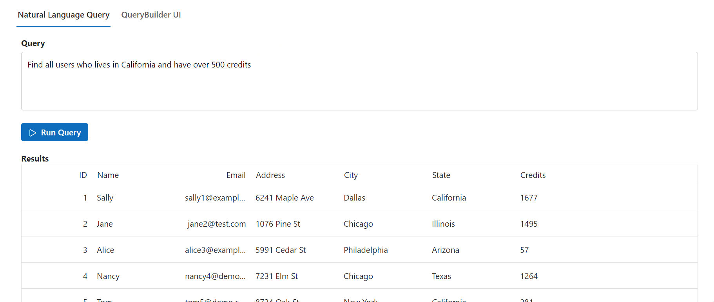

# Using Azure OpenAI with Syncfusion Blazor AI package

This section helps to configuring and using the **Syncfusion.Blazor.AI** package with **Azure OpenAI** to enable AI functionalities in your Blazor applications. The package provides seamless integration with Azure OpenAI's API, allowing you to enhance any Syncfusion Blazor component with intelligent features.

## Prerequisites
- Install the following NuGet packages:
  - `Syncfusion.Blazor.AI`
  - `Azure.AI.OpenAI`
- For **Azure OpenAI**, first [deploy an Azure OpenAI Service resource and model](https://learn.microsoft.com/en-us/azure/ai-services/openai/how-to/create-resource), then values for `apiKey`, `deploymentName` and `endpoint` will all be provided to you.
- Ensure your Blazor application meets the [System Requirements](https://blazor.syncfusion.com/documentation/system-requirements).

## Configuration
To use Azure OpenAI, configure the AI service in your `Program.cs` file by registering the `AIServiceCredentials` and `IChatInferenceService`.

### Steps
1. Open your Blazor application's `Program.cs`.
2. Add the following code to configure Azure OpenAI credentials:

```csharp
builder.Services.AddSingleton(new AIServiceCredentials
{
    ApiKey = "your-azure-openai-key", // Replace with your Azure OpenAI API key
    DeploymentName = "your-deployment-name", // Specify the Azure OpenAI deployment name
    Endpoint = new Uri("https://your-openai.azure.com/") // Replace with your Azure OpenAI endpoint
});

// Register the inference backend
builder.Services.AddSingleton<IChatInferenceService, SyncfusionAIService>();
```

3. Ensure the required Syncfusion Blazor namespaces are included in your `Program.cs`:
```csharp
using Syncfusion.Blazor.AI;
```

## Example: Syncfusion Query Builder with Azure OpenAI in a Blazor Application

This example demonstrates using the **Syncfusion.Blazor.AI** package with **Azure OpenAI** to enable natural language querying in a Blazor application. The application features a Syncfusion Tab component with a textarea for entering natural language queries, a QueryBuilder component to visualize the generated query rules, and a Grid component to display filtered results based on the query processed by Azure OpenAI.

### Prerequisites
- Install the following NuGet packages:
  - `Syncfusion.Blazor.Grid`
  - `Syncfusion.Blazor.Themes`
  - `Syncfusion.Blazor.AI`
  - `Syncfusion.Blazor.QueryBuilder`
  - `Azure.AI.OpenAI`
- Ensure your Blazor application meets the [System Requirements](https://blazor.syncfusion.com/documentation/system-requirements).
- Add the following to `App.razor` for Syncfusion themes and scripts:
  
```html
<head>
    ....
    <link href="_content/Syncfusion.Blazor.Themes/tailwind.css" rel="stylesheet" />
</head>

<body>
    ....
    <script src="_content/Syncfusion.Blazor.Core/scripts/syncfusion-blazor.min.js" type="text/javascript"></script>
</body>
```

Now, register the Syncfusion<sup style="font-size:70%">&reg;</sup> Blazor Service in the **~/Program.cs** file of your Blazor WebAssembly App.




using Microsoft.AspNetCore.Components.Web;
using Microsoft.AspNetCore.Components.WebAssembly.Hosting;
using Syncfusion.Blazor;

var builder = WebAssemblyHostBuilder.CreateDefault(args);
builder.RootComponents.Add<App>("#app");
builder.RootComponents.Add<HeadOutlet>("head::after");

builder.Services.AddScoped(sp => new HttpClient { BaseAddress = new Uri(builder.HostEnvironment.BaseAddress) });

builder.Services.AddSyncfusionBlazor();
await builder.Build().RunAsync();
....




### Razor Component (`Home.razor`)
```csharp
@page "/"

@using Syncfusion.Blazor.QueryBuilder
@using Syncfusion.Blazor.Navigations
@using Syncfusion.Blazor.Grids
@using Syncfusion.Blazor.Buttons
@using Syncfusion.Blazor.Spinner
@using Syncfusion.Blazor.AI
@inject IChatInferenceService AzureAIService

<title>Syncfusion - Smart Natural Language Querying</title>
<SfTab LoadOn="ContentLoad.Init">
    <TabItems>
        <TabItem>
            <ChildContent>
                <TabHeader Text="Natural Language Query"></TabHeader>
            </ChildContent>
            <ContentTemplate>
                <span class="e-text">Query</span>
                <textarea id="text-area" @bind="TextAreaValue" placeholder="Find all users who lives in California and have over 500 credits"></textarea>
            </ContentTemplate>
        </TabItem>
        <TabItem>
            <ChildContent>
                <TabHeader Text="QueryBuilder UI"></TabHeader>
            </ChildContent>
            <ContentTemplate>
                <SfQueryBuilder Readonly="true" TValue="User" @ref="QueryBuilderObj" DataSource="@DataSource">
                    <QueryBuilderColumns>
                        <QueryBuilderColumn Field="id" Label="ID" Type="Syncfusion.Blazor.QueryBuilder.ColumnType.Number"></QueryBuilderColumn>
                        <QueryBuilderColumn Field="name" Label="Name" Type="Syncfusion.Blazor.QueryBuilder.ColumnType.String"></QueryBuilderColumn>
                        <QueryBuilderColumn Field="email" Label="Email" Type="Syncfusion.Blazor.QueryBuilder.ColumnType.String"></QueryBuilderColumn>
                        <QueryBuilderColumn Field="address" Label="Address" Type="Syncfusion.Blazor.QueryBuilder.ColumnType.Boolean"></QueryBuilderColumn>
                        <QueryBuilderColumn Field="city" Label="City" Type="Syncfusion.Blazor.QueryBuilder.ColumnType.String"></QueryBuilderColumn>
                        <QueryBuilderColumn Field="state" Label="State" Type="Syncfusion.Blazor.QueryBuilder.ColumnType.String"></QueryBuilderColumn>
                        <QueryBuilderColumn Field="credits" Label="Credits" Type="Syncfusion.Blazor.QueryBuilder.ColumnType.Number"></QueryBuilderColumn>
                    </QueryBuilderColumns>
                </SfQueryBuilder>
            </ContentTemplate>
        </TabItem>
    </TabItems>
</SfTab>
<div class="e-custom-elem">
    <SfButton Content="Run Query" CssClass="e-primary" IconCss="e-icons e-play" @onclick="GenBtnClick"></SfButton>
</div>
<div class="e-custom-elem">
    <span class="e-text">Results</span>
    <SfGrid TValue="User" DataSource="@GridData" AllowPaging="true">
        <SfSpinner @bind-Visible="@VisibleProperty"></SfSpinner>
        <GridEvents Created="GridCreated" TValue="User"></GridEvents>
        <GridColumns>
            <GridColumn Field=@nameof(User.id) HeaderText="ID" TextAlign="TextAlign.Right"></GridColumn>
            <GridColumn Field=@nameof(User.name) HeaderText="Name"></GridColumn>
            <GridColumn Field=@nameof(User.email) HeaderText="Email" TextAlign="TextAlign.Right"></GridColumn>
            <GridColumn Field=@nameof(User.address) HeaderText="Address"></GridColumn>
            <GridColumn Field=@nameof(User.city) HeaderText="City"></GridColumn>
            <GridColumn Field=@nameof(User.state) HeaderText="State"></GridColumn>
            <GridColumn Field=@nameof(User.credits) HeaderText="Credits"></GridColumn>
        </GridColumns>
    </SfGrid>
</div>

<style>
    #container {
        margin: 10px;
        border: 1px solid lightgray;
        border-radius: 4px;
    }
    #container .e-tab {
        margin-top: 16px;
    }
    .e-tab .e-content {
        padding: 16px;
    }
    #text-area {
        width: 100%;
        height: 100px;
        margin-top: 5px;
        margin-bottom: 0px;
        padding: 10px;
        border: 1px solid #ccc;
        border-radius: 4px;
        resize: none;
    }
    .e-text {
        font-weight: bold;
        font-family: "Roboto", -apple-system, BlinkMacSystemFont, "Segoe UI", "Helvetica Neue", sans-serif;
        font-size: 14px;
    }
    .e-custom-elem {
        margin-bottom: 16px;
        margin-left: 16px;
        width: calc(100% - 32px);
    }
</style>
```

(`Home.razor.cs`)
```csharp
using Microsoft.Extensions.AI;
using Syncfusion.Blazor.AI;
using Syncfusion.Blazor.QueryBuilder;

namespace AzureOpenAIExample.Components.Pages
{
    public partial class Home
    {
        public bool VisibleProperty = false;
        public class User
        {
            public int id { get; set; }
            public string name { get; set; }
            public string email { get; set; }
            public string address { get; set; }
            public string city { get; set; }
            public string state { get; set; }
            public int credits { get; set; }
        }
        private static readonly string[] Names = { "John", "Jane", "Bob", "Alice", "Tom", "Sally", "Jim", "Mary", "Peter", "Nancy" };
        private static readonly string[] Cities = { "Los Angeles", "San Diego", "New York", "Chicago", "Houston", "Phoenix", "Philadelphia", "San Antonio", "Dallas", "San Jose" };
        private static readonly string[] States = { "California", "New York", "Illinois", "Texas", "Arizona", "Pennsylvania" };
        private static readonly string[] Streets = { "Elm St", "Oak St", "Maple Ave", "Pine St", "Cedar St", "Birch St" };
        private static readonly string[] Emails = { "example.com", "test.com", "demo.com" };

        public static List<User> GenerateRandomUsers(int count)
        {
            var random = new Random();
            var users = new List<User>();

            for (int i = 0; i < count; i++)
            {
                var id = i + 1;
                var name = Names[random.Next(Names.Length)];
                var email = $"{name.ToLower()}{id}@{Emails[random.Next(Emails.Length)]}";
                var address = $"{random.Next(10000)} {Streets[random.Next(Streets.Length)]}";
                var city = Cities[random.Next(Cities.Length)];
                var state = States[random.Next(States.Length)];
                var credits = random.Next(2001);

                users.Add(new User
                {
                    id = id,
                    name = name,
                    email = email,
                    address = address,
                    city = city,
                    state = state,
                    credits = credits
                });
            }

            return users;
        }

        List<User> Users = GenerateRandomUsers(7);

        private string TextAreaValue { get; set; } = "Find all users who lives in Los Angeles and have over 500 credits";
        SfQueryBuilder<User> QueryBuilderObj;
        private IEnumerable<User> GridData { get; set; }
        private IEnumerable<User> DataSource { get; set; }
        protected override void OnInitialized()
        {
            DataSource = Users;
        }
        private void GridCreated()
        {
            GridData = DataSource;
        }

        private async void GenBtnClick()
        {
            VisibleProperty = true;
            string prompt = "Create an SQL query to achieve the following task: " + TextAreaValue + " from a single table. Focus on constructing a valid SQL query that directly addresses the specified task, ensuring it adheres to standard SQL syntax for querying a single table. NOTE: Return only the SQL query without any additional explanation or commentary. The response should contain the query itself, formatted correctly and ready for execution.";

            ChatParameters chatParameters = new ChatParameters
            {
                Messages = new List<ChatMessage>
                {
                    new ChatMessage(ChatRole.User, prompt)
                }
            };
            string result = await AzureAIService.GenerateResponseAsync(chatParameters);

            string value = result.Split("WHERE ")[1].Split(";\n")[0];
            value = value.Replace("\n", " ");
            value = value.Replace(";", "");
            QueryBuilderObj.SetRulesFromSql(value);
            GridData = QueryBuilderObj.GetFilteredRecords().ToList().AsEnumerable<User>();
            StateHasChanged();
            VisibleProperty = false;
        }
    }
}
```



### Explanation
- **IChatInferenceService**: Injected to interact with the OpenAI service.
- **ChatParameters**: Configures the AI request, including system and user messages, temperature, and token limits.
- **GenerateResponseAsync**: Sends the request to OpenAI and retrieves the response asynchronously.
- **Response**: Displays the AI-generated text.

