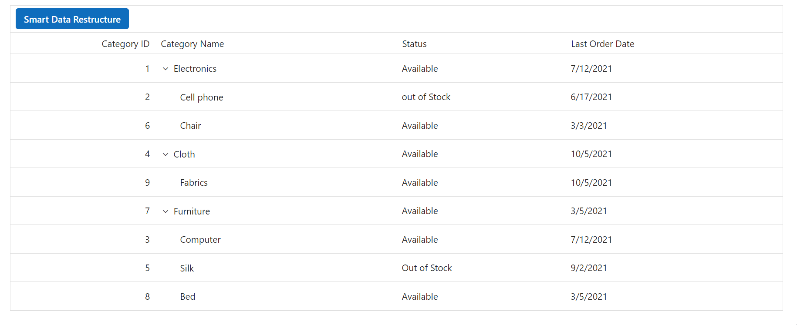

# Ollama Integration with Syncfusion® Blazor AI

## Introduction

This section demonstrates configuring and using the [Syncfusion.Blazor.AI](https://www.nuget.org/packages/Syncfusion.Blazor.AI) package with [Ollama](https://ollama.com/) to enable AI functionalities in Blazor applications. The package provides seamless integration with Ollama's locally hosted AI models, empowering Syncfusion<sup style="font-size:70%">&reg;</sup> Blazor components with intelligent features such as data restructuring, content analysis, and hierarchical organization without requiring external API dependencies.
>>>>>>> c8df4c3ee (Updated Blazor UG documentation):blazor/smart-ai-solutions/ai/ollama.md

## Prerequisites

Before you begin integrating Ollama with your Blazor application, ensure you have:

* Installed the following nuget packages



Install-Package Syncfusion.Blazor.AI -Version {{ site.releaseversion }}
Install-Package Microsoft.Extensions.AI
Install-Package OllamaSharp



* Installed **Ollama** on your local system (no virtual machines) following the instructions at [Ollama's official site](https://ollama.com/)
* Downloaded an Ollama model (e.g., `llama2`) using the command:
  ```bash
  ollama run llama2
  ```
* Met the [System Requirements](https://blazor.syncfusion.com/documentation/system-requirements) for Syncfusion<sup style="font-size:70%">&reg;</sup> Blazor components.

## Configuration Steps

Follow these steps to configure Azure OpenAI as your AI provider:

### Register AI Services in Program.cs

Open your Blazor application's `Program.cs` file and add the following configuration:

```csharp
// Add required namespaces
using Syncfusion.Blazor.AI;
using Microsoft.Extensions.AI;
using OllamaSharp;

string ModelName = "MODEL_NAME";
IChatClient chatClient = new OllamaApiClient("http://localhost:11434", ModelName);
builder.Services.AddChatClient(chatClient);

// Register the inference backend
builder.Services.AddSingleton<IChatInferenceService, SyncfusionAIService>();
```

##  Smart Data Restructuring with Ollama and TreeGrid

This example demonstrates using the **Syncfusion.Blazor.AI** package with **Ollama** to perform intelligent data restructuring in a Syncfusion<sup style="font-size:70%">&reg;</sup> Blazor TreeGrid component. The application organizes hierarchical data by leveraging Ollama to assign appropriate `ParentId` values based on `CategoryName` relationships, automatically updating the TreeGrid to reflect the corrected hierarchical structure.

### Prerequisites
- Install the following NuGet packages:




Install-Package Syncfusion.Blazor.TreeGrid -Version {{ site.releaseversion }}
Install-Package Syncfusion.Blazor.Themes -Version {{ site.releaseversion }}
Install-Package Syncfusion.Blazor.AI -Version {{ site.releaseversion }}
Install-Package Microsoft.Extensions.AI
Install-Package OllamaSharp




- Ensure your Blazor application meets the [System Requirements](https://blazor.syncfusion.com/documentation/system-requirements).
- Add the following to `App.razor` for Syncfusion<sup style="font-size:70%">&reg;</sup> themes and scripts:
  
```html
<head>
    ....
    <link href="_content/Syncfusion.Blazor.Themes/tailwind.css" rel="stylesheet" />
</head>

<body>
    ....
    <script src="_content/Syncfusion.Blazor.Core/scripts/syncfusion-blazor.min.js" type="text/javascript"></script>
</body>
```

### Register Syncfusion<sup style="font-size:70%">&reg;</sup> Blazor Service

Register the Syncfusion<sup style="font-size:70%">&reg;</sup> Blazor Service in the **~/Program.cs** file of your Blazor Web App.

If the **Interactive Render Mode** is set to `WebAssembly` or `Auto`, you need to register the Syncfusion<sup style="font-size:70%">&reg;</sup> Blazor service in both **~/Program.cs** files of your Blazor Web App.




...
...
using Syncfusion.Blazor;

var builder = WebApplication.CreateBuilder(args);

// Add services to the container.
builder.Services.AddRazorComponents()
    .AddInteractiveServerComponents()
    .AddInteractiveWebAssemblyComponents();
builder.Services.AddSyncfusionBlazor();

var app = builder.Build();
....




...
using Syncfusion.Blazor;

var builder = WebAssemblyHostBuilder.CreateDefault(args);
builder.Services.AddSyncfusionBlazor();

await builder.Build().RunAsync();




If the **Interactive Render Mode** is set to `Server`, your project will contain a single **~/Program.cs** file. So, you should register the Syncfusion<sup style="font-size:70%">&reg;</sup> Blazor Service only in that **~/Program.cs** file.




...
using Syncfusion.Blazor;

var builder = WebApplication.CreateBuilder(args);

// Add services to the container.
builder.Services.AddRazorComponents()
    .AddInteractiveServerComponents();
builder.Services.AddSyncfusionBlazor();

var app = builder.Build();
....




### Razor Component (`Home.razor`)
```csharp
@page "/"

@inject IChatInferenceService OllamaAIService
@using Syncfusion.Blazor.TreeGrid
@using Syncfusion.Blazor.Navigations
@using Syncfusion.Blazor.Buttons
@using Syncfusion.Blazor.AI
@using System.Text.Json;

<div style="padding-bottom: 10px;">
    <span>@message</span>
</div>
<div style="width: 100%; position: relative">
    <SfTreeGrid @ref="TreeGrid" DataSource="@TreeGridData" IdMapping="CategoryId" ParentIdMapping="ParentId" TreeColumnIndex="1">
        <TreeGridEditSettings AllowEditing="true" />
        <TreeGridColumns>
            <TreeGridColumn Field="CategoryId" HeaderText="Category ID" IsPrimaryKey="true" Width="60" TextAlign="Syncfusion.Blazor.Grids.TextAlign.Right"></TreeGridColumn>
            <TreeGridColumn Field="CategoryName" HeaderText="Category Name" Width="100"></TreeGridColumn>
            <TreeGridColumn Field="Status" HeaderText="Status" Width="70"></TreeGridColumn>
            <TreeGridColumn Field="OrderDate" HeaderText="Last Order Date" Format="d" Width="90"></TreeGridColumn>
        </TreeGridColumns>
        <SfToolbar ID="TreeGrid_AISample_Toolbar">
            <ToolbarItems>
                <ToolbarItem>
                    <Template>
                        <SfButton IsPrimary ID="openAI" @onclick="OpenAIHandler">Smart Data Restructure</SfButton>
                    </Template>
                </ToolbarItem>
            </ToolbarItems>
        </SfToolbar>
    </SfTreeGrid>
</div>
```

`Home.razor.cs`
```csharp
using Microsoft.Extensions.AI;
using Syncfusion.Blazor.AI;
using Syncfusion.Blazor.TreeGrid;
using System.Text.Json;

namespace OllamaExample.Components.Pages
{
    public partial class Home
    {
        public SfTreeGrid<TreeData.BusinessObject> TreeGrid;
        private string AIPrompt = string.Empty;
        private string message = string.Empty;
        public List<TreeData.BusinessObject> TreeGridData { get; set; }
        protected override void OnInitialized()
        {
            this.TreeGridData = TreeData.GetAdaptiveStructureData().ToList();
        }

        private async Task OpenAIHandler()
        {
            await TreeGrid.ShowSpinnerAsync();
            List<TreeData.BusinessObject> sortedCollection = new List<TreeData.BusinessObject>();
            var AIPrompt = GeneratePrompt(TreeGridData);
            ChatParameters chatParameters = new ChatParameters
            {
                Messages = new List<ChatMessage>
                {
                    new ChatMessage(ChatRole.User, AIPrompt)
                }
            };
            var result = await OllamaAIService.GenerateResponseAsync(chatParameters);
            result = result.Replace("```json", "").Replace("```", "").Trim();

            string response = JsonDocument.Parse(result).RootElement.GetProperty("TreeGridData").ToString();
            if (response is not null)
            {
                sortedCollection = JsonSerializer.Deserialize<List<TreeData.BusinessObject>>(response);
            }
            if (sortedCollection is not null && sortedCollection.Count > 0)
            {
                TreeGridData = sortedCollection.Cast<TreeData.BusinessObject>().ToList();
            }
            else
            {
                message = "Oops.! Please try Again !";
            }
            await TreeGrid.HideSpinnerAsync();
            await Task.CompletedTask;
        }

        private string GeneratePrompt(List<TreeData.BusinessObject> TreeGridData)
        {
            Dictionary<string, IEnumerable<object>> treeData = new Dictionary<string, IEnumerable<object>>();
            treeData.Add("TreeGridData", TreeGridData);
            var jsonData = JsonSerializer.Serialize(treeData);
            return @"I want you to act as a TreeGrid Data Organizer.
            Your task is to organize a dataset based on a hierarchical structure using 'CategoryId' and 'ParentId'.
            Each item in the dataset has a 'CategoryName' representing categories, and some categories have a null 'ParentId', indicating they are top-level categories. 
            Your role will be to meticulously scan the entire dataset to identify related items based on their 'CategoryName' values and nest them under the appropriate top-level categories by updating their 'ParentId' to match the 'CategoryId' of the corresponding top-level category.
            For example, if a category like 'Furniture' exists, you should scan the dataset for items such as 'Chair' and 'Table' and update their 'ParentId' to the 'CategoryId' of 'Furniture'.
            The output should be the newly prepared TreeGridData with correctly assigned 'ParentId' values. Please ensure that all subcategories are correctly nested under their respective top-level categories.
            Return the newly prepared TreeGridData alone and don't share any other information with the response: Here is the dataset " + jsonData + "/n Note: Return response must be in json string and with no other explanation. ";
        }
        public class TreeData
        {
            public class BusinessObject
            {
                public int CategoryId { get; set; }
                public string CategoryName { get; set; }
                public string Status { get; set; }
                public DateTime OrderDate { get; set; }
                public int? ParentId { get; set; }
            }

            public static List<BusinessObject> GetAdaptiveStructureData()
            {
                List<BusinessObject> BusinessObjectCollection = new List<BusinessObject>();
                BusinessObjectCollection.Add(new BusinessObject() { CategoryId = 1, CategoryName = "Electronics", Status = "Available", OrderDate = new DateTime(2021, 7, 12), ParentId = null });
                BusinessObjectCollection.Add(new BusinessObject() { CategoryId = 2, CategoryName = "Cell phone", Status = "out of Stock", OrderDate = new DateTime(2021, 6, 17), ParentId = 1 });
                BusinessObjectCollection.Add(new BusinessObject() { CategoryId = 3, CategoryName = "Computer", Status = "Available", OrderDate = new DateTime(2021, 7, 12), ParentId = 7 });
                BusinessObjectCollection.Add(new BusinessObject() { CategoryId = 4, CategoryName = "Cloth", Status = "Available", OrderDate = new DateTime(2021, 10, 5), ParentId = null });
                BusinessObjectCollection.Add(new BusinessObject() { CategoryId = 5, CategoryName = "Silk", Status = "Out of Stock", OrderDate = new DateTime(2021, 9, 2), ParentId = 7 });
                BusinessObjectCollection.Add(new BusinessObject() { CategoryId = 6, CategoryName = "Chair", Status = "Available", OrderDate = new DateTime(2021, 3, 3), ParentId = 1 });
                BusinessObjectCollection.Add(new BusinessObject() { CategoryId = 7, CategoryName = "Furniture", Status = "Available", OrderDate = new DateTime(2021, 3, 5), ParentId = null });
                BusinessObjectCollection.Add(new BusinessObject() { CategoryId = 8, CategoryName = "Bed", Status = "Available", OrderDate = new DateTime(2021, 3, 5), ParentId = 7 });
                BusinessObjectCollection.Add(new BusinessObject() { CategoryId = 9, CategoryName = "Fabrics", Status = "Available", OrderDate = new DateTime(2021, 10, 5), ParentId = 4 });
                return BusinessObjectCollection;
            }
        }
    }
}
```



## How It Works

The example above demonstrates how to use Ollama with Syncfusion<sup style="font-size:70%">&reg;</sup> Blazor components for intelligent data organization:

1. **Setup**: Configuring the Ollama service in `Program.cs` with appropriate credentials and endpoint.
2. **Component Integration**: Using the `IChatInferenceService` to process TreeGrid data.
3. **Prompt Engineering**: Creating detailed prompts for the AI model to understand hierarchical relationships.
4. **Response Processing**: Parsing the JSON response and applying it to update the TreeGrid structure.

### Key Components

- **IChatInferenceService**: Injected to interact with the Ollama models.
- **ChatParameters**: Configures the AI request, including system prompt and user messages.
- **GenerateResponseAsync**: Sends the request to Ollama and retrieves the response asynchronously.
- **UI Components**: Syncfusion<sup style="font-size:70%">&reg;</sup> TreeGrid and Button components work together with the AI service.

