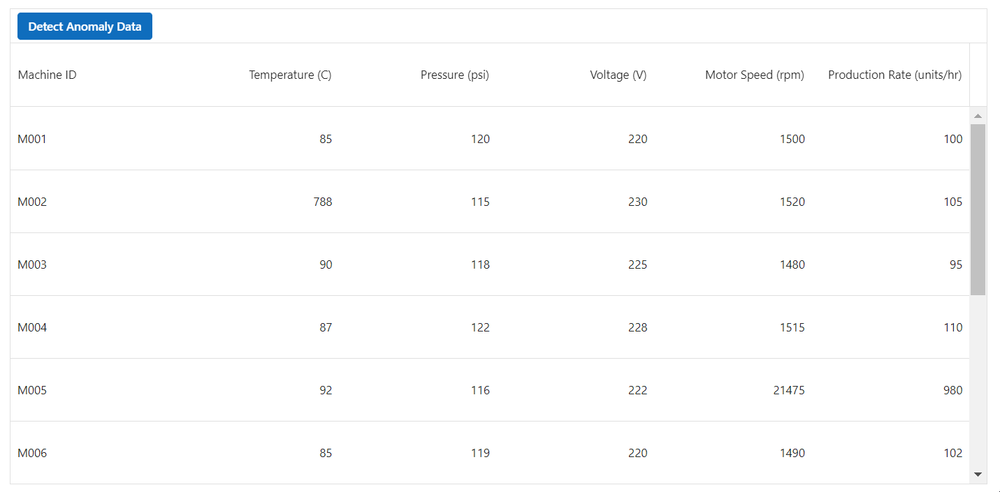

# Using OpenAI with Syncfusion Blazor AI package

This section helps to configuring and using the **Syncfusion.Blazor.AI** package with **OpenAI** to enable AI functionalities in your Blazor applications. The package allows seamless integration with OpenAI's API, empowering any Syncfusion Blazor component with intelligent features.

## Prerequisites
- Install the **Syncfusion.Blazor.AI** package via NuGet.
- Obtain an OpenAI API key from the OpenAI platform.
- Ensure your Blazor application meets the [System Requirements](https://blazor.syncfusion.com/documentation/system-requirements).

## Configuration
To use OpenAI, configure the AI service in your `Program.cs` file by registering the `AIServiceCredentials` and `IChatInferenceService`.

### Steps
1. Open your Blazor application's `Program.cs`.
2. Add the following code to configure OpenAI credentials:

```csharp
builder.Services.AddSingleton(new AIServiceCredentials
{
    ApiKey = "your-openai-key", // Replace with your OpenAI API key
    DeploymentName = "gpt-4",   // Specify the model (e.g., "gpt-4", "gpt-3.5-turbo")
    Endpoint = null             // Must be null for OpenAI
});

// Register the inference backend
builder.Services.AddSingleton<IChatInferenceService, SyncfusionAIService>();
```

3. Ensure the required Syncfusion Blazor namespaces are included in your `Program.cs`:
```csharp
using Syncfusion.Blazor.AI;
```

## Example: Syncfusion Grid with Azure OpenAI in a Blazor Application

This example demonstrates using the **Syncfusion.Blazor.AI** package with OpenAI to perform anomaly detection in a Syncfusion Blazor Grid component. The grid displays machine data (e.g., MachineID, Temperature, Pressure, Voltage, MotorSpeed, ProductionRate), and OpenAI identifies rows with irrelevant production rates relative to other factors, updating the grid with anomaly descriptions and visual styling.

### Prerequisites
- Install the following NuGet packages:
  - `Syncfusion.Blazor.Grid`
  - `Syncfusion.Blazor.Themes`
  - `Syncfusion.Blazor.AI`
- Ensure your Blazor application meets the [System Requirements](https://blazor.syncfusion.com/documentation/system-requirements?utm_source=nuget&utm_medium=listing&utm_campaign=blazor-smart-nuget).
- Add the following to `App.razor` for Syncfusion themes and scripts:
  
```html
<head>
    ....
    <link href="_content/Syncfusion.Blazor.Themes/tailwind.css" rel="stylesheet" />
</head>

<body>
    ....
    <script src="_content/Syncfusion.Blazor.Core/scripts/syncfusion-blazor.min.js" type="text/javascript"></script>
</body>
```

Now, register the Syncfusion<sup style="font-size:70%">&reg;</sup> Blazor Service in the **~/Program.cs** file of your Blazor WebAssembly App.




using Microsoft.AspNetCore.Components.Web;
using Microsoft.AspNetCore.Components.WebAssembly.Hosting;
using Syncfusion.Blazor;

var builder = WebAssemblyHostBuilder.CreateDefault(args);
builder.RootComponents.Add<App>("#app");
builder.RootComponents.Add<HeadOutlet>("head::after");

builder.Services.AddScoped(sp => new HttpClient { BaseAddress = new Uri(builder.HostEnvironment.BaseAddress) });

builder.Services.AddSyncfusionBlazor();
await builder.Build().RunAsync();
....




### Razor Component (`Home.razor`)
```cshtml
@page "/"

@inject IChatInferenceService OpenAIService
@using Newtonsoft.Json
@using Syncfusion.Blazor.AI
@using Syncfusion.Blazor.Grids
@using Syncfusion.Blazor.Navigations
@using Syncfusion.Blazor.Buttons
@using Syncfusion.Blazor.Spinner

<SfGrid @ref=Grid TValue="MachineData" DataSource="@machineDataList" EnableHover=false EnableStickyHeader=true AllowTextWrap=true Height="auto">
    <GridTemplates>
        <ToolbarTemplate>
            <SfToolbar>
                <ToolbarEvents Clicked="ToolbarClickHandler"></ToolbarEvents>
                <ToolbarItems>
                    <ToolbarItem Id="Anomaly">
                        <Template>
                            <div>
                                <SfButton Content="Detect Anomaly Data" IsPrimary="true"></SfButton>
                            </div>
                        </Template>
                    </ToolbarItem>
                </ToolbarItems>
            </SfToolbar>
        </ToolbarTemplate>
    </GridTemplates>
    <GridEvents QueryCellInfo="CustomizeCell" TValue="MachineData"></GridEvents>
    <GridColumns>
        <GridColumn Field=@nameof(MachineData.MachineID) IsPrimaryKey=true HeaderText="Machine ID" Width="40"></GridColumn>
        <GridColumn Field=@nameof(MachineData.Temperature) HeaderText="Temperature (C)" TextAlign="TextAlign.Right" Width="40"></GridColumn>
        <GridColumn Field=@nameof(MachineData.Pressure) HeaderText="Pressure (psi)" TextAlign="TextAlign.Right" Width="60"></GridColumn>
        <GridColumn Field=@nameof(MachineData.Voltage) HeaderText="Voltage (V)" TextAlign="TextAlign.Right" Width="60"></GridColumn>
        <GridColumn Field=@nameof(MachineData.MotorSpeed) HeaderText="Motor Speed (rpm)" TextAlign="TextAlign.Right" Width="60"></GridColumn>
        <GridColumn Field=@nameof(MachineData.ProductionRate) HeaderText="Production Rate (units/hr)" TextAlign="TextAlign.Right" Width="60"></GridColumn>
        <GridColumn Field=@nameof(MachineData.AnomalyDescription) HeaderText="Anomaly Description" Visible=@anomalyColumnVisibility Width="170"></GridColumn>
    </GridColumns>
    <SfSpinner Visible="@spinnerVisibility"></SfSpinner>
</SfGrid>

<style>
    .anomaly-cell {
        background-color: #c2410c;
        color: white !important;
    }
    .e-grid .e-rowcell.anomaly-cell:not(.e-editedbatchcell):not(.e-updatedtd) {
        color: #c2410c;
    }
    .e-tbar-btn {
        border: 1px double !important;
        border-color: gray !important;
    }
    .normal-cell {
        background-color: #15803d;
        color: white !important;
    }
</style>
```

`Home.razor.cs`
```cshtml
using Microsoft.Extensions.AI;
using Newtonsoft.Json;
using Syncfusion.Blazor.AI;
using Syncfusion.Blazor.Grids;

namespace OpenAIExample.Components.Pages
{
    public partial class Home
    {
        SfGrid<MachineData> Grid { get; set; }
        private List<MachineData> machineDataList = new List<MachineData>();
        private List<MachineData> AIgeneratedData = new List<MachineData>();
        private bool anomalyColumnVisibility { get; set; }
        private bool spinnerVisibility { get; set; }

        public void CustomizeCell(QueryCellInfoEventArgs<MachineData> args)
        {
            if (AIgeneratedData != null && AIgeneratedData.Count > 0)
            {
                if (AIgeneratedData.Where(e => (!string.IsNullOrEmpty(e.AnomalyFieldName)) && (e.AnomalyFieldName.Equals(args.Column.Field, StringComparison.Ordinal) && e.MachineID.Equals(args.Data.MachineID))).Any())
                {
                    args.Cell.AddClass(new string[] { "anomaly-cell" });
                }
                else if (args.Column.Field.Equals("AnomalyDescription", StringComparison.Ordinal))
                {
                    string defaultDescription = machineDataList[0].AnomalyDescription;
                    string anomalyDescription = args.Data.AnomalyDescription;
                    if (defaultDescription.Equals(anomalyDescription, StringComparison.Ordinal))
                    {
                        args.Cell.AddClass(new string[] { "normal-cell" });
                    }
                    else
                    {
                        args.Cell.AddClass(new string[] { "anomaly-cell" });
                    }
                }
            }
        }

        public async Task ToolbarClickHandler(Syncfusion.Blazor.Navigations.ClickEventArgs args)
        {
            if (args.Item.Id == "Anomaly")
            {
                DetectAnomalyData();
            }
        }

        private async void DetectAnomalyData()
        {
            spinnerVisibility = true;
            GridReport gridReport = new GridReport()
            {
                DataSource = machineDataList,
            };
            var gridReportJson = GetSerializedGridReport(gridReport);
            string userInput = ValidateAndGeneratePrompt(gridReportJson);
            ChatParameters chatParameters = new ChatParameters
            {
                Messages = new List<ChatMessage>
                {
                    new ChatMessage(ChatRole.User, userInput)
                }
            };
            var result = await OpenAIService.GenerateResponseAsync(chatParameters);
            if (result != null)
            {
                GridReport deserializeResult = new GridReport();
                try
                {
                    result = result.Replace("```json", "").Replace("```", "").Trim();
                    deserializeResult = DeserializeResult(result);
                    AIgeneratedData = deserializeResult.DataSource;
                    spinnerVisibility = false;
                    anomalyColumnVisibility = true;
                    if (AIgeneratedData != null && AIgeneratedData.Count > 0)
                    {
                        foreach (var data in AIgeneratedData)
                        {
                            await Grid.SetCellValueAsync(data.MachineID, "AnomalyDescription", data.AnomalyDescription);
                        }
                    }
                }
                catch (Exception ex)
                {
                    throw ex;
                }
            }
        }

        private static string ValidateAndGeneratePrompt(string data)
        {
            return $"Given the following datasource are bounded in the Grid table\n\n{data}.\n Return the anomaly data rows (ie. pick the ir-relevant datas mentioned in the corresponding table) present in the table mentioned above as like in the same format provided do not change the format. Example: Watch out the production rate count and the factors that is used to acheive the mentioned production rate(Temprature, Pressure, Motor Speed) If the production rate is not relevant to the concern factors mark it as anomaly Data. If it is anomaly data then due to which column data it is marked as anomaly that particular column name should be updated in the AnomalyFieldName. Also Update the AnomalyDescription stating that due to which reason it is marked as anomaly a short description. Example if the data is marked as anomaly due to the Temperature column, Since the mentioned temperature is too high than expected, it is marked as anomaly data.\n\nGenerate an output in JSON format only and Should not include any additional information or contents in response";
        }

        private string GetSerializedGridReport(GridReport report)
        {
            return JsonConvert.SerializeObject(report);
        }

        private GridReport DeserializeResult(string result)
        {
            return JsonConvert.DeserializeObject<GridReport>(result);
        }

        protected override void OnInitialized()
        {
            string description = "The factors that supporting the Production rate is relevant to the count produced, hence the row data is marked as normal data.";
            machineDataList = new List<MachineData>
            {
                new MachineData { MachineID = "M001", Temperature = 85, Pressure = 120, Voltage = 220, MotorSpeed = 1500, ProductionRate = 100, AnomalyDescription = description },
                new MachineData { MachineID = "M002", Temperature = 788, Pressure = 115, Voltage = 230, MotorSpeed = 1520, ProductionRate = 105, AnomalyDescription = description },
                new MachineData { MachineID = "M003", Temperature = 90, Pressure = 118, Voltage = 225, MotorSpeed = 1480, ProductionRate = 95, AnomalyDescription = description },
                new MachineData { MachineID = "M004", Temperature = 87, Pressure = 122, Voltage = 228, MotorSpeed = 1515, ProductionRate = 110, AnomalyDescription = description },
                new MachineData { MachineID = "M005", Temperature = 92, Pressure = 116, Voltage = 222, MotorSpeed = 21475, ProductionRate = 980, AnomalyDescription = description },
                new MachineData { MachineID = "M006", Temperature = 85, Pressure = 119, Voltage = 220, MotorSpeed = 1490, ProductionRate = 102, AnomalyDescription = description },
                new MachineData { MachineID = "M007", Temperature = 88, Pressure = 114, Voltage = 230, MotorSpeed = 1500, ProductionRate = 104, AnomalyDescription = description },
                new MachineData { MachineID = "M008", Temperature = 90, Pressure = 1120, Voltage = 225, MotorSpeed = 1470, ProductionRate = 89, AnomalyDescription = description },
                new MachineData { MachineID = "M009", Temperature = 87, Pressure = 121, Voltage = 228, MotorSpeed = 1505, ProductionRate = 108, AnomalyDescription = description },
                new MachineData { MachineID = "M010", Temperature = 92, Pressure = 117, Voltage = 222, MotorSpeed = 1480, ProductionRate = 100, AnomalyDescription = description },
            };
        }

        public class MachineData
        {
            public string MachineID { get; set; }
            public int Temperature { get; set; }
            public int Pressure { get; set; }
            public int Voltage { get; set; }
            public int MotorSpeed { get; set; }
            public int ProductionRate { get; set; }
            public string AnomalyDescription { get; set; }
            public string AnomalyFieldName { get; set; }
        }

        public class GridReport
        {
            public List<MachineData> DataSource { get; set; }
        }
    }
}
```



### Explanation
- **IChatInferenceService**: Injected to interact with the OpenAI service.
- **ChatParameters**: Configures the AI request, including system and user messages, temperature, and token limits.
- **GenerateResponseAsync**: Sends the request to OpenAI and retrieves the response asynchronously.
- **Response**: Displays the AI-generated text.


