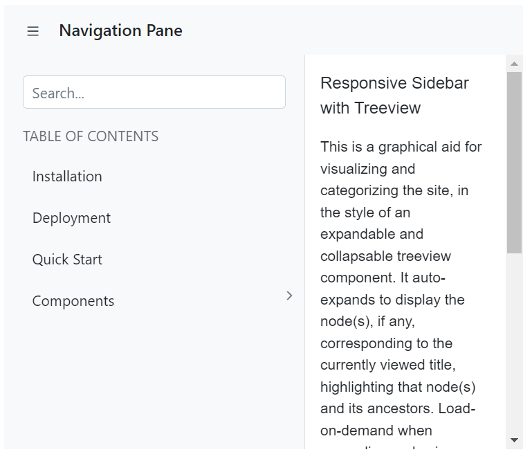

# Design with Blazor AppBar Component

## Spacer

`AppBarSpacer` is used to provide spacing between the AppBar contents which gives an additional space on content layout.

The following example depicts the code to provide spacing between home and pan button in the AppBar.

```cshtml
@using Syncfusion.Blazor.Navigations
@using Syncfusion.Blazor.Buttons

<div class="control-container">
    <SfAppBar ColorMode="AppBarColor.Primary">
        <SfButton CssClass="e-inherit" IconCss="e-icons e-home"></SfButton>
        <span class="spacer">Spacer AppBar</span>
        <AppBarSpacer></AppBarSpacer>
        <SfButton CssClass="e-inherit" IconCss="e-icons e-pan"></SfButton>
    </SfAppBar>
</div>

<style>
    .control-container {
        height: 300px;
        margin: 0 auto;
        width: 500px;
    }
    .e-appbar .spacer {
        margin:0 5px;
    }
</style>
```


## Separator

`AppBarSeparator` shows a vertical line to visually group or separate the AppBar contents.

The following example depicts the code to provide vertical line between home and pan button in the AppBar.

```cshtml
@using Syncfusion.Blazor.Navigations
@using Syncfusion.Blazor.Buttons

<div class="control-container">
    <SfAppBar ColorMode="AppBarColor.Primary">
        <SfButton CssClass="e-inherit" IconCss="e-icons e-home"></SfButton>
        <span class="separator">Separator AppBar</span>
        <AppBarSpacer></AppBarSpacer>
        <AppBarSeparator></AppBarSeparator>
        <SfButton CssClass="e-inherit" IconCss="e-icons e-pan"></SfButton>
    </SfAppBar>
</div>

<style>
    .control-container {
        height: 300px;
        margin: 0 auto;
        width: 500px;
    }
    .e-appbar .separator {
        margin:0 5px;
    }
</style>
```


## Media Query

It is used to adjust the AppBar for different screen sizes by using media queries. On mobile devices, media query is used to display the AppBar in adaptive views. You can click the menu to see the hidden AppBar content.

```cshtml
@using Syncfusion.Blazor.Navigations
@using Syncfusion.Blazor.Buttons
@using Syncfusion.Blazor.SplitButtons

<div class="control-container">
    <SfAppBar ColorMode="AppBarColor.Primary">
        <SfButton aria-label="menu" CssClass="e-inherit menu" IconCss="e-icons e-menu"></SfButton>
        <SfButton CssClass="e-inherit home e-appbar-menu" Content="Home"></SfButton>
        <SfButton CssClass="e-inherit products e-appbar-menu" Content="Products"></SfButton>
        <AppBarSpacer></AppBarSpacer>
        <div style="width: 200px; margin-right:10px">
            <span class="e-input-group e-control-wrapper e-inherit @InputFocus">
                 <input type="text" class="e-searchinput e-input" @onblur="@(e => InputFocus = string.Empty)" @onfocus="@(e => InputFocus = "e-input-focus")" placeholder="Search">
                 <span class="e-icons e-search e-input-group-icon"></span>
            </span>
        </div>
        <AppBarSeparator></AppBarSeparator>
        <SfButton CssClass="e-inherit login" Content="Login"></SfButton>
        <SfMenu CssClass="e-inherit e-appbar-icon-menu" TValue="MenuItem">
            <MenuItems>
               <MenuItem aria-label="more vertical" IconCss="e-icons e-more-vertical-1">
                  <MenuItems>
                     <MenuItem Text="Home"></MenuItem>
                     <MenuItem Text="Products"></MenuItem>
                     <MenuItem Text="Login"></MenuItem>
                  </MenuItems>
               </MenuItem>
            </MenuItems>
        </SfMenu>
    </SfAppBar>
</div>

@code{
    public string InputFocus { get; set; }
}

<style>
    .control-container {
        height: 300px;
        margin: 0 auto;
        width: 500px;
    }
    .control-container .e-dropdown-btn.e-inherit,
    .control-container .e-btn.e-inherit.home,
    .control-container .e-btn.e-inherit.products {
        margin: 0 5px;
    }
    .control-container .e-appbar .e-appbar-separator {
        margin: 0 10px;
    }
    .control-container .e-appbar-icon-menu {
        display: none;
    }
    @@media screen and (max-width: 480px) {
        .control-container {
           width: 300px;
        }
        .control-container .e-appbar-icon-menu {
            display: block;
        }
        .control-container  .login,
        .control-container .e-appbar-separator,
        .control-container .e-menu-container.e-inherit.e-appbar-menu,
        .control-container .e-menu-container.e-inherit.e-appbar-icon-menu .e-menu .e-menu-item .e-caret,
        .control-container .e-btn.e-inherit.e-appbar-menu {
            display: none;
        }
        .control-container .e-menu-container.e-inherit.e-appbar-icon-menu ul .e-menu-item.e-menu-caret-icon {
            padding: 0 8px;
        }
        .control-container .e-menu-container.e-inherit ul .e-menu-item .e-menu-icon {
            margin-right: 0;
        }
        .control-container .e-menu-container.e-inherit {
            margin: 0 10px;
        }
        .control-container .e-input-group.e-control-wrapper.e-inherit {
            margin-left: 10px;
        }
        .control-container .menu {
            margin-bottom: 3px;
        }
    }
</style>
```


## Designing AppBar with Menu

This section briefly explains about how to design AppBar with Menu. In the following example, the AppBar is rendered with Menu component in its appbar header area.

```cshtml
@using Syncfusion.Blazor.Navigations
@using Syncfusion.Blazor.Buttons

<div class="control-container">
    <SfAppBar ColorMode="AppBarColor.Primary">
        <SfButton CssClass="e-inherit" IconCss="e-icons e-menu"></SfButton>
        <span class="spacer">Menu AppBar</span>
        <SfMenu CssClass="e-inherit" TValue="MenuItem">
            <MenuItems>
                <MenuItem aria-label="company" Text="Company">
                    <MenuItems>
                       <MenuItem Text="About Us"></MenuItem>
                       <MenuItem Text="Customers"></MenuItem>
                       <MenuItem Text="Blog"></MenuItem>
                       <MenuItem Text="Careers"></MenuItem>
                    </MenuItems>
                </MenuItem>
            </MenuItems>
        </SfMenu>
        <AppBarSpacer></AppBarSpacer>
        <SfButton CssClass="e-inherit"Content="Login"></SfButton>
    </SfAppBar>
</div>

<style>
    .control-container {
        height: 300px;
        margin: 0 auto;
        width: 500px;
    }
    .e-appbar .spacer {
        margin:0 5px;
    }
</style>
```


## Designing AppBar with Buttons

This section briefly explains about how to design AppBar with Buttons. In the following example, the AppBar is rendered with Button and DropDownButton component in its appbar header area.

```cshtml
@using Syncfusion.Blazor.Navigations
@using Syncfusion.Blazor.Buttons
@using Syncfusion.Blazor.SplitButtons

<div class="control-container">
    <SfAppBar ColorMode="AppBarColor.Primary">
        <SfButton CssClass="e-inherit" IconCss="e-icons e-menu"></SfButton>
        <span class="buttons">Buttons AppBar</span>
        <SfDropDownButton CssClass="e-inherit" Content="Products">
            <DropDownMenuItems>
              <DropDownMenuItem Text="Developer"></DropDownMenuItem>
              <DropDownMenuItem Text="Analytics"></DropDownMenuItem>
              <DropDownMenuItem Text="Reporting"></DropDownMenuItem>
              <DropDownMenuItem Text="E-Signature"></DropDownMenuItem>
              <DropDownMenuItem Text="Help Desk"></DropDownMenuItem>
            </DropDownMenuItems>
        </SfDropDownButton>
        <AppBarSpacer></AppBarSpacer>
        <SfButton CssClass="e-inherit"Content="Login"></SfButton>
    </SfAppBar>
</div>

<style>
    .control-container {
        height: 300px;
        margin: 0 auto;
        width: 500px;
    }
    .e-appbar .buttons {
        margin:0 5px;
    }
</style>
```


## Designing AppBar with SideBar

This section briefly explains about how to design AppBar with SideBar. In the following example, the AppBar is rendered with SideBar component below the appbar. Click on the menu icon to expand/collapse the Sidebar.

```cshtml
@using Syncfusion.Blazor.Navigations
@using Syncfusion.Blazor.Buttons
@using Syncfusion.Blazor.Inputs

<div class="control-container">
    <div>
        <SfAppBar>
            <SfButton CssClass="e-inherit" IconCss="e-icons e-menu" OnClick="@Toggle"></SfButton>
            <div class="e-folder">
                <div class="e-folder-name">Navigation Pane</div>
            </div>
        </SfAppBar>
    </div>
    <SfSidebar HtmlAttributes="@HtmlAttribute" Width="290px" Target=".main-content" MediaQuery="(min-width:600px)" @bind-IsOpen="SidebarToggle">
        <ChildContent>
            <div class="main-menu">
                <div class="table-content">
                    <SfTextBox Placeholder="Search..."></SfTextBox>
                    <p class="main-menu-header">TABLE OF CONTENTS</p>
                </div>
                <div>
                    <SfTreeView CssClass="main-treeview" ExpandOn="@Expand" TValue="TreeData">
                        <TreeViewFieldsSettings Id="NodeId" Text="NodeText" IconCss="IconCss" DataSource="Treedata" HasChildren="HasChild" ParentID="Pid">
                        </TreeViewFieldsSettings>
                    </SfTreeView>
                </div>
            </div>
        </ChildContent>
    </SfSidebar>
    <div class="main-content" id="main-text">
        <div class="sidebar-content">
            <div class="sidebar-heading"> Responsive Sidebar with Treeview</div>
            <p class="paragraph-content">
                This is a graphical aid for visualizing and categorizing the site, in the style of an expandable and collapsable treeview component.
                It auto-expands to display the node(s), if any, corresponding to the currently viewed title, highlighting that node(s)
                and its ancestors. Load-on-demand when expanding nodes is available where supported (most graphical browsers),
                falling back to a full-page reload. MediaWiki-supported caching, aside from squid, has been considered so that
                unnecessary re-downloads of content are avoided where possible. The complete expanded/collapsed state of
                the treeview persists across page views in most situations.
            </p>
        </div>
    </div>
</div>

@code {
    public ExpandAction Expand = ExpandAction.Click;
    public bool SidebarToggle = false;
    Dictionary<string, object> HtmlAttribute = new Dictionary<string, object>()
    {
        {"class", "sidebar-treeview" }
    };
    public void Toggle(MouseEventArgs args)
    {
        SidebarToggle = !SidebarToggle;
    }
    public class TreeData {
        public string NodeId { get; set; }
        public string NodeText { get; set; }
        public string IconCss { get; set; }
        public bool HasChild { get; set; }
        public string Pid { get; set; }
    }
    private List<TreeData> Treedata = new List<TreeData> ();
    protected override void OnInitialized() {
        base.OnInitialized();
        Treedata.Add(new TreeData { NodeId = "01", NodeText = "Installation", IconCss = "icon-microchip icon" });
        Treedata.Add(new TreeData { NodeId = "02", NodeText = "Deployment", IconCss = "icon-thumbs-up-alt icon" });
        Treedata.Add(new TreeData { NodeId = "03", NodeText = "Quick Start", IconCss = "icon-docs icon" });
        Treedata.Add(new TreeData { NodeId = "04", NodeText = "Components", IconCss = "icon-th icon", HasChild=true });
        Treedata.Add(new TreeData { NodeId = "04-01", NodeText = "Calendar", IconCss = "icon-circle-thin icon", Pid="04" });
        Treedata.Add(new TreeData { NodeId = "04-02", NodeText = "DatePicker", IconCss = "icon-circle-thin icon", Pid="04" });
        Treedata.Add(new TreeData { NodeId = "04-03", NodeText = "DateTimePicker", IconCss = "icon-circle-thin icon", Pid="04" });
        Treedata.Add(new TreeData { NodeId = "04-04", NodeText = "DateRangePicker", IconCss = "icon-circle-thin icon", Pid="04" });
        Treedata.Add(new TreeData { NodeId = "04-05", NodeText = "TimePicker", IconCss = "icon-circle-thin icon", Pid="04" });
        Treedata.Add(new TreeData { NodeId = "04-06", NodeText = "SideBar", IconCss = "icon-circle-thin icon", Pid="04" });
        Treedata.Add(new TreeData { NodeId = "05", NodeText = "API Reference", IconCss = "icon-code icon", HasChild=true });
        Treedata.Add(new TreeData { NodeId = "05-01", NodeText = "Calendar", IconCss = "icon-circle-thin icon", Pid="05" });
        Treedata.Add(new TreeData { NodeId = "05-02", NodeText = "DatePicker", IconCss = "icon-circle-thin icon", Pid="05" });
        Treedata.Add(new TreeData { NodeId = "05-03", NodeText = "DateTimePicker", IconCss = "icon-circle-thin icon", Pid="05" });
        Treedata.Add(new TreeData { NodeId = "05-04", NodeText = "DateRangePicker", IconCss = "icon-circle-thin icon", Pid="05" });
        Treedata.Add(new TreeData { NodeId = "05-05", NodeText = "TimePicker", IconCss = "icon-circle-thin icon", Pid="05" });
        Treedata.Add(new TreeData { NodeId = "05-06", NodeText = "SideBar", IconCss = "icon-circle-thin icon", Pid="05" });
        Treedata.Add(new TreeData { NodeId = "06", NodeText = "Browser Compatibility", IconCss = "icon-chrome icon" });
        Treedata.Add(new TreeData { NodeId = "07", NodeText = "Upgrade Packages", IconCss = "icon-up-hand icon" });
        Treedata.Add(new TreeData { NodeId = "08", NodeText = "Release Notes", IconCss = "icon-bookmark-empty icon" });
        Treedata.Add(new TreeData { NodeId = "09", NodeText = "FAQ", IconCss = "icon-help-circled icon" });
        Treedata.Add(new TreeData { NodeId = "10", NodeText = "License", IconCss = "icon-doc-text icon" });
    }
}

<style>
    .control-container {
        height: 300px;
        margin: 0 auto;
        width: 500px;
    }
    .e-appbar .e-folder {
        margin:0 5px;
    }
    .container-fluid {
        padding-left: 0;
        padding-right: 0;
    }
    .sidebar-treeview .e-treeview .e-icon-collapsible,
    .sidebar-treeview .e-treeview .e-icon-expandable {
        float: right;
    }
    .sidebar-treeview .e-treeview .e-icon-collapsible,
    .sidebar-treeview .e-treeview .e-icon-expandable {
        margin: 3px;
    }
    .sidebar-treeview .e-treeview,
    .sidebar-treeview .e-treeview .e-ul {
        padding: 0;
        margin: 0;
    }
    .control-container .sidebar-treeview {
        z-index: 20 !important;
    }
    .sidebar-treeview .main-menu .main-menu-header {
        color: #656a70;
        padding: 15px 15px 15px 0;
        font-size: 14px;
        width: 13em;
        margin: 0;
    }
    #main-text .sidebar-heading {
        font-size: 16px;
    }
    .sidebar-treeview .table-content {
        padding: 20px 18px;
        height: 8em;
    }
    #main-text .sidebar-content .line {
        width: 100%;
        height: 1px;
        border-bottom: 1px dashed #ddd;
        margin: 40px 0;
    }
    #main-text .sidebar-content {
        padding: 15px;
        font-size: 14px;
    }
    #main-text .paragraph-content {
        padding: 15px 0;
        font-weight: normal;
        font-size: 14px;
    }
    @@font-face {
        font-family: 'fontello';
        src: url('data:application/octet-stream;base64,AAEAAAAPAIAAAwBwR1NVQiCLJXoAAAD8AAAAVE9TLzI+JUkyAAABUAAAAFZjbWFw0almQAAAAagAAAIgY3Z0IAbV/vwAABfUAAAAIGZwZ22KkZBZAAAX9AAAC3BnYXNwAAAAEAAAF8wAAAAIZ2x5Zk3OJrMAAAPIAAAPrGhlYWQTw6AfAAATdAAAADZoaGVhB2gDnAAAE6wAAAAkaG10eDHm//YAABPQAAAAOGxvY2EejhqYAAAUCAAAAB5tYXhwAfYMkAAAFCgAAAAgbmFtZcydHiAAABRIAAACzXBvc3RuKDzPAAAXGAAAALRwcmVw5UErvAAAI2QAAACGAAEAAAAKADAAPgACREZMVAAObGF0bgAaAAQAAAAAAAAAAQAAAAQAAAAAAAAAAQAAAAFsaWdhAAgAAAABAAAAAQAEAAQAAAABAAgAAQAGAAAAAQAAAAEDkAGQAAUAAAJ6ArwAAACMAnoCvAAAAeAAMQECAAACAAUDAAAAAAAAAAAAAAAAAAAAAAAAAAAAAFBmRWQAQOgB6BMDUv9qAFoDUgCaAAAAAQAAAAAAAAAAAAUAAAADAAAALAAAAAQAAAF0AAEAAAAAAG4AAwABAAAALAADAAoAAAF0AAQAQgAAAAYABAABAALoCegT//8AAOgB6BD//wAAAAAAAQAGABYAAAABAAIAAwAEAAUABgAHAAgACQAKAAsADAANAAABBgAAAAAAAAAAAAAAAAAAAAAAAAAAAAAAAAAAAAAAAAAAAAAAAAAAAAAAAAAAAAAAAAAAAAAAAAAAAAAAAAAAAAAAAAAAAAAAAAAAAAAAAAAAAAAAAAAAAAAAAAAAAAAAAAAAAAAAAAAAAAAAAAAAAAAAAAAAAAAAAAAAAAAAAAAAAAAAAAAAAAAAAAAAAAAAAAAAAAAAAAAAAAAAAAAAAAAAAAAAAAAAAAAAAAAAAAAAAAAAAAAAAAAAAAAAAAAAAAAAAAAAAAAAAAAAAAAAAAAAAAAAAAAAAAAAAAAAAAAAAAAAAAAAAAAAAAAAAAAAAAAAAAAAAAAAAAAAAAAAAAAAAAAMAAAAAACsAAAAAAAAAA0AAOgBAADoAQAAAAEAAOgCAADoAgAAAAIAAOgDAADoAwAAAAMAAOgEAADoBAAAAAQAAOgFAADoBQAAAAUAAOgGAADoBgAAAAYAAOgHAADoBwAAAAcAAOgIAADoCAAAAAgAAOgJAADoCQAAAAkAAOgQAADoEAAAAAoAAOgRAADoEQAAAAsAAOgSAADoEgAAAAwAAOgTAADoEwAAAA0AAwAA//kDWgLEAA8AHwAvADdANCgBBAUIAAIAAQJHAAUABAMFBGAAAwACAQMCYAABAAABVAABAQBYAAABAEwmNSY1JjMGBRorJRUUBgchIiYnNTQ2NyEyFgMVFAYnISImJzU0NhchMhYDFRQGIyEiJic1NDYXITIWA1kUEPzvDxQBFg4DEQ8WARQQ/O8PFAEWDgMRDxYBFBD87w8UARYOAxEPFmRHDxQBFg5HDxQBFgEQSA4WARQPSA4WARQBDkcOFhYORw8WARQAAAAABQAA/2oD6ANSAB8AIgAlADMAPABsQGkjAQAGHQEJACcgAgcFA0cMAQAACQUACV4ABQAHBAUHYAAEAAoIBApgAAgAAgsIAmAABgYDWAADAwxIDQELCwFYAAEBDQFJNDQBADQ8NDw7OTY1MC8uLCkoJSQiIRoXDgwJBgAfAR4OBRQrATIWFxEUBgchIiYnNSEiJicRNDY/AT4BOwEyFhcVNjMPATMBBzMXNzUjFRQGByMRITU0NgERIxUUBicjEQOyFx4BIBb96RceAf7RFx4BFhDkDzYW6BceASYhR6en/punp22w1h4X6QEeFgIm1x4X6AJ8IBb9WhceASAWoCAWAXcWNg/kEBYgFrcXd6cBfafCsOnpFh4B/puPFjb+TgKD6BYgAf6aAAAJAAD/+QPoAwsADwAfAC8APwBPAF8AbwB/AI8AT0BMEQ0CBxAMAgYDBwZgDwkCAw4IAgIBAwJgCwUCAQAAAVQLBQIBAQBYCgQCAAEATI6LhoN+e3ZzbmtmY15bVlNOSzU1NTU1NTU1MxIFHSslFRQGByMiJic1NDYXMzIWExUUBicjIiYnNTQ2NzMyFgEVFAYHIyImJzU0NhczMhYBFRQGKwEiJic1NDY7ATIWARUUBicjIiYnNTQ2NzMyFgEVFAYHIyImPQE0NhczMhYBFRQGKwEiJic1NDY7ATIWARUUBicjIiY9ATQ2NzMyFhMVFAYrASImPQE0NjsBMhYBHiAWshceASAWshceASAWshceASAWshceAWYgFrIXHgEgFrIXHv6cIBayFx4BIBayFx4BZiAWshceASAWshceAWYgFrIWICAWshce/pwgFrIXHgEgFrIXHgFmIBayFiAgFrIXHgEgFrIWICAWshcemmwWHgEgFWwWIAEeAQZrFiABHhdrFx4BIP7NbBYeASAVbBYgAR4CJGsWICAWaxYgIP7MaxYgAR4XaxceASD+zWwWHgEgFWwWIAEeAiRrFiAgFmsWICD+zGsWIAEeF2sXHgEgAQhrFiAgFmsWICAAAAMAAP+5BBYCugAUACQAOQAeQBsuEQIAAQFHAwEBAAFvAgEAAGY1NCgnFxIEBRYrJQcGIicBJjQ3ATYyHwEWFA8BFxYUAQMOAS8BLgE3Ez4BHwEeAQkBBiIvASY0PwEnJjQ/ATYyFwEWFAFYHAUOBv78BgYBBAUQBBwGBtvbBgFE0AIOBiIIBgHRAgwHIwcIAWz+/AYOBhwFBdvbBQUcBg4GAQQFRRwFBQEFBQ4GAQQGBhwFEATc2wYOAk79LwcIAwkDDAgC0AgGAQoCDv6P/vsFBRwGDgbb3AUOBhwGBv78BRAAAAMAAP+xA30DCwAIABgAVQBOQEtKAQgHHxsCAAMAAQEAMRECAgEERwAHCAdvAAgDCG8GAQMAA28AAAEAbwAEAgRwAAECAgFUAAEBAlgFAQIBAkwvLBUkPyY1ExIJBR0rNzQuAQ4BHgE2ExEUBgcjIiYnETQ2FzMyFgUUBxYVFgcWBwYHFgcGByMiLgEnJiciJicRND4CNzY3PgI3PgMzMh4EBhcUDgEHDgIHMzIWjxYdFAEWHRRaFBCgDxQBFg6gDxYClB8JARkJCQkWBSAkSkglVjIqRRMPFAEUGzocJhIKDgYFBAYQFQ8ZKhgUCAYCAgwIDAEIBAObK0BkDxQBFh0UARYBLP6bDxQBFg4BZQ4WARQPMCMZEioiHyMfFT4nKwESDg8YARYOAWUOFgFAIzESCiIUGBYYIhYMEhoYIBINFSwWFAQMDgZAAAAACwAA/7EDWQNSAA8AHwAvAD8ATwBfAG8AfwCPAJ8ArwD6QPesARITnAEODzkBDQ6MLQIKC3wBBgdsAQIDBkcAFAAUcCkBEiYBERASEWAoLgITJwEQDxMQYCUBDiIBDQwODWAkLQIPIwEMCw8MYCEBCh4BCQgKCWAgLAILHwEIBwsIYB0BBhoBBQQGBWAcKwIHGwEEAwcEYBkBAhYBAQACAWAYKgIDFwEAFAMAYAAVFQwVSUBAMDAgIBAQAACvraqpqKakop+dmpmYlpSSj42KiYiGhIJ/fXp5eHZ0cm9tamloZmRiXltWU0BPQE5MSkdFQ0EwPzA+PDs3NTMxIC8gLywqJyUjIRAfEB4cGhcVExEADwAOIyIhLwUXKzcVIyI9ASMiPQE0OwE1NDM3FSMiPQEjIj0BNDsBNTQzNxUjIj0BIyI9ATQ7ATU0MzcVIyI9ASMiPQE0OwE1NDM3FSMiPQEjIj0BNDsBNTQzJREUBiMhIiYnETQ2NyEyFhMVFCsBFRQrATUzMh0BMzI1FRQrARUUKwE1MzIdATMyNRUUKwEVFCsBNTMyHQEzMjUVFCsBFRQrATUzMh0BMzI1FRQrARUUKwE1MzIdATMyaz4JGwkJGwk+PgkbCQkbCT4+CRsJCRsJPj4JGwkJGwk+PgkbCQkbCQKdHhf+LxYeASAVAdEWII4JGwg/PwgbCQkbCD8/CBsJCRsIPz8IGwkJGwg/PwgbCQkbCD8/CBsJiEgJCQkSCQkJj0gJCQkSCQkJjkcJCQkSCQkIj0cJCQkSCAkJj0cJCQkRCQkJWfzLFiAgFgM1Fx4BIP07EgkJCUgJCYYSCQkJSAkJhhIJCQlHCAmGEgkJCUcJCYYRCQkJRwkJAAAEAAD/ZgPzA1IADwAeACwAOQDhS7AJUFhADwQBAQAFAQUCGhkCAwUDRxtLsApQWEAPBAEBAAUBBQQaGQIDBQNHG0APBAEBAAUBBQIaGQIDBQNHWVlLsAlQWEAkAAEAAgABAm0HBAICBQACBWsABQMABQNrBgEAAAxIAAMDDQNJG0uwClBYQCoAAQACAAECbQACBAACBGsHAQQFAAQFawAFAwAFA2sGAQAADEgAAwMNA0kbQCQAAQACAAECbQcEAgIFAAIFawAFAwAFA2sGAQAADEgAAwMNA0lZWUAXLi0BADQzLTkuOSYlIB8KCQAPAQ8IBRQrAQYHBgcXPgIXBSYnJicmBQYHBhUUFx4BFzcGLgEnAQUeAQYHAxY2NzY3PgElIg4BFB4BMj4BNC4BAfJwZWdHmhNSbDoBniAxMkFz/dcoFBY4N8F3gDlwWBgCuf7mJh0UIuJIjUFqQj8Z/gIuTS4uTVxNLi5NA1IBMDFY7TdRKAYWQDQ2JkPiPEVGS3tsaYwS/AseSjUBFA8scHIv/qUFISY9Z2TtZS5NXE0uLk1cTS4AAAAAAv/9/7EDXwMLABAAHQArQCgAAwQBAAEDAGAAAQICAVQAAQECWAACAQJMAQAbGhUUCQgAEAEQBQUUKwEiDgMeAj4DNC4CARQOASIuAj4BMh4BAa1JhGA4AjxciI6GXjo6XoYBZXLG6MhuBnq89Lp+AsM4YISShF48BDRmfJp8aDD+n3XEdHTE6sR0dMQAAAAAAv///2oDoQMNAAgAIQArQCgfAQEADgEDAQJHAAQAAAEEAGAAAQADAgEDYAACAg0CSRcjFBMSBQUZKwE0LgEGFBY+AQEUBiIvAQYjIi4CPgQeAhcUBxcWAoOS0JKS0JIBHiw6FL9ke1CSaEACPGyOpI5sPAFFvxUBgmeSApbKmAaM/podKhW/RT5qkKKObjoEQmaWTXtkvxUAAAAAAv/9/2oDWQNSACYATQA8QDlFQj8NBwUGAAFLSEY+DgUDACIaAgIDA0cAAAEDAQADbQABAQxIAAMDAlgAAgINAkksKyAeFxIEBRYrET4BNzYXNjc1PgEyFhcTNhceAQcOAQcOAgcVFAYHISImJzU0LgE3HgIXITU+ATc+AT8BMjY3NicuAQ4BBxEuAScOAQcVJgcmBgcmBgJKSTNEGSACRmtEBQFeTDc2FxdwFRciUhEmGf6lGiQDHBY+AhYcAQFbEG4NFUIWRQQGAQQNFkg8WBYCIhwYIgMxOhpCDj46AaM8TAQrChAGazVMSDn+7y0cE3Y4FhALDipMFpsZJAMmGqochHQdN2x6FwMmYhMZIAQNAgQVGiMOFiIDAW0bJAICJBu/MTsQEhsJOAAAAgAA/74CygMLAAUAIgAyQC8UBQMCBAIAAUcDAQIAAnAEAQEAAAFUBAEBAQBWAAABAEoHBhgWEhAGIgchEAUFFSsBIREBHwETMhceARcRFAYHBiMiLwEHBiMiJy4BNRE0Njc2MwKD/cQBHjLsBwwMExQBFhIKDhsU9vYUGg0MEhYWEgwNAsP9SwESL+MC/QUIHhT9MRMgBwQS7OwTBQcgEwLPEyAHBQAABgAA/2oDWQNSABMAGgAjADMAQwBTAHJAbxQBAgQsJAIHBkA4AggJUEgCCgsERwACAAMGAgNgAAYABwkGB2ANAQkACAsJCGAOAQsACgULCmAABAQBWAABAQxIDAEFBQBYAAAADQBJREQ0NBsbRFNEUkxKNEM0Qjw6MC4oJhsjGyMTJhQ1Ng8FGSsBHgEVERQGByEiJicRNDY3ITIWFwcVMyYvASYTESMiJic1IRETNDYzITIWHQEUBiMhIiY1BTIWHQEUBiMhIiY9ATQ2MwUyFh0BFAYjISImPQE0NjMDMxAWHhf9EhceASAWAfQWNg9K0gUHrwbG6BceAf5TjwoIAYkICgoI/ncICgGbCAoKCP53CAoKCAGJCAoKCP53CAoKCAJ+EDQY/X4XHgEgFgN8Fx4BFhAm0hEGrwf8sAI8IBXp/KYB4wcKCgckCAoKCFkKCCQICgoIJAgKjwoIJAgKCggkCAoAAAAAA//9/7EDXwMLAA8ANwBEAEhARSkBBQMJAQIBAAJHAAQCAwIEA20AAwUCAwVrAAcAAgQHAmAABQAAAQUAYAABBgYBVAABAQZYAAYBBkwVHisTFiYmIwgFHCslNTQmKwEiBh0BFBY7ATI2EzQuASMiBwYfARYzMjc+ATIWFRQGBw4BFxUUFjsBMjY0Nj8BPgMXFA4BIi4CPgEyHgEB9AoIawgKCghrCAqPPlwxiEcJDUoEBgkFHiU4KhYbIzwBCghrCAoYEhwKHhQM13LG6MhuBnq89Lp+UmsICgoIawgKCgF/MVQudw0LNwQHJhseEhUaDA9CJRQICgoSIgsQBhocKFJ1xHR0xOrEdHTEAAEAAAABAACCKpnPXw889QALA+gAAAAA2EiuQQAAAADYSK5B//3/ZgQWA1IAAAAIAAIAAAAAAAAAAQAAA1L/agAABC///f/0BBYAAQAAAAAAAAAAAAAAAAAAAA4D6AAAA1kAAAPoAAAD6AAABC8AAAOgAAADWQAAA+gAAANZ//0DoP//A03//QLKAAADWQAAA1n//QAAAAAAZgD6AegCWgMABEgFHAVkBbIGSAacB1AH1gAAAAEAAAAOALAACwAAAAAAAgBeAG4AcwAAAQsLcAAAAAAAAAASAN4AAQAAAAAAAAA1AAAAAQAAAAAAAQAIADUAAQAAAAAAAgAHAD0AAQAAAAAAAwAIAEQAAQAAAAAABAAIAEwAAQAAAAAABQALAFQAAQAAAAAABgAIAF8AAQAAAAAACgArAGcAAQAAAAAACwATAJIAAwABBAkAAABqAKUAAwABBAkAAQAQAQ8AAwABBAkAAgAOAR8AAwABBAkAAwAQAS0AAwABBAkABAAQAT0AAwABBAkABQAWAU0AAwABBAkABgAQAWMAAwABBAkACgBWAXMAAwABBAkACwAmAclDb3B5cmlnaHQgKEMpIDIwMTggYnkgb3JpZ2luYWwgYXV0aG9ycyBAIGZvbnRlbGxvLmNvbWZvbnRlbGxvUmVndWxhcmZvbnRlbGxvZm9udGVsbG9WZXJzaW9uIDEuMGZvbnRlbGxvR2VuZXJhdGVkIGJ5IHN2ZzJ0dGYgZnJvbSBGb250ZWxsbyBwcm9qZWN0Lmh0dHA6Ly9mb250ZWxsby5jb20AQwBvAHAAeQByAGkAZwBoAHQAIAAoAEMAKQAgADIAMAAxADgAIABiAHkAIABvAHIAaQBnAGkAbgBhAGwAIABhAHUAdABoAG8AcgBzACAAQAAgAGYAbwBuAHQAZQBsAGwAbwAuAGMAbwBtAGYAbwBuAHQAZQBsAGwAbwBSAGUAZwB1AGwAYQByAGYAbwBuAHQAZQBsAGwAbwBmAG8AbgB0AGUAbABsAG8AVgBlAHIAcwBpAG8AbgAgADEALgAwAGYAbwBuAHQAZQBsAGwAbwBHAGUAbgBlAHIAYQB0AGUAZAAgAGIAeQAgAHMAdgBnADIAdAB0AGYAIABmAHIAbwBtACAARgBvAG4AdABlAGwAbABvACAAcAByAG8AagBlAGMAdAAuAGgAdAB0AHAAOgAvAC8AZgBvAG4AdABlAGwAbABvAC4AYwBvAG0AAAAAAgAAAAAAAAAKAAAAAAAAAAAAAAAAAAAAAAAAAAAAAAAOAQIBAwEEAQUBBgEHAQgBCQEKAQsBDAENAQ4BDwAEbWVudQRkb2NzAnRoBGNvZGUNdGh1bWJzLXVwLWFsdAltaWNyb2NoaXAGY2hyb21lC2NpcmNsZS10aGluCHNlYXJjaC0xB3VwLWhhbmQOYm9va21hcmstZW1wdHkIZG9jLXRleHQMaGVscC1jaXJjbGVkAAAAAQAB//8ADwAAAAAAAAAAAAAAAAAAAAAAGAAYABgAGANS/2YDUv9msAAsILAAVVhFWSAgS7gADlFLsAZTWliwNBuwKFlgZiCKVViwAiVhuQgACABjYyNiGyEhsABZsABDI0SyAAEAQ2BCLbABLLAgYGYtsAIsIGQgsMBQsAQmWrIoAQpDRWNFUltYISMhG4pYILBQUFghsEBZGyCwOFBYIbA4WVkgsQEKQ0VjRWFksChQWCGxAQpDRWNFILAwUFghsDBZGyCwwFBYIGYgiophILAKUFhgGyCwIFBYIbAKYBsgsDZQWCGwNmAbYFlZWRuwAStZWSOwAFBYZVlZLbADLCBFILAEJWFkILAFQ1BYsAUjQrAGI0IbISFZsAFgLbAELCMhIyEgZLEFYkIgsAYjQrEBCkNFY7EBCkOwAWBFY7ADKiEgsAZDIIogirABK7EwBSWwBCZRWGBQG2FSWVgjWSEgsEBTWLABKxshsEBZI7AAUFhlWS2wBSywB0MrsgACAENgQi2wBiywByNCIyCwACNCYbACYmawAWOwAWCwBSotsAcsICBFILALQ2O4BABiILAAUFiwQGBZZrABY2BEsAFgLbAILLIHCwBDRUIqIbIAAQBDYEItsAkssABDI0SyAAEAQ2BCLbAKLCAgRSCwASsjsABDsAQlYCBFiiNhIGQgsCBQWCGwABuwMFBYsCAbsEBZWSOwAFBYZVmwAyUjYUREsAFgLbALLCAgRSCwASsjsABDsAQlYCBFiiNhIGSwJFBYsAAbsEBZI7AAUFhlWbADJSNhRESwAWAtsAwsILAAI0KyCwoDRVghGyMhWSohLbANLLECAkWwZGFELbAOLLABYCAgsAxDSrAAUFggsAwjQlmwDUNKsABSWCCwDSNCWS2wDywgsBBiZrABYyC4BABjiiNhsA5DYCCKYCCwDiNCIy2wECxLVFixBGREWSSwDWUjeC2wESxLUVhLU1ixBGREWRshWSSwE2UjeC2wEiyxAA9DVVixDw9DsAFhQrAPK1mwAEOwAiVCsQwCJUKxDQIlQrABFiMgsAMlUFixAQBDYLAEJUKKiiCKI2GwDiohI7ABYSCKI2GwDiohG7EBAENgsAIlQrACJWGwDiohWbAMQ0ewDUNHYLACYiCwAFBYsEBgWWawAWMgsAtDY7gEAGIgsABQWLBAYFlmsAFjYLEAABMjRLABQ7AAPrIBAQFDYEItsBMsALEAAkVUWLAPI0IgRbALI0KwCiOwAWBCIGCwAWG1EBABAA4AQkKKYLESBiuwcisbIlktsBQssQATKy2wFSyxARMrLbAWLLECEystsBcssQMTKy2wGCyxBBMrLbAZLLEFEystsBossQYTKy2wGyyxBxMrLbAcLLEIEystsB0ssQkTKy2wHiwAsA0rsQACRVRYsA8jQiBFsAsjQrAKI7ABYEIgYLABYbUQEAEADgBCQopgsRIGK7ByKxsiWS2wHyyxAB4rLbAgLLEBHistsCEssQIeKy2wIiyxAx4rLbAjLLEEHistsCQssQUeKy2wJSyxBh4rLbAmLLEHHistsCcssQgeKy2wKCyxCR4rLbApLCA8sAFgLbAqLCBgsBBgIEMjsAFgQ7ACJWGwAWCwKSohLbArLLAqK7AqKi2wLCwgIEcgILALQ2O4BABiILAAUFiwQGBZZrABY2AjYTgjIIpVWCBHICCwC0NjuAQAYiCwAFBYsEBgWWawAWNgI2E4GyFZLbAtLACxAAJFVFiwARawLCqwARUwGyJZLbAuLACwDSuxAAJFVFiwARawLCqwARUwGyJZLbAvLCA1sAFgLbAwLACwAUVjuAQAYiCwAFBYsEBgWWawAWOwASuwC0NjuAQAYiCwAFBYsEBgWWawAWOwASuwABa0AAAAAABEPiM4sS8BFSotsDEsIDwgRyCwC0NjuAQAYiCwAFBYsEBgWWawAWNgsABDYTgtsDIsLhc8LbAzLCA8IEcgsAtDY7gEAGIgsABQWLBAYFlmsAFjYLAAQ2GwAUNjOC2wNCyxAgAWJSAuIEewACNCsAIlSYqKRyNHI2EgWGIbIVmwASNCsjMBARUUKi2wNSywABawBCWwBCVHI0cjYbAJQytlii4jICA8ijgtsDYssAAWsAQlsAQlIC5HI0cjYSCwBCNCsAlDKyCwYFBYILBAUVizAiADIBuzAiYDGllCQiMgsAhDIIojRyNHI2EjRmCwBEOwAmIgsABQWLBAYFlmsAFjYCCwASsgiophILACQ2BkI7ADQ2FkUFiwAkNhG7ADQ2BZsAMlsAJiILAAUFiwQGBZZrABY2EjICCwBCYjRmE4GyOwCENGsAIlsAhDRyNHI2FgILAEQ7ACYiCwAFBYsEBgWWawAWNgIyCwASsjsARDYLABK7AFJWGwBSWwAmIgsABQWLBAYFlmsAFjsAQmYSCwBCVgZCOwAyVgZFBYIRsjIVkjICCwBCYjRmE4WS2wNyywABYgICCwBSYgLkcjRyNhIzw4LbA4LLAAFiCwCCNCICAgRiNHsAErI2E4LbA5LLAAFrADJbACJUcjRyNhsABUWC4gPCMhG7ACJbACJUcjRyNhILAFJbAEJUcjRyNhsAYlsAUlSbACJWG5CAAIAGNjIyBYYhshWWO4BABiILAAUFiwQGBZZrABY2AjLiMgIDyKOCMhWS2wOiywABYgsAhDIC5HI0cjYSBgsCBgZrACYiCwAFBYsEBgWWawAWMjICA8ijgtsDssIyAuRrACJUZSWCA8WS6xKwEUKy2wPCwjIC5GsAIlRlBYIDxZLrErARQrLbA9LCMgLkawAiVGUlggPFkjIC5GsAIlRlBYIDxZLrErARQrLbA+LLA1KyMgLkawAiVGUlggPFkusSsBFCstsD8ssDYriiAgPLAEI0KKOCMgLkawAiVGUlggPFkusSsBFCuwBEMusCsrLbBALLAAFrAEJbAEJiAuRyNHI2GwCUMrIyA8IC4jOLErARQrLbBBLLEIBCVCsAAWsAQlsAQlIC5HI0cjYSCwBCNCsAlDKyCwYFBYILBAUVizAiADIBuzAiYDGllCQiMgR7AEQ7ACYiCwAFBYsEBgWWawAWNgILABKyCKimEgsAJDYGQjsANDYWRQWLACQ2EbsANDYFmwAyWwAmIgsABQWLBAYFlmsAFjYbACJUZhOCMgPCM4GyEgIEYjR7ABKyNhOCFZsSsBFCstsEIssDUrLrErARQrLbBDLLA2KyEjICA8sAQjQiM4sSsBFCuwBEMusCsrLbBELLAAFSBHsAAjQrIAAQEVFBMusDEqLbBFLLAAFSBHsAAjQrIAAQEVFBMusDEqLbBGLLEAARQTsDIqLbBHLLA0Ki2wSCywABZFIyAuIEaKI2E4sSsBFCstsEkssAgjQrBIKy2wSiyyAABBKy2wSyyyAAFBKy2wTCyyAQBBKy2wTSyyAQFBKy2wTiyyAABCKy2wTyyyAAFCKy2wUCyyAQBCKy2wUSyyAQFCKy2wUiyyAAA+Ky2wUyyyAAE+Ky2wVCyyAQA+Ky2wVSyyAQE+Ky2wViyyAABAKy2wVyyyAAFAKy2wWCyyAQBAKy2wWSyyAQFAKy2wWiyyAABDKy2wWyyyAAFDKy2wXCyyAQBDKy2wXSyyAQFDKy2wXiyyAAA/Ky2wXyyyAAE/Ky2wYCyyAQA/Ky2wYSyyAQE/Ky2wYiywNysusSsBFCstsGMssDcrsDsrLbBkLLA3K7A8Ky2wZSywABawNyuwPSstsGYssDgrLrErARQrLbBnLLA4K7A7Ky2waCywOCuwPCstsGkssDgrsD0rLbBqLLA5Ky6xKwEUKy2wayywOSuwOystsGwssDkrsDwrLbBtLLA5K7A9Ky2wbiywOisusSsBFCstsG8ssDorsDsrLbBwLLA6K7A8Ky2wcSywOiuwPSstsHIsswkEAgNFWCEbIyFZQiuwCGWwAyRQeLABFTAtAEu4AMhSWLEBAY5ZsAG5CAAIAGNwsQAFQrIAAQAqsQAFQrMKAgEIKrEABUKzDgABCCqxAAZCugLAAAEACSqxAAdCugBAAAEACSqxAwBEsSQBiFFYsECIWLEDZESxJgGIUVi6CIAAAQRAiGNUWLEDAERZWVlZswwCAQwquAH/hbAEjbECAEQAAA==') format('truetype');
    }
    .sidebar-treeview .main-treeview .icon {
        font-family: 'fontello';
        font-size: 16px;
        margin: -4px 0;
    }
    .control-container .e-toolbar .e-icons {
        font-size: 20px;
    }
    .control-container .e-tbar-menu-icon:before {
        content: '\e914';
        font-family: 'sbicons';
    }
    .e-folder {
        text-align: center;
        font-weight: 500;
        font-size: 16px
    }
    .sidebar-treeview .e-treeview .e-text-content {
        padding-left: 18px;
    }
    .sidebar-treeview .main-treeview .icon-microchip::before {
        content: '\e806';
    }
    .sidebar-treeview .main-treeview .icon-thumbs-up-alt::before {
        content: '\e805';
    }
    .sidebar-treeview .main-treeview .icon-docs::before {
        content: '\e802';
    }
    .sidebar-treeview .main-treeview .icon-th::before {
        content: '\e803';
    }
    .sidebar-treeview .main-treeview .icon-code::before {
        content: '\e804';
    }
    .sidebar-treeview .main-treeview .icon-chrome::before {
        content: '\e807';
    }
    .sidebar-treeview .main-treeview .icon-up-hand::before {
        content: '\e810';
    }
    .sidebar-treeview .main-treeview .icon-bookmark-empty::before {
        content: '\e811';
    }
    .sidebar-treeview .main-treeview .icon-help-circled::before {
        content: '\e813';
    }
    .sidebar-treeview .main-treeview .icon-doc-text::before {
        content: '\e812';
    }
    .sidebar-treeview .main-treeview .icon-circle-thin::before {
        content: '\e808';
    }
    .bootstrap5 #wrapper .e-toolbar {
        border-bottom: 1px solid #d2d6de;
    }
    .control-container .main-content {
        height: 380px;
    }
    .bootstrap5 .sidebar-treeview {
        border-right: 1px solid #dee2e6 !important;
    }
    .bootstrap5 .e-folder-name, .bootstrap5-dark .e-folder-name {
        margin-top: -2px;
    }
</style>
```

