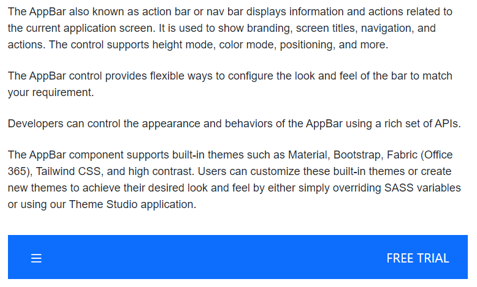

# Design User Interface with Blazor AppBar Component

## Spacer

[AppBarSpacer](https://help.syncfusion.com/cr/blazor/Syncfusion.Blazor.Navigations.AppBarSpacer.html)  is used to provide spacing between the AppBar contents which gives additional space to the content layout.

The following example depicts the code to provide spacing between the home and pan buttons in the AppBar:

```cshtml
@using Syncfusion.Blazor.Navigations
@using Syncfusion.Blazor.Buttons

<div class="control-container">
    <SfAppBar ColorMode="AppBarColor.Primary">
        <SfButton CssClass="e-inherit" IconCss="e-icons e-home"></SfButton>
        <AppBarSpacer></AppBarSpacer>
         <SfButton CssClass="e-inherit" IconCss="e-icons e-cut"></SfButton>
        <AppBarSpacer></AppBarSpacer>
        <SfButton CssClass="e-inherit" IconCss="e-icons e-pan"></SfButton>
    </SfAppBar>
</div>
```




## Separator

[AppBarSeparator](https://help.syncfusion.com/cr/blazor/Syncfusion.Blazor.Navigations.AppBarSeparator.html) shows a vertical line to visually group or separate the AppBar contents.

The following example depicts the code to provide a vertical line between a group of buttons in the AppBar.

```cshtml
@using Syncfusion.Blazor.Navigations
@using Syncfusion.Blazor.Buttons

<div class="control-container">
    <SfAppBar ColorMode="AppBarColor.Primary">
        <SfButton CssClass="e-inherit" IconCss="e-icons e-cut"></SfButton>
        <SfButton CssClass="e-inherit" IconCss="e-icons e-copy"></SfButton>
        <SfButton CssClass="e-inherit" IconCss="e-icons e-paste"></SfButton>
        <AppBarSeparator></AppBarSeparator>
        <SfButton CssClass="e-inherit" IconCss="e-icons e-bold"></SfButton>
        <SfButton CssClass="e-inherit" IconCss="e-icons e-underline"></SfButton>
        <SfButton CssClass="e-inherit" IconCss="e-icons e-italic"></SfButton>
        <AppBarSeparator></AppBarSeparator>
        <SfButton CssClass="e-inherit" IconCss="e-icons e-align-left"></SfButton>
        <SfButton CssClass="e-inherit" IconCss="e-icons e-align-right"></SfButton>
        <SfButton CssClass="e-inherit" IconCss="e-icons e-align-center"></SfButton>
        <SfButton CssClass="e-inherit" IconCss="e-icons e-justify"></SfButton>
    </SfAppBar>
</div>

<style>
    .control-container .e-btn.e-inherit {
        margin: 0 3px;
    }
</style>
```



## Media Query

Media Query is used to adjusting the AppBar for different screen sizes. Resize the screen to observe the responsive layout of the AppBar.

```cshtml
@using Syncfusion.Blazor.Navigations
@using Syncfusion.Blazor.Buttons

<div class="control-container">
    <SfAppBar ColorMode="AppBarColor.Primary">
        <SfButton CssClass="e-inherit" IconCss="e-icons e-menu"></SfButton>
        <SfButton CssClass="e-inherit" Content="Home"></SfButton>
        <SfButton CssClass="e-inherit" Content="About"></SfButton>
        <SfButton CssClass="e-inherit" Content="Products"></SfButton>
        <SfButton CssClass="e-inherit" Content="Contacts"></SfButton>
        <AppBarSpacer></AppBarSpacer>
        <AppBarSeparator></AppBarSeparator>
        <SfButton CssClass="e-inherit" Content="Login"></SfButton>
    </SfAppBar>
</div>

<style>
    .control-container .e-btn.e-inherit {
        margin: 0 3px;
    }
    @@media screen and (max-width: 1024px) {
        .control-container .e-appbar {
           flex-flow: row wrap;
           height: auto;
           gap: 8px;
        }
        .control-container {
           width: 350px;
        }
    }
    @@media screen and (max-width: 480px) {
        .control-container {
           width: 200px;
           margin: 0 2px;
        }
    }
</style>
```



## Designing AppBar with Menu

**SfMenu** component can be rendered as a child content of AppBar. You can inherit the AppBar component styles by setting CSS class as `e-inherit` to SfMenu component.

```cshtml
@using Syncfusion.Blazor.Navigations
@using Syncfusion.Blazor.Buttons

<div class="control-container">
    <SfAppBar ColorMode="AppBarColor.Primary">
        <SfButton CssClass="e-inherit" IconCss="e-icons e-menu"></SfButton>
        <SfMenu CssClass="e-inherit" TValue="MenuItem">
            <MenuItems>
                <MenuItem Text="Company">
                    <MenuItems>
                       <MenuItem Text="About Us"></MenuItem>
                       <MenuItem Text="Customers"></MenuItem>
                       <MenuItem Text="Blog"></MenuItem>
                       <MenuItem Text="Careers"></MenuItem>
                    </MenuItems>
                </MenuItem>
            </MenuItems>
        </SfMenu>
        <SfMenu CssClass="e-inherit" TValue="MenuItem">
            <MenuItems>
                <MenuItem Text="Products">
                    <MenuItems>
                       <MenuItem Text="Developer"></MenuItem>
                       <MenuItem Text="Analytics"></MenuItem>
                       <MenuItem Text="Reporting"></MenuItem>
                       <MenuItem Text="Help Desk"></MenuItem>
                    </MenuItems>
                </MenuItem>
            </MenuItems>
        </SfMenu>
        <SfMenu CssClass="e-inherit" TValue="MenuItem">
            <MenuItems>
                <MenuItem Text="About Us"></MenuItem>
            </MenuItems>
        </SfMenu>
        <SfMenu CssClass="e-inherit" TValue="MenuItem">
            <MenuItems>
                <MenuItem Text="Carrers"></MenuItem>
            </MenuItems>
        </SfMenu>
        <AppBarSpacer></AppBarSpacer>
        <SfButton CssClass="e-inherit"Content="Login"></SfButton>
    </SfAppBar>
</div>

<style>
    .control-container .e-btn.e-inherit {
        margin: 0 3px;
    }
</style>
```




## Designing AppBar with Buttons

**SfButton** and **SfDropDownButton** component can be rendered as a child content of AppBar. You can inherit the AppBar component styles by setting CSS class as `e-inherit` to SfButton and SfDropDownButton component.

```cshtml
@using Syncfusion.Blazor.Navigations
@using Syncfusion.Blazor.Buttons
@using Syncfusion.Blazor.SplitButtons

<div class="control-container">
    <SfAppBar ColorMode="AppBarColor.Primary">
        <SfButton CssClass="e-inherit" IconCss="e-icons e-menu"></SfButton>
        <SfDropDownButton CssClass="e-inherit" Content="Products">
            <DropDownMenuItems>
              <DropDownMenuItem Text="Developer"></DropDownMenuItem>
              <DropDownMenuItem Text="Analytics"></DropDownMenuItem>
              <DropDownMenuItem Text="Reporting"></DropDownMenuItem>
              <DropDownMenuItem Text="E-Signature"></DropDownMenuItem>
              <DropDownMenuItem Text="Help Desk"></DropDownMenuItem>
            </DropDownMenuItems>
        </SfDropDownButton>
        <AppBarSpacer></AppBarSpacer>
        <SfButton CssClass="e-inherit"Content="Login"></SfButton>
    </SfAppBar>
</div>

<style>
    .control-container .e-btn.e-inherit {
        margin: 0 3px;
    }
</style>
```




## Designing AppBar with SideBar

AppBar toggle button used to control the expand and collapse state of **SfSidebar** component. Click on the menu icon to expand/collapse the Sidebar. In the following sample, the `IsOpen` property has been used to show or hide the Sidebar on the AppBar button click.

```cshtml
@using Syncfusion.Blazor.Navigations
@using Syncfusion.Blazor.Buttons
@using Syncfusion.Blazor.Inputs

<div class="control-container">
    <div>
        <SfAppBar>
            <SfButton CssClass="e-inherit" IconCss="e-icons e-menu" OnClick="@Toggle"></SfButton>
            <div class="e-folder">
                <div class="e-folder-name">Navigation Pane</div>
            </div>
        </SfAppBar>
    </div>
    <SfSidebar HtmlAttributes="@HtmlAttribute" Width="210px" Target=".main-content" MediaQuery="(min-width:600px)" @bind-IsOpen="SidebarToggle">
        <ChildContent>
            <div class="main-menu">
                <div class="table-content">
                    <SfTextBox Placeholder="Search..."></SfTextBox>
                    <p class="main-menu-header">TABLE OF CONTENTS</p>
                </div>
                <div>
                    <SfTreeView CssClass="main-treeview" ExpandOn="@Expand" TValue="TreeData">
                        <TreeViewFieldsSettings Id="NodeId" Text="NodeText" DataSource="Treedata" HasChildren="HasChild" ParentID="Pid">
                        </TreeViewFieldsSettings>
                    </SfTreeView>
                </div>
            </div>
        </ChildContent>
    </SfSidebar>
    <div class="main-content" id="main-text">
        <div class="sidebar-content">
            <div class="sidebar-heading"> Responsive Sidebar with Treeview</div>
            <p class="paragraph-content">
                This is a graphical aid for visualizing and categorizing the site, in the style of an expandable and collapsable treeview component.
                It auto-expands to display the node(s), if any, corresponding to the currently viewed title, highlighting that node(s)
                and its ancestors. Load-on-demand when expanding nodes is available where supported (most graphical browsers),
                falling back to a full-page reload. MediaWiki-supported caching, aside from squid, has been considered so that
                unnecessary re-downloads of content are avoided where possible. The complete expanded/collapsed state of
                the treeview persists across page views in most situations.
            </p>
        </div>
    </div>
</div>

@code {
    public ExpandAction Expand = ExpandAction.Click;
    public bool SidebarToggle = false;
    Dictionary<string, object> HtmlAttribute = new Dictionary<string, object>()
    {
        {"class", "sidebar-treeview" }
    };
    public void Toggle(MouseEventArgs args)
    {
        SidebarToggle = !SidebarToggle;
    }
    public class TreeData {
        public string NodeId { get; set; }
        public string NodeText { get; set; }
        public bool HasChild { get; set; }
        public string Pid { get; set; }
    }
    private List<TreeData> Treedata = new List<TreeData> ();
    protected override void OnInitialized() {
        base.OnInitialized();
        Treedata.Add(new TreeData { NodeId = "01", NodeText = "Installation" });
        Treedata.Add(new TreeData { NodeId = "02", NodeText = "Deployment" });
        Treedata.Add(new TreeData { NodeId = "03", NodeText = "Quick Start" });
        Treedata.Add(new TreeData { NodeId = "04", NodeText = "Components", HasChild=true });
        Treedata.Add(new TreeData { NodeId = "04-01", NodeText = "Calendar", Pid="04" });
        Treedata.Add(new TreeData { NodeId = "04-02", NodeText = "DatePicker", Pid="04" });
        Treedata.Add(new TreeData { NodeId = "04-03", NodeText = "DateTimePicker", Pid="04" });
        Treedata.Add(new TreeData { NodeId = "04-04", NodeText = "DateRangePicker", Pid="04" });
        Treedata.Add(new TreeData { NodeId = "04-05", NodeText = "TimePicker", Pid="04" });
        Treedata.Add(new TreeData { NodeId = "04-06", NodeText = "SideBar", Pid="04" });
    }
}

<style>
    .e-appbar .e-folder {
        margin:0 5px;
    }
    .container-fluid {
        padding-left: 0;
        padding-right: 0;
    }
    .sidebar-treeview .e-treeview .e-icon-collapsible,
    .sidebar-treeview .e-treeview .e-icon-expandable {
        float: right;
    }
    .sidebar-treeview .e-treeview .e-icon-collapsible,
    .sidebar-treeview .e-treeview .e-icon-expandable {
        margin: 3px;
    }
    .sidebar-treeview .e-treeview,
    .sidebar-treeview .e-treeview .e-ul {
        padding: 0;
        margin: 0;
    }
    .control-container .sidebar-treeview {
        z-index: 20 !important;
    }
    .sidebar-treeview .main-menu .main-menu-header {
        color: #656a70;
        padding: 15px 15px 15px 0;
        font-size: 14px;
        width: 13em;
        margin: 0;
    }
    #main-text .sidebar-heading {
        font-size: 16px;
    }
    #main-text .sidebar-content .line {
        width: 100%;
        height: 1px;
        border-bottom: 1px dashed #ddd;
        margin: 40px 0;
    }
    #main-text .sidebar-content {
        padding: 15px;
        font-size: 14px;
    }
    #main-text .paragraph-content {
        padding: 15px 0;
        font-weight: normal;
        font-size: 14px;
    }
    .sidebar-treeview .main-treeview .icon {
        font-family: 'fontello';
        font-size: 16px;
        margin: -4px 0;
    }
    .e-folder {
        text-align: center;
        font-weight: 500;
        font-size: 16px
    }
    .sidebar-treeview .e-treeview .e-text-content {
        padding-left: 18px;
    }
    #wrapper .e-toolbar {
        border-bottom: 1px solid #d2d6de;
    }
    .control-container .main-content {
        height: 380px;
    }
    .sidebar-treeview {
        border-right: 1px solid #dee2e6 !important;
    }
    .e-folder-name {
        margin-top: -2px;
    }
</style>
```


