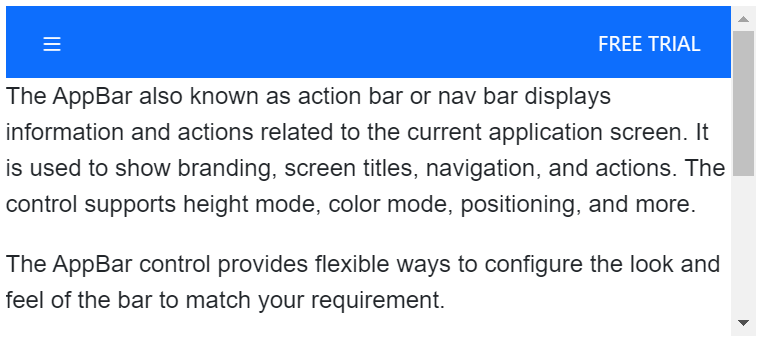
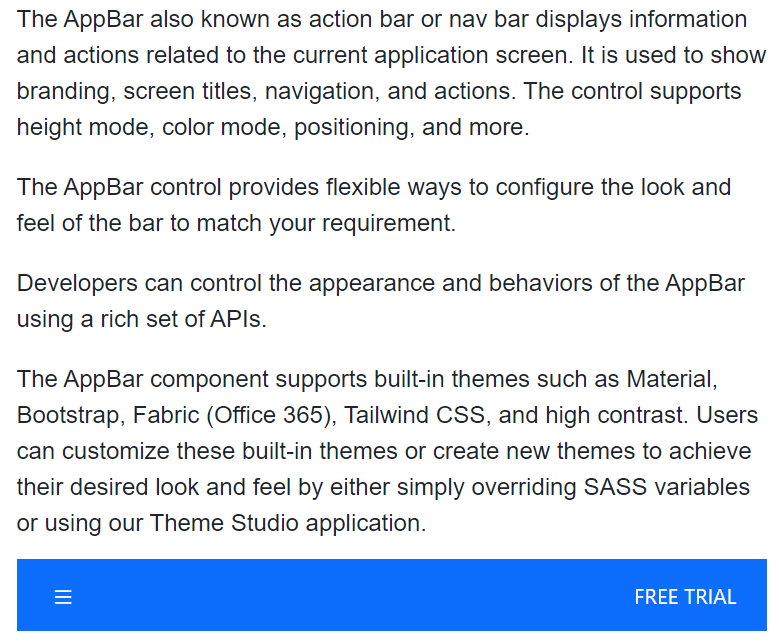
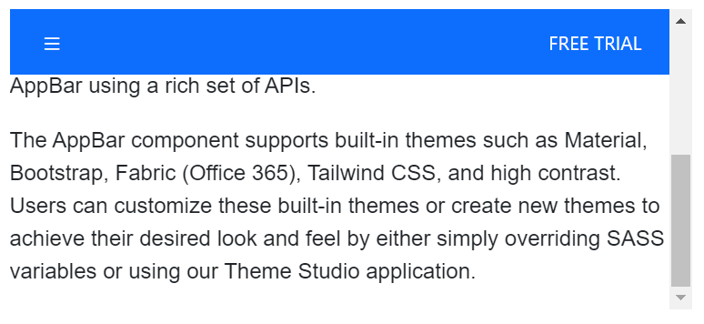

# Positioning in Blazor AppBar Component

The AppBar component offers flexible control over its placement and behavior within your application's layout. You can configure its position and whether it remains visible during scrolling using the [Position](https://help.syncfusion.com/cr/blazor/Syncfusion.Blazor.Navigations.SfAppBar.html#Syncfusion_Blazor_Navigations_SfAppBar_Position) and [IsSticky](https://help.syncfusion.com/cr/blazor/Syncfusion.Blazor.Navigations.SfAppBar.html#Syncfusion_Blazor_Navigations_SfAppBar_IsSticky) property. The AppBar provides the following options for setting its position:

* Top AppBar
* Bottom AppBar
* Sticky AppBar

### Top AppBar

A top AppBar is the most common configuration, positioning the AppBar at the top of its parent container or the viewport. This is the default behavior if the `Position` property is not explicitly set.

```cshtml
@using Syncfusion.Blazor.Navigations
@using Syncfusion.Blazor.Buttons

<div class="control-container">
    <SfAppBar ColorMode="AppBarColor.Primary">
        <SfButton CssClass="e-inherit" IconCss="e-icons e-menu"></SfButton>
        <AppBarSpacer></AppBarSpacer>
        <SfButton CssClass="e-inherit" Content="FREE TRIAL"></SfButton>
    </SfAppBar>
    <div class="appbar-content" style="font-size: 12px">
        <p>
            The AppBar also known as action bar or nav bar displays information and actions related to the current application screen. It is used to show branding, screen titles, navigation, and actions. The control supports height mode, color mode, positioning, and more.
        </p>
        <p>
            The AppBar control provides flexible ways to configure the look and feel of the bar to match your requirement.
        </p>
        <p>
            Developers can control the appearance and behaviors of the AppBar using a rich set of APIs.
        </p>
        <p>
            The AppBar component supports built-in themes such as Material, Bootstrap, Fabric (Office 365), Tailwind CSS, and high contrast. Users can customize these built-in themes or create new themes to achieve their desired look and feel by either simply overriding SASS variables or using our Theme Studio application.
        </p>
    </div>
</div>

<style>
    .control-container {
        height: 220px;
        margin: 0 auto;
        width: 500px;
        overflow-y: scroll;
    }
    .control-container .e-btn.e-inherit {
        margin: 0 3px;
    }
</style>
```




### Bottom AppBar

A bottom AppBar positions the component at the bottom of its parent container. This position can be set to the AppBar by setting `AppBarPosition.Bottom` to the property [Position](https://help.syncfusion.com/cr/blazor/Syncfusion.Blazor.Navigations.SfAppBar.html#Syncfusion_Blazor_Navigations_SfAppBar_Position).

```cshtml
@using Syncfusion.Blazor.Navigations
@using Syncfusion.Blazor.Buttons

<div class="control-container">
    <SfAppBar ColorMode="AppBarColor.Primary" Position="AppBarPosition.Bottom">
        <SfButton CssClass="e-inherit" IconCss="e-icons e-menu"></SfButton>
        <AppBarSpacer></AppBarSpacer>
        <SfButton CssClass="e-inherit" Content="FREE TRIAL"></SfButton>
    </SfAppBar>
    <div class="appbar-content" style="font-size: 12px">
        <p>
            The AppBar also known as action bar or nav bar displays information and actions related to the current application screen. It is used to show branding, screen titles, navigation, and actions. The control supports height mode, color mode, positioning, and more.
        </p>
        <p>
            The AppBar control provides flexible ways to configure the look and feel of the bar to match your requirement.
        </p>
        <p>
            Developers can control the appearance and behaviors of the AppBar using a rich set of APIs.
        </p>
        <p>
            The AppBar component supports built-in themes such as Material, Bootstrap, Fabric (Office 365), Tailwind CSS, and high contrast. Users can customize these built-in themes or create new themes to achieve their desired look and feel by either simply overriding SASS variables or using our Theme Studio application.
        </p>
    </div>
</div>

<style>
    .control-container {
        height: 420px;
        width: 500px;
        margin: 0 auto;
        position: relative;
    }
    .control-container .e-btn.e-inherit {
        margin: 0 3px;
    }
</style>
```




### Sticky AppBar

A sticky AppBar remains visible at the top of the viewport even when the page content is scrolled.This position can be set to the AppBar by setting `true` to the property [IsSticky](https://help.syncfusion.com/cr/blazor/Syncfusion.Blazor.Navigations.SfAppBar.html#Syncfusion_Blazor_Navigations_SfAppBar_IsSticky).

```cshtml
@using Syncfusion.Blazor.Navigations
@using Syncfusion.Blazor.Buttons

<div class="control-container">
    <SfAppBar ColorMode="AppBarColor.Primary" IsSticky=true>
        <SfButton CssClass="e-inherit" IconCss="e-icons e-menu"></SfButton>
        <AppBarSpacer></AppBarSpacer>
        <SfButton CssClass="e-inherit" Content="FREE TRIAL"></SfButton>
    </SfAppBar>
    <div class="appbar-content" style="font-size: 12px">
        <p>
            The AppBar also known as action bar or nav bar displays information and actions related to the current application screen. It is used to show branding, screen titles, navigation, and actions. The control supports height mode, color mode, positioning, and more.
        </p>
        <p>
            The AppBar control provides flexible ways to configure the look and feel of the bar to match your requirement.
        </p>
        <p>
            Developers can control the appearance and behaviors of the AppBar using a rich set of APIs.
        </p>
        <p>
            The AppBar component supports built-in themes such as Material, Bootstrap, Fabric (Office 365), Tailwind CSS, and high contrast. Users can customize these built-in themes or create new themes to achieve their desired look and feel by either simply overriding SASS variables or using our Theme Studio application.
        </p>
    </div>
</div>

<style>
    .control-container {
        height: 220px;
        margin: 0 auto;
        width: 500px;
        overflow-y: scroll;
    }
    .control-container .e-btn.e-inherit {
        margin: 0 3px;
    }
</style>
```


