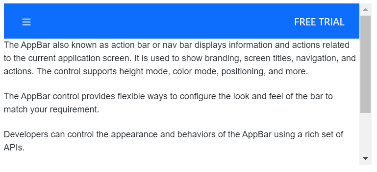
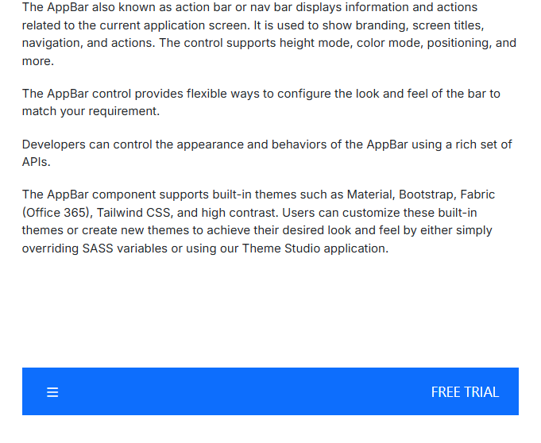
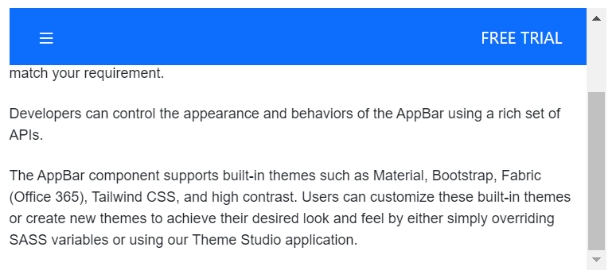

# Position with Blazor AppBar Component

This section briefly explains about how to configure the position of the AppBar. The AppBar provides the following options for setting its position:

* Top AppBar
* Bottom AppBar
* Sticky AppBar

### Top AppBar

Top Appbar is the default once in which it positions the AppBar at the top of the content.

```cshtml
@using Syncfusion.Blazor.Navigations
@using Syncfusion.Blazor.Buttons

<div class="control-container">
    <SfAppBar ColorMode="AppBarColor.Primary">
        <SfButton aria-label="menu" CssClass="e-inherit" IconCss="e-icons e-menu"></SfButton>
        <span class="regular">Top AppBar</span>
        <AppBarSpacer></AppBarSpacer>
        <SfButton CssClass="e-inherit" Content="FREE TRIAL"></SfButton>
    </SfAppBar>
    <div class="appbar-content">
        <p>
            The AppBar also known as action bar or nav bar displays information and actions related to the current application screen. It is used to show branding, screen titles, navigation, and actions. The control supports height mode, color mode, positioning, and more.
        </p>
        <p>
            The AppBar control provides flexible ways to configure the look and feel of the bar to match your requirement.
        </p>
        <p>
            Developers can control the appearance and behaviors of the AppBar using a rich set of APIs.
        </p>
        <p>
            The AppBar component supports built-in themes such as Material, Bootstrap, Fabric (Office 365), Tailwind CSS, and high contrast. Users can customize these built-in themes or create new themes to achieve their desired look and feel by either simply overriding SASS variables or using our Theme Studio application.
        </p>
    </div>
</div>

<style>
    .control-container {
        height: 220px;
        margin: 0 auto;
        width: 500px;
        overflow-y: scroll;
    }
    .e-appbar .regular {
        margin:0 5px;
    }
</style>
```



### Bottom AppBar

This position can be set to the AppBar by setting `AppBarPosition.Bottom` to the property `Position`. Bottom Appbar positions the Appbar at the bottom of the content.

```cshtml
@using Syncfusion.Blazor.Navigations
@using Syncfusion.Blazor.Buttons

<div class="control-container">
    <SfAppBar ColorMode="AppBarColor.Primary" Position="AppBarPosition.Bottom">
        <SfButton aria-label="menu" CssClass="e-inherit" IconCss="e-icons e-menu"></SfButton>
        <span class="regular">Bottom AppBar</span>
        <AppBarSpacer></AppBarSpacer>
        <SfButton CssClass="e-inherit" Content="FREE TRIAL"></SfButton>
    </SfAppBar>
    <div class="appbar-content">
        <p>
            The AppBar also known as action bar or nav bar displays information and actions related to the current application screen. It is used to show branding, screen titles, navigation, and actions. The control supports height mode, color mode, positioning, and more.
        </p>
        <p>
            The AppBar control provides flexible ways to configure the look and feel of the bar to match your requirement.
        </p>
        <p>
            Developers can control the appearance and behaviors of the AppBar using a rich set of APIs.
        </p>
        <p>
            The AppBar component supports built-in themes such as Material, Bootstrap, Fabric (Office 365), Tailwind CSS, and high contrast. Users can customize these built-in themes or create new themes to achieve their desired look and feel by either simply overriding SASS variables or using our Theme Studio application.
        </p>
    </div>
</div>

<style>
    .control-container {
        height: 420px;
        width: 500px;
        margin: 0 auto;
        position: relative;
    }
    .e-appbar .regular {
        margin:0 5px;
    }
</style>
```



### Sticky AppBar

This position can be set to the AppBar by setting `true` to the property `IsSticky`. AppBar will be sticky while scrolling the AppBar content.

```cshtml
@using Syncfusion.Blazor.Navigations
@using Syncfusion.Blazor.Buttons

<div class="control-container">
    <SfAppBar ColorMode="AppBarColor.Primary" IsSticky=true>
        <SfButton aria-label="menu" CssClass="e-inherit" IconCss="e-icons e-menu"></SfButton>
        <span class="regular">Sticky AppBar</span>
        <AppBarSpacer></AppBarSpacer>
        <SfButton CssClass="e-inherit" Content="FREE TRIAL"></SfButton>
    </SfAppBar>
    <div class="appbar-content">
        <p>
            The AppBar also known as action bar or nav bar displays information and actions related to the current application screen. It is used to show branding, screen titles, navigation, and actions. The control supports height mode, color mode, positioning, and more.
        </p>
        <p>
            The AppBar control provides flexible ways to configure the look and feel of the bar to match your requirement.
        </p>
        <p>
            Developers can control the appearance and behaviors of the AppBar using a rich set of APIs.
        </p>
        <p>
            The AppBar component supports built-in themes such as Material, Bootstrap, Fabric (Office 365), Tailwind CSS, and high contrast. Users can customize these built-in themes or create new themes to achieve their desired look and feel by either simply overriding SASS variables or using our Theme Studio application.
        </p>
    </div>
</div>

<style>
    .control-container {
        height: 220px;
        margin: 0 auto;
        width: 500px;
        overflow-y: scroll;
    }
    .e-appbar .regular {
        margin:0 5px;
    }
</style>
```

