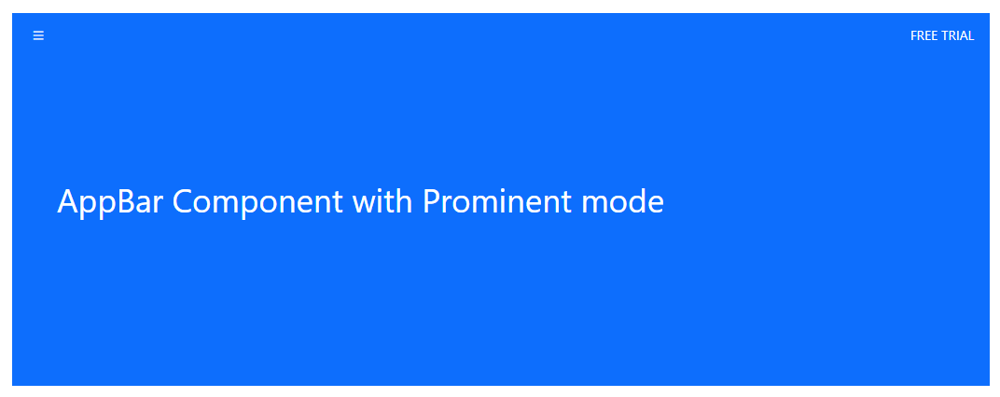

# Size and Color with Blazor AppBar Component

## Size

This section briefly explains the different types of AppBar. The available types of Blazor AppBar are as follows:

* Regular AppBar
* Prominent AppBar
* Dense AppBar

### Regular AppBar

This mode is the default one in which the AppBar is displayed with the default height.

```cshtml
@using Syncfusion.Blazor.Navigations
@using Syncfusion.Blazor.Buttons

<div class="control-container">
    <SfAppBar ColorMode="AppBarColor.Primary">
        <SfButton CssClass="e-inherit" IconCss="e-icons e-menu"></SfButton>
        <span class="regular">Regular AppBar</span>
        <AppBarSpacer></AppBarSpacer>
        <SfButton CssClass="e-inherit" Content="FREE TRIAL"></SfButton>
    </SfAppBar>
</div>

<style>
    .control-container {
        height: 300px;
        margin: 0 auto;
        width: 500px;
    }
    .control-container .e-btn.e-inherit {
        margin: 0 3px;
    }
</style>
```


### Prominent AppBar

This height mode can be set to the AppBar by setting `AppBarMode.Prominent` to the property [Mode](https://help.syncfusion.com/cr/blazor/Syncfusion.Blazor.Navigations.SfAppBar.html#Syncfusion_Blazor_Navigations_SfAppBar_Mode). Prominent AppBar is displayed with longer height, and can be used for larger titles, images or texts. It is also longer than regular. In the folllowing example, we have customized the prominent text using align-self and white-space CSS property. You can change the prominent AppBar height if larger titles, images or texts are used.

```cshtml
@using Syncfusion.Blazor.Navigations
@using Syncfusion.Blazor.Buttons

<div class="control-container">
    <SfAppBar ColorMode="AppBarColor.Primary" Mode="AppBarMode.Prominent">
        <SfButton CssClass="e-inherit" IconCss="e-icons e-menu"></SfButton>
        <span class="prominent">AppBar Component with Prominent mode</span>
        <AppBarSpacer></AppBarSpacer>
        <SfButton CssClass="e-inherit" Content="FREE TRIAL"></SfButton>
    </SfAppBar>
</div>

<style>
    .control-container {
        height: 300px;
        margin: 0 auto;
        width: 500px;
    }
    .control-container .e-appbar .prominent {
        margin:0 5px;
        align-self: flex-end;
        white-space: break-spaces;
        text-align: inherit;
    }
</style>
```



### Dense AppBar

This height mode can be set to the AppBar by setting `AppBarMode.Dense` to the property [Mode](https://help.syncfusion.com/cr/blazor/Syncfusion.Blazor.Navigations.SfAppBar.html#Syncfusion_Blazor_Navigations_SfAppBar_Mode). Dense AppBar is displayed with shorter height which is denser to accommodate all the AppBar content.

```cshtml
@using Syncfusion.Blazor.Navigations
@using Syncfusion.Blazor.Buttons

<div class="control-container">
    <SfAppBar ColorMode="AppBarColor.Primary" Mode="AppBarMode.Dense">
        <SfButton CssClass="e-inherit" IconCss="e-icons e-menu"></SfButton>
        <span class="dense">Dense AppBar</span>
        <AppBarSpacer></AppBarSpacer>
        <SfButton CssClass="e-inherit" Content="FREE TRIAL"></SfButton>
    </SfAppBar>
</div>

<style>
    .control-container {
        height: 300px;
        margin: 0 auto;
        width: 500px;
    }
    .control-container .e-btn.e-inherit {
        margin: 0 3px;
    }
</style>
```


## Color

This section briefly explains the different types of background color used for AppBar. The background and font colors can be set using the [ColorMode](https://help.syncfusion.com/cr/blazor/Syncfusion.Blazor.Navigations.SfAppBar.html#Syncfusion_Blazor_Navigations_SfAppBar_ColorMode) property. The available types of background color for Blazor AppBar are as follows:

* Light AppBar
* Dark AppBar
* Primary AppBar
* Inherit AppBar

### Light AppBar

This color mode is the default one in which the AppBar can be displayed with a light background and its corresponding font color.

```cshtml
@using Syncfusion.Blazor.Navigations
@using Syncfusion.Blazor.Buttons

<div class="control-container">
    <SfAppBar>
        <SfButton CssClass="e-inherit" IconCss="e-icons e-menu"></SfButton>
        <AppBarSpacer></AppBarSpacer>
        <SfButton IsPrimary=true Content="FREE TRIAL"></SfButton>
    </SfAppBar>
</div>

<style>
    .control-container {
        height: 300px;
        margin: 0 auto;
        width: 500px;
    }
    .control-container .e-btn.e-inherit {
        margin: 0 3px;
    }
</style>
```


### Dark AppBar

This color mode can be set to the AppBar by setting `AppBarColor.Dark` to the property [ColorMode](https://help.syncfusion.com/cr/blazor/Syncfusion.Blazor.Navigations.SfAppBar.html#Syncfusion_Blazor_Navigations_SfAppBar_ColorMode). Dark AppBar can be displayed with a dark background and its corresponding font color.

```cshtml
@using Syncfusion.Blazor.Navigations
@using Syncfusion.Blazor.Buttons

<div class="control-container">
    <SfAppBar ColorMode="AppBarColor.Dark">
        <SfButton CssClass="e-inherit" IconCss="e-icons e-menu"></SfButton>
        <AppBarSpacer></AppBarSpacer>
        <SfButton CssClass="e-inherit" Content="FREE TRIAL"></SfButton>
    </SfAppBar>
</div>

<style>
    .control-container {
        height: 300px;
        margin: 0 auto;
        width: 500px;
    }
    .control-container .e-btn.e-inherit {
        margin: 0 3px;
    }
</style>
```


### Primary AppBar

This color mode can be set to the AppBar by setting `AppBarColor.Primary` to the property [ColorMode](https://help.syncfusion.com/cr/blazor/Syncfusion.Blazor.Navigations.SfAppBar.html#Syncfusion_Blazor_Navigations_SfAppBar_ColorMode). Primary AppBar can be displayed with a primary colors.

```cshtml
@using Syncfusion.Blazor.Navigations
@using Syncfusion.Blazor.Buttons

<div class="control-container">
    <SfAppBar ColorMode="AppBarColor.Primary">
        <SfButton CssClass="e-inherit" IconCss="e-icons e-menu"></SfButton>
        <AppBarSpacer></AppBarSpacer>
        <SfButton CssClass="e-inherit" Content="FREE TRIAL"></SfButton>
    </SfAppBar>
</div>

<style>
    .control-container {
        height: 300px;
        margin: 0 auto;
        width: 500px;
    }
    .control-container .e-btn.e-inherit {
        margin: 0 3px;
    }
</style>
```


### Inherit AppBar

This color mode can be set to the AppBar by setting `AppBarColor.Inherit` to the property [ColorMode](https://help.syncfusion.com/cr/blazor/Syncfusion.Blazor.Navigations.SfAppBar.html#Syncfusion_Blazor_Navigations_SfAppBar_ColorMode). The AppBar inherits the background and font color from its parent element.

```cshtml
@using Syncfusion.Blazor.Navigations
@using Syncfusion.Blazor.Buttons

<div class="control-container">
    <SfAppBar ColorMode="AppBarColor.Inherit">
        <SfButton CssClass="e-inherit" IconCss="e-icons e-menu"></SfButton>
        <AppBarSpacer></AppBarSpacer>
        <SfButton IsPrimary=true Content="FREE TRIAL"></SfButton>
    </SfAppBar>
</div>

<style>
    .control-container {
        height: 300px;
        margin: 0 auto;
        width: 500px;
    }
    .control-container .e-btn.e-inherit {
        margin: 0 3px;
    }
</style>
```

