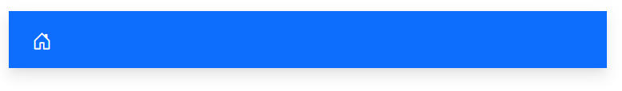

# Styles and Appearances in Blazor AppBar Component

To modify the AppBar appearance, you need to override the default CSS of AppBar component. Please find the list of CSS classes and its corresponding section in AppBar component. Also, you have an option to create your own custom theme for the controls using our [Theme Studio](https://blazor.syncfusion.com/themestudio/?theme=material).

|CSS Class | Purpose of Class |
|-----|----- |
|.e-appbar|To customize the appbar.|

>Note: You can change the default value of the property using customization(For Example: You can change the prominent appbar height)

## CssClass

CssClass is used for AppBar customization based on the custom class. In the below example AppBar background and color is customized using `CssClass` property.

```cshtml
@using Syncfusion.Blazor.Navigations
@using Syncfusion.Blazor.Buttons

<div class="control-container">
    <SfAppBar ColorMode="AppBarColor.Primary" CssClass="custom-appbar">
       <SfButton CssClass="e-inherit" IconCss="e-icons e-menu"></SfButton>
    </SfAppBar>
</div>

<style>
    .control-container {
        height: 300px;
        margin: 0 auto;
        width: 500px;
    }
    .e-appbar.custom-appbar {
        background: #adadb1;
        color: #fff;
    }
</style>
```


## HtmlAttributes

It can be used to additional inline attributes through `@attributes` directive. In the below code example, Elevation of the AppBar customized using `@attributes` directive.

```cshtml
@using Syncfusion.Blazor.Navigations
@using Syncfusion.Blazor.Buttons

<div class="control-container">
    <SfAppBar ColorMode="AppBarColor.Primary" @attributes="customAttribute">
       <SfButton CssClass="e-inherit" IconCss="e-icons e-home"></SfButton>
    </SfAppBar>
</div>

@code { 
     Dictionary<string, object> customAttribute = new Dictionary<string, object>() 
     { 
         { "style", "box-shadow: 0 5px 5px -3px rgba(0,0,0,.06), 0 8px 10px 1px rgba(0,0,0,.042), 0 3px 14px 2px rgba(0,0,0,.036)" } 
     }; 
}

<style>
    .control-container {
        height: 300px;
        margin: 0 auto;
        width: 500px;
    }
</style>
```



