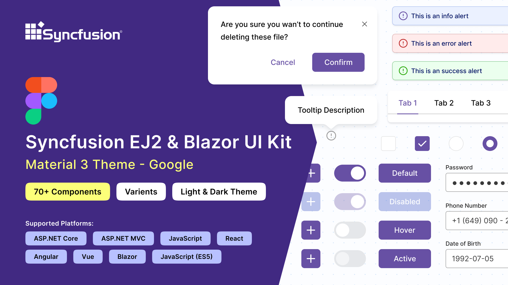
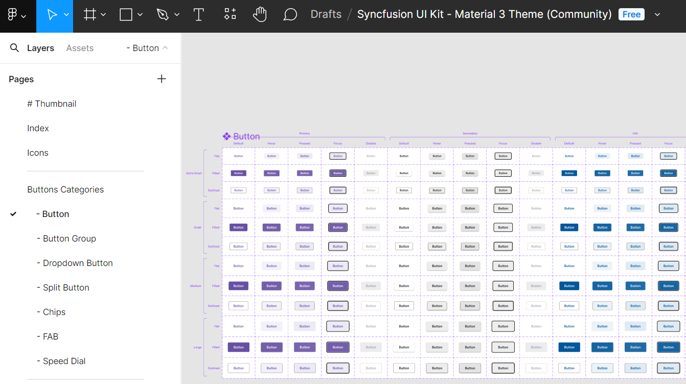
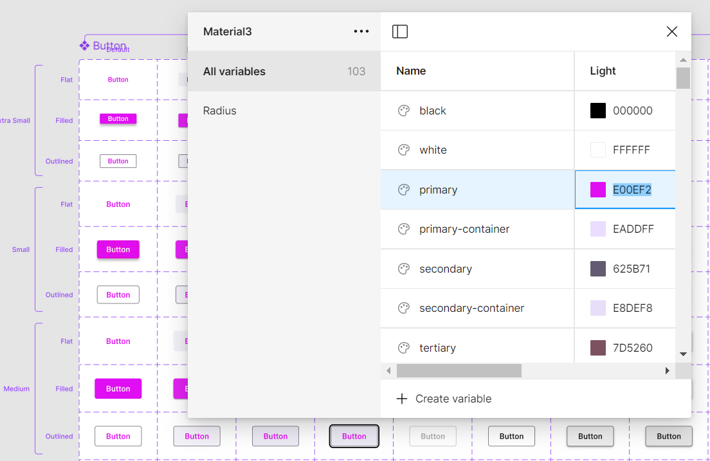
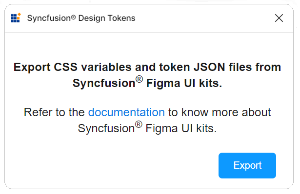

# Figma UI kits for Syncfusion® controls

Syncfusion&reg; provides [Figma UI kits](https://www.figma.com/@syncfusion) to streamline collaboration between designers and developers. The kits match the themes used by Syncfusion&reg; Blazor components and are available for [Material 3](https://www.figma.com/community/file/1454123774600129202/syncfusion-ui-kit-material-3-theme), [Fluent](https://www.figma.com/community/file/1385969120047188707/syncfusion-ui-kit-fluent-theme), [Tailwind](https://www.figma.com/community/file/1385969065626384098/syncfusion-ui-kit-tailwind-theme), and [Bootstrap 5](https://www.figma.com/community/file/1385968977953858272/syncfusion-ui-kit-bootstrap-5-theme).

Each kit contains reusable design controls with states and variants, along with detailed figures, measurements, and icons that represent Syncfusion&reg; controls.

## Advantages of UI kits

The Syncfusion&reg; Figma UI kits offer the following advantages:
- Detailed information about controls, including lists, states, and variants, to quickly understand available options.
- Design controls follow the [atomic design methodology](https://atomicdesign.bradfrost.com/chapter-2/), making customization straightforward.
- Developers can match Syncfusion&reg; controls to design requirements for alignment and accuracy.
- Standardized controls and themes maintain a consistent look and feel across projects.

## Downloading the UI kits

The Syncfusion&reg; Figma UI kits are available in the [Figma community](https://www.figma.com/@syncfusion). Download the theme-specific kits from the following links:

- [Material 3](https://www.figma.com/community/file/1454123774600129202/syncfusion-ui-kit-material-3-theme)
- [Fluent](https://www.figma.com/community/file/1385969120047188707/syncfusion-ui-kit-fluent-theme)
- [Tailwind](https://www.figma.com/community/file/1385969065626384098/syncfusion-ui-kit-tailwind-theme)
- [Bootstrap 5](https://www.figma.com/community/file/1385968977953858272/syncfusion-ui-kit-bootstrap-5-theme)

## Structure of the UI kits

The Figma UI kits are structured for easy navigation and exploration of controls. They include the following pages:

- **Thumbnail**: This page serves as the cover page for the UI kit.
- **Index**: Here, users can find a detailed list of all control names, making it simple to identify and locate specific controls within the UI kit.
- **Icons**: Contains a collection of all icons used in the design controls.
- **UI Controls**: At the core of the UI kit, this section features a wide range of essential UI controls. Each control is meticulously designed with detailed figures, measurements, and icons, showcasing various states and variants.

## Customizing the UI kits

The Syncfusion&reg; Figma UI kits are customizable to meet specific needs, allowing unique designs and color adjustments to match brand guidelines. Because the controls are built using the [atomic design methodology](https://atomicdesign.bradfrost.com/chapter-2/), customizations will be seamlessly reflected across multiple controls and variants.

Here's how to customize the primary button color of the Material 3 theme within your layout:

1. Visit our [UI kits](#downloading-the-ui-kits) and choose your preferred theme, such as the Material 3 theme.
2. Open the selected theme in the Figma web application by clicking **Open in Figma**.
3. For the desktop application, click **Import** in the top-right corner. Select the downloaded Syncfusion&reg; Figma file and click **Open**.
4. Identify the button you wish to customize within your layout.
5. On the right side of the Figma interface, locate the color variables. For example, a button color variable might be labeled `$primary-bg-color`, derived from the primary color variable.
6. To customize the primary button color, click outside the button to reveal the **Local variables** panel. It contains the design tokens for color variables. Click **Local variables**.
7. A popup will show the design token list. You can change the primary color using a color palette.
8. Once you've selected the new color (e.g., pink) for the primary variable, the button's color pattern will be updated accordingly. You'll see the changes reflected in real-time within your design.

In addition to changing the button color, you can also customize other aspects like font, spacing, shadows, etc., of the UI controls:

Feel free to experiment with these customization options to create a design that perfectly matches your requirements.

## Download customized styles

Download customized style changes as tokens and CSS variables using the Syncfusion&reg; Design Tokens plugin. This plugin bridges the gap between design and development by converting Figma design variables into Syncfusion&reg; tokens for direct use in your applications to ensure a smooth transition from design to implementation.

### Exporting design tokens

Follow these steps to download the customized styles from the Figma UI Kit:

- First, open a [Syncfusion&reg; Figma UI Kit](https://www.figma.com/@syncfusion).
- Navigate to the `Plugins and widgets` section in Figma and search for **Syncfusion&reg; Design Tokens**.
- Run the plugin. A dialog appears with an `Export` button.
- Click the `Export` button. This action will generate a zip file containing your design tokens.
- Select a directory to save the exported files.
- Extract the downloaded zip file to access its contents.

### Use design tokens

The exported zip file includes the following files:
  - `css-variables.css`: Contains CSS variables for light and dark themes derived from the Figma design. Import this file alongside component styles to reflect custom designs.
  - `<theme-name>-tokens.json`: Contains style variables and values in a JSON format compatible with [Theme Studio](./theme-studio). This file, prefixed with the corresponding theme name, can be [imported](./theme-studio#import-previously-changed-settings-into-the-theme-studio) into [Theme Studio](./theme-studio) for further customization. After processing in [Theme Studio](./theme-studio), you can [download](./theme-studio#download-the-customized-theme) the updated styles file and integrate it into your application, bringing your custom themes to life.

This streamlined process ensures that your unique design vision, crafted in Figma, is accurately translated into your final application, maintaining consistency between design and implementation.

## Upgrade the UI kits

To upgrade the UI kits, download the latest versions from the links above. Follow these guidelines for a seamless upgrade:

- Keep track of updates or new versions of UI kits from Syncfusion.
- Before upgrading, back up your ongoing projects to prevent data loss or compatibility issues.
- Share feedback regarding the upgraded UI kits, including any issues encountered or suggestions for improvement.

## See also

* [Available themes](https://blazor.syncfusion.com/documentation/appearance/themes)
* [Customizing themes](https://blazor.syncfusion.com/documentation/appearance/theme-studio#customizing-theme-color-from-theme-studio)
