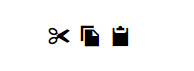
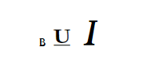
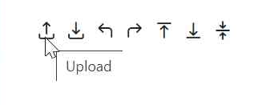
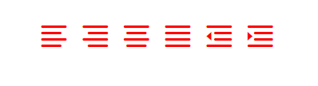
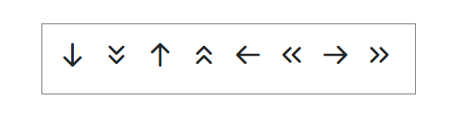
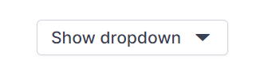

# Blazor icons library

The Syncfusion<sup style="font-size:70%">&reg;</sup> Blazor library provides a set of base64-formatted font icons used across Syncfusion<sup style="font-size:70%">&reg;</sup> Blazor components. Icons can be used via the `SfIcon` component or the `e-icons` CSS class.

Watch a quick-start video for the Blazor Icon component:



## Icon component

Syncfusion<sup style="font-size:70%">&reg;</sup> Icon component provides support to render predefined Syncfusion<sup style="font-size:70%">&reg;</sup> icons or custom font icons.

Refer to the [Getting started with Syncfusion Blazor Web App](https://blazor.syncfusion.com/documentation/getting-started/blazor-web-app) guide for installation and common configuration.

The following code example shows the rendering of built-in Syncfusion<sup style="font-size:70%">&reg;</sup> icons from predefined [IconName](https://help.syncfusion.com/cr/blazor/Syncfusion.Blazor.Buttons.IconName.html) options using [Name](https://help.syncfusion.com/cr/blazor/Syncfusion.Blazor.Buttons.SfIcon.html#Syncfusion_Blazor_Buttons_SfIcon_Name) property by defining them in `SfIcon` tag.

```cshtml
@using Syncfusion.Blazor.Buttons

<SfIcon Name="IconName.Cut"></SfIcon>
<SfIcon Name="IconName.Copy"></SfIcon>
<SfIcon Name="IconName.Paste"></SfIcon>
<SfIcon Name="IconName.Bold"></SfIcon>
<SfIcon Name="IconName.Underline"></SfIcon>
<SfIcon Name="IconName.Italic"></SfIcon>
```



### Icon size

The font size of the icon can be changed using the [Size](https://help.syncfusion.com/cr/blazor/Syncfusion.Blazor.Buttons.SfIcon.html#Syncfusion_Blazor_Buttons_SfIcon_Size) property. The default size is `Medium`.

* When IconSize set to Small, the font size will be `8px`.
* When IconSize set to Medium, the font size will be `16px`.
* When IconSize set to Large, the font size will be `24px`.

```cshtml
@using Syncfusion.Blazor.Buttons

<p>Smaller icons</p>
<SfIcon Name="IconName.Cut" Size="IconSize.Small"></SfIcon>
<SfIcon Name="IconName.Copy" Size="IconSize.Small"></SfIcon>
<SfIcon Name="IconName.Paste" Size="IconSize.Small"></SfIcon>
<SfIcon Name="IconName.Bold" Size="IconSize.Small"></SfIcon>
<SfIcon Name="IconName.Underline" Size="IconSize.Small"></SfIcon>
<SfIcon Name="IconName.Italic" Size="IconSize.Small"></SfIcon>
<p>Medium icons</p>
<SfIcon Name="IconName.Cut" Size="IconSize.Medium"></SfIcon>
<SfIcon Name="IconName.Copy" Size="IconSize.Medium"></SfIcon>
<SfIcon Name="IconName.Paste" Size="IconSize.Medium"></SfIcon>
<SfIcon Name="IconName.Bold" Size="IconSize.Medium"></SfIcon>
<SfIcon Name="IconName.Underline" Size="IconSize.Medium"></SfIcon>
<SfIcon Name="IconName.Italic" Size="IconSize.Medium"></SfIcon>
<p>Larger icons</p>
<SfIcon Name="IconName.Cut" Size="IconSize.Large"></SfIcon>
<SfIcon Name="IconName.Copy" Size="IconSize.Large"></SfIcon>
<SfIcon Name="IconName.Paste" Size="IconSize.Large"></SfIcon>
<SfIcon Name="IconName.Bold" Size="IconSize.Large"></SfIcon>
<SfIcon Name="IconName.Underline" Size="IconSize.Large"></SfIcon>
<SfIcon Name="IconName.Italic" Size="IconSize.Large"></SfIcon>
```



N> The `Size` property is applicable only when defining the icon using `Name` property. Otherwise, use [IconCss](https://help.syncfusion.com/cr/blazor/Syncfusion.Blazor.Buttons.SfIcon.html#Syncfusion_Blazor_Buttons_SfIcon_IconCss) property to customize the icon.

### Tooltip for icons

`Title` property is used to set title attribute for the icon to improve accessibility with screen readers and shows a tooltip on mouseover. The following example code displays tooltip text for appropriate icons.

```cshtml
@using Syncfusion.Blazor.Buttons

<SfIcon Name="IconName.Upload" Title="Upload"></SfIcon>
<SfIcon Name="IconName.Download" Title="Download"></SfIcon>
<SfIcon Name="IconName.Undo" Title="Undo"></SfIcon>
<SfIcon Name="IconName.Redo" Title="Redo"></SfIcon>
<SfIcon Name="IconName.AlignTop" Title="AlignTop"></SfIcon>
<SfIcon Name="IconName.AlignBottom" Title="AlignBottom"></SfIcon>
<SfIcon Name="IconName.AlignMiddle" Title="AlignMiddle"></SfIcon>
```



### Icon appearance customization 

The [SfIcon](https://help.syncfusion.com/cr/blazor/Syncfusion.Blazor.Buttons.SfIcon.html) supports customizing color and size by overriding the `e-icons` class.

The following example code demonstrates the custom font-size and color for icons.

```cshtml
@using Syncfusion.Blazor.Buttons

<SfIcon Name="IconName.AlignLeft"></SfIcon>
<SfIcon Name="IconName.AlignRight"></SfIcon>
<SfIcon Name="IconName.AlignCenter"></SfIcon>
<SfIcon Name="IconName.Justify"></SfIcon>
<SfIcon Name="IconName.DecreaseIndent"></SfIcon>
<SfIcon Name="IconName.IncreaseIndent"></SfIcon>

<style>
    .e-icons{
        color: #ff0000;
        font-size: 26px !important;
    }
</style>
```



### Third‑party icons integration

The [SfIcon](https://help.syncfusion.com/cr/blazor/Syncfusion.Blazor.Buttons.SfIcon.html) supports to render custom font icons using the [IconCss](https://help.syncfusion.com/cr/blazor/Syncfusion.Blazor.Buttons.SfIcon.html#Syncfusion_Blazor_Buttons_SfIcon_IconCss) property. To render custom font icons define the required font CSS that provides the required font name, font size, and content for the icon.

The following code explains how to render `open-iconic` icons using `IconCss` property.

Include the stylesheet reference in the `<head>` section of the **~/App.razor** file as shown below:

Example link tag:

```html
<head>
    ....
    <link href="https://cdnjs.cloudflare.com/ajax/libs/open-iconic/1.1.1/font/css/open-iconic-bootstrap.min.css" rel="stylesheet">
</head>
```

```cshtml
@using Syncfusion.Blazor.Buttons

<SfIcon IconCss="oi oi-list-rich"></SfIcon>
<SfIcon IconCss="oi oi-account-login"></SfIcon>
<SfIcon IconCss="oi oi-account-logout"></SfIcon>
<SfIcon IconCss="oi oi-action-redo"></SfIcon>
<SfIcon IconCss="oi oi-action-undo"></SfIcon>
<SfIcon IconCss="oi oi-clock"></SfIcon>
<SfIcon IconCss="oi oi-audio"></SfIcon>
<SfIcon IconCss="oi oi-bluetooth"></SfIcon>
```



### HTML attribute support

You can add the additional HTML attributes to the icon element using [HtmlAttributes](https://help.syncfusion.com/cr/blazor/Syncfusion.Blazor.Buttons.SfIcon.html#Syncfusion_Blazor_Buttons_SfIcon_HtmlAttributes) property. HTML attributes can be added by specifying as inline attributes or by specifying `@attributes` razor directive.

The following example shows the icon font size customization using `@attributes` directive.

```cshtml
@using Syncfusion.Blazor.Buttons

<SfIcon Name="IconName.Copy" @attributes="customAttribute"></SfIcon>

@code{
   Dictionary<string, object> customAttribute = new Dictionary<string, object>()
   {
       { "style", "font-size: 20px" }
   };
}
```

## Icon integration with Button component

The built-in Syncfusion<sup style="font-size:70%">&reg;</sup> icons can be integrated with other Blazor components without defining the `<SfIcon>` tag. To use Syncfusion<sup style="font-size:70%">&reg;</sup> icons, add `e-icons` class that contains the font-family and common property of the font icons. Add the icon class with the corresponding icon name from the [available icons](#icons-list) with `e-` prefix.

The following example shows how to integrate the icons with Syncfusion<sup style="font-size:70%">&reg;</sup> button component by defining the icon class in the `IconCss` property of button.

```cshtml
@using Syncfusion.Blazor.Buttons

<SfButton IconCss="e-icons e-chevron-down-fill" Content="Show dropdown" IconPosition="IconPosition.Right"></SfButton>
```




## Use icons directly in an HTML element

Built-in Syncfusion<sup style="font-size:70%">&reg;</sup> icons can be rendered directly in an HTML element by adding the `e-icons` class (font family and common properties) and the [available icon](#icons-list) class with the `e-` prefix.

The following code example explains the direct rendering of Syncfusion<sup style="font-size:70%">&reg;</sup> `search` icon in the span element.

```cshtml
<span class="e-icons e-search"></span>
```

## Icons list

The complete pack of Syncfusion<sup style="font-size:70%">&reg;</sup> Blazor icons is listed in the following table. The corresponding icon content can be referred to the content section.

<!-- markdownlint-disable MD033 -->

### Bootstrap 5

<iframe class="doc-sample-frame" src="https://blazor.syncfusion.com/icons/bootstrap5/demo.html" style="height:1000px;width:100%;"></iframe>

### Fluent 2

<iframe class="doc-sample-frame" src="https://blazor.syncfusion.com/icons/fluent2/demo.html" style="height:1000px;width:100%;"></iframe>

### Material 3

<iframe class="doc-sample-frame" src="https://blazor.syncfusion.com/icons/material3/demo.html" style="height:1000px;width:100%;"></iframe>

### Tailwind 3

<iframe class="doc-sample-frame" src="https://blazor.syncfusion.com/icons/tailwind3/demo.html" style="height:1000px;width:100%;"></iframe>

### Bootstrap 4

<iframe class="doc-sample-frame" src="https://blazor.syncfusion.com/icons/bootstrap4/demo.html" style="height:1000px;width:100%;"></iframe>

### Bootstrap

<iframe class="doc-sample-frame" src="https://blazor.syncfusion.com/icons/bootstrap/demo.html" style="height:1000px;width:100%;"></iframe>

### Fluent

<iframe class="doc-sample-frame" src="https://blazor.syncfusion.com/icons/fluent/demo.html" style="height:1000px;width:100%;"></iframe>

### Material

<iframe class="doc-sample-frame" src="https://blazor.syncfusion.com/icons/material/demo.html" style="height:1000px;width:100%;"></iframe>

### Tailwind CSS

<iframe class="doc-sample-frame" src="https://blazor.syncfusion.com/icons/tailwind/demo.html" style="height:1000px;width:100%;"></iframe>

### Office Fabric

<iframe class="doc-sample-frame" src="https://blazor.syncfusion.com/icons/fabric/demo.html" style="height:1000px;width:100%;"></iframe>

### High Contrast

<iframe class="doc-sample-frame" src="https://blazor.syncfusion.com/icons/highcontrast/demo.html" style="height:1000px;width:100%;"></iframe>
