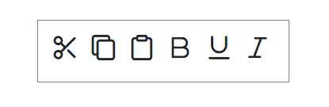
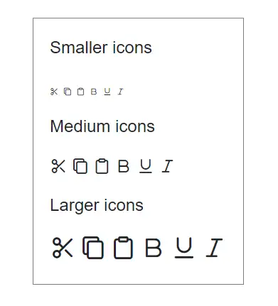
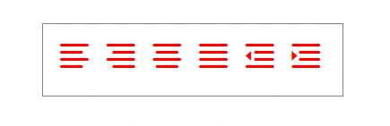
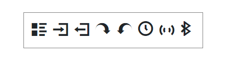
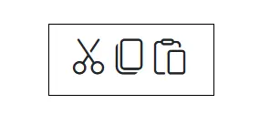
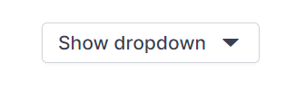

# Blazor Icons Library Usage and Customization

The Syncfusion&reg; Blazor library provides a set of base64-formatted font icons used across [Blazor components](https://www.syncfusion.com/blazor-components). Icons can be used via the `SfIcon` component or the `e-icons` CSS class.

Watch a quick-start video for the Blazor Icon component:



## Prerequisites

Before using the Blazor Icon component, set up your Blazor application by following the [Blazor Getting Started](https://blazor.syncfusion.com/documentation/getting-started/blazor-web-app) guide.

Next, install the [Syncfusion.Blazor.Buttons](https://www.nuget.org/packages/Syncfusion.Blazor.Buttons) NuGet package using the following command.




Install-Package Syncfusion.Blazor.Buttons -Version {{ site.releaseversion }}




dotnet add package Syncfusion.Blazor.Buttons --version {{ site.releaseversion }}




For the complete list of available packages, refer to the [Blazor NuGet packages](https://blazor.syncfusion.com/documentation/nuget-packages).

## Icon component

The Blazor Icon component provides support for rendering predefined Blazor icons or custom font icons.

The following code example shows how to render built-in Blazor icons from predefined [IconName](https://help.syncfusion.com/cr/blazor/Syncfusion.Blazor.Buttons.IconName.html) options by using the [Name](https://help.syncfusion.com/cr/blazor/Syncfusion.Blazor.Buttons.SfIcon.html#Syncfusion_Blazor_Buttons_SfIcon_Name) property in the `SfIcon` tag.




@using Syncfusion.Blazor.Buttons

<SfIcon Name="IconName.Cut"></SfIcon>
<SfIcon Name="IconName.Copy"></SfIcon>
<SfIcon Name="IconName.Paste"></SfIcon>
<SfIcon Name="IconName.Bold"></SfIcon>
<SfIcon Name="IconName.Underline"></SfIcon>
<SfIcon Name="IconName.Italic"></SfIcon>




### Icon size

The font size of the icon can be changed using the [Size](https://help.syncfusion.com/cr/blazor/Syncfusion.Blazor.Buttons.SfIcon.html#Syncfusion_Blazor_Buttons_SfIcon_Size) property. The default size is `Medium`.

* When the `Size` property is set to `IconSize.Small`, the font size will be `8px`.
* When the `Size` property is set to `IconSize.Medium`, the font size will be `16px`.
* When the `Size` property is set to `IconSize.Large`, the font size will be `24px`.




@using Syncfusion.Blazor.Buttons

Smaller icons

<SfIcon Name="IconName.Cut" Size="IconSize.Small"></SfIcon>
<SfIcon Name="IconName.Copy" Size="IconSize.Small"></SfIcon>
<SfIcon Name="IconName.Paste" Size="IconSize.Small"></SfIcon>
<SfIcon Name="IconName.Bold" Size="IconSize.Small"></SfIcon>
<SfIcon Name="IconName.Underline" Size="IconSize.Small"></SfIcon>
<SfIcon Name="IconName.Italic" Size="IconSize.Small"></SfIcon>

Medium icons

<SfIcon Name="IconName.Cut" Size="IconSize.Medium"></SfIcon>
<SfIcon Name="IconName.Copy" Size="IconSize.Medium"></SfIcon>
<SfIcon Name="IconName.Paste" Size="IconSize.Medium"></SfIcon>
<SfIcon Name="IconName.Bold" Size="IconSize.Medium"></SfIcon>
<SfIcon Name="IconName.Underline" Size="IconSize.Medium"></SfIcon>
<SfIcon Name="IconName.Italic" Size="IconSize.Medium"></SfIcon>

Larger icons

<SfIcon Name="IconName.Cut" Size="IconSize.Large"></SfIcon>
<SfIcon Name="IconName.Copy" Size="IconSize.Large"></SfIcon>
<SfIcon Name="IconName.Paste" Size="IconSize.Large"></SfIcon>
<SfIcon Name="IconName.Bold" Size="IconSize.Large"></SfIcon>
<SfIcon Name="IconName.Underline" Size="IconSize.Large"></SfIcon>
<SfIcon Name="IconName.Italic" Size="IconSize.Large"></SfIcon>




N> The [Size](https://help.syncfusion.com/cr/blazor/Syncfusion.Blazor.Buttons.SfIcon.html#Syncfusion_Blazor_Buttons_SfIcon_Size) property is applicable only when defining the icon using the [Name](https://help.syncfusion.com/cr/blazor/Syncfusion.Blazor.Buttons.SfIcon.html#Syncfusion_Blazor_Buttons_SfIcon_Name) property. Otherwise, use the [IconCss](https://help.syncfusion.com/cr/blazor/Syncfusion.Blazor.Buttons.SfIcon.html#Syncfusion_Blazor_Buttons_SfIcon_IconCss) property to customize the icon.

### Tooltip for icons

The [Title](https://help.syncfusion.com/cr/blazor/Syncfusion.Blazor.Buttons.SfIcon.html#Syncfusion_Blazor_Buttons_SfIcon_Title) property is used to set the title attribute for the icon, which improves accessibility with screen readers and shows a tooltip on mouseover. The following code example displays tooltip text for appropriate icons.




@using Syncfusion.Blazor.Buttons

<SfIcon Name="IconName.Upload" Title="Upload"></SfIcon>
<SfIcon Name="IconName.Download" Title="Download"></SfIcon>
<SfIcon Name="IconName.Undo" Title="Undo"></SfIcon>
<SfIcon Name="IconName.Redo" Title="Redo"></SfIcon>
<SfIcon Name="IconName.AlignTop" Title="AlignTop"></SfIcon>
<SfIcon Name="IconName.AlignBottom" Title="AlignBottom"></SfIcon>
<SfIcon Name="IconName.AlignMiddle" Title="AlignMiddle"></SfIcon>




### Icon appearance customization 

The [SfIcon](https://help.syncfusion.com/cr/blazor/Syncfusion.Blazor.Buttons.SfIcon.html) component supports customizing color and size by overriding the `e-icons` class.

The following code example demonstrates custom font-size and color for icons.




@using Syncfusion.Blazor.Buttons

<SfIcon Name="IconName.AlignLeft"></SfIcon>
<SfIcon Name="IconName.AlignRight"></SfIcon>
<SfIcon Name="IconName.AlignCenter"></SfIcon>
<SfIcon Name="IconName.Justify"></SfIcon>
<SfIcon Name="IconName.DecreaseIndent"></SfIcon>
<SfIcon Name="IconName.IncreaseIndent"></SfIcon>




### Third-party icons integration

The [SfIcon](https://help.syncfusion.com/cr/blazor/Syncfusion.Blazor.Buttons.SfIcon.html) component supports rendering custom font icons using the [IconCss](https://help.syncfusion.com/cr/blazor/Syncfusion.Blazor.Buttons.SfIcon.html#Syncfusion_Blazor_Buttons_SfIcon_IconCss) property. To render custom font icons, define the required font CSS that provides the font name, font size, and content for the icon.

The following code explains how to render `open-iconic` icons using the `IconCss` property.

* For **Blazor Web Apps**, add the stylesheet reference to the `<head>` section of `~/Components/App.razor`.

* For **Blazor WebAssembly standalone apps**, add the stylesheet reference to the `<head>` section of `~/wwwroot/index.html`.




<head>
    ...
    <link href="https://cdnjs.cloudflare.com/ajax/libs/open-iconic/1.1.1/font/css/open-iconic-bootstrap.min.css" rel="stylesheet">
</head>







@using Syncfusion.Blazor.Buttons

<SfIcon IconCss="oi oi-list-rich"></SfIcon>
<SfIcon IconCss="oi oi-account-login"></SfIcon>
<SfIcon IconCss="oi oi-account-logout"></SfIcon>
<SfIcon IconCss="oi oi-action-redo"></SfIcon>
<SfIcon IconCss="oi oi-action-undo"></SfIcon>
<SfIcon IconCss="oi oi-clock"></SfIcon>
<SfIcon IconCss="oi oi-audio"></SfIcon>
<SfIcon IconCss="oi oi-bluetooth"></SfIcon>




### Create custom icons with Syncfusion Metro Studio

[Syncfusion Metro Studio](https://help.syncfusion.com/metro-studio/overview) is a desktop tool for creating and customizing icon fonts for applications. It includes more than 7,000 flat and wireframe icon templates that you can modify to fit your design needs. You can also customize existing icons and export them in multiple formats, including SVG.

After exporting the icon font, use the [IconCss](https://help.syncfusion.com/cr/blazor/Syncfusion.Blazor.Buttons.SfIcon.html#Syncfusion_Blazor_Buttons_SfIcon_IconCss) property of the [SfIcon](https://help.syncfusion.com/cr/blazor/Syncfusion.Blazor.Buttons.SfIcon.html) component to display the custom icon in your application.

For more information, refer to the [Metro Studio documentation](https://help.syncfusion.com/metro-studio/overview).

### Icon styling with inline attributes

You can customize the icon element by applying HTML attributes directly to the `SfIcon` component. To reuse the same attribute values across multiple icons, use the `@attributes` Razor directive.

The following example demonstrates how to customize the icon font size using the `@attributes` directive.




@using Syncfusion.Blazor.Buttons

<SfIcon Name="IconName.Cut" @attributes="customAttribute"></SfIcon>
<SfIcon Name="IconName.Copy" @attributes="customAttribute"></SfIcon>
<SfIcon Name="IconName.Paste" @attributes="customAttribute"></SfIcon>

@code{
   Dictionary<string, object> customAttribute = new Dictionary<string, object>()
   {
       { "style", "font-size: 30px" }
   };
}




## Icon integration with Button component

The built-in Blazor icons can be integrated with other Blazor components without defining the `<SfIcon>` tag. To use Blazor icons, add the `e-icons` class that contains the font-family and common properties of the font icons. Add the icon class with the corresponding icon name from the [available icons](#icons-list) with the `e-` prefix.

The following example shows how to integrate icons with the [Blazor Button](https://www.syncfusion.com/blazor-components/blazor-button) component by defining the icon class in the `IconCss` property of the button.




@using Syncfusion.Blazor.Buttons

<SfButton IconCss="e-icons e-chevron-down-fill" Content="Show dropdown" IconPosition="IconPosition.Right"></SfButton>




## Use icons directly in an HTML element

Built-in Blazor icons can be rendered directly in an HTML element by adding the `e-icons` class (font family and common properties) and the [available icon](#icons-list) class with the `e-` prefix.

The following code example explains the direct rendering of the Blazor `search` icon in a span element.







## Icons list

The complete pack of Blazor icons is listed in the following table. The corresponding icon content can be found in the content section.

<!-- markdownlint-disable MD033 -->

### Bootstrap 5

<iframe class="doc-sample-frame" src="https://blazor.syncfusion.com/icons/bootstrap5/demo.html" style="height:1000px;width:100%;"></iframe>

### Fluent 2

<iframe class="doc-sample-frame" src="https://blazor.syncfusion.com/icons/fluent2/demo.html" style="height:1000px;width:100%;"></iframe>

### Material 3

<iframe class="doc-sample-frame" src="https://blazor.syncfusion.com/icons/material3/demo.html" style="height:1000px;width:100%;"></iframe>

### Tailwind 3

<iframe class="doc-sample-frame" src="https://blazor.syncfusion.com/icons/tailwind3/demo.html" style="height:1000px;width:100%;"></iframe>

### Bootstrap 4

<iframe class="doc-sample-frame" src="https://blazor.syncfusion.com/icons/bootstrap4/demo.html" style="height:1000px;width:100%;"></iframe>

### Bootstrap

<iframe class="doc-sample-frame" src="https://blazor.syncfusion.com/icons/bootstrap/demo.html" style="height:1000px;width:100%;"></iframe>

### Fluent

<iframe class="doc-sample-frame" src="https://blazor.syncfusion.com/icons/fluent/demo.html" style="height:1000px;width:100%;"></iframe>

### Material

<iframe class="doc-sample-frame" src="https://blazor.syncfusion.com/icons/material/demo.html" style="height:1000px;width:100%;"></iframe>

### Tailwind CSS

<iframe class="doc-sample-frame" src="https://blazor.syncfusion.com/icons/tailwind/demo.html" style="height:1000px;width:100%;"></iframe>

### Office Fabric

<iframe class="doc-sample-frame" src="https://blazor.syncfusion.com/icons/fabric/demo.html" style="height:1000px;width:100%;"></iframe>

### High Contrast

<iframe class="doc-sample-frame" src="https://blazor.syncfusion.com/icons/highcontrast/demo.html" style="height:1000px;width:100%;"></iframe>
