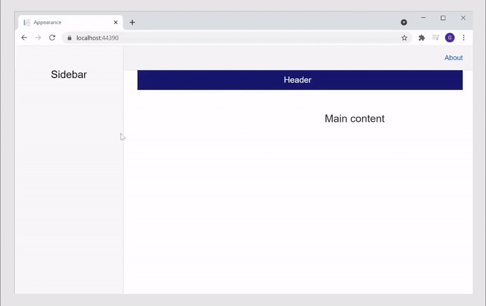

# Size-modes in Syncfusion Components

Syncfusion components and elements support different size modes.

## Size mode for application

This article explains how to implement the touch and mouse mode in an entire application.

Using **JavaScriptInterop**, you can enable or disable touch mode at run time by adding or removing `.e-bigger` class.Refer to the below steps,

1. Add the `e-bigger` CSS class in the `~/wwwroot/css/site.css` file.

```css
.e-bigger {
    font-size: x-large;
}
```

2.	To call JS from .NET, inject the **IJSRuntime** abstraction and call **InvokeAsync** method as given in the below code,

```cshtml
@page "/"

@using Syncfusion.Blazor.Calendars;
@using Syncfusion.Blazor.Buttons;
@using Syncfusion.Blazor.Popups
@inject IJSRuntime jsRuntime;

<p> Size-modes for application </p>
<p> This demo shows the Size-Modes applied for an entire application </p>

<button @onclick="callOnTouch">Touch Mode</button>
<button @onclick="callOnMouse">Mouse Mode</button>
<div>
    <SfCalendar TValue="DateTime?" Value="@DateValue"></SfCalendar>
</div>

<div>
    <SfButton> Button </SfButton>
</div>

<div>
    <SfCheckBox Label="checked" @bind-Checked="isChecked"></SfCheckBox>

    @code
    {
        private bool isChecked = true;
    }
</div>

@code {
    ………………..

    private async void callOnTouch(MouseEventArgs args)
    {
       await jsRuntime.InvokeAsync<string>("onTouch");
    }
    private async void callOnMouse(MouseEventArgs args)
    {
        await jsRuntime.InvokeAsync<string>("onMouse");
    }
}
```

3.	Add the following JS code inside the script tag of `wwwroot/index.html` (Blazor WebAssembly) or `Pages/_Host.cshtml` (Blazor Server) to enable the `e-bigger` class for touch mode and disable it in mouse mode.

```cshtml

<script>
        function onTouch() {
            document.body.classList.add('e-bigger');
     }
        function onMouse() {
            document.body.classList.remove('e-bigger');
                    }
 </script>
```


> [View sample in GitHub](https://github.com/SyncfusionExamples/size-mode-in-blazor-application)

## Size mode for a control

Touch mode can be enabled in a Syncfusion control by adding `.e-bigger` class in CSS style element.

Refer to the following code, in which the `e-bigger` class is added for enabling touch mode using the `check` variable.

```cshtml

@page "/"

@using Syncfusion.Blazor.Calendars;
@using Syncfusion.Blazor.Buttons;
@using Syncfusion.Blazor.Popups;

<h2>Syncfusion Component Size-Modes</h2>

<button @onclick="ontouch">Touch Mode</button> 
<button @onclick="onmouse">Mouse Mode</button>

<div class="@check">
    <SfCalendar TValue="DateTime?" Value="@DateValue"></SfCalendar>
</div>

<div class="@check">
    <SfButton> Button </SfButton>
</div>

<div class="@check">
    <SfCheckBox Label="checked" @bind-Checked="isChecked"></SfCheckBox>

    @code
    {
        private bool isChecked = true;
    }
</div>

<style>
    .e-bigger {
        font-size: x-large;
    }
</style>

@code {

    public DateTime? DateValue { get; set; } = new DateTime(DateTime.Now.Year, DateTime.Now.Month, 28);

    public string check { get; set; }

    public void ontouch()
    {
        check = "e-bigger";
    }

    public void onmouse()
    {
        check = "";
    }
}
```


> [View sample in GitHub](https://github.com/SyncfusionExamples/size-mode-in-blazor-application)

## Side-bar Responsiveness in Syncfusion Components

Blazor application renders UI as HTML content in client-side (browser). So, based on the width of the viewport in a device, it is possible to determine whether it is a Desktop or a Mobile device and design responsive web pages accordingly.

The meta tag named `viewport` is used to design the **webpage responsiveness** and this is included in all the Blazor applications of ` _Host.cshtml` file in Blazor server-side application and `index.html` file in Blazor Web Assembly application. CSS styling makes designs responsive in Blazor application.

Sidebar often behaves differently on a mobile versus a desktop display. It has an effective feature that offers to set it in an opened or closed state corresponding to the specified resolution. This is achieved through the MediaQuery property that allows to set the Sidebar in an expanded state or collapsed state only in user-defined resolution.

In the following sample, `MediaQuery` has been used for the specific resolution to close and open the sidebar.

```cshtml
@page "/"
@using Syncfusion.Blazor.Navigations

<div id="header" style="height:45px;color:white;background-color:midnightblue;font-size:1.2rem;line-height:45px;">
    <span style="position:absolute; left:10px; font-size:25px;">&#9776;</span>
    <span style="margin-left:45%;">Header</span>
</div>

<SfSidebar Width="250px" MediaQuery="(min-width: 600px)">
    <ChildContent>
        <div style="text-align: center;" class="text-content"> Sidebar </div>
    </ChildContent>
</SfSidebar>

<div class="text-content" style="text-align: center;">Main content</div>

<style>
    .e-sidebar {
        background-color: #f8f8f8;
        color: black;
    }

    .text-content {
        font-size: 1.5rem;
        padding: 3rem;
    }

    .main > div {
        padding: 0px !important;
    }
</style>
```


## See Also

Some other components also supports responsiveness, please refer to the below some of the responsive components in Syncfusion Blazor.

[DataGrid](https://blazor.syncfusion.com/documentation/datagrid/columns#responsive-columns)
[TreeGrid](https://blazor.syncfusion.com/documentation/treegrid/scrolling#responsive-with-parent-container)
[Dashboard Layout](https://blazor.syncfusion.com/documentation/dashboard-layout/responsive-adaptive)
[Kanban](https://blazor.syncfusion.com/documentation/kanban/responsive-mode)
[Toolbar](https://blazor.syncfusion.com/documentation/toolbar/responsive-mode)
[Tabs](https://blazor.syncfusion.com/documentation/tabs/responsive-modes)