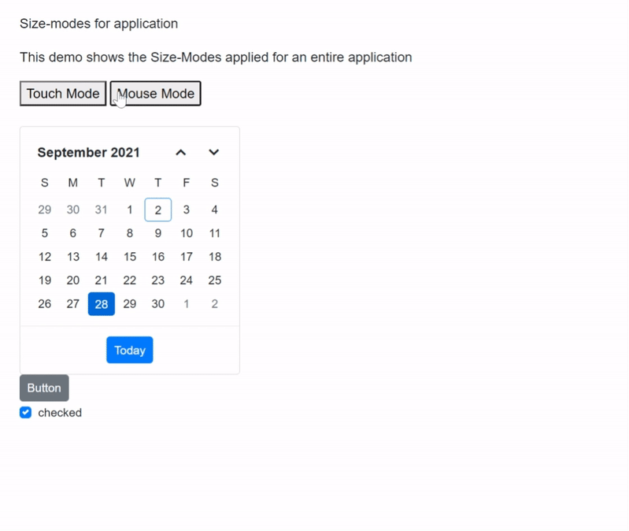
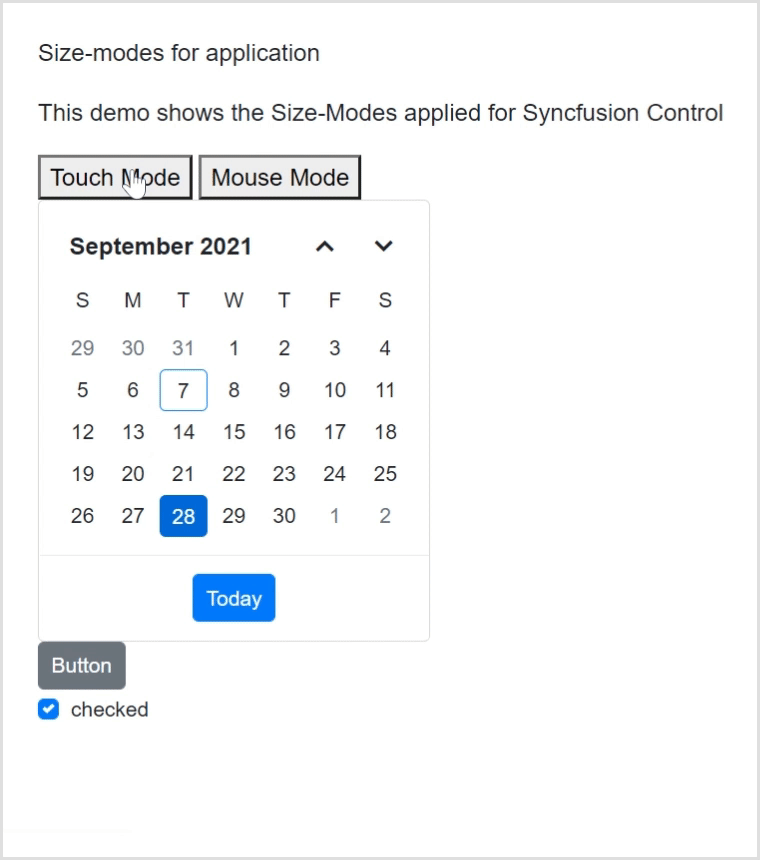

# Size modes for Syncfusion® Blazor components

Syncfusion<sup style="font-size:70%">&reg;</sup> Blazor components support two size modes: normal and touch (bigger theme). The following sections show how to enable them.

## Size mode for the application

You can enable touch mode (bigger theme) for an application by adding the `.e-bigger` class in your app stylesheet (`~/wwwroot/css/app.css or site.css`) and applying it to the `body` element.

* For **Blazor Web App**, assign `.e-bigger` class to `body` element of **~/Components/App.razor** file.
* For **Blazor WebAssembly application**, assign `.e-bigger` class to `body` element of **wwwroot/index.html** file.
* For **Blazor Server application**, assign `.e-bigger` class to `body` element of
    * **~/Pages/_Host.cshtml** file for .NET 7.
    * **~/Pages/_Layout.cshtml** file for .NET 6.




.e-bigger {
    font-size: x-large;
}





```cshtml
<body class="e-bigger">
...
</body>
```

## Size mode for a component

You can enable touch mode (bigger theme) for a control by adding `.e-bigger` class and assign to the `div` which contains the control.

If the Blazor Web App uses interactivity location `Per page/component`, ensure a render mode is defined at the top of the page that includes the Syncfusion<sup style="font-size:70%">&reg;</sup> Blazor component, as follows:




@* Your app render mode define here *@
@rendermode InteractiveAuto




```cshtml

@page "/"

@using Syncfusion.Blazor.Calendars;
@using Syncfusion.Blazor.Buttons;
@using Syncfusion.Blazor.Popups;

<div class="e-bigger">
    <SfCalendar TValue="DateTime?" Value="@DateValue"></SfCalendar>
</div>

<div class="e-bigger">
    <SfButton> Button </SfButton>
</div>

<div class="e-bigger">
    <SfCheckBox Label="checked" @bind-Checked="isChecked"></SfCheckBox>
</div>

<style>
    .e-bigger {
        font-size: x-large;
    }
</style>

@code {
    private bool isChecked = true;
    public DateTime? DateValue { get; set; } = new DateTime(DateTime.Now.Year, DateTime.Now.Month, 28);
}

```

## Change size mode for the application at runtime

You can change the size mode of an application between touch and normal (mouse) mode at runtime by adding and removing `.e-bigger` using `JavaScriptInterop`.

Follow below steps to change the size mode for an application at runtime.

1. Add the `e-bigger` CSS class in the `~/wwwroot/css/app.css or site.css` file.

    ```css
    .e-bigger {
        font-size: x-large;
    }
    ```

2. Add the following JavaScript methods to switch between touch and mouse modes using the `e-bigger` class. Place the script in the appropriate file:
   - Blazor Web App: `~/Pages/_Layout.cshtml`
   - Blazor WebAssembly App: `~/wwwroot/index.html`
   - Blazor Server App: `~/Pages/_Host.cshtml`

    ```cshtml
    <script>
        function onTouch() {
            document.body.classList.add('e-bigger');
        }

        function onMouse() {
            document.body.classList.remove('e-bigger');
        }
     </script>
    ```

2. To call JavaScript method from .NET, inject the `IJSRuntime` abstraction and call `InvokeAsync` method as given in the below code,

    ```cshtml
    @page "/"

    @using Syncfusion.Blazor.Calendars;
    @using Syncfusion.Blazor.Buttons;
    @using Syncfusion.Blazor.Popups
    @inject IJSRuntime jsRuntime;

    <p> Size-modes for application </p>
    <p> This demo shows the Size-Modes applied for an entire application </p>

    <button @onclick="callOnTouch">Touch Mode</button>
    <button @onclick="callOnMouse">Mouse Mode</button>
    <div>
        <SfCalendar TValue="DateTime?" Value="@DateValue"></SfCalendar>
    </div>

    <div>
        <SfButton> Button </SfButton>
    </div>

    <div>
        <SfCheckBox Label="checked" @bind-Checked="isChecked"></SfCheckBox>
     </div>

    @code {
        private bool isChecked = true;
        public DateTime? DateValue { get; set; } = new DateTime(DateTime.Now.Year, DateTime.Now.Month, 28);
        private async void callOnTouch(MouseEventArgs args)
        {
           await jsRuntime.InvokeAsync<string>("onTouch");
        }
        private async void callOnMouse(MouseEventArgs args)
        {
            await jsRuntime.InvokeAsync<string>("onMouse");
        }
    }
    ```

    

    N> [View sample in GitHub](https://github.com/SyncfusionExamples/size-mode-in-blazor-application)

## Change size mode for a component at runtime

You can change the size mode of a control between touch and normal (mouse) mode at runtime by setting `.e-bigger` CSS class.

Refer to the following code, where the e-bigger class is added to enable touch mode using the `OnTouch` method.

```cshtml

@page "/"

@using Syncfusion.Blazor.Calendars;
@using Syncfusion.Blazor.Buttons;
@using Syncfusion.Blazor.Popups;

<h2>Syncfusion Component Size-Modes</h2>

<button @onclick="OnTouch">Touch Mode</button>
<button @onclick="OnMouse">Mouse Mode</button>

<div class="@touchCSS">
    <SfCalendar TValue="DateTime?" Value="@DateValue"></SfCalendar>
</div>

<div class="@touchCSS">
    <SfButton> Button </SfButton>
</div>

<div class="@touchCSS">
    <SfCheckBox Label="checked" @bind-Checked="isChecked"></SfCheckBox>
</div>

<style>
    .e-bigger {
        font-size: x-large;
    }
</style>

@code {
    private bool isChecked = true;

    public DateTime? DateValue { get; set; } = new DateTime(DateTime.Now.Year, DateTime.Now.Month, 28);

    public string touchCSS { get; set; }

    public void OnTouch()
    {
        touchCSS = "e-bigger";
    }

    public void OnMouse()
    {
        touchCSS = "";
    }
}
```



N> [View sample in GitHub](https://github.com/SyncfusionExamples/size-mode-in-blazor-application)


## Change font size and font family for all components

You can change the font-size and font-family for all the components by overriding the CSS for `e-control` class as follows.

```css
<style>
   .e-control, [class^="e-"] *:not([class*="e-icon"]) {

         font-size: 1rem !important;

         font-family: Cambria, Cochin, Georgia, Times, Times New Roman, serif !important;
}
</style>
```

## See Also

Refer below topics to learn about responsiveness components based on available size in Syncfusion<sup style="font-size:70%">&reg;</sup> Blazor Components.

* [Sidebar Responsiveness](https://blazor.syncfusion.com/documentation/sidebar/auto-close)
* [DataGrid Responsiveness](https://blazor.syncfusion.com/documentation/datagrid/columns#responsive-columns)
* [TreeGrid Responsiveness](https://blazor.syncfusion.com/documentation/treegrid/scrolling#responsive-with-parent-container)
* [Dashboard Layout Responsiveness](https://blazor.syncfusion.com/documentation/dashboard-layout/responsive-adaptive)
* [Kanban Responsiveness](https://blazor.syncfusion.com/documentation/kanban/responsive-mode)
* [Toolbar Responsiveness](https://blazor.syncfusion.com/documentation/toolbar/responsive-mode)
* [Tab Responsiveness](https://blazor.syncfusion.com/documentation/tabs/responsive-modes)
