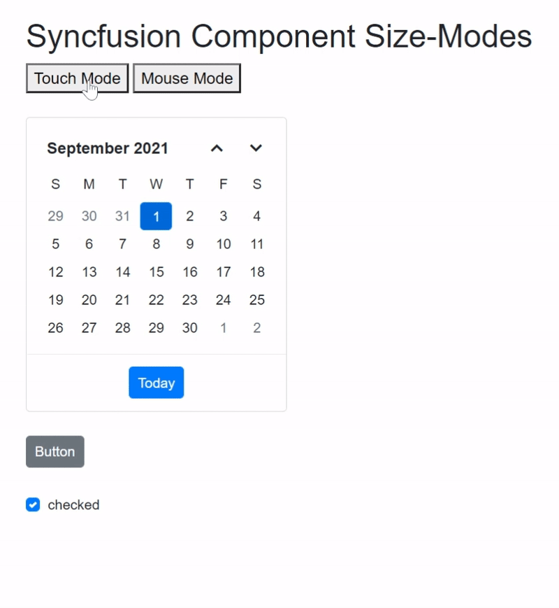

# Size-modes in Syncfusion Components

Syncfusion components and elements support different size modes.

This article explains the size modes (Touch and Mouse) of the Syncfusion components.

In the following example, there are two buttons, one for Touch mode and the other for normal mode. You can change the size of the element by adding the `e-bigger` class with a specific font size to the Div element. 

Refer to the following code, in which the `e-bigger` class is added for touch mode using the `check` variable and assigned a value to its Div element.

```cshtml

@page "/"

@using Syncfusion.Blazor.Calendars;
@using Syncfusion.Blazor.Buttons;
@using Syncfusion.Blazor.Popups;

<h2>Syncfusion Component Size-Modes</h2>

<button @onclick="ontouch">Touch Mode</button> 
<button @onclick="onmouse">Mouse Mode</button>

<div class="@check">
    <SfCalendar TValue="DateTime?" Value="@DateValue"></SfCalendar>
</div>

<div class="@check">
    <SfButton> Button </SfButton>
</div>

<div class="@check">
    <SfCheckBox Label="checked" @bind-Checked="isChecked"></SfCheckBox>

    @code
    {
        private bool isChecked = true;
    }
</div>

<style>
    .e-bigger {
        font-size: x-large;
    }
</style>

@code {

    public DateTime? DateValue { get; set; } = new DateTime(DateTime.Now.Year, DateTime.Now.Month, 28);

    public string check { get; set; }

    public void ontouch()
    {
        check = "e-bigger";
    }

    public void onmouse()
    {
        check = "";
    }
}
```



## Side-bar Responsiveness in Syncfusion Components

Blazor application renders UI as HTML content in client-side (browser). So, based on the width of the viewport in a device, it is possible to determine whether it is a Desktop or a Mobile device and design responsive web pages accordingly.

The meta tag named `viewport` is used to design the **webpage responsiveness** and this is included in all the Blazor applications of ` _Host.cshtml` file in Blazor server-side application and `index.html` file in Blazor Web Assembly application. CSS styling makes designs responsive in Blazor application.

Sidebar often behaves differently on a mobile versus a desktop display. It has an effective feature that offers to set it in an opened or closed state corresponding to the specified resolution. This is achieved through the MediaQuery property that allows to set the Sidebar in an expanded state or collapsed state only in user-defined resolution.

In the following sample, `MediaQuery` has been used for the specific resolution to close and open the sidebar.

```cshtml
@page "/"
@using Syncfusion.Blazor.Navigations

<div id="header" style="height:45px;color:white;background-color:midnightblue;font-size:1.2rem;line-height:45px;">
    <span style="position:absolute; left:10px; font-size:25px;">&#9776;</span>
    <span style="margin-left:45%;">Header</span>
</div>

<SfSidebar Width="250px" MediaQuery="(min-width: 600px)">
    <ChildContent>
        <div style="text-align: center;" class="text-content"> Sidebar </div>
    </ChildContent>
</SfSidebar>

<div class="text-content" style="text-align: center;">Main content</div>

<style>
    .e-sidebar {
        background-color: #f8f8f8;
        color: black;
    }

    .text-content {
        font-size: 1.5rem;
        padding: 3rem;
    }

    .main > div {
        padding: 0px !important;
    }
</style>
```
