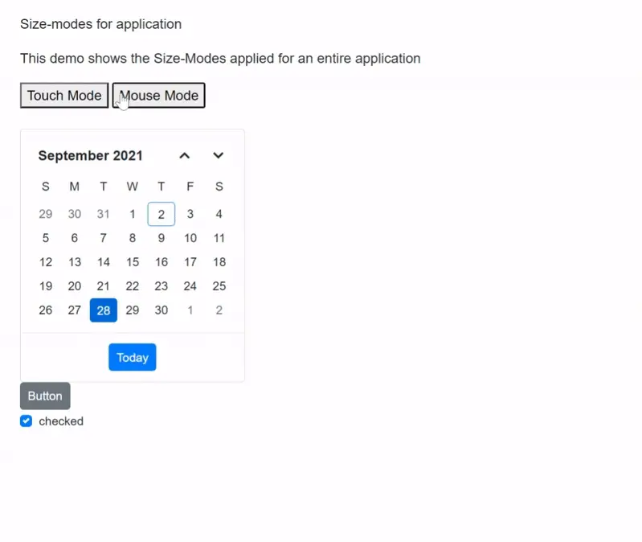
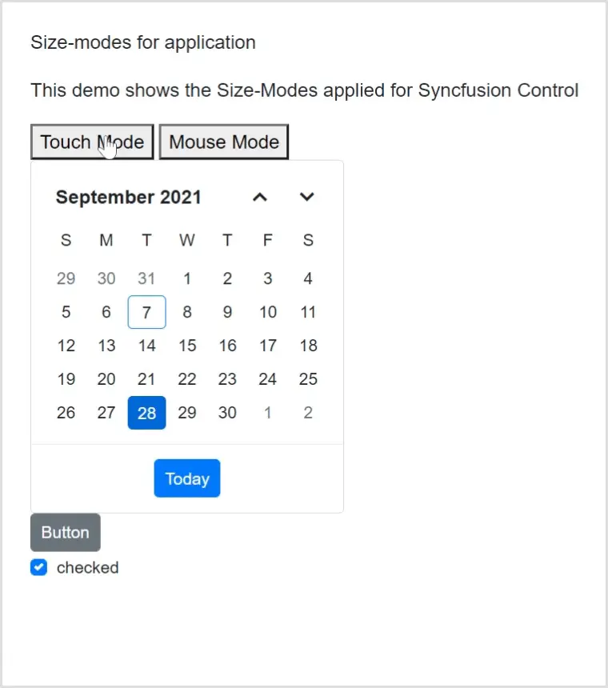

# Size modes for Blazor components

Blazor components support two size modes: **normal** and **touch** (bigger theme). The touch mode provides larger, touch-friendly UI elements for better accessibility on touch devices.

## Size mode for the application

You can enable touch mode for the entire application by adding the `.e-bigger` class to the `body` element.

1. Define the `.e-bigger` CSS class in your app stylesheet (`~/wwwroot/css/app.css`):

   
   

   .e-bigger {
       font-size: x-large;
   }

   
   

2. Add the `.e-bigger` class to the `body` element:
   - For **Blazor Web App**: Add to `~/Components/App.razor`
   - For **Blazor WebAssembly Standalone App**: Add to `~/wwwroot/index.html`

   
   

   <body class="e-bigger">
       ...
   </body>

   
   

## Size mode for a component

You can enable touch mode for individual components by wrapping them in a `div` with the `.e-bigger` class.

If the Blazor Web App uses interactivity location **Per page/component**, ensure a render mode is defined at the top of the page:




@rendermode InteractiveAuto







@page "/"

@using Syncfusion.Blazor.Calendars
@using Syncfusion.Blazor.Buttons
@using Syncfusion.Blazor.Popups

<div class="e-bigger">
    <SfCalendar TValue="DateTime?" Value="@DateValue"></SfCalendar>
</div>

<div class="e-bigger">
    <SfButton>Button</SfButton>
</div>

<div class="e-bigger">
    <SfCheckBox Label="Checked" @bind-Checked="isChecked"></SfCheckBox>
</div>

<style>
    .e-bigger {
        font-size: x-large;
    }
</style>

@code {
    private bool isChecked = true;
    public DateTime? DateValue { get; set; } = new DateTime(DateTime.Now.Year, DateTime.Now.Month, 28);
}




## Change size mode for the application at runtime

You can dynamically toggle between touch and normal modes at runtime using `JavaScript interop`.

### Step 1: Add CSS class

Add the `.e-bigger` CSS class in the `~/wwwroot/css/app.css` file.




.e-bigger {
    font-size: x-large;
}




### Step 2: Add JavaScript functions

Add the following JavaScript methods to toggle the size mode. Place the script in the appropriate file:
- **Blazor Web App**: `~/Components/App.razor`
- **Blazor WebAssembly Standalone App**: `~/wwwroot/index.html`




<script>
    function onTouch() {
        document.body.classList.add('e-bigger');
    }

    function onMouse() {
        document.body.classList.remove('e-bigger');
    }
</script>




### Step 3: Call JavaScript from .NET

Inject the `IJSRuntime` abstraction and call the JavaScript methods.




@page "/"

@using Syncfusion.Blazor.Calendars
@using Syncfusion.Blazor.Buttons
@using Syncfusion.Blazor.Popups
@inject IJSRuntime JSRuntime

<h2>Size modes for application</h2>
<p>This demo shows size modes applied for an entire application.</p>

<button @onclick="EnableTouchMode">Touch Mode</button>
<button @onclick="EnableMouseMode">Mouse Mode</button>

<div>
    <SfCalendar TValue="DateTime?" Value="@DateValue"></SfCalendar>
</div>

<div>
    <SfButton>Button</SfButton>
</div>

<div>
    <SfCheckBox Label="Checked" @bind-Checked="isChecked"></SfCheckBox>
</div>

@code {
    private bool isChecked = true;
    public DateTime? DateValue { get; set; } = new DateTime(DateTime.Now.Year, DateTime.Now.Month, 28);

    private async Task EnableTouchMode()
    {
        await JSRuntime.InvokeVoidAsync("onTouch");
    }

    private async Task EnableMouseMode()
    {
        await JSRuntime.InvokeVoidAsync("onMouse");
    }
}






N> [View sample in GitHub](https://github.com/SyncfusionExamples/size-mode-in-blazor-application)

## Change size mode for a component at runtime

You can dynamically change the size mode for individual components by conditionally applying the `.e-bigger` CSS class.




@page "/"

@using Syncfusion.Blazor.Calendars
@using Syncfusion.Blazor.Buttons
@using Syncfusion.Blazor.Popups

<h2>Syncfusion component size modes</h2>
<p>This demo shows size modes applied for individual components.</p>

<button @onclick="EnableTouchMode">Touch Mode</button>
<button @onclick="EnableMouseMode">Mouse Mode</button>

<div class="@touchCSS">
    <SfCalendar TValue="DateTime?" Value="@DateValue"></SfCalendar>
</div>

<div class="@touchCSS">
    <SfButton>Button</SfButton>
</div>

<div class="@touchCSS">
    <SfCheckBox Label="Checked" @bind-Checked="isChecked"></SfCheckBox>
</div>

<style>
    .e-bigger {
        font-size: x-large;
    }
</style>

@code {
    private bool isChecked = true;
    public DateTime? DateValue { get; set; } = new DateTime(DateTime.Now.Year, DateTime.Now.Month, 28);
    private string touchCSS = string.Empty;

    private void EnableTouchMode()
    {
        touchCSS = "e-bigger";
    }

    private void EnableMouseMode()
    {
        touchCSS = string.Empty;
    }
}






N> [View sample in GitHub](https://github.com/SyncfusionExamples/size-mode-in-blazor-application)

## Customize font size and font family

You can customize the font size and font family for all components by overriding the CSS for the `.e-control` class:

```css
.e-control, [class^="e-"] *:not([class*="e-icon"]) {
    font-size: 1rem !important;
    font-family: Cambria, Cochin, Georgia, Times, 'Times New Roman', serif !important;
}
```

## See also

* [Sidebar responsiveness](https://blazor.syncfusion.com/documentation/sidebar/auto-close)
* [DataGrid responsiveness](https://blazor.syncfusion.com/documentation/datagrid/columns#responsive-columns)
* [TreeGrid responsiveness](https://blazor.syncfusion.com/documentation/treegrid/scrolling#responsive-with-parent-container)
* [Dashboard layout responsiveness](https://blazor.syncfusion.com/documentation/dashboard-layout/responsive-adaptive)
* [Kanban responsiveness](https://blazor.syncfusion.com/documentation/kanban/responsive-mode)
* [Toolbar responsiveness](https://blazor.syncfusion.com/documentation/toolbar/responsive-mode)
* [Tab responsiveness](https://blazor.syncfusion.com/documentation/tabs/responsive-modes)