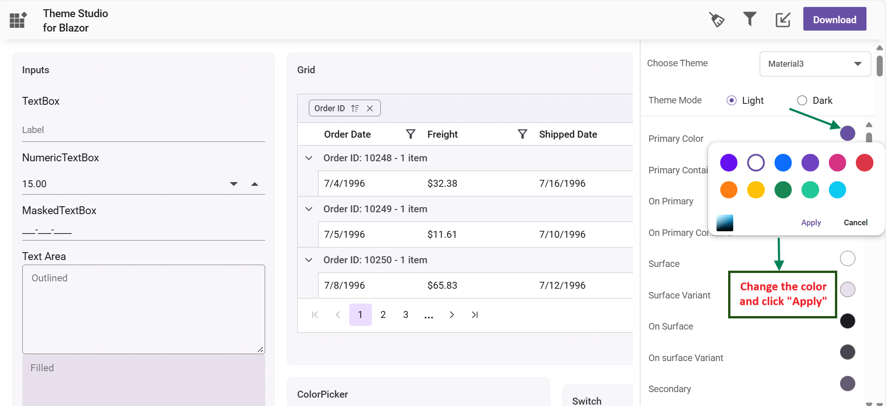

# Theme Studio for Syncfusion Blazor components

Theme Studio for Syncfusion<sup style="font-size:70%">&reg;</sup> Blazor can be used to customize a new theme from an existing theme. It does not support data visualization controls such as Chart, Diagram, Gauge, Range Navigator, and Maps.

## Customize theme colors from theme studio

The Syncfusion<sup style="font-size:70%">&reg;</sup> Blazor themes are developed under the SCSS environment. Each theme has a unique common variable list. When you change the common variable color code value, it will reflect in all the Syncfusion<sup style="font-size:70%">&reg;</sup> Blazor components. All Syncfusion<sup style="font-size:70%">&reg;</sup> Blazor component styles are derived from these [theme-based common variables](#common-variables). This common variable list is handled inside the Theme Studio application for customizing theme-based colors.

1. Open [Blazor Theme Studio](https://blazor.syncfusion.com/themestudio/?theme=material3) application.
2. The Theme Studio application page can be divided into two sections: the controls preview section on the left, and the theme customization section on the right.

3. Click the color pickers in the theme customization section to select your desired colors.

4. The Syncfusion<sup style="font-size:70%">&reg;</sup> Blazor components are rendered with the newly selected colors in the preview section after selecting a custom color from the picker.


### Filter a specific list of components

Using the theme studio, you can apply custom themes to a list of specific controls. This option is used when you integrate a selective list of Syncfusion<sup style="font-size:70%">&reg;</sup> Blazor components in your application. The theme studio will filter the selected controls and customize the final output for the controls’ styles alone by reducing the final output file size.

1. Click the Filter icon at the top-right corner, and select the controls whose theme you want to customize.

2. Click the Apply button in the Filter dialog. Now, only the selected controls will be rendered in the controls preview section.

3. Now, you can customize the colors in the theme customization section for the controls selected.


### Download the customized theme

You can download the custom styles after customizing the theme colors.

1. Click the Download button at the top-right corner, and the Download dialog will appear.

2. Assign a theme name in the File Name field, and click the Download button.

3. The download styles will come as a zip file that contains SCSS and CSS files for the selected Syncfusion<sup style="font-size:70%">&reg;</sup> Blazor components. The current settings are stored in the `settings.json` file.


N> The Material and Tailwind themes use the online Roboto font. For offline or restricted networks, the downloaded package includes CSS without Google Fonts dependencies. Lightweight theme files (for example, fluent2-lite.css) optimize performance by excluding larger styles. When using a customized CSS file, remove other Syncfusion base theme references (CDN or local) to avoid duplicate or conflicting styles.

### Use a customized theme in a web application

You can directly use the customized CSS file in the web application.

1. Copy and paste the customized CSS file from the download folder into any folder, e.g., `~/wwwroot/styles/{file-name}.css`.
2. Reference the customized CSS file in the appropriate host page:
    * For **Blazor Web App**, refer style sheet inside the `<head>` of **~/Components/App.razor** file.
    * For **Blazor WebAssembly App**, refer style sheet inside the `<head>` of **wwwroot/index.html** file.
    * For **Blazor Server App**, refer style sheet inside the `<head>` of
        * **~/Pages/_Host.cshtml** file for .NET 7.
        * **~/Pages/_Layout.cshtml**  file for .NET 6.

    ```html
    <head>
        <link href="styles/{file-name}.css" rel="stylesheet"/>
    </head>
    ```

## Import previous settings into Theme Studio

If you need to change your application theme and UI design in the future, do not customize the Syncfusion<sup style="font-size:70%">&reg;</sup> Blazor components from scratch in the theme studio. Just import the old `settings.json` file to review and update your stored settings in the Theme Studio application.

1. Click the Import icon at the top-right corner.

2. The Import Theme dialog will open. Click the Browse button and select the `settings.json` file you exported previously.

3. Click the Import button.

4. The stored data will be reflected in the Theme Studio application. Now, you can change the theme colors based on your latest design and export the theme again.

5. The exported file contains your latest changes. You can just replace the older custom style with a new style to refresh your application.

## Common Variables

The following list of common variables is used in the Syncfusion<sup style="font-size:70%">&reg;</sup> Blazor library themes for all UI components. You can change these variables to customize the corresponding theme.

### Material 3 Theme

<table>
    <style>
        .circle-color-indicator {
            width: 1.5em;
            height: 1.5em;
            border-radius: 50%;
            display: inline-block;
            border: 1px solid rgba(0, 0, 0, .08);
            vertical-align: middle;
        }
        th, td {
        text-align: left;
        padding: 5px 15px;
        vertical-align: top;
        }
    </style>
    <thead>
        <tr>
            <th>Name</th>
            <th>Value (Default Theme) </th>
            <th>Value (Dark Theme) </th>
        </tr>
    </thead>
    <tbody>
        <tr>
            <td>--color-sf-black</td>
            <td>
                <span class="circle-color-indicator" style="background: rgb(0,0,0)"></span> rgb(0,0,0)
            </td>
            <td>
                <span class="circle-color-indicator" style="background: rgb(0,0,0)"></span> rgb(0,0,0)
            </td>
        </tr>
        <tr>
            <td>--color-sf-white</td>
            <td>
                <span class="circle-color-indicator" style="background: rgb(255,255,255)"></span> rgb(255,255,255)
            </td>
            <td>
                <span class="circle-color-indicator" style="background: rgb(255,255,255)"></span> rgb(255,255,255)
            </td>
        </tr>
        <tr>
            <td>--color-sf-primary</td>
            <td>
                <span class="circle-color-indicator" style="background: rgb(103, 80, 164)"></span> rgb(103, 80, 164)
            </td>
            <td>
                <span class="circle-color-indicator" style="background: rgb(208, 188, 255)"></span> rgb(208, 188, 255)
            </td>
        </tr>
        <tr>
            <td>--color-sf-primary-container</td>
            <td>
                <span class="circle-color-indicator" style="background: rgb(234, 221, 255)"></span> rgb(234, 221, 255)
            </td>
            <td>
                <span class="circle-color-indicator" style="background: rgb(79, 55, 139)"></span> rgb(79, 55, 139)
            </td>
        </tr>
        <tr>
            <td>--color-sf-on-primary</td>
            <td>
                <span class="circle-color-indicator" style="background: rgb(255, 255, 255)"></span> rgb(255, 255, 255)
            </td>
            <td>
                <span class="circle-color-indicator" style="background: rgb(55, 30, 115)"></span> rgb(55, 30, 115)
            </td>
        </tr>
        <tr>
            <td>--color-sf-on-primary-container</td>
            <td>
                <span class="circle-color-indicator" style="background: rgb(33, 0, 94)"></span> rgb(33, 0, 94)
            </td>
            <td>
                <span class="circle-color-indicator" style="background: rgb(234, 221, 255)"></span> rgb(234, 221, 255)
            </td>
        </tr>
        <tr>
            <td>--color-sf-surface</td>
            <td>
                <span class="circle-color-indicator" style="background: rgb(255, 255, 255)"></span> rgb(255, 255, 255)
            </td>
            <td>
                <span class="circle-color-indicator" style="background: rgb(28, 27, 31)"></span> rgb(28, 27, 31)
            </td>
        </tr>
        <tr>
            <td>--color-sf-surface-variant</td>
            <td>
                <span class="circle-color-indicator" style="background: rgb(231, 224, 236)"></span> rgb(231, 224, 236)
            </td>
            <td>
                <span class="circle-color-indicator" style="background: rgb(73, 69, 79)"></span> rgb(73, 69, 79)
            </td>
        </tr>
        <tr>
            <td>--color-sf-on-surface</td>
            <td>
                <span class="circle-color-indicator" style="background: rgb(28, 27, 31)"></span> rgb(28, 27, 31)
            </td>
            <td>
                <span class="circle-color-indicator" style="background: rgb(230, 225, 229)"></span> rgb(230, 225, 229)
            </td>
        </tr>
        <tr>
            <td>--color-sf-on-surface-variant</td>
            <td>
                <span class="circle-color-indicator" style="background: rgb(73, 69, 78)"></span> rgb(73, 69, 78)
            </td>
            <td>
                <span class="circle-color-indicator" style="background: rgb(202, 196, 208)"></span> rgb(202, 196, 208)
            </td>
        </tr>
        <tr>
            <td>--color-sf-secondary</td>
            <td>
                <span class="circle-color-indicator" style="background: rgb(98, 91, 113)"></span> rgb(98, 91, 113)
            </td>
            <td>
                <span class="circle-color-indicator" style="background: rgb(204, 194, 220)"></span> rgb(204, 194, 220)
            </td>
        </tr>
        <tr>
            <td>--color-sf-secondary-container</td>
            <td>
                <span class="circle-color-indicator" style="background: rgb(232, 222, 248)"></span> rgb(232, 222, 248)
            </td>
            <td>
                <span class="circle-color-indicator" style="background: rgb(74, 68, 88)"></span> rgb(74, 68, 88)
            </td>
        </tr>
        <tr>
            <td>--color-sf-on-secondary</td>
            <td>
                <span class="circle-color-indicator" style="background: rgb(255, 255, 255)"></span> rgb(255, 255, 255)
            </td>
            <td>
                <span class="circle-color-indicator" style="background: rgb(51, 45, 65)"></span> rgb(51, 45, 65)
            </td>
        </tr>
        <tr>
            <td>--color-sf-on-secondary-container</td>
            <td>
                <span class="circle-color-indicator" style="background: rgb(30, 25, 43)"></span> rgb(30, 25, 43)
            </td>
            <td>
                <span class="circle-color-indicator" style="background: rgb(232, 222, 248)"></span> rgb(232, 222, 248)
            </td>
        </tr>
        <tr>
            <td>--color-sf-tertiary</td>
            <td>
                <span class="circle-color-indicator" style="background: rgb(125, 82, 96)"></span> rgb(125, 82, 96)
            </td>
            <td>
                <span class="circle-color-indicator" style="background: rgb(239, 184, 200)"></span> rgb(239, 184, 200)
            </td>
        </tr>
        <tr>
            <td>--color-sf-tertiary-container</td>
            <td>
                <span class="circle-color-indicator" style="background: rgb(255, 216, 228)"></span> rgb(255, 216, 228)
            </td>
            <td>
                <span class="circle-color-indicator" style="background: rgb(99, 59, 72)"></span> rgb(99, 59, 72)
            </td>
        </tr>
        <tr>
            <td>--color-sf-on-tertiary</td>
            <td>
                <span class="circle-color-indicator" style="background: rgb(255, 255, 255)"></span> rgb(255, 255, 255)
            </td>
            <td>
                <span class="circle-color-indicator" style="background: rgb(73, 37, 50)"></span> rgb(73, 37, 50)
            </td>
        </tr>
        <tr>
<td>--color-sf-on-tertiary-container</td>
            <td>
                <span class="circle-color-indicator" style="background: rgb(55, 11, 30)"></span> rgb(55, 11, 30)
            </td>
            <td>
                <span class="circle-color-indicator" style="background: rgb(255, 216, 228)"></span> rgb(255, 216, 228)
            </td>
        </tr>
        <tr>
            <td>--color-sf-background</td>
            <td>
                <span class="circle-color-indicator" style="background: rgb(255, 255, 255)"></span> rgb(255, 255, 255)
            </td>
            <td>
                <span class="circle-color-indicator" style="background: rgb(28, 27, 31)"></span> rgb(28, 27, 31)
            </td>
        </tr>
        <tr>
            <td>--color-sf-on-background</td>
            <td>
                <span class="circle-color-indicator" style="background: rgb(28, 27, 31)"></span> rgb(28, 27, 31)
            </td>
            <td>
                <span class="circle-color-indicator" style="background: rgb(230, 225, 229)"></span> rgb(230, 225, 229)
            </td>
        </tr>
        <tr>
            <td>--color-sf-outline</td>
            <td>
                <span class="circle-color-indicator" style="background: rgb(121, 116, 126)"></span> rgb(121, 116, 126)
            </td>
            <td>
                <span class="circle-color-indicator" style="background: rgb(147, 143, 153)"></span> rgb(147, 143, 153)
            </td>
        </tr>
        <tr>
            <td>--color-sf-outline-variant</td>
            <td>
                <span class="circle-color-indicator" style="background: rgb(196, 199, 197)"></span> rgb(196, 199, 197)
            </td>
            <td>
                <span class="circle-color-indicator" style="background: rgb(68, 71, 70)"></span> rgb(68, 71, 70)
            </td>
        </tr>
        <tr>
            <td>--color-sf-shadow</td>
            <td>
                <span class="circle-color-indicator" style="background: rgb(0, 0, 0)"></span> rgb(0, 0, 0)
            </td>
            <td>
                <span class="circle-color-indicator" style="background: rgb(0, 0, 0)"></span> rgb(0, 0, 0)
            </td>
        </tr>
        <tr>
            <td>--color-sf-surface-tint-color</td>
            <td>
                <span class="circle-color-indicator" style="background: rgb(103, 80, 164)"></span> rgb(103, 80, 164)
            </td>
            <td>
                <span class="circle-color-indicator" style="background: rgb(208, 188, 255)"></span> rgb(208, 188, 255)
            </td>
        </tr>
        <tr>
            <td>--color-sf-inverse-surface</td>
            <td>
                <span class="circle-color-indicator" style="background: rgb(49, 48, 51)"></span> rgb(49, 48, 51)
            </td>
            <td>
                <span class="circle-color-indicator" style="background: rgb(230, 225, 229)"></span> rgb(230, 225, 229)
            </td>
        </tr>
        <tr>
            <td>--color-sf-inverse-on-surface</td>
            <td>
                <span class="circle-color-indicator" style="background: rgb(244, 239, 244)"></span> rgb(244, 239, 244)
            </td>
            <td>
                <span class="circle-color-indicator" style="background: rgb(49, 48, 51)"></span> rgb(49, 48, 51)
            </td>
        </tr>
        <tr>
            <td>--color-sf-inverse-primary</td>
            <td>
                <span class="circle-color-indicator" style="background: rgb(208, 188, 255)"></span> rgb(208, 188, 255)
            </td>
            <td>
                <span class="circle-color-indicator" style="background: rgb(103, 80, 164)"></span> rgb(103, 80, 164)
            </td>
        </tr>
        <tr>
            <td>--color-sf-scrim</td>
            <td>
                <span class="circle-color-indicator" style="background: rgb(0, 0, 0)"></span> rgb(0, 0, 0)
            </td>
            <td>
                <span class="circle-color-indicator" style="background: rgb(0, 0, 0)"></span> rgb(0, 0, 0)
            </td>
        </tr>
        <tr>
            <td>--color-sf-error</td>
            <td>
                <span class="circle-color-indicator" style="background: rgb(179, 38, 30)"></span> rgb(179, 38, 30)
            </td>
            <td>
                <span class="circle-color-indicator" style="background: rgb(242, 184, 181)"></span> rgb(242, 184, 181)
            </td>
        </tr>
        <tr>
            <td>--color-sf-error-container</td>
            <td>
                <span class="circle-color-indicator" style="background: rgb(249, 222, 220)"></span> rgb(249, 222, 220)
            </td>
            <td>
                <span class="circle-color-indicator" style="background: rgb(140, 29, 24)"></span> rgb(140, 29, 24)
            </td>
        </tr>
        <tr>
            <td>--color-sf-on-error</td>
            <td>
                <span class="circle-color-indicator" style="background: rgb(255, 250, 250)"></span> rgb(255, 250, 250)
            </td>
            <td>
                <span class="circle-color-indicator" style="background: rgb(96, 20, 16)"></span> rgb(96, 20, 16)
            </td>
        </tr>
        <tr>
            <td>--color-sf-on-error-container</td>
            <td>
                <span class="circle-color-indicator" style="background: rgb(65, 14, 11)"></span> rgb(65, 14, 11)
            </td>
            <td>
                <span class="circle-color-indicator" style="background: rgb(249, 222, 220)"></span> rgb(249, 222, 220)
            </td>
        </tr>
        <tr>
            <td>--color-sf-success</td>
            <td>
                <span class="circle-color-indicator" style="background: rgb(32, 81, 7)"></span> rgb(32, 81, 7)
            </td>
            <td>
                <span class="circle-color-indicator" style="background: rgb(83, 202, 23)"></span> rgb(83, 202, 23)
            </td>
        </tr>
        <tr>
            <td>--color-sf-success-container</td>
            <td>
                <span class="circle-color-indicator" style="background: rgb(209, 255, 186)"></span> rgb(209, 255, 186)
            </td>
            <td>
                <span class="circle-color-indicator" style="background: rgb(22, 62, 2)"></span> rgb(22, 62, 2)
            </td>
        </tr>
        <tr>
            <td>--color-sf-on-success</td>
            <td>
                <span class="circle-color-indicator" style="background: rgb(244, 255, 239)"></span> rgb(244, 255, 239)
            </td>
            <td>
                <span class="circle-color-indicator" style="background: rgb(13, 39, 0)"></span> rgb(13, 39, 0)
            </td>
        </tr>
        <tr>
            <td>--color-sf-on-success-container</td>
            <td>
                <span class="circle-color-indicator" style="background: rgb(13, 39, 0)"></span> rgb(13, 39, 0)
            </td>
            <td>
                <span class="circle-color-indicator" style="background: rgb(183, 250, 150)"></span> rgb(183, 250, 150)
            </td>
        </tr>
        <tr>
            <td>--color-sf-info</td>
            <td>
                <span class="circle-color-indicator" style="background: rgb(1, 87, 155)"></span> rgb(1, 87, 155)
            </td>
            <td>
                <span class="circle-color-indicator" style="background: rgb(71, 172, 251)"></span> rgb(71, 172, 251)
            </td>
        </tr>
        <tr>
            <td>--color-sf-info-container</td>
            <td>
                <span class="circle-color-indicator" style="background: rgb(233, 245, 255)"></span> rgb(233, 245, 255)
            </td>
            <td>
                <span class="circle-color-indicator" style="background: rgb(0, 67, 120)"></span> rgb(0, 67, 120)
            </td>
        </tr>
        <tr>
            <td>--color-sf-on-info</td>
            <td>
                <span class="circle-color-indicator" style="background: rgb(250, 253, 255)"></span> rgb(250, 253, 255)
            </td>
            <td>
                <span class="circle-color-indicator" style="background: rgb(0, 51, 91)"></span> rgb(0, 51, 91)
            </td>
        </tr>
        <tr>
            <td>--color-sf-on-info-container</td>
            <td>
                <span class="circle-color-indicator" style="background: rgb(0, 51, 91)"></span> rgb(0, 51, 91)
            </td>
            <td>
                <span class="circle-color-indicator" style="background: rgb(173, 219, 255)"></span> rgb(173, 219, 255)
            </td>
        </tr>
        <tr>
            <td>--color-sf-warning</td>
            <td>
                <span class="circle-color-indicator" style="background: rgb(145, 76, 0)"></span> rgb(145, 76, 0)
            </td>
            <td>
                <span class="circle-color-indicator" style="background: rgb(245, 180, 130)"></span> rgb(245, 180, 130)
            </td>
        </tr>
        <tr>
            <td>--color-sf-warning-container</td>
            <td>
                <span class="circle-color-indicator" style="background: rgb(254, 236, 222)"></span> rgb(254, 236, 222)
            </td>
            <td>
                <span class="circle-color-indicator" style="background: rgb(123, 65, 0)"></span> rgb(123, 65, 0)
            </td>
        </tr>
        <tr>
            <td>--color-sf-on-warning</td>
            <td>
                <span class="circle-color-indicator" style="background: rgb(255, 255, 255)"></span> rgb(255, 255, 255)
            </td>
            <td>
                <span class="circle-color-indicator" style="background: rgb(99, 52, 0)"></span> rgb(99, 52, 0)
            </td>
        </tr>
        <tr>
            <td>--color-sf-on-warning-container</td>
            <td>
                <span class="circle-color-indicator" style="background: rgb(47, 21, 0)"></span> rgb(47, 21, 0)
            </td>
            <td>
                <span class="circle-color-indicator" style="background: rgb(255, 220, 193)"></span> rgb(255, 220, 193)
            </td>
        </tr>
    </tbody>
</table>

### Bootstrap 5 Theme

<table>
    <style>
        .circle-color-indicator {
            width: 1.5em;
            height: 1.5em;
            border-radius: 50%;
            display: inline-block;
            border: 1px solid rgba(0, 0, 0, .08);
            vertical-align: middle;
        }
        th, td {
        text-align: left;
        padding: 5px 15px;
        vertical-align: top;
        }
    </style>
    <thead>
        <tr>
            <th>Name</th>
            <th>Value (Default Theme) </th>
            <th>Value (Dark Theme) </th>
        </tr>
    </thead>
    <tbody>
        <tr>
            <td>$black</td>
            <td>
                <span class="circle-color-indicator" style="background: #000"></span> #000
            </td>
            <td>
                <span class="circle-color-indicator" style="background: #000"></span> #000
            </td>
        </tr>
        <tr>
            <td>$white</td>
            <td>
                <span class="circle-color-indicator" style="background: #fff"></span> #fff
            </td>
            <td>
                <span class="circle-color-indicator" style="background: #fff"></span> #fff
            </td>
        </tr>
        <tr>
            <td>$gray-100</td>
            <td>
                <span class="circle-color-indicator" style="background: #f8f9fa"></span> #f8f9fa
            </td>
            <td>
                <span class="circle-color-indicator" style="background: #f8f9fa"></span> #f8f9fa
            </td>
        </tr>
        <tr>
            <td>$gray-200</td>
            <td>
                <span class="circle-color-indicator" style="background: #e9ecef"></span> #e9ecef
            </td>
            <td>
                <span class="circle-color-indicator" style="background: #e9ecef"></span> #e9ecef
            </td>
        </tr>
        <tr>
            <td>$gray-300</td>
            <td>
                <span class="circle-color-indicator" style="background: #dee2e6"></span> #dee2e6
            </td>
            <td>
                <span class="circle-color-indicator" style="background: #dee2e6"></span> #dee2e6
            </td>
        </tr>
        <tr>
            <td>$gray-400</td>
            <td>
                <span class="circle-color-indicator" style="background: #ced4da"></span> #ced4da
            </td>
            <td>
                <span class="circle-color-indicator" style="background: #ced4da"></span> #ced4da
            </td>
        </tr>
        <tr>
            <td>$gray-500</td>
            <td>
                <span class="circle-color-indicator" style="background: #adb5bd"></span> #adb5bd
            </td>
            <td>
                <span class="circle-color-indicator" style="background: #adb5bd"></span> #adb5bd
            </td>
        </tr>
        <tr>
            <td>$gray-600</td>
            <td>
                <span class="circle-color-indicator" style="background: #6c757d"></span> #6c757d
            </td>
            <td>
                <span class="circle-color-indicator" style="background: #6c757d"></span> #6c757d
            </td>
        </tr>
        <tr>
            <td>$gray-700</td>
            <td>
                <span class="circle-color-indicator" style="background: #495057"></span> #495057
            </td>
            <td>
                <span class="circle-color-indicator" style="background: #495057"></span> #495057
            </td>
        </tr>
        <tr>
            <td>$gray-800</td>
            <td>
                <span class="circle-color-indicator" style="background: #343a40"></span> #343a40
            </td>
            <td>
                <span class="circle-color-indicator" style="background: #343a40"></span> #343a40
            </td>
        </tr>
        <tr>
            <td>$gray-900</td>
            <td>
                <span class="circle-color-indicator" style="background: #212529"></span> #212529
            </td>
            <td>
                <span class="circle-color-indicator" style="background: #212529"></span> #212529
            </td>
        </tr>
        <tr>
            <td>$blue</td>
            <td>
                <span class="circle-color-indicator" style="background: #0d6efd"></span> #0d6efd
            </td>
            <td>
                <span class="circle-color-indicator" style="background: #0d6efd"></span> #0d6efd
            </td>
        </tr>
        <tr>
            <td>$indigo</td>
            <td>
                <span class="circle-color-indicator" style="background: #6610f2"></span> #6610f2
            </td>
            <td>
                <span class="circle-color-indicator" style="background: #6610f2"></span> #6610f2
            </td>
        </tr>
        <tr>
            <td>$purple</td>
            <td>
                <span class="circle-color-indicator" style="background: #6f42c1"></span> #6f42c1
            </td>
            <td>
                <span class="circle-color-indicator" style="background: #6f42c1"></span> #6f42c1
            </td>
        </tr>
        <tr>
            <td>$pink</td>
            <td>
                <span class="circle-color-indicator" style="background: #d63384"></span> #d63384
            </td>
            <td>
                <span class="circle-color-indicator" style="background: #d63384"></span> #d63384
            </td>
        </tr>
        <tr>
            <td>$red</td>
            <td>
                <span class="circle-color-indicator" style="background: #dc3545"></span> #dc3545
            </td>
            <td>
                <span class="circle-color-indicator" style="background: #dc3545"></span> #dc3545
            </td>
        </tr>
        <tr>
            <td>$orange</td>
            <td>
                <span class="circle-color-indicator" style="background: #fd7e14"></span> #fd7e14
            </td>
            <td>
                <span class="circle-color-indicator" style="background: #fd7e14"></span> #fd7e14
            </td>
        </tr>
        <tr>
            <td>$yellow</td>
            <td>
                <span class="circle-color-indicator" style="background: #ffc107"></span> #ffc107
            </td>
            <td>
                <span class="circle-color-indicator" style="background: #ffc107"></span> #ffc107
            </td>
        </tr>
        <tr>
            <td>$green</td>
            <td>
                <span class="circle-color-indicator" style="background: #198754"></span> #198754
            </td>
            <td>
                <span class="circle-color-indicator" style="background: #198754"></span> #198754
            </td>
        </tr>
        <tr>
            <td>$teal</td>
            <td>
                <span class="circle-color-indicator" style="background: #20c997"></span> #20c997
            </td>
            <td>
                <span class="circle-color-indicator" style="background: #20c997"></span> #20c997
            </td>
        </tr>
        <tr>
            <td>$cyan</td>
            <td>
                <span class="circle-color-indicator" style="background: #0dcaf0"></span> #0dcaf0
            </td>
            <td>
                <span class="circle-color-indicator" style="background: #0dcaf0"></span> #0dcaf0
            </td>
        </tr>
    </tbody>
</table>

### Fluent Theme

<table>
    <style>
        .circle-color-indicator {
            width: 1.5em;
            height: 1.5em;
            border-radius: 50%;
            display: inline-block;
            border: 1px solid rgba(0, 0, 0, .08);
            vertical-align: middle;
        }
        th, td {
        text-align: left;
        padding: 5px 15px;
        vertical-align: top;
        }
    </style>
    <thead>
        <tr>
            <th>Name</th>
            <th>Value (Default Theme)</th>
            <th>Value (Dark Theme)</th>
        </tr>
    </thead>
    <tbody>
        <tr>
            <td>$black</td>
            <td>
                <span class="circle-color-indicator" style="background: #000"></span> #000
            </td>
            <td>
                <span class="circle-color-indicator" style="background: #000"></span> #000
            </td>
        </tr>
        <tr>
            <td>$white</td>
            <td>
                <span class="circle-color-indicator" style="background: #fff"></span> #fff
            </td>
            <td>
                <span class="circle-color-indicator" style="background: #fff"></span> #fff
            </td>
        </tr>
        <tr>
            <td>$gray220</td>
            <td>
                <span class="circle-color-indicator" style="background: #11100f"></span> #11100f
            </td>
            <td>
                <span class="circle-color-indicator" style="background: #11100f"></span> #11100f
            </td>
        </tr>
        <tr>
            <td>$gray210</td>
            <td>
                <span class="circle-color-indicator" style="background: #161514"></span> #161514
            </td>
            <td>
                <span class="circle-color-indicator" style="background: #161514"></span> #161514
            </td>
        </tr>
        <tr>
            <td>$gray200</td>
            <td>
                <span class="circle-color-indicator" style="background: #1b1a19"></span> #1b1a19
            </td>
            <td>
                <span class="circle-color-indicator" style="background: #1b1a19"></span> #1b1a19
            </td>
        </tr>
        <tr>
            <td>$gray190</td>
            <td>
                <span class="circle-color-indicator" style="background: #201f1e"></span> #201f1e
            </td>
            <td>
                <span class="circle-color-indicator" style="background: #201f1e"></span> #201f1e
            </td>
        </tr>
        <tr>
            <td>$gray180</td>
            <td>
                <span class="circle-color-indicator" style="background: #252423"></span> #252423
            </td>
            <td>
                <span class="circle-color-indicator" style="background: #252423"></span> #252423
            </td>
        </tr>
        <tr>
            <td>$gray170</td>
            <td>
                <span class="circle-color-indicator" style="background: #292827"></span> #292827
            </td>
            <td>
                <span class="circle-color-indicator" style="background: #292827"></span> #292827
            </td>
        </tr>
        <tr>
            <td>$gray160</td>
            <td>
                <span class="circle-color-indicator" style="background: #323130"></span> #323130
            </td>
            <td>
                <span class="circle-color-indicator" style="background: #323130"></span> #323130
            </td>
        </tr>
        <tr>
            <td>$gray150</td>
            <td>
                <span class="circle-color-indicator" style="background: #3b3a39"></span> #3b3a39
            </td>
            <td>
                <span class="circle-color-indicator" style="background: #3b3a39"></span> #3b3a39
            </td>
        </tr>
        <tr>
            <td>$gray140</td>
            <td>
                <span class="circle-color-indicator" style="background: #484644"></span> #484644
            </td>
            <td>
                <span class="circle-color-indicator" style="background: #484644"></span> #484644
            </td>
        </tr>
        <tr>
            <td>$gray130</td>
            <td>
                <span class="circle-color-indicator" style="background: #605e5c"></span> #605e5c
            </td>
            <td>
                <span class="circle-color-indicator" style="background: #605e5c"></span> #605e5c
            </td>
        </tr>
        <tr>
            <td>$gray120</td>
            <td>
                <span class="circle-color-indicator" style="background: #797775"></span> #797775
            </td>
            <td>
                <span class="circle-color-indicator" style="background: #797775"></span> #797775
            </td>
        </tr>
        <tr>
            <td>$gray110</td>
            <td>
                <span class="circle-color-indicator" style="background: #8a8886"></span> #8a8886
            </td>
            <td>
                <span class="circle-color-indicator" style="background: #8a8886"></span> #8a8886
            </td>
        </tr>
        <tr>
            <td>$gray100</td>
            <td>
                <span class="circle-color-indicator" style="background: #979593"></span> #979593
            </td>
            <td>
                <span class="circle-color-indicator" style="background: #979593"></span> #979593
            </td>
        </tr>
        <tr>
            <td>$gray90</td>
            <td>
                <span class="circle-color-indicator" style="background: #a19f9d"></span> #a19f9d
            </td>
            <td>
                <span class="circle-color-indicator" style="background: #a19f9d"></span> #a19f9d
            </td>
        </tr>
        <tr>
            <td>$gray80</td>
            <td>
                <span class="circle-color-indicator" style="background: #b3b0ad"></span> #b3b0ad
            </td>
            <td>
                <span class="circle-color-indicator" style="background: #b3b0ad"></span> #b3b0ad
            </td>
        </tr>
        <tr>
            <td>$gray70</td>
            <td>
                <span class="circle-color-indicator" style="background: #bebbb8"></span> #bebbb8
            </td>
            <td>
                <span class="circle-color-indicator" style="background: #bebbb8"></span> #bebbb8
            </td>
        </tr>
        <tr>
            <td>$gray60</td>
            <td>
                <span class="circle-color-indicator" style="background: #c8c6c4"></span> #c8c6c4
            </td>
            <td>
                <span class="circle-color-indicator" style="background: #c8c6c4"></span> #c8c6c4
            </td>
        </tr>
        <tr>
            <td>$gray50</td>
            <td>
                <span class="circle-color-indicator" style="background: #d2d0ce"></span> #d2d0ce
            </td>
            <td>
                <span class="circle-color-indicator" style="background: #d2d0ce"></span> #d2d0ce
            </td>
        </tr>
        <tr>
            <td>$gray40</td>
            <td>
                <span class="circle-color-indicator" style="background: #e1dfdd"></span> #e1dfdd
            </td>
            <td>
                <span class="circle-color-indicator" style="background: #e1dfdd"></span> #e1dfdd
            </td>
        </tr>
        <tr>
            <td>$gray30</td>
            <td>
                <span class="circle-color-indicator" style="background: #edebe9"></span> #edebe9
            </td>
            <td>
                <span class="circle-color-indicator" style="background: #edebe9"></span> #edebe9
            </td>
        </tr>
        <tr>
            <td>$gray20</td>
            <td>
                <span class="circle-color-indicator" style="background: #f3f2f1"></span> #f3f2f1
            </td>
            <td>
                <span class="circle-color-indicator" style="background: #f3f2f1"></span> #f3f2f1
            </td>
        </tr>
        <tr>
            <td>$gray10</td>
            <td>
                <span class="circle-color-indicator" style="background: #faf9f8"></span> #faf9f8
            </td>
            <td>
                <span class="circle-color-indicator" style="background: #faf9f8"></span> #faf9f8
            </td>
        </tr>
        <tr>
            <td>$cyanblue10</td>
            <td>
                <span class="circle-color-indicator" style="background: #0078d4"></span> #0078d4
            </td>
            <td>
                <span class="circle-color-indicator" style="background: #0078d4"></span> #0078d4
            </td>
        </tr>
        <tr>
            <td>$red10</td>
            <td>
                <span class="circle-color-indicator" style="background: #d13438"></span> #d13438
            </td>
            <td>
                <span class="circle-color-indicator" style="background: #d13438"></span> #d13438
            </td>
        </tr>
        <tr>
            <td>$orange20</td>
            <td>
                <span class="circle-color-indicator" style="background: #ca5010"></span> #ca5010
            </td>
            <td>
                <span class="circle-color-indicator" style="background: #ca5010"></span> #ca5010
            </td>
        </tr>
        <tr>
            <td>$green20</td>
            <td>
                <span class="circle-color-indicator" style="background: #0b6a0b"></span> #0b6a0b
            </td>
            <td>
                <span class="circle-color-indicator" style="background: #0b6a0b"></span> #0b6a0b
            </td>
        </tr>
        <tr>
            <td>$cyan20</td>
            <td>
                <span class="circle-color-indicator" style="background: #038387"></span> #038387
            </td>
            <td>
                <span class="circle-color-indicator" style="background: #038387"></span> #038387
            </td>
        </tr>
    </tbody>
</table>

### Bootstrap 4 Theme

<table>
    <style>
        .circle-color-indicator {
            width: 1.5em;
            height: 1.5em;
            border-radius: 50%;
            display: inline-block;
            border: 1px solid rgba(0, 0, 0, .08);
            vertical-align: middle;
        }
        th, td {
        text-align: left;
        padding: 5px 15px;
        vertical-align: top;
        }
    </style>
    <thead>
        <tr>
            <th>Name</th>
            <th>Value</th>
        </tr>
    </thead>
    <tbody>
        <tr>
            <td>$white</td>
            <td>
                <span class="circle-color-indicator" style="background: #fff;"></span> #fff
            </td>
        </tr>
        <tr>
            <td>$gray-100</td>
            <td>
                <span class="circle-color-indicator" style="background: #f8f9fa;"></span> #f8f9fa
            </td>
        </tr>
        <tr>
            <td>$gray-200</td>
            <td>
                <span class="circle-color-indicator" style="background: #e9ecef;"></span> #e9ecef
            </td>
        </tr>
        <tr>
            <td>$gray-300</td>
            <td>
                <span class="circle-color-indicator" style="background: #dee2e6;"></span> #dee2e6
            </td>
        </tr>
        <tr>
            <td>$gray-400</td>
            <td>
                <span class="circle-color-indicator" style="background: #ced4da;"></span> #ced4da
            </td>
        </tr>
        <tr>
            <td>$gray-500</td>
            <td>
                <span class="circle-color-indicator" style="background: #adb5bd;"></span> #adb5bd
            </td>
        </tr>
        <tr>
            <td>$gray-600</td>
            <td>
                <span class="circle-color-indicator" style="background: #6c757d;"></span> #6c757d
            </td>
        </tr>
        <tr>
        <td>$gray-700</td>
            <td>
                <span class="circle-color-indicator" style="background: #495057;"></span> #495057
            </td>
        </tr>
        <tr>
        <td>$gray-800</td>
            <td>
                <span class="circle-color-indicator" style="background: #343a40;"></span> #343a40
            </td>
        </tr>
        <tr>
        <td>$gray-900</td>
            <td>
                <span class="circle-color-indicator" style="background: #212529;"></span> #212529
            </td>
        </tr>
        <tr>
        <td>$black</td>
            <td>
                <span class="circle-color-indicator" style="background: #000;"></span> #000
            </td>
        </tr>
        <tr>
            <td>$blue</td>
            <td>
                <span class="circle-color-indicator" style="background: #007bff;"></span> #007bff
            </td>
        </tr>
        <tr>
            <td>$indigo</td>
            <td>
                <span class="circle-color-indicator" style="background: #6610f2;"></span> #6610f2
            </td>
        </tr>
        <tr>
            <td>$purple</td>
            <td>
                <span class="circle-color-indicator" style="background: #6f42c1;"></span> #6f42c1
            </td>
        </tr>
        <tr>
            <td>$pink</td>
            <td>
                <span class="circle-color-indicator" style="background: #e83e8c;"></span> #e83e8c
            </td>
        </tr>
        <tr>
            <td>$red</td>
            <td>
                <span class="circle-color-indicator" style="background: #dc3545;"></span> #dc3545
            </td>
        </tr>
        <tr>
            <td>$orange</td>
            <td>
                <span class="circle-color-indicator" style="background: #fd7e14;"></span> #fd7e14
            </td>
        </tr>
        <tr>
            <td>$yellow</td>
            <td>
                <span class="circle-color-indicator" style="background: #ffc107;"></span> #ffc107
            </td>
        </tr>
        <tr>
            <td>$green</td>
            <td>
                <span class="circle-color-indicator" style="background: #28a745;"></span> #28a745
            </td>
        </tr>
        <tr>
            <td>$teal</td>
            <td>
                <span class="circle-color-indicator" style="background: #20c997;"></span> #20c997
            </td>
        </tr>
        <tr>
            <td>$cyan</td>
            <td>
                <span class="circle-color-indicator" style="background: #17a2b8;"></span> #17a2b8
            </td>
        </tr>
    </tbody>
</table>

### Bootstrap Theme

Design based on Bootstrap 3 theme.

<table>
    <style>
        .circle-color-indicator {
            width: 1.5em;
            height: 1.5em;
            border-radius: 50%;
            display: inline-block;
            border: 1px solid rgba(0, 0, 0, .08);
            vertical-align: middle;
        }
        th, td {
        text-align: left;
        padding: 5px 15px;
        vertical-align: top;
        }
    </style>
    <thead>
        <tr>
            <th>Name</th>
            <th>Value (Default Theme) </th>
            <th>Value (Dark Theme) </th>
        </tr>
    </thead>
    <tbody>
        <tr>
            <td>$brand-primary</td>
            <td>
                <span class="circle-color-indicator" style="background: #317ab9"></span> #317ab9
            </td>
            <td>
                <span class="circle-color-indicator" style="background: #0070f0"></span> #0070f0
            </td>
        </tr>
        <tr>
            <td>$brand-primary-darken-10</td>
            <td>
                <span class="circle-color-indicator" style="background: #3071a9"></span> #3071a9
            </td>
            <td>
                <span class="circle-color-indicator" style="background: #0058bd"></span> darken($brand-primary, 10%)
            </td>
        </tr>
        <tr>
            <td>$brand-primary-darken-15</td>
            <td>
                <span class="circle-color-indicator" style="background: #2a6496"></span> #2a6496
            </td>
            <td>
                <span class="circle-color-indicator" style="background: #00408a"></span> darken($brand-primary, 20%)
            </td>
        </tr>
        <tr>
            <td>$brand-primary-darken-25</td>
            <td>
                <span class="circle-color-indicator" style="background: #1f496e"></span> #1f496e
            </td>
            <td>
                <span class="circle-color-indicator" style="background: #002957"></span> darken($brand-primary, 30%)
            </td>
        </tr>
        <tr>
            <td>$brand-primary-darken-35</td>
            <td>
                <span class="circle-color-indicator" style="background: #142f46"></span> #142f46
            </td>
            <td>
                <span class="circle-color-indicator" style="background: #001124"></span> darken($brand-primary, 40%)
            </td>
        </tr>
        <tr>
            <td>$brand-primary-font</td>
            <td>
                <span class="circle-color-indicator" style="background: #fff"></span> #fff
            </td>
            <td>
                <span class="circle-color-indicator" style="background: #fff"></span> #fff
            </td>
        </tr>
        <tr>
            <td>$gray-base</td>
            <td>
                <span class="circle-color-indicator" style="background: #000"></span> #000
            </td>
            <td>
                <span class="circle-color-indicator" style="background: #1a1a1a"></span> #1a1a1a
            </td>
        </tr>
        <tr>
            <td>$gray-darker</td>
            <td>
                <span class="circle-color-indicator" style="background: #222"></span> #222
            </td>
            <td>
                <span class="circle-color-indicator" style="background: #131313"></span> #131313
            </td>
        </tr>
        <tr>
            <td>$gray-dark</td>
            <td>
                <span class="circle-color-indicator" style="background: #333"></span> #333
            </td>
            <td>
                <span class="circle-color-indicator" style="background: #2a2a2a"></span> #2a2a2a
            </td>
        </tr>
        <tr>
            <td>$gray</td>
            <td>
                <span class="circle-color-indicator" style="background: #555"></span> #555
            </td>
            <td>
                <span class="circle-color-indicator" style="background: #313131"></span> #313131
            </td>
        </tr>
        <tr>
            <td>$gray-light</td>
            <td>
                <span class="circle-color-indicator" style="background: #777"></span> #777
            </td>
            <td>
                <span class="circle-color-indicator" style="background: #393939"></span> #393939
            </td>
        </tr>
        <tr>
            <td>$grey-44</td>
            <td>
                <span class="circle-color-indicator" style="background: #444"></span> #444
            </td>
            <td>
                <span class="circle-color-indicator" style="background: #414141"></span> #414141
            </td>
        </tr>
        <tr>
            <td>$grey-88</td>
            <td>
                <span class="circle-color-indicator" style="background: #888"></span> #888
            </td>
            <td>
                <span class="circle-color-indicator" style="background: #484848"></span> #484848
            </td>
        </tr>
        <tr>
            <td>$grey-99</td>
            <td>
                <span class="circle-color-indicator" style="background: #999"></span> #999
            </td>
            <td>
                <span class="circle-color-indicator" style="background: #505050"></span> #505050
            </td>
        </tr>
        <tr>
            <td>$grey-8c</td>
            <td>
                <span class="circle-color-indicator" style="background: #8c8c8c"></span> #8c8c8c
            </td>
            <td>
                <span class="circle-color-indicator" style="background: #585858"></span> #585858
            </td>
        </tr>
        <tr>
            <td>$grey-ad</td>
            <td>
                <span class="circle-color-indicator" style="background: #adadad"></span> #adadad
            </td>
            <td>
                <span class="circle-color-indicator" style="background: #676767"></span> #676767
            </td>
        </tr>
        <tr>
            <td>$grey-dark-font</td>
            <td>
                <span class="circle-color-indicator" style="background: #fff"></span> #fff
            </td>
            <td>
                <span class="circle-color-indicator" style="background: #f0f0f0"></span> #f0f0f0
            </td>
        </tr>
        <tr>
            <td>$grey-white</td>
            <td>
                <span class="circle-color-indicator" style="background: #fff"></span> #fff
            </td>
            <td>
                <span class="circle-color-indicator" style="background: #6e6e6e"></span> #6e6e6e
            </td>
        </tr>
        <tr>
            <td>$grey-lighter</td>
            <td>
                <span class="circle-color-indicator" style="background: #eee"></span> #eee
            </td>
            <td>
                <span class="circle-color-indicator" style="background: #767676"></span> #767676
            </td>
        </tr>
        <tr>
            <td>$grey-f9</td>
            <td>
                <span class="circle-color-indicator" style="background: #f9f9f9"></span> #f9f9f9
            </td>
            <td>
                <span class="circle-color-indicator" style="background: #7e7e7e"></span> #7e7e7e
            </td>
        </tr>
        <tr>
            <td>$grey-f8</td>
            <td>
                <span class="circle-color-indicator" style="background: #f8f8f8"></span> #f8f8f8
            </td>
            <td>
                <span class="circle-color-indicator" style="background: #858585"></span> #858585
            </td>
        </tr>
        <tr>
            <td>$grey-f5</td>
            <td>
                <span class="circle-color-indicator" style="background: #f5f5f5"></span> #f5f5f5
            </td>
            <td>
                <span class="circle-color-indicator" style="background: #8d8d8d"></span> #8d8d8d
            </td>
        </tr>
        <tr>
            <td>$grey-e6</td>
            <td>
                <span class="circle-color-indicator" style="background: #e6e6e6"></span> #e6e6e6
            </td>
            <td>
                <span class="circle-color-indicator" style="background: #959595"></span> #959595
            </td>
        </tr>
        <tr>
            <td>$grey-dd</td>
            <td>
                <span class="circle-color-indicator" style="background: #ddd"></span> #ddd
            </td>
            <td>
                <span class="circle-color-indicator" style="background: #9c9c9c"></span> #9c9c9c
            </td>
        </tr>
        <tr>
            <td>$grey-d4</td>
            <td>
                <span class="circle-color-indicator" style="background: #d4d4d4"></span> #d4d4d4
            </td>
            <td>
                <span class="circle-color-indicator" style="background: #a4a4a4"></span> #a4a4a4
            </td>
        </tr>
        <tr>
            <td>$grey-cc</td>
            <td>
                <span class="circle-color-indicator" style="background: #ccc"></span> #ccc
            </td>
            <td>
                <span class="circle-color-indicator" style="background: #acacac"></span> #acacac
            </td>
        </tr>
        <tr>
            <td>$grey-light-font</td>
            <td>
                <span class="circle-color-indicator" style="background: #333"></span> #333
            </td>
            <td>
                <span class="circle-color-indicator" style="background: #fff"></span> #fff
            </td>
        </tr>
        <tr>
            <td>$brand-success</td>
            <td>
                <span class="circle-color-indicator" style="background: #5cb85c"></span> #5cb85c
            </td>
            <td>
                <span class="circle-color-indicator" style="background: #48b14c"></span> #48b14c
            </td>
        </tr>
        <tr>
            <td>$brand-success-dark</td>
            <td>
                <span class="circle-color-indicator" style="background: #3c763d"></span> #3c763d
            </td>
            <td>
                <span class="circle-color-indicator" style="background: #358238"></span> #358238
            </td>
        </tr>
        <tr>
            <td>$brand-info</td>
            <td>
                <span class="circle-color-indicator" style="background: #5bc0de"></span> #5bc0de
            </td>
            <td>
                <span class="circle-color-indicator" style="background: #2aaac0"></span> #2aaac0
            </td>
        </tr>
        <tr>
            <td>$brand-info-dark</td>
            <td>
                <span class="circle-color-indicator" style="background: #31708f"></span> #31708f
            </td>
            <td>
                <span class="circle-color-indicator" style="background: #208090"></span> #208090
            </td>
        </tr>
        <tr>
            <td>$brand-warning</td>
            <td>
                <span class="circle-color-indicator" style="background: #f0ad4e"></span> #f0ad4e
            </td>
            <td>
                <span class="circle-color-indicator" style="background: #fac168"></span> #fac168
            </td>
        </tr>
        <tr>
            <td>$brand-warning-dark</td>
            <td>
                <span class="circle-color-indicator" style="background: #8a6d3b"></span> #8a6d3b
            </td>
            <td>
                <span class="circle-color-indicator" style="background: #f9ad37"></span> #f9ad37
            </td>
        </tr>
        <tr>
            <td>$brand-danger</td>
            <td>
                <span class="circle-color-indicator" style="background: #d9534f"></span> #d9534f
            </td>
            <td>
                <span class="circle-color-indicator" style="background: #d44f4f"></span> #d44f4f
            </td>
        </tr>
        <tr>
            <td>$brand-danger-dark</td>
            <td>
                <span class="circle-color-indicator" style="background: #a94442"></span> #a94442
            </td>
            <td>
                <span class="circle-color-indicator" style="background: #c12f2f"></span> #c12f2f
            </td>
        </tr>
        <tr>
            <td>$brand-success-light</td>
            <td>
                <span class="circle-color-indicator" style="background: #dff0d8"></span> #dff0d8
            </td>
            <td>
                <span class="circle-color-indicator" style="background: #dff0d8"></span> #dff0d8
            </td>
        </tr>
        <tr>
            <td>$brand-info-light</td>
            <td>
                <span class="circle-color-indicator" style="background: #d9edf7"></span> #d9edf7
            </td>
            <td>
                <span class="circle-color-indicator" style="background: #d9edf7"></span> #d9edf7
            </td>
        </tr>
        <tr>
            <td>$brand-warning-light</td>
            <td>
                <span class="circle-color-indicator" style="background: #fcf8e3"></span> #fcf8e3
            </td>
            <td>
                <span class="circle-color-indicator" style="background: #fcf8e3"></span> #fcf8e3
            </td>
        </tr>
        <tr>
            <td>$brand-danger-light</td>
            <td>
                <span class="circle-color-indicator" style="background: #f2dede"></span> #f2dede
            </td>
            <td>
                <span class="circle-color-indicator" style="background: #f2dede"></span> #f2dede
            </td>
        </tr>
        <tr>
            <td>$input-border-focus</td>
            <td>
                <span class="circle-color-indicator" style="background: #66afe9"></span> #66afe9
            </td>
            <td>
                <span class="circle-color-indicator" style="background: #104888"></span> #104888
            </td>
        </tr>
        <tr>
            <td>$brand-success-font</td>
            <td>
                <span class="circle-color-indicator" style="background: #3c763d"></span> #3c763d
            </td>
            <td>
                <span class="circle-color-indicator" style="background: #2f7432"></span> #2f7432
            </td>
        </tr>
        <tr>
            <td>$brand-info-font</td>
            <td>
                <span class="circle-color-indicator" style="background: #31708f"></span> #31708f
            </td>
            <td>
                <span class="circle-color-indicator" style="background: #1a6c7a"></span> #1a6c7a
            </td>
        </tr>
        <tr>
            <td>$brand-warning-font</td>
            <td>
                <span class="circle-color-indicator" style="background: #8a6d3b"></span> #8a6d3b
            </td>
            <td>
                <span class="circle-color-indicator" style="background: #9d6106"></span> #9d6106
            </td>
        </tr>
        <tr>
            <td>$brand-danger-font</td>
            <td>
                <span class="circle-color-indicator" style="background: #a94442"></span> #a94442
            </td>
            <td>
                <span class="circle-color-indicator" style="background: #ac2a2a"></span> #ac2a2a
            </td>
        </tr>
        <tr>
            <td>$base-font</td>
            <td>
                <span class="circle-color-indicator" style="background: #000"></span> #000
            </td>
            <td>
                <span class="circle-color-indicator" style="background: #000"></span> #000
            </td>
        </tr>
        <tr>
            <td>$brand-primary-lighten-10</td>
            <td> </td>
            <td>
                <span class="circle-color-indicator" style="background: #248aff"></span> lighten($brand-primary, 10%)
            </td>
        </tr>
        <tr>
            <td>$brand-primary-lighten-15</td>
            <td> </td>
            <td>
                <span class="circle-color-indicator" style="background: #3d98ff"></span> lighten($brand-primary, 15%)
            </td>
        </tr>
        <tr>
            <td>$brand-primary-lighten-20</td>
            <td> </td>
            <td>
                <span class="circle-color-indicator" style="background: #57a5ff"></span> lighten($brand-primary, 20%)
            </td>
        </tr>
        <tr>
            <td>$brand-primary-lighten-30</td>
            <td> </td>
            <td>
                <span class="circle-color-indicator" style="background: #8ac1ff"></span> lighten($brand-primary, 30%)
            </td>
        </tr>
        <tr>
            <td>$brand-primary-lighten-40</td>
            <td> </td>
            <td>
                <span class="circle-color-indicator" style="background: #bddcff"></span> lighten($brand-primary, 40%)
            </td>
        </tr>
    </tbody>
</table>

### Material Theme

<table>
    <style>
        .circle-color-indicator {
            width: 1.5em;
            height: 1.5em;
            border-radius: 50%;
            display: inline-block;
            border: 1px solid rgba(0, 0, 0, .08);
            vertical-align: middle;
        }
        th, td {
        text-align: left;
        padding: 5px 15px;
        vertical-align: top;
        }
    </style>
    <thead>
        <tr>
            <th>Name</th>
            <th>Value (Default Theme) </th>
            <th>Value (Dark Theme) </th>
        </tr>
    </thead>
    <tbody>
        <tr>
            <td>$accent</td>
            <td>
                <span class="circle-color-indicator" style="background: #e3165b"></span> #e3165b
            </td>
            <td>
                <span class="circle-color-indicator" style="background: #ff80ab"></span> #ff80ab
            </td>
        </tr>
        <tr>
            <td>$accent-font</td>
            <td>
                <span class="circle-color-indicator" style="background: #fff"></span> #fff
            </td>
            <td>
                <span class="circle-color-indicator" style="background: #000"></span> #000
            </td>
        </tr>
        <tr>
            <td>$primary</td>
            <td>
                <span class="circle-color-indicator" style="background: #3f51b5"></span> #3f51b5
            </td>
            <td>
                <span class="circle-color-indicator" style="background: #3f51b5"></span> #3f51b5
            </td>
        </tr>
        <tr>
            <td>$primary-50</td>
            <td>
                <span class="circle-color-indicator" style="background: #e8eaf6"></span> #e8eaf6
            </td>
            <td>
                <span class="circle-color-indicator" style="background: #e8eaf6"></span> #e8eaf6
            </td>
        </tr>
        <tr>
            <td>$primary-100</td>
            <td>
                <span class="circle-color-indicator" style="background: #c5cae9"></span> #c5cae9
            </td>
            <td>
                <span class="circle-color-indicator" style="background: #c5cae9"></span> #c5cae9
            </td>
        </tr>
        <tr>
            <td>$primary-200</td>
            <td>
                <span class="circle-color-indicator" style="background: #9fa8da"></span> #9fa8da
            </td>
            <td>
                <span class="circle-color-indicator" style="background: #9fa8da"></span> #9fa8da
            </td>
        </tr>
        <tr>
            <td>$primary-300</td>
            <td>
                <span class="circle-color-indicator" style="background: #7986cb"></span> #7986cb
            </td>
            <td>
                <span class="circle-color-indicator" style="background: #7986cb"></span> #7986cb
            </td>
        </tr>
        <tr>
            <td>$primary-font</td>
            <td>
                <span class="circle-color-indicator" style="background: #fff"></span> #fff
            </td>
            <td>
                <span class="circle-color-indicator" style="background: #fff"></span> #fff
            </td>
        </tr>
        <tr>
            <td>$primary-50-font</td>
            <td>
                <span class="circle-color-indicator" style="background: #000"></span> #000
            </td>
            <td>
                <span class="circle-color-indicator" style="background: #000"></span> #000
            </td>
        </tr>
        <tr>
            <td>$primary-100-font</td>
            <td>
                <span class="circle-color-indicator" style="background: #000"></span> #000
            </td>
            <td>
                <span class="circle-color-indicator" style="background: #000"></span> #000
            </td>
        </tr>
        <tr>
            <td>$primary-200-font</td>
            <td>
                <span class="circle-color-indicator" style="background: #000"></span> #000
            </td>
            <td>
                <span class="circle-color-indicator" style="background: #000"></span> #000
            </td>
        </tr>
        <tr>
            <td>$primary-300-font</td>
            <td>
                <span class="circle-color-indicator" style="background: #fff"></span> #fff
            </td>
            <td>
                <span class="circle-color-indicator" style="background: #fff"></span> #fff
            </td>
        </tr>
        <tr>
            <td>$grey-white</td>
            <td>
                <span class="circle-color-indicator" style="background: #fff"></span> #fff
            </td>
            <td>
                <span class="circle-color-indicator" style="background: #fff"></span> #fff
            </td>
        </tr>
        <tr>
            <td>$grey-black</td>
            <td>
                <span class="circle-color-indicator" style="background: #000"></span> #000
            </td>
            <td>
                <span class="circle-color-indicator" style="background: #000"></span> #000
            </td>
        </tr>
        <tr>
            <td>$grey-50</td>
            <td>
                <span class="circle-color-indicator" style="background: #fafafa"></span> #fafafa
            </td>
            <td>
                <span class="circle-color-indicator" style="background: #fafafa"></span> #fafafa
            </td>
        </tr>
        <tr>
            <td>$grey-100</td>
            <td>
                <span class="circle-color-indicator" style="background: #f5f5f5"></span> #f5f5f5
            </td>
            <td>
                <span class="circle-color-indicator" style="background: #f5f5f5"></span> #f5f5f5
            </td>
        </tr>
        <tr>
            <td>$grey-200</td>
            <td>
                <span class="circle-color-indicator" style="background: #eee"></span> #eee
            </td>
            <td>
                <span class="circle-color-indicator" style="background: #eee"></span> #eee
            </td>
        </tr>
        <tr>
            <td>$grey-300</td>
            <td>
                <span class="circle-color-indicator" style="background: #e0e0e0"></span> #e0e0e0
            </td>
            <td>
                <span class="circle-color-indicator" style="background: #e0e0e0"></span> #e0e0e0
            </td>
        </tr>
        <tr>
            <td>$grey-400</td>
            <td>
                <span class="circle-color-indicator" style="background: #bdbdbd"></span> #bdbdbd
            </td>
            <td>
                <span class="circle-color-indicator" style="background: #bdbdbd"></span> #bdbdbd
            </td>
        </tr>
        <tr>
            <td>$grey-500</td>
            <td>
                <span class="circle-color-indicator" style="background: #9e9e9e"></span> #9e9e9e
            </td>
            <td>
                <span class="circle-color-indicator" style="background: #9e9e9e"></span> #9e9e9e
            </td>
        </tr>
        <tr>
            <td>$grey-600</td>
            <td>
                <span class="circle-color-indicator" style="background: #757575"></span> #757575
            </td>
            <td>
                <span class="circle-color-indicator" style="background: #757575"></span> #757575
            </td>
        </tr>
        <tr>
            <td>$grey-700</td>
            <td>
                <span class="circle-color-indicator" style="background: #616161"></span> #616161
            </td>
            <td>
                <span class="circle-color-indicator" style="background: #616161"></span> #616161
            </td>
        </tr>
        <tr>
            <td>$grey-800</td>
            <td>
                <span class="circle-color-indicator" style="background: #424242"></span> #424242
            </td>
            <td>
                <span class="circle-color-indicator" style="background: #424242"></span> #424242
            </td>
        </tr>
        <tr>
            <td>$grey-900</td>
            <td>
                <span class="circle-color-indicator" style="background: #212121"></span> #212121
            </td>
            <td>
                <span class="circle-color-indicator" style="background: #212121"></span> #212121
            </td>
        </tr>
        <tr>
            <td>$grey-dark</td>
            <td>
                <span class="circle-color-indicator" style="background: #303030"></span> #303030
            </td>
            <td>
                <span class="circle-color-indicator" style="background: #303030"></span> #303030
            </td>
        </tr>
        <tr>
            <td>$grey-light-font</td>
            <td>
                <span class="circle-color-indicator" style="background: #000"></span> #000
            </td>
            <td>
                <span class="circle-color-indicator" style="background: #000"></span> #000
            </td>
        </tr>
        <tr>
            <td>$grey-dark-font</td>
            <td>
                <span class="circle-color-indicator" style="background: #fff"></span> #fff
            </td>
            <td>
                <span class="circle-color-indicator" style="background: #fff"></span> #fff
            </td>
        </tr>
        <tr>
            <td>$base-font</td>
            <td>
                <span class="circle-color-indicator" style="background: #000"></span> #000
            </td>
            <td>
                <span class="circle-color-indicator" style="background: #000"></span> #000
            </td>
        </tr>
        <tr>
            <td>$error-font</td>
            <td>
                <span class="circle-color-indicator" style="background: #f44336"></span> #f44336
            </td>
            <td>
                <span class="circle-color-indicator" style="background: #ff6652"></span> #ff6652
            </td>
        </tr>
        <tr>
            <td>$success-bg</td>
            <td> </td>
            <td>
                <span class="circle-color-indicator" style="background: #4caf50"></span> #4caf50
            </td>
        </tr>
        <tr>
            <td>$error-bg</td>
            <td> </td>
            <td>
                <span class="circle-color-indicator" style="background: #ff6652"></span> #ff6652
            </td>
        </tr>
        <tr>
            <td>$warning-bg</td>
            <td> </td>
            <td>
                <span class="circle-color-indicator" style="background: #ff9800"></span> #ff9800
            </td>
        </tr>
        <tr>
            <td>$info-bg</td>
            <td> </td>
            <td>
                <span class="circle-color-indicator" style="background: #03a9f4"></span> #03a9f4
            </td>
        </tr>
        <tr>
            <td>$message-font</td>
            <td> </td>
            <td>
                <span class="circle-color-indicator" style="background: #fff"></span> #fff
            </td>
        </tr>
        <tr>
            <td>$success-font</td>
            <td> </td>
            <td>
                <span class="circle-color-indicator" style="background: #4caf50"></span> #4caf50
            </td>
        </tr>
        <tr>
            <td>$warning-font</td>
            <td> </td>
            <td>
                <span class="circle-color-indicator" style="background: #ff9800"></span> #ff9800
            </td>
        </tr>
        <tr>
            <td>$info-font</td>
            <td> </td>
            <td>
                <span class="circle-color-indicator" style="background: #03a9f4"></span> #03a9f4
            </td>
        </tr>
    </tbody>
</table>
### Tailwind CSS Theme

<table>
    <style>
        .circle-color-indicator {
            width: 1.5em;
            height: 1.5em;
            border-radius: 50%;
            display: inline-block;
            border: 1px solid rgba(0, 0, 0, .08);
            vertical-align: middle;
        }
        th, td {
        text-align: left;
        padding: 5px 15px;
        vertical-align: top;
        }
    </style>
    <thead>
        <tr>
            <th>Name</th>
            <th>Value (Default Theme) </th>
            <th>Value (Dark Theme) </th>
        </tr>
    </thead>
    <tbody>
        <tr>
            <td>$black</td>
            <td>
                <span class="circle-color-indicator" style="background: #000"></span> #000
            </td>
            <td>
                <span class="circle-color-indicator" style="background: #000"></span> #000
            </td>
        </tr>
        <tr>
            <td>$white</td>
            <td>
                <span class="circle-color-indicator" style="background: #fff"></span> #fff
            </td>
            <td>
                <span class="circle-color-indicator" style="background: #fff"></span> #fff
            </td>
        </tr>
        <tr>
            <td>$transparent</td>
            <td>
                <span class="circle-color-indicator" style="background: transparent"></span> transparent
            </td>
            <td>
                <span class="circle-color-indicator" style="background: transparent"></span> transparent
            </td>
        </tr>
        <tr>
            <td>$cool-gray-50</td>
            <td>
                <span class="circle-color-indicator" style="background: #f9fafb"></span> #f9fafb
            </td>
            <td>
                <span class="circle-color-indicator" style="background: #f9fafb"></span> #f9fafb
            </td>
        </tr>
        <tr>
            <td>$cool-gray-100</td>
            <td>
                <span class="circle-color-indicator" style="background: #f3f4f6"></span> #f3f4f6
            </td>
            <td>
                <span class="circle-color-indicator" style="background: #f3f4f6"></span> #f3f4f6
            </td>
        </tr>
        <tr>
            <td>$cool-gray-200</td>
            <td>
                <span class="circle-color-indicator" style="background: #e5e7eb"></span> #e5e7eb
            </td>
            <td>
                <span class="circle-color-indicator" style="background: #e5e7eb"></span> #e5e7eb
            </td>
        </tr>
        <tr>
            <td>$cool-gray-300</td>
            <td>
                <span class="circle-color-indicator" style="background: #d1d5db"></span> #d1d5db
            </td>
            <td>
                <span class="circle-color-indicator" style="background: #d1d5db"></span> #d1d5db
            </td>
        </tr>
        <tr>
            <td>$cool-gray-400</td>
            <td>
                <span class="circle-color-indicator" style="background: #9ca3af"></span> #9ca3af
            </td>
            <td>
                <span class="circle-color-indicator" style="background: #9ca3af"></span> #9ca3af
            </td>
        </tr>
        <tr>
            <td>$cool-gray-500</td>
            <td>
                <span class="circle-color-indicator" style="background: #6b7280"></span> #6b7280
            </td>
            <td>
                <span class="circle-color-indicator" style="background: #6b7280"></span> #6b7280
            </td>
        </tr>
        <tr>
            <td>$cool-gray-600</td>
            <td>
                <span class="circle-color-indicator" style="background: #4b5563"></span> #4b5563
            </td>
            <td>
                <span class="circle-color-indicator" style="background: #4b5563"></span> #4b5563
            </td>
        </tr>
        <tr>
            <td>$cool-gray-700</td>
            <td>
                <span class="circle-color-indicator" style="background: #374151"></span> #374151
            </td>
            <td>
                <span class="circle-color-indicator" style="background: #374151"></span> #374151
            </td>
        </tr>
        <tr>
            <td>$cool-gray-800</td>
            <td>
                <span class="circle-color-indicator" style="background: #1f2937"></span> #1f2937
            </td>
            <td>
                <span class="circle-color-indicator" style="background: #1f2937"></span> #1f2937
            </td>
        </tr>
        <tr>
            <td>$cool-gray-900</td>
            <td>
                <span class="circle-color-indicator" style="background: #111827"></span> #111827
            </td>
            <td>
                <span class="circle-color-indicator" style="background: #111827"></span> #111827
            </td>
        </tr>
        <tr>
            <td>$red-100</td>
            <td>
                <span class="circle-color-indicator" style="background: #fee2e2"></span> #fee2e2
            </td>
            <td>
                <span class="circle-color-indicator" style="background: #fee2e2"></span> #fee2e2
            </td>
        </tr>
        <tr>
            <td>$red-400</td>
            <td>
                <span class="circle-color-indicator" style="background: #f87171"></span> #f87171
            </td>
            <td>
                <span class="circle-color-indicator" style="background: #f87171"></span> #f87171
            </td>
        </tr>
        <tr>
            <td>$red-500</td>
            <td>
                <span class="circle-color-indicator" style="background: #ef4444"></span> #ef4444
            </td>
            <td>
                <span class="circle-color-indicator" style="background: #ef4444"></span> #ef4444
            </td>
        </tr>
        <tr>
            <td>$red-600</td>
            <td>
                <span class="circle-color-indicator" style="background: #dc2626"></span> #dc2626
            </td>
            <td>
                <span class="circle-color-indicator" style="background: #dc2626"></span> #dc2626
            </td>
        </tr>
        <tr>
            <td>$red-800</td>
            <td>
                <span class="circle-color-indicator" style="background: #991b1b"></span> #991b1b
            </td>
            <td>
                <span class="circle-color-indicator" style="background: #991b1b"></span> #991b1b
            </td>
        </tr>
        <tr>
            <td>$green-100</td>
            <td>
                <span class="circle-color-indicator" style="background: #dcfce7"></span> #dcfce7
            </td>
            <td>
                <span class="circle-color-indicator" style="background: #dcfce7"></span> #dcfce7
            </td>
        </tr>
        <tr>
            <td>$green-500</td>
            <td>
                <span class="circle-color-indicator" style="background: #22c55e"></span> #22c55e
            </td>
            <td>
                <span class="circle-color-indicator" style="background: #22c55e"></span> #22c55e
            </td>
        </tr>
        <tr>
            <td>$green-600</td>
            <td>
                <span class="circle-color-indicator" style="background: #16a34a"></span> #16a34a
            </td>
            <td>
                <span class="circle-color-indicator" style="background: #16a34a"></span> #16a34a
            </td>
        </tr>
        <tr>
            <td>$green-700</td>
            <td>
                <span class="circle-color-indicator" style="background: #15803d"></span> #15803d
            </td>
            <td>
                <span class="circle-color-indicator" style="background: #15803d"></span> #15803d
            </td>
        </tr>
        <tr>
            <td>$orange-100</td>
            <td>
                <span class="circle-color-indicator" style="background: #ffedd5"></span> #ffedd5
            </td>
            <td>
                <span class="circle-color-indicator" style="background: #ffedd5"></span> #ffedd5
            </td>
        </tr>
        <tr>
            <td>$orange-500</td>
            <td>
                <span class="circle-color-indicator" style="background: #f97316"></span> #f97316
            </td>
            <td>
                <span class="circle-color-indicator" style="background: #f97316"></span> #f97316
            </td>
        </tr>
        <tr>
            <td>$orange-600</td>
            <td>
                <span class="circle-color-indicator" style="background: #ea580c"></span> #ea580c
            </td>
            <td>
                <span class="circle-color-indicator" style="background: #ea580c"></span> #ea580c
            </td>
        </tr>
        <tr>
            <td>$orange-700</td>
            <td>
                <span class="circle-color-indicator" style="background: #c2410c"></span> #c2410c
            </td>
            <td>
                <span class="circle-color-indicator" style="background: #c2410c"></span> #c2410c
            </td>
        </tr>
        <tr>
            <td>$orange-800</td>
            <td>
                <span class="circle-color-indicator" style="background: #9a3412"></span> #9a3412
            </td>
            <td>
                <span class="circle-color-indicator" style="background: #9a3412"></span> #9a3412
            </td>
        </tr>
        <tr>
            <td>$cyan-300</td>
            <td>
                <span class="circle-color-indicator" style="background: #67e8f9"></span> #67e8f9
            </td>
            <td>
                <span class="circle-color-indicator" style="background: #67e8f9"></span> #67e8f9
            </td>
        </tr>
        <tr>
            <td>$cyan-400</td>
            <td>
                <span class="circle-color-indicator" style="background: #22d3ee"></span> #22d3ee
            </td>
            <td>
                <span class="circle-color-indicator" style="background: #22d3ee"></span> #22d3ee
            </td>
        </tr>
        <tr>
            <td>$cyan-500</td>
            <td>
                <span class="circle-color-indicator" style="background: #06b6d4"></span> #06b6d4
            </td>
            <td>
                <span class="circle-color-indicator" style="background: #06b6d4"></span> #06b6d4
            </td>
        </tr>
        <tr>
            <td>$cyan-600</td>
            <td>
                <span class="circle-color-indicator" style="background: #0891b2"></span> #0891b2
            </td>
            <td>
                <span class="circle-color-indicator" style="background: #0891b2"></span> #0891b2
            </td>
        </tr>
        <tr>
            <td>$cyan-800</td>
            <td>
                <span class="circle-color-indicator" style="background: #155e75"></span> #155e75
            </td>
            <td>
                <span class="circle-color-indicator" style="background: #155e75"></span> #155e75
            </td>
        </tr>
        <tr>
            <td>$indigo-50</td>
            <td>
                <span class="circle-color-indicator" style="background: #eef2ff"></span> #eef2ff
            </td>
            <td> </td>
        </tr>
        <tr>
            <td>$indigo-100</td>
            <td>
                <span class="circle-color-indicator" style="background: #e0e7ff"></span> #e0e7ff
            </td>
            <td> </td>
        </tr>
        <tr>
            <td>$indigo-200</td>
            <td>
                <span class="circle-color-indicator" style="background: #c7d2fe"></span> #c7d2fe
            </td>
            <td> </td>
        </tr>
        <tr>
            <td>$indigo-300</td>
            <td>
                <span class="circle-color-indicator" style="background: #a5b4fc"></span> #a5b4fc
            </td>
            <td> </td>
        </tr>
        <tr>
            <td>$indigo-400</td>
            <td>
                <span class="circle-color-indicator" style="background: #818cf8"></span> #818cf8
            </td>
            <td> </td>
        </tr>
        <tr>
            <td>$indigo-500</td>
            <td>
                <span class="circle-color-indicator" style="background: #6366f1"></span> #6366f1
            </td>
            <td> </td>
        </tr>
        <tr>
            <td>$indigo-600</td>
            <td>
                <span class="circle-color-indicator" style="background: #4f46e5"></span> #4f46e5
            </td>
            <td> </td>
        </tr>
        <tr>
            <td>$indigo-700</td>
            <td>
                <span class="circle-color-indicator" style="background: #4338ca"></span> #4338ca
            </td>
            <td> </td>
        </tr>
        <tr>
            <td>$indigo-800</td>
            <td>
                <span class="circle-color-indicator" style="background: #3730a3"></span> #3730a3
            </td>
            <td> </td>
        </tr>
        <tr>
            <td>$indigo-900</td>
            <td>
                <span class="circle-color-indicator" style="background: #312e81"></span> #312e81
            </td>
            <td> </td>
        </tr>
        <tr>
            <td>$green-400</td>
            <td> </td>
            <td>
                <span class="circle-color-indicator" style="background: #4ade80"></span> #4ade80
            </td>
        </tr>
        <tr>
            <td>$light-blue-50</td>
            <td> </td>
            <td>
                <span class="circle-color-indicator" style="background: #f0f9ff"></span> #f0f9ff
            </td>
        </tr>
        <tr>
            <td>$light-blue-100</td>
            <td> </td>
            <td>
                <span class="circle-color-indicator" style="background: #e0f2fe"></span> #e0f2fe
            </td>
        </tr>
        <tr>
            <td>$light-blue-400</td>
            <td> </td>
            <td>
                <span class="circle-color-indicator" style="background: #38bdf8"></span> #38bdf8
            </td>
        </tr>
        <tr>
            <td>$light-blue-500</td>
            <td> </td>
            <td>
                <span class="circle-color-indicator" style="background: #0ea5e9"></span> #0ea5e9
            </td>
        </tr>
        <tr>
            <td>$light-blue-600</td>
            <td> </td>
            <td>
                <span class="circle-color-indicator" style="background: #0284c7"></span> #0284c7
            </td>
        </tr>
        <tr>
            <td>$light-blue-700</td>
            <td> </td>
            <td>
                <span class="circle-color-indicator" style="background: #0369a1"></span> #0369a1
            </td>
        </tr>
        <tr>
            <td>$light-blue-800</td>
            <td> </td>
            <td>
                <span class="circle-color-indicator" style="background: #075985"></span> #075985
            </td>
        </tr>
    </tbody>
</table>

### Microsoft Office Fabric Theme

<table>
    <style>
        .circle-color-indicator {
            width: 1.5em;
            height: 1.5em;
            border-radius: 50%;
            display: inline-block;
            border: 1px solid rgba(0, 0, 0, .08);
            vertical-align: middle;
        }
        th, td {
        text-align: left;
        padding: 5px 15px;
        vertical-align: top;
        }
    </style>
    <thead>
        <tr>
            <th>Name</th>
            <th>Value (Default Theme) </th>
            <th>Value (Dark Theme) </th>
        </tr>
    </thead>
    <tbody>
        <tr>
            <td>$theme-primary</td>
            <td>
                <span class="circle-color-indicator" style="background: #0078d6"></span> #0078d6
            </td>
            <td>
                <span class="circle-color-indicator" style="background: #0074cc"></span> #0074cc
            </td>
        </tr>
        <tr>
            <td>$theme-dark-alt</td>
            <td>
                <span class="circle-color-indicator" style="background: #006fc7"></span> darken($theme-primary, 3%)
            </td>
            <td>
                <span class="circle-color-indicator" style="background: #006bbd"></span> darken($theme-primary, 3%)
            </td>
        </tr>
        <tr>
            <td>$theme-dark</td>
            <td>
                <span class="circle-color-indicator" style="background: #005ba3"></span> darken($theme-primary, 10%)
            </td>
            <td>
                <span class="circle-color-indicator" style="background: #0063ad"></span> darken($theme-primary, 6%)
            </td>
        </tr>
        <tr>
            <td>$theme-darker</td>
            <td>
                <span class="circle-color-indicator" style="background: #00457a"></span> darken($theme-primary, 18%)
            </td>
            <td>
                <span class="circle-color-indicator" style="background: #005799"></span> darken($theme-primary, 10%)
            </td>
        </tr>
        <tr>
            <td>$theme-secondary</td>
            <td>
                <span class="circle-color-indicator" style="background: #0081e5"></span> lighten($theme-primary, 3%)
            </td>
            <td>
                <span class="circle-color-indicator" style="background: #007ddb"></span> lighten($theme-primary, 3%)
            </td>
        </tr>
        <tr>
            <td>$theme-tertiary</td>
            <td>
                <span class="circle-color-indicator" style="background: #42acff"></span> lighten($theme-primary, 21%)
            </td>
            <td>
                <span class="circle-color-indicator" style="background: #38a9ff"></span> lighten($theme-primary, 21%)
            </td>
        </tr>
        <tr>
            <td>$theme-light</td>
            <td>
                <span class="circle-color-indicator" style="background: #b7e0ff"></span> lighten($theme-primary, 44%)
            </td>
            <td>
                <span class="circle-color-indicator" style="background: #addcff"></span> lighten($theme-primary, 44%)
            </td>
        </tr>
        <tr>
            <td>$theme-lighter</td>
            <td>
                <span class="circle-color-indicator" style="background: #d1ebff"></span> lighten($theme-primary, 49%)
            </td>
            <td>
                <span class="circle-color-indicator" style="background: #c7e7ff"></span> lighten($theme-primary, 49%)
            </td>
        </tr>
        <tr>
            <td>$theme-lighter-alt</td>
            <td>
                <span class="circle-color-indicator" style="background: #eff8ff"></span> lighten($theme-primary, 55%)
            </td>
            <td>
                <span class="circle-color-indicator" style="background: #e5f4ff"></span> lighten($theme-primary, 55%)
            </td>
        </tr>
        <tr>
            <td>$neutral-white</td>
            <td>
                <span class="circle-color-indicator" style="background: #fff"></span> #fff
            </td>
            <td>
                <span class="circle-color-indicator" style="background: #201f1f"></span> #201f1f
            </td>
        </tr>
        <tr>
            <td>$neutral-lighter-alt</td>
            <td>
                <span class="circle-color-indicator" style="background: #f8f8f8"></span> #f8f8f8
            </td>
            <td>
                <span class="circle-color-indicator" style="background: #282727"></span> #282727
            </td>
        </tr>
        <tr>
            <td>$neutral-lighter</td>
            <td>
                <span class="circle-color-indicator" style="background: #f4f4f4"></span> #f4f4f4
            </td>
            <td>
                <span class="circle-color-indicator" style="background: #333232"></span> #333232
            </td>
        </tr>
        <tr>
            <td>$neutral-light</td>
            <td>
                <span class="circle-color-indicator" style="background: #eaeaea"></span> #eaeaea
            </td>
            <td>
                <span class="circle-color-indicator" style="background: #414040"></span> #414040
            </td>
        </tr>
        <tr>
            <td>$neutral-quintenaryalt</td>
            <td>
                <span class="circle-color-indicator" style="background: #dadada"></span> #dadada
            </td>
            <td>
                <span class="circle-color-indicator" style="background: #4a4848"></span> #4a4848
            </td>
        </tr>
        <tr>
            <td>$neutral-quintenary</td>
            <td>
                <span class="circle-color-indicator" style="background: #d0d0d0"></span> #d0d0d0
            </td>
            <td>
                <span class="circle-color-indicator" style="background: #514f4f"></span> #514f4f
            </td>
        </tr>
        <tr>
            <td>$neutral-tertiary-alt</td>
            <td>
                <span class="circle-color-indicator" style="background: #c8c8c8"></span> #c8c8c8
            </td>
            <td>
                <span class="circle-color-indicator" style="background: #6f6c6c"></span> #6f6c6c
            </td>
        </tr>
        <tr>
            <td>$neutral-tertiary</td>
            <td>
                <span class="circle-color-indicator" style="background: #a6a6a6"></span> #a6a6a6
            </td>
            <td>
                <span class="circle-color-indicator" style="background: #9a9a9a"></span> #9a9a9a
            </td>
        </tr>
        <tr>
            <td>$neutral-secondary-alt</td>
            <td>
                <span class="circle-color-indicator" style="background: #767676"></span> #767676
            </td>
            <td>
                <span class="circle-color-indicator" style="background: #c8c8c8"></span> #c8c8c8
            </td>
        </tr>
        <tr>
            <td>$neutral-secondary</td>
            <td>
                <span class="circle-color-indicator" style="background: #666"></span> #666
            </td>
            <td>
                <span class="circle-color-indicator" style="background: #dadada"></span> #dadada
            </td>
        </tr>
        <tr>
            <td>$neutral-primary</td>
            <td>
                <span class="circle-color-indicator" style="background: #333"></span> #333
            </td>
            <td>
                <span class="circle-color-indicator" style="background: #fff"></span> #fff
            </td>
        </tr>
        <tr>
            <td>$neutral-dark</td>
            <td>
                <span class="circle-color-indicator" style="background: #212121"></span> #212121
            </td>
            <td>
                <span class="circle-color-indicator" style="background: #f4f4f4"></span> #f4f4f4
            </td>
        </tr>
        <tr>
            <td>$neutral-black</td>
            <td>
                <span class="circle-color-indicator" style="background: #000"></span> #000
            </td>
            <td>
                <span class="circle-color-indicator" style="background: #f8f8f8"></span> #f8f8f8
            </td>
        </tr>
        <tr>
            <td>$alert-bg</td>
            <td>
                <span class="circle-color-indicator" style="background: #deecf9"></span> #deecf9
            </td>
            <td>
                <span class="circle-color-indicator" style="background: #bf7500"></span> #bf7500
            </td>
        </tr>
        <tr>
            <td>$error-bg</td>
            <td>
                <span class="circle-color-indicator" style="background: #fde7e9"></span> #fde7e9
            </td>
            <td>
                <span class="circle-color-indicator" style="background: #cd2a19"></span> #cd2a19
            </td>
        </tr>
        <tr>
            <td>$success-bg</td>
            <td>
                <span class="circle-color-indicator" style="background: #dff6dd"></span> #dff6dd
            </td>
            <td>
                <span class="circle-color-indicator" style="background: #37844d"></span> #37844d
            </td>
        </tr>
        <tr>
            <td>$theme-dark-font</td>
            <td>
                <span class="circle-color-indicator" style="background: #fff"></span> #fff
            </td>
            <td>
                <span class="circle-color-indicator" style="background: #fff"></span> #fff
            </td>
        </tr>
        <tr>
            <td>$theme-primary-font</td>
            <td>
                <span class="circle-color-indicator" style="background: #fff"></span> #fff
            </td>
            <td>
                <span class="circle-color-indicator" style="background: #fff"></span> #fff
            </td>
        </tr>
        <tr>
            <td>$theme-light-font</td>
            <td>
                <span class="circle-color-indicator" style="background: #333"></span> #333
            </td>
            <td>
                <span class="circle-color-indicator" style="background: #000"></span> #000
            </td>
        </tr>
        <tr>
            <td>$neutral-light-font</td>
            <td>
                <span class="circle-color-indicator" style="background: #333"></span> #333
            </td>
            <td>
                <span class="circle-color-indicator" style="background: #dadada"></span> #dadada
            </td>
        </tr>
        <tr>
            <td>$neutral-light-fontalt</td>
            <td>
                <span class="circle-color-indicator" style="background: #000"></span> #000
            </td>
            <td>
                <span class="circle-color-indicator" style="background: #fff"></span> #fff
            </td>
        </tr>
        <tr>
            <td>$grey-dark-font</td>
            <td>
                <span class="circle-color-indicator" style="background: #fff"></span> #fff
            </td>
            <td>
                <span class="circle-color-indicator" style="background: #000"></span> #000
            </td>
        </tr>
        <tr>
            <td>$base-font</td>
            <td>
                <span class="circle-color-indicator" style="background: #333"></span> #333
            </td>
            <td>
                <span class="circle-color-indicator" style="background: #dadada"></span> #dadada
            </td>
        </tr>
        <tr>
            <td>$message-font</td>
            <td>
                <span class="circle-color-indicator" style="background: #333"></span> #333
            </td>
            <td>
                <span class="circle-color-indicator" style="background: #fff"></span> #fff
            </td>
        </tr>
        <tr>
            <td>$alert-font</td>
            <td>
                <span class="circle-color-indicator" style="background: #d83b01"></span> #d83b01
            </td>
            <td>
                <span class="circle-color-indicator" style="background: #ff9d48"></span> #ff9d48
            </td>
        </tr>
        <tr>
            <td>$error-font</td>
            <td>
                <span class="circle-color-indicator" style="background: #a80000"></span> #a80000
            </td>
            <td>
                <span class="circle-color-indicator" style="background: #ff5f5f"></span> #ff5f5f
            </td>
        </tr>
        <tr>
            <td>$success-font</td>
            <td>
                <span class="circle-color-indicator" style="background: #107c10"></span> #107c10
            </td>
            <td>
                <span class="circle-color-indicator" style="background: #8eff8d"></span> #8eff8d
            </td>
        </tr>
        <tr>
            <td>$info-bg</td>
            <td> </td>
            <td>
                <span class="circle-color-indicator" style="background: #1e79cb"></span> #1e79cb
            </td>
        </tr>
        <tr>
            <td>$info-font</td>
            <td> </td>
            <td>
                <span class="circle-color-indicator" style="background: #62cfff"></span> #62cfff
            </td>
        </tr>
    </tbody>
</table>

### High Contrast Theme

<table>
    <style>
        .circle-color-indicator {
            width: 1.5em;
            height: 1.5em;
            border-radius: 50%;
            display: inline-block;
            border: 1px solid rgba(0, 0, 0, .08);
            vertical-align: middle;
        }
        th, td {
        text-align: left;
        padding: 5px 15px;
        vertical-align: top;
        }
    </style>
    <thead>
        <tr>
            <th>Name</th>
            <th>Value</th>
        </tr>
    </thead>
    <tbody>
        <tr>
            <td>$selection-bg</td>
            <td>
                <span class="circle-color-indicator" style="background: #ffd939"></span> #ffd939
            </td>
        </tr>
        <tr>
            <td>$selection-font</td>
            <td>
                <span class="circle-color-indicator" style="background: #000"></span> #000
            </td>
        </tr>
        <tr>
            <td>$selection-border</td>
            <td>
                <span class="circle-color-indicator" style="background: #ffd939"></span> #ffd939
            </td>
        </tr>
        <tr>
            <td>$hover-bg</td>
            <td>
                <span class="circle-color-indicator" style="background: #685708"></span> #685708
            </td>
        </tr>
        <tr>
            <td>$hover-font</td>
            <td>
                <span class="circle-color-indicator" style="background: #fff"></span> #fff
            </td>
        </tr>
        <tr>
            <td>$hover-border</td>
            <td>
                <span class="circle-color-indicator" style="background: #fff"></span> #fff
            </td>
        </tr>
        <tr>
            <td>$border-default</td>
            <td>
                <span class="circle-color-indicator" style="background: #969696"></span> #969696
            </td>
        </tr>
        <tr>
            <td>$border-alt</td>
            <td>
                <span class="circle-color-indicator" style="background: #757575"></span> #757575
            </td>
        </tr>
        <tr>
            <td>$border-fg</td>
            <td>
                <span class="circle-color-indicator" style="background: #fff"></span> #fff
            </td>
        </tr>
        <tr>
            <td>$border-fg-alt</td>
            <td>
                <span class="circle-color-indicator" style="background: #ffd939"></span> #ffd939
            </td>
        </tr>
        <tr>
            <td>$bg-base-0</td>
            <td>
                <span class="circle-color-indicator" style="background: #000"></span> #000
            </td>
        </tr>
        <tr>
            <td>$bg-base-5</td>
            <td>
                <span class="circle-color-indicator" style="background: #0d0d0d"></span> #0d0d0d
            </td>
        </tr>
        <tr>
            <td>$bg-base-10</td>
            <td>
                <span class="circle-color-indicator" style="background: #1a1a1a"></span> #1a1a1a
            </td>
        </tr>
        <tr>
            <td>$bg-base-15</td>
            <td>
                <span class="circle-color-indicator" style="background: #262626"></span> #262626
            </td>
        </tr>
        <tr>
            <td>$bg-base-20</td>
            <td>
                <span class="circle-color-indicator" style="background: #333"></span> #333
            </td>
        </tr>
        <tr>
            <td>$bg-base-75</td>
            <td>
                <span class="circle-color-indicator" style="background: #bfbfbf"></span> #bfbfbf
            </td>
        </tr>
        <tr>
            <td>$bg-base-100</td>
            <td>
                <span class="circle-color-indicator" style="background: #fff"></span> #fff
            </td>
        </tr>
        <tr>
            <td>$header-font</td>
            <td>
                <span class="circle-color-indicator" style="background: #ffd939"></span> #ffd939
            </td>
        </tr>
        <tr>
            <td>$header-font-alt</td>
            <td>
                <span class="circle-color-indicator" style="background: #fff"></span> #fff
            </td>
        </tr>
        <tr>
            <td>$content-font</td>
            <td>
                <span class="circle-color-indicator" style="background: #fff"></span> #fff
            </td>
        </tr>
        <tr>
            <td>$content-font-alt</td>
            <td>
                <span class="circle-color-indicator" style="background: #969696"></span> #969696
            </td>
        </tr>
        <tr>
            <td>$link</td>
            <td>
                <span class="circle-color-indicator" style="background: #8a8aff"></span> #8a8aff
            </td>
        </tr>
        <tr>
            <td>$invert-font</td>
            <td>
                <span class="circle-color-indicator" style="background: #000"></span> #000
            </td>
        </tr>
        <tr>
            <td>$success-bg</td>
            <td>
                <span class="circle-color-indicator" style="background: #166600"></span> #166600
            </td>
        </tr>
        <tr>
            <td>$error-bg</td>
            <td>
                <span class="circle-color-indicator" style="background: #b30900"></span> #b30900
            </td>
        </tr>
        <tr>
            <td>$message-font</td>
            <td>
                <span class="circle-color-indicator" style="background: #fff"></span> #fff
            </td>
        </tr>
        <tr>
            <td>$alert-bg</td>
            <td>
                <span class="circle-color-indicator" style="background: #944000"></span> #944000
            </td>
        </tr>
        <tr>
            <td>$info-bg</td>
            <td>
                <span class="circle-color-indicator" style="background: #0056b3"></span> #0056b3
            </td>
        </tr>
        <tr>
            <td>$success-alt</td>
            <td>
                <span class="circle-color-indicator" style="background: #2bc700"></span> #2bc700
            </td>
        </tr>
        <tr>
            <td>$error-alt</td>
            <td>
                <span class="circle-color-indicator" style="background: #ff6161"></span> #ff6161
            </td>
        </tr>
        <tr>
            <td>$alert-alt</td>
            <td>
                <span class="circle-color-indicator" style="background: #ff7d1a"></span> #ff7d1a
            </td>
        </tr>
        <tr>
            <td>$info-alt</td>
            <td>
                <span class="circle-color-indicator" style="background: #66b0ff"></span> #66b0ff
            </td>
        </tr>
        <tr>
            <td>$disable</td>
            <td>
                <span class="circle-color-indicator" style="background: #757575"></span> #757575
            </td>
        </tr>
    </tbody>
</table>
