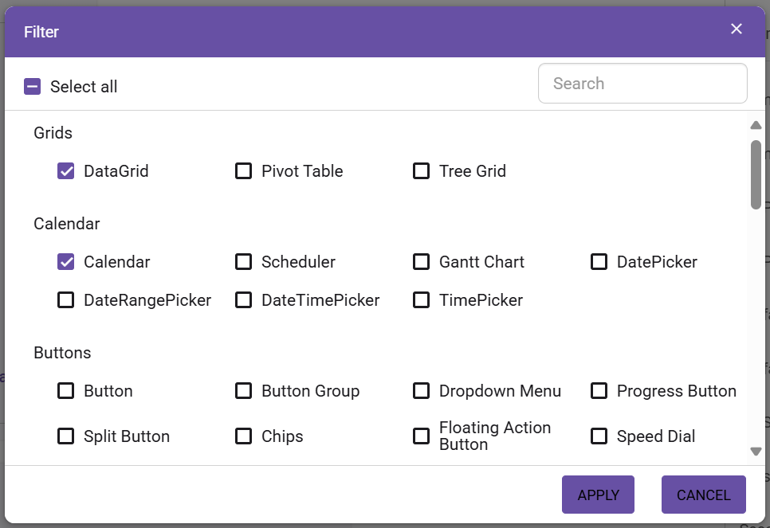

# Overview

Theme Studio for Syncfusion Blazor can be used to customize a new theme from an existing theme. It does not support data visualization controls such as Chart, Diagram, Gauge, Range Navigator, and Maps. Since Syncfusion Blazor components follow the same UI pattern as Syncfusion's EJ2 components, you can use the [Syncfusion EJ2 Theme studio](https://ej2.syncfusion.com/themestudio/) for customizing Syncfusion Blazor components appearance.

## Customizing theme color from theme studio

The Syncfusion Blazor themes are developed under the SCSS environment. Each theme has a unique common variable list. When you change the common variable color code value, it will reflect in all the Syncfusion Blazor components. All Syncfusion Blazor component styles are derived from these [theme-based common variables](themes#common-variables). This common variable list is handled inside the Theme Studio application for customizing theme-based colors.

**Step 1:** Navigate to the Theme Studio application from this link: [Theme Studio](https://ej2.syncfusion.com/themestudio/).

**Step 2:** The Theme Studio application page can be divided into two sections: the controls preview section on the left, and the theme customization section on the right.


**Step 3:** Click the color pickers in the theme customization section to select your desired colors.


**Step 4:** The Syncfusion Blazor components will be rendered with the newly selected colors in the preview section after selecting a custom color form picker.


### Filtering a specific list of controls

Using the theme studio, you can apply custom themes to a list of specific controls. This option is used when you integrate a selective list of Syncfusion Blazor components in your application. The theme studio will filter the selected controls and customize the final output for the controls’ styles alone by reducing the final output file size.

**Step 1:** Click the Filter icon at the top-right corner, and select the controls whose theme you want to customize.


**Step 2:** Click the Apply button in the Filter dialog. Now, only the selected controls will be rendered in the controls preview section.



**Step 3:** Now, you can customize the colors in the theme customization section for the controls selected.


### Download the customized theme

You can download the custom styles after customizing the theme colors.

**Step 1:** Click the Download button at the top-right corner, and the Download dialog will appear.


**Step 2:** Assign a theme name in the File Name field, and click the Download button.


**Step 3:** The download styles will come as a zip file that contains SCSS and CSS files for the selected Syncfusion Blazor components. The current settings are stored in the `settings.json` file.


### Using customized theme in a web application

You can directly use the customized CSS file in the web application.

**Step 1:** Copy and paste the customized CSS file from the download folder into any folder, e.g., `~/wwwroot/styles/{file-name}.css`.

**Step 2:** Refer the customized CSS file reference in the `~/wwwroot/index.html` or `~/Pages/_Host.cshtml` main page head section.

```html
    <head>
        <link href="styles/{file-name}.css" rel="stylesheet"/>
    </head>
```

## Import previously changed settings into theme studio

If you need to change your application theme and UI design in the future, do not customize the Syncfusion Blazor components from scratch in the theme studio. Just import the old `settings.json` file to review and update your stored settings in the Theme Studio application.

**Step 1:** Click the Import icon at the top-right corner.


**Step 2:** The Import Theme dialog will open. Click the Browse button and select the `settings.json` file you exported previously.


**Step 3:** Click the Import button.


**Step 4:** The stored data will be reflected in the Theme Studio application. Now, you can change the theme colors based on your latest design and export the theme again.


**Step 5:** The exported file contains your latest changes. You can just replace the older custom style with a new style to refresh your application.
