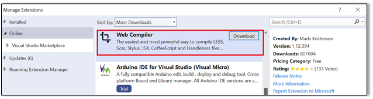
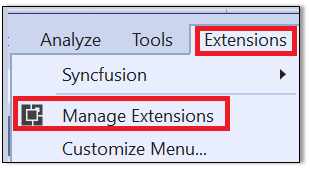
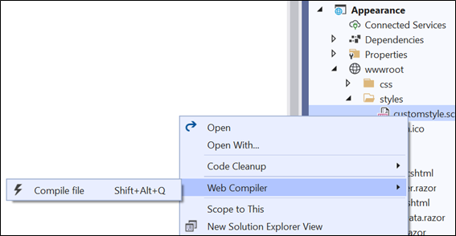

# Blazor Themes in Syncfusion Components 

The following list of themes are included in the Syncfusion Blazor components library.

|Theme	|Style Sheet Name| 
|--------|--------|
|Bootstrap 5	| bootstrap5.css | 
|Bootstrap 5 Dark	| bootstrap5-dark.css | 
|Bootstrap 4	| bootstrap4.css |
|Bootstrap 3	| bootstrap.css | 
|Bootstrap 3 Dark	| bootstrap-dark.css | 
|Google’s Material | material.css |
|Google’s Material-Dark | material-dark.css |
|Tailwind CSS | tailwind.css |
|TailwindDark CSS | tailwind-dark.css |
|Microsoft Office Fabric | fabric.css |
|Microsoft Office Fabric Dark | fabric-dark.css |
|High Contrast | highcontrast.css |

The Syncfusion Blazor Bootstrap Theme is designed based on Bootstrap v3, whereas the Bootsrap4 theme is designed based on Bootstrap v4.

## Reference themes in Blazor application

Syncfusion Blazor themes can be used in your Blazor application by referencing the style sheet. 

* For **Blazor WebAssembly application**, refer style sheet inside the `<head>` of **wwwroot/index.html** file.
* For **Blazor Server application**, refer style sheet inside the `<head>` of 
    * **~/Pages/_Host.cshtml** file for .NET 3 and .NET 5.
    * **~/Pages/_Layout.cshtml** for .NET 6.

Using the below approaches the themes can be referenced in the Blazor application,

1. [Static Web assets](#static-web-assets) - Used to reference complete css via static web assests. 
2. [CDN](#cdn-reference) - Used to reference complete css via static web assests. 
3. [CRG](https://blazor.syncfusion.com/documentation/common/custom-resource-generator) - Used to generate resources only for the selected (used) components. 
4. [Theme Studio](https://blazor.syncfusion.com/documentation/appearance/theme-studio) - Used to customize and generate themes only for the selected (used) components. 
5. [NPM packages](#npm-packages) - Used to customize the existing themes and bundle stylesheet's in an application.
6. [LibMan](#libman) - Used to customize the existing themes and bundle stylesheet's in an application.

Instead of using [Static Web assets](#static-web-assets) or a [CDN reference](#cdn-reference), you can reference the style sheet into your projects to customize the theme or bundle it with the other style sheets using [NPM packages](#npm-packages) or [LibMan](#libman). 

## Static Web Assets

Syncfusion Blazor themes are available as Static web Assets in the [Syncfusion.Blazor](https://www.nuget.org/packages/Syncfusion.Blazor/) and [Syncfusion.Blazor.Themes](https://www.nuget.org/packages/Syncfusion.Blazor.Themes/) NuGet Packages.

* For **Blazor WebAssembly application**, refer style sheet inside the `<head>` element of **wwwroot/index.html** file.
* For **Blazor Server application**, refer style sheet inside the `<head>` element of 
    * **~/Pages/_Host.cshtml** file for .NET 3 and .NET 5.
    * **~/Pages/_Layout.cshtml** for .NET 6.
    
When using individual NuGet packages in your application, add [Syncfusion.Blazor.Themes](https://www.nuget.org/packages/Syncfusion.Blazor.Themes/) NuGet Package and reference style sheet as below,

 ```html
<head>
    <link href="_content/Syncfusion.Blazor.Themes/bootstrap5.css" rel="stylesheet" />
</head>
```

When using [Syncfusion.Blazor](https://www.nuget.org/packages/Syncfusion.Blazor/) NuGet package,

 ```html
<head>
    <link href="_content/Syncfusion.Blazor/styles/bootstrap5.css" rel="stylesheet" />
</head>
```

## CDN Reference

Instead of using a local resource on your server, you can use a cloud CDN to reference the theme style sheets. CDN Stands for "Content Delivery Network". A CDN is a group of servers distributed in different locations. While CDNs are often used to host websites, they are commonly used to provide other types of downloadable data as well. Examples include software programs, images, videos, and streaming media.

Syncfusion Blazor Themes are available in the CDN. Make sure that the version in the URLs matches the version of the Syncfusion Blazor Package you are using.

 ```html
<head>
    <link href="https://cdn.syncfusion.com/blazor/{{ site.blazorversion }}/styles/bootstrap5.css" rel="stylesheet"/>
</head>
```

| Theme Name | CDN Reference |
|--- | --- |
| Bootstrap 5 | https://cdn.syncfusion.com/blazor/{{ site.blazorversion }}/styles/bootstrap5.css |
| Bootstrap 5 Dark| https://cdn.syncfusion.com/blazor/{{ site.blazorversion }}/styles/bootstrap5-dark.css |
| Bootstrap 4 | https://cdn.syncfusion.com/blazor/{{ site.blazorversion }}/styles/bootstrap4.css |
| Bootstrap 3 | https://cdn.syncfusion.com/blazor/{{ site.blazorversion }}/styles/bootstrap.css |
| Bootstrap 3 Dark| https://cdn.syncfusion.com/blazor/{{ site.blazorversion }}/styles/bootstrap-dark.css |
| Google’s Material | https://cdn.syncfusion.com/blazor/{{ site.blazorversion }}/styles/material.css |
| Google’s Material Dark | https://cdn.syncfusion.com/blazor/{{ site.blazorversion }}/styles/material-dark.css |
| Tailwind CSS | https://cdn.syncfusion.com/blazor/{{ site.blazorversion }}/styles/tailwind.css |
| Tailwind Dark CSS | https://cdn.syncfusion.com/blazor/{{ site.blazorversion }}/styles/tailwind-dark.css |
| Microsoft Office Fabric  | https://cdn.syncfusion.com/blazor/{{ site.blazorversion }}/styles/fabric.css |
| Microsoft Office Fabric Dark | https://cdn.syncfusion.com/blazor/{{ site.blazorversion }}/styles/fabric-dark.css |
| High Contrast  | https://cdn.syncfusion.com/blazor/{{ site.blazorversion }}/styles/highcontrast.css |

## NPM Packages

NPM is a node package manager. It is basically used for managing dependencies of various server-side dependencies. You can manage server-side dependencies manually. It is a command-line program for dealing with said repository that aids in package installation, version management, and dependency management. It is an online repository for the publishing of open-source `Node.js` projects.

You can add the theme for the Blazor applications through **npm packages** using the **SCSS** files by following the below process.

* Install Web Compiler to use `SCSS` files in Blazor applications.

* To install Web Compiler, open Visual Studio and click the **Extensions** in the toolbar.

    
 
    
 
* Install the Syncfusion `node_modules` in this application using this command.

    ```
    npm install @syncfusion/ej2
    ```

* Create a `SCSS` file as `~/wwwroot/styles/custom.scss` and provide the variables to override as shown below.

    ``` scss
    $primary: blue !default;
    @import 'ej2/fabric.scss';
    ```

* Right-click the `SCSS` file and click the Web Compiler to compile the file.

     

* The `compiler config.json` file is created. Then, provide the location of the compiled CSS file and include a path as shown in the following code snippet.

    ```json
    [
      {
        "outputFile": "wwwroot/styles/customstyle.css",
        "inputFile": "wwwroot/styles/customstyle.scss",
        "options": {
          "includePath": "node_modules/@syncfusion"
        }
      }
    ]
    ```

* The SCSS file has been compiled to the CSS file. Then, add this CSS file to the `<head>` element of the **~/Pages/_Host.cshtml** page.

* Run the application and see the fabric themes from installed npm packages was applied.

## LibMan

Library Manager (LibMan) is a client-side library acquisition tool that is simple to use. LibMan is a program that downloads popular libraries and frameworks from a file system or a content delivery network (CDN).

LibMan offers the following advantages,

1. Only the library files you need are downloaded.
2. Additional tooling, such as Node.js, npm, and WebPack, isn't necessary to acquire a subset of files in a library.
3. Files can be placed in a specific location without resorting to build tasks or manual file copying.

In the server application root, add the **lib man.json** file with the following content:

```json
{
  "version": "1.0",
  "defaultProvider": "cdnjs",
  "libraries": [
    {
      "library": "@progress/Syncfusion-Blazor-bootstrap@latest",
      "destination": "wwwroot/css/Syncfusion-Blazor/bootstrap",
      "files": [
        "dist/all.css"
      ]
    },
    {
      "library": "@progress/Syncfusion-Blazor-fabric@latest",
      "destination": "wwwroot/css/Syncfusion-Blazor/fabric",
      "files": [
        "dist/all.css"
      ]
    },
    {
      "library": "@progress/Syncfusion-Blazor-material@latest",
      "destination": "wwwroot/css/Syncfusion-Blazor/material",
      "files": [
        "dist/all.css"
      ]
    }
  ]
}
```

In the client Blazor application, go to the **wwwroot/index.html** file and replace the CDN link with the following one. For a server-side Blazor project, do that in the **~/Pages/_Host.cshtml** file.

```html
<!DOCTYPE html>
<html lang="en">
<head>
    <link href="/css/Syncfusion-Blazor/fabric/dist/all.css" rel="stylesheet" />
</head>
</html>
```

## Change theme dynamically

In the Blazor application, the application theme can be changed dynamically by changing its style sheet reference in code. 

### Change theme dynamically in blazor server app

The following example demonstrates how to change a theme dynamically in Blazor Server application using Syncfusion Blazor themes using Syncfusion Dropdown component.

1. For **.NET5 Blazor Server Application**, in  **_Host.cshtml**, refer syncfusion style sheet where the style sheet name is defined based on query string.

* For **.NET6 Blazor Server Application**, add the below function code in the  **_Layout.cshtml** file to set the theme as selected in dropdown by using its `id` value.
    



<head>
…………… 
<link id="theme" href="_content/Syncfusion.Blazor.Themes/bootstrap4.css" rel="stylesheet" />
</head>
…………… 
<script>
    function setTheme(theme) {
        document.getElementsByTagName('body')[0].style.display = 'none';
        let synclink = document.getElementById('theme');
        synclink.href = '_content/Syncfusion.Blazor.Themes/' + theme + '.css';
        setTimeout(function () { document.getElementsByTagName('body')[0].style.display = 'block'; }, 200);
    }
</script>
……………




@page "/"
@namespace BlazorThemeSwitcher.Pages
@addTagHelper *, Microsoft.AspNetCore.Mvc.TagHelpers
    
@{
    Layout = null;
    QueryHelpers.ParseQuery(Request.QueryString.Value).TryGetValue("theme", out var themeName);
    themeName = themeName.Count > 0 ? themeName.First() : "bootstrap4";
}

<!DOCTYPE html>
<html lang="en">
<head>
    <meta charset="utf-8" />
    <meta name="viewport" content="width=device-width, initial-scale=1.0" />
    <title>BlazorThemeSwitcher</title>
    <base href="~/" />
    <link rel="stylesheet" href="css/bootstrap/bootstrap.min.css" />
    <link href="css/site.css" rel="stylesheet" />
    <link href="BlazorThemeSwitcher.styles.css" rel="stylesheet" />
    <link href=@("_content/Syncfusion.Blazor.Themes/" + themeName + ".css")rel="stylesheet" />
</head>

<body>
    <script src="_framework/blazor.server.js"></script>
</ </body>
</html>




2. For **.NET5 Blazor Server Application**, in **MainLayout.razor** page add dropdown list with themes and in `ValueChange` event handler, the page is refreshed by changing query string to change the theme in application.

* For **.NET6 Blazor Server Application**, modify the **MainLayout.razor** page with the below code to implement a theme change dynamically using the dropdown by its id value in javascript function in the application.




@inherits LayoutComponentBase
@inject NavigationManager UrlHelper;
@inject IJSRuntime JSRuntime;
@using Syncfusion.Blazor.DropDowns;
@using Syncfusion.Blazor.Buttons;
@using Microsoft.AspNetCore.WebUtilities;

<div class="page">
    <div class="main">
        <div class="top-row px-4">
            <div class="theme-switcher">
                @*Theme switcher*@
                <SfDropDownList TItem="ThemeDetails" TValue="string" @bind-Value="themeName" DataSource="@Themes">
                    <DropDownListFieldSettings Text="Text" Value="ID"></DropDownListFieldSettings>
                    <DropDownListEvents TItem="ThemeDetails" TValue="string" ValueChange="OnThemeChange"></DropDownListEvents>
                </SfDropDownList>
            </div>
            <a href="http://blazor.net" target="_blank" class="ml-md-auto">About</a>
        </div>

        <div class="content px-4">
            @Body
        </div>
    </div>
</div>

@code {
    private string themeName;

    public class ThemeDetails
    {
        public string ID { get; set; }
        public string Text { get; set; }
    }

    private List<ThemeDetails> Themes = new List<ThemeDetails>() {
        new ThemeDetails(){ ID = "material", Text = "Material" },
        new ThemeDetails(){ ID = "bootstrap", Text = "Bootstrap" },
        new ThemeDetails(){ ID = "fabric", Text = "Fabric" },
        new ThemeDetails(){ ID = "bootstrap4", Text = "Bootstrap 4" },
        new ThemeDetails(){ ID = "tailwind", Text = "TailWind"},
        new ThemeDetails(){ ID = "tailwind-dark", Text = "TailWind Dark" },
        new ThemeDetails(){ ID = "material-dark", Text = "Material Dark" },
        new ThemeDetails(){ ID = "bootstrap-dark", Text = "Bootstrap Dark" },
        new ThemeDetails(){ ID = "fabric-dark", Text = "Fabric Dark" },
        new ThemeDetails(){ ID = "highcontrast", Text = "High Contrast" }
    };
    

    public void OnThemeChange(Syncfusion.Blazor.DropDowns.ChangeEventArgs<string, ThemeDetails> args)
    {
        JSRuntime.InvokeAsync<object>("setTheme", args.ItemData.ID);                
    }
    
    private string GetThemeName()
    {
        var uri = UrlHelper.ToAbsoluteUri(UrlHelper.Uri);
        QueryHelpers.ParseQuery(uri.Query).TryGetValue("theme", out var theme);
        return theme.Count > 0 ? theme.First() : "bootstrap4";
    }

    protected override void OnInitialized()
    {
        var theme = GetThemeName();
        themeName = theme.Contains("bootstrap4") ? "bootstrap4" : theme;
    }

}




@inherits LayoutComponentBase
@inject NavigationManager UrlHelper;
@using Syncfusion.Blazor.DropDowns;
@using Syncfusion.Blazor.Buttons;
@using Microsoft.AspNetCore.WebUtilities

<div class="page">
    <div class="main">
        <div class="top-row px-4">
            <div class="theme-switcher">
                @*Theme switcher*@
                <SfDropDownList TItem="ThemeDetails" TValue="string" @bind-Value="themeName" DataSource="@Themes">
                    <DropDownListFieldSettings Text="Text" Value="ID"></DropDownListFieldSettings>
                    <DropDownListEvents TItem="ThemeDetails" TValue="string" ValueChange="OnThemeChange"></DropDownListEvents>
                </SfDropDownList>
            </div>
            <a href="http://blazor.net" target="_blank" class="ml-md-auto">About</a>
        </div>

        <div class="content px-4">
            @Body
        </div>
    </div>
</div>

@code {
    private string themeName;

    public class ThemeDetails
    {
        public string ID { get; set; }
        public string Text { get; set; }
    }
    
    private List<ThemeDetails> Themes = new List<ThemeDetails>() {
        new ThemeDetails(){ ID = "material", Text = "Material" },
        new ThemeDetails(){ ID = "bootstrap", Text = "Bootstrap" },
        new ThemeDetails(){ ID = "fabric", Text = "Fabric" },
        new ThemeDetails(){ ID = "bootstrap4", Text = "Bootstrap 4" },
        new ThemeDetails(){ ID = "tailwind", Text = "TailWind"},
        new ThemeDetails(){ ID = "tailwind-dark", Text = "TailWind Dark" },
        new ThemeDetails(){ ID = "material-dark", Text = "Material Dark" },
        new ThemeDetails(){ ID = "bootstrap-dark", Text = "Bootstrap Dark" },
        new ThemeDetails(){ ID = "fabric-dark", Text = "Fabric Dark" },
        new ThemeDetails(){ ID = "highcontrast", Text = "High Contrast" }
    };
    
    public void OnThemeChange(ChangeEventArgs<string, ThemeDetails> args)
    {
        var theme = GetThemeName();
        if (theme != args.ItemData.ID)
        {
            UrlHelper.NavigateTo(GetUri(args.ItemData.ID ), true);
        }
    }
    
    private string GetThemeName()
    {
        var uri = UrlHelper.ToAbsoluteUri(UrlHelper.Uri);
        QueryHelpers.ParseQuery(uri.Query).TryGetValue("theme", out var theme);
        return theme.Count > 0 ? theme.First() : "bootstrap4";
    }
    
    private string GetUri(string themeName)
    {
        var uri = UrlHelper.ToAbsoluteUri(UrlHelper.Uri);
        return uri.AbsolutePath + "?theme=" + themeName;
    }
    
    protected override void OnInitialized()
    {
        var theme = GetThemeName();
        themeName = theme.Contains("bootstrap4") ? "bootstrap4" : theme;
    }
}




     
    
    > [View sample in GitHub](https://github.com/SyncfusionExamples/theme-switching-in-blazor-server-app) 

### Change theme dynamically in blazor WebAssembly (WASM) app

The following example demonstrates how to change a theme dynamically in Blazor WebAssembly using the application with the Syncfusion Blazor themes using Syncfusion Dropdown component.

1. Add the below function code in the  **index.html** file to set the theme as selected in dropdown by using its `id` value.
    
    ```html
    <head>
    …………… 
    <link id="theme" href="_content/Syncfusion.Blazor.Themes/bootstrap4.css" rel="stylesheet" />
    </head>
    …………… 
    <script>
        function setTheme(theme) {
            document.getElementsByTagName('body')[0].style.display = 'none';
            let synclink = document.getElementById('theme');
            synclink.href = '_content/Syncfusion.Blazor.Themes/' + theme + '.css';
            setTimeout(function () { document.getElementsByTagName('body')[0].style.display = 'block'; }, 200);
        }
    </script>
    ……………
    ```

2. Modify the **MainLayout.razor** page with the below code to implement a theme change dynamically using the dropdown by its id value in javascript function in the application.
    
    ```cshtml
    @inherits LayoutComponentBase
    @inject NavigationManager UrlHelper;
    @inject IJSRuntime JSRuntime;
    @using Syncfusion.Blazor.DropDowns;
    @using Syncfusion.Blazor.Buttons;
    @using Microsoft.AspNetCore.WebUtilities;
    
    <div class="page">
        <div class="main">
            <div class="top-row px-4">
                <div class="theme-switcher">
                    @*Theme switcher*@
                    <SfDropDownList TItem="ThemeDetails" TValue="string" @bind-Value="themeName" DataSource="@Themes">
                        <DropDownListFieldSettings Text="Text" Value="ID"></DropDownListFieldSettings>
                        <DropDownListEvents TItem="ThemeDetails" TValue="string" ValueChange="OnThemeChange"></DropDownListEvents>
                    </SfDropDownList>
                </div>
                <a href="http://blazor.net" target="_blank" class="ml-md-auto">About</a>
            </div>
    
            <div class="content px-4">
                @Body
            </div>
        </div>
    </div>
    
    @code {
        private string themeName;
    
        public class ThemeDetails
        {
            public string ID { get; set; }
            public string Text { get; set; }
        }
    
        private List<ThemeDetails> Themes = new List<ThemeDetails>() {
            new ThemeDetails(){ ID = "material", Text = "Material" },
            new ThemeDetails(){ ID = "bootstrap", Text = "Bootstrap" },
            new ThemeDetails(){ ID = "fabric", Text = "Fabric" },
            new ThemeDetails(){ ID = "bootstrap4", Text = "Bootstrap 4" },
            new ThemeDetails(){ ID = "tailwind", Text = "TailWind"},
            new ThemeDetails(){ ID = "tailwind-dark", Text = "TailWind Dark" },
            new ThemeDetails(){ ID = "material-dark", Text = "Material Dark" },
            new ThemeDetails(){ ID = "bootstrap-dark", Text = "Bootstrap Dark" },
            new ThemeDetails(){ ID = "fabric-dark", Text = "Fabric Dark" },
            new ThemeDetails(){ ID = "highcontrast", Text = "High Contrast" }
        };
        
    
        public void OnThemeChange(Syncfusion.Blazor.DropDowns.ChangeEventArgs<string, ThemeDetails> args)
        {
            JSRuntime.InvokeAsync<object>("setTheme", args.ItemData.ID);                
        }
     
        private string GetThemeName()
        {
            var uri = UrlHelper.ToAbsoluteUri(UrlHelper.Uri);
            QueryHelpers.ParseQuery(uri.Query).TryGetValue("theme", out var theme);
            return theme.Count > 0 ? theme.First() : "bootstrap4";
        }
    
        protected override void OnInitialized()
        {
            var theme = GetThemeName();
            themeName = theme.Contains("bootstrap4") ? "bootstrap4" : theme;
        }
    
    }
    
    ```
     
    
    > [View sample in GitHub](https://github.com/SyncfusionExamples/theme-switching-in-blazor-WASM-app)